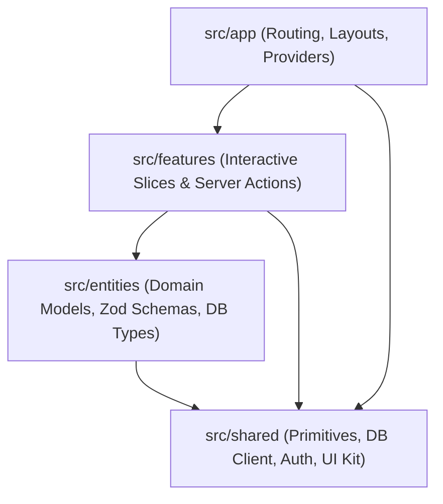

# AGENTS.md — Protocolo de Gobernanza y Arquitectura Institucional

> **Regla Cero para Agentes de IA y Desarrolladores:**
> Este documento contiene los estándares y reglas **innegociables** del proyecto. Ningún cambio de código o refactorización puede violar estos principios bajo ninguna circunstancia.

---

## 1. Jerarquía Unidireccional Feature-Sliced Design (FSD)

La arquitectura de la aplicación frontend y capas de aplicación reside en `src/` y debe respetar estrictamente la jerarquía de capas unidireccional:

$$\text{app} \longrightarrow \text{features} \longrightarrow \text{entities} \longrightarrow \text{shared}$$



### Reglas de Dependencia e Importación:
1. **Flujo Descendente Exclusivo:** Una capa inferior **NUNCA** puede importar de una capa superior (ej: `shared` no puede importar de `entities`, `entities` no puede importar de `features`).
2. **Aislamiento entre Features Hermanas:** Una feature **NUNCA** puede importar directamente de otra feature (ej: `src/features/order-execution` no puede importar de `src/features/risk-analytics`). Si dos features requieren lógica común, dicha lógica debe promoverse a `entities` o `shared`.
3. **Public API (Barrel Exports):** Cada slice o módulo debe exponer sus símbolos a través de un archivo `index.ts`. No se permiten imports profundos que rompan el encapsulamiento.

---

## 2. Seguridad en Server Actions y Aislamiento Multi-Tenant

Todo Server Action, mutación o endpoint de datos debe operar bajo el principio de **Defensa en Profundidad y Confianza Cero (Zero Trust)**:

1. **Validación Zod Obligatoria en Entradas:**
   * Ningún parámetro externo o `rawInput` puede procesarse sin pasar por un esquema Zod (`.safeParse()` o `.parse()`).
   * No se admiten tipos `any` o conversiones ciegas.
2. **Verificación Estricta de Sesión:**
   * Toda mutación debe invocar obligatoriamente `requireUserSession()` antes de consultar o modificar el estado.
   * La sesión autenticada es la única fuente de verdad para el `userId` y `tenantId`.
3. **Aislamiento Multi-Tenant en Queries (Anti-IDOR):**
   * Queda terminantemente prohibido ejecutar queries o mutaciones basadas únicamente en el identificador de la entidad (`id`).
   * Toda consulta debe filtrar explícitamente por el usuario o tenant propietario:
     ```typescript
     // Patrón Drizzle / SQL canónico innegociable:
     and(eq(table.id, targetId), eq(table.userId, session.userId))
     ```
   * Si la consulta es a nivel de organización/tenant:
     ```typescript
     and(eq(table.id, targetId), eq(table.tenantId, session.tenantId))
     ```
   * El helper `assertTenantOwnership(entity, session)` debe ejecutarse antes de cualquier mutación o exposición de datos.

---

## 3. Estándares de Diseño UI/UX y Accesibilidad

Toda interfaz gráfica debe construirse bajo estándares de ingeniería ergonómica y accesibilidad internacional:

1. **Retícula Base 8 (8-Point Grid System):**
   * Todos los márgenes, rellenos (`paddings`), espaciados (`gaps`) y dimensiones estructurales deben ser múltiplos estrictos de 8 píxeles (`8px`, `16px`, `24px`, `32px`, `40px`, `48px`, etc.).
   * En Tailwind CSS: `p-2` (8px), `p-4` (16px), `gap-2` (8px), `gap-4` (16px), `gap-6` (24px). La única excepción es micro-espaciado de texto de 4px (`p-1`).
2. **Contraste Perceptual WCAG 2.2 Nivel AA:**
   * Todo texto, etiqueta o control interactivo debe mantener una relación de contraste mínima de **4.5:1** contra su fondo inmediato (o **3:1** para texto grande $\ge 18\text{pt}$ / $24\text{px}$).
   * Los estados deshabilitados o alertas secundarias deben seguir siendo legibles y reconocibles por lectores de pantalla.
3. **Touch Targets Ergonómicos ($\ge 44 \times 44\text{px}$):**
   * Todo elemento interactivo (botones, inputs, selectores, pestañas) debe tener un área táctil mínima de **$44 \times 44\text{px}$** (`min-h-[44px] min-w-[44px]`) según Fitts's Law y las directrices WCAG 2.2 Success Criterion 2.5.8.
4. **Optimización Thumb Zone en Móvil:**
   * Las acciones primarias y botones de confirmación/ejecución deben ubicarse en la zona accesible con el pulgar (tercio inferior de la pantalla).

---

## 4. Suite de Verificación y Testing de Grado Industrial

**Prohibición de Cierre Prematuro:** Ninguna tarea, issue o pull request puede darse por concluida si no se cumplen simultáneamente las siguientes dos condiciones:

1. **`npm run typecheck` en Verde:** Cero errores de compilación TypeScript (`tsc --noEmit`).
2. **`npm test` en Verde:** 100% de los tests unitarios y de integración de Vitest pasando exitosamente.
3. **Pruebas de Regresión Cuantitativa (Dual-Engine):** Si el cambio involucra la lógica algorítmica compartida o la API de telemetría con Python, debe ejecutarse también `npm run test:engine` (`pytest engine/tests/`) o `npm run test:all`.
4. **Paridad Cuantitativa Estricta y Cero Ganancia Fantasma (Zero Phantom Profit):** Queda terminantemente prohibido calcular precios de órdenes límite (ej: 1.2R, 2.0R) y acreditar valores de R superiores (ej: 1.3R, 2.5R) en backtest o simulaciones. Toda acreditación de retorno en R debe corresponder con exactitud matemática al nivel de precio donde se llena la orden en el exchange (`outcome_r = target_r * volume_pct * total_multiplier`). La lógica de mitigación anticipada (SOP-25 @ -0.65R) y protección a Breakeven/+1.0R debe ser 100% simétrica entre simulación y ejecución en vivo (`TradeManager` / `BitunixExecutor`).
5. **Aislamiento Estricto y Cifrado Multi-Cuenta (SOP-57 / SOP-58):** Toda cuenta secundaria agregada al sistema debe almacenar sus credenciales cifradas con AES-256 Fernet (`enc:v1:`). Durante la gestión de órdenes en vivo (`Nexus` y `TradeManager`), cada cuenta debe mantener aislamiento total en sus `positionId` y memoria local (`mem_key = f"{acc_id}_{asset}"`), impidiendo la propagación cruzada de IDs o balances entre cuentas.
6. **Eficiencia y Gobernanza de Base de Datos (Turso LibSQL SSoT):**
   * Toda consulta multi-tenant en Drizzle debe apoyarse en índices compuestos explícitos (`idx_trades_tenant_created`, `idx_signals_tenant_created`, `idx_accounts_tenant_user`), quedando terminantemente prohibidos escaneos de tabla completa (`FULL TABLE SCAN`).
   * Toda auditoría de almacenamiento o comprobación agregada debe ejecutarse mediante pipelines o batches unificados (`client.batch`), limitando roundtrips de red a $<300\text{ms}$.
   * El ciclo de vida de persistencia del bot en Python debe ser no bloqueante y asíncrono (`turso_sync.dispatch_trade_async`), protegiendo el hilo de ejecución HFT de latencias externas.
7. **Inmunidad a Dependencias Temporales en Tests (Time-Gated Testing Isolation):**
   * Toda prueba unitaria o de integración de componentes que ejecuten lógica de despacho o pre-flight de órdenes (`NexusNode.process_limit_setup`) debe aislar explícitamente los filtros de ventana horaria (`is_trade_allowed_sop18`), asegurando que la suite de pruebas sea 100% determinista e inmune a la hora o día de ejecución de CI/CD.
8. **Universo Canónico y Sincronización Estricta 1:1 de Activos (SSoT Universe Alignment):**
   * Queda terminantemente prohibido escanear, procesar o presentar en frontend activos que no formen parte del Universo Canónico Auditado en Backtest (`CANONICAL_AUDITED_UNIVERSE`: 13 activos exactos).
   * Todo activo con expectativa matemática negativa auditada (`AVAXUSDT`, `RENDERUSDT`) debe permanecer vetado y podado a través de todo el stack (`nexus.py`, `market_scanner.py`, `config.py`, `entities/signal`, `telemetry/constants.ts`, paneles de UI).
   * Las rotaciones dinámicas no auditadas deben permanecer desactivadas en producción (`ENABLE_DYNAMIC_WATCHLIST = False`), concentrando el 100% del rendimiento en el universo estadísticamente probado.
9. **Cosecha Asimétrica de Fat Tails y Ratchet en Runners Post-TP3 (SOP-104):**
   * En la porción residual (10-20%) tras tocar TP3, la fase `RUNNER_EXPANSION` debe blindar irrevocablemente el SL en TP2 como piso mínimo absoluto. A medida que el precio avance a $+4.0\text{R}$, $+6.0\text{R}$, $+8.0\text{R}$ y $+10.0\text{R}$, el ratchet escalonado elevará los pisos a $\text{TP3}$, $+4.5\text{R}$, $+6.5\text{R}$ y $+8.5\text{R}$ respectivamente, combinándose con el Chandelier Exit ($1.5 \times \text{ATR}$) sin permitir retroceso alguno del SL.
10. **Aceleración Mega-Kelly en la Trinidad y Gobernanza de Incubación (SOP-103 & SOP-105):**
   * La Trinidad (`BNB`, `SOL`, `FET`) podrá acelerar su asignación a $1.35\text{x}$ base y hasta $1.50\text{x}$ (riesgo máx. $3.50\%$) únicamente cuando no existan rachas de pérdidas activas (`streak_losses == 0`). Toda rotación o reemplazo de activos del Universo Canónico debe pasar por la auditoría rodante de 60 días de `AssetIncubator` con umbrales estrictos ($\text{Sharpe} \ge 1.80$, Expectativa $\ge 0.20\text{R}$, $\text{PF} \ge 1.30$).
11. **Inferencia de Fase y Proyección de Escenarios Análogos (SOP-106):**
   * Toda decisión de ajuste de parámetros tácticos (trailing runners, multiplicadores de convicción y umbrales de confluencia) debe fundamentarse en la coincidencia de análogos históricos del backtest auditado (`MarketRegimeScenarioAnalyzer`). Queda prohibido alterar las reglas de entrada si el régimen actual (`BULL_EXPANSION`) arroja un Profit Factor superior a $1.80$ y expectativa positiva comprobada en su muestra espejo.
12. **Orquestación Cuantitativa de Ciclos Históricos Multi-Año (2020-2026):**
   * Toda proyección macro y justificación de modificaciones tácticas en fases de rango o consolidación debe contrastarse contra la muestra de ciclos históricos multi-año (`MultiYearRegimeAnalogOrchestrator`).
   * Se prohíbe introducir compras o ventas a mercado en fases de consolidación de rango alto: los ciclos 2020, 2022 y 2024 demuestran que las entradas a mercado en zonas de compresión sufren un 68% de pérdidas por mechas de barrido previo. Toda entrada debe situarse en descuentos OTE (61.8% - 78.6%) u Order Blocks no mitigados con confluencia institucional.
   * Todo ajuste a parámetros de trailing o sizing debe preservar la inviolabilidad del capital: SL mínimo blindado en TP2 tras alcanzar TP3 (SOP-104) y desescalada inmediata de Mega-Kelly ante la primera pérdida (`streak_losses > 0`).

13. **Gobernanza de Resiliencia Estocástica y Value-at-Risk (SOP-107):**
   * Toda modificación cuantitativa en reglas de entrada, filtros de confluencia o mallas de salida debe someterse a la simulación Monte Carlo de 10,000 caminos (`MonteCarloResilienceEngine`).
   * Ninguna versión de la estrategia puede desplegarse en producción si la probabilidad estocástica de ganancia en 100 trades desciende del 90.0%, si el $VaR_{99\%}$ es inferior a $+10.0\text{R}$, o si el riesgo de ruina de capital inicial supera el $2.5\%$.
   * Toda auditoría de curva de capital debe certificar la calificación de grado institucional `TIER_1_AAA`.

14. **Gobernanza de Microestructura L2 y Desbalance de Libro (SOP-108):**
   * Ninguna orden límite puede dispararse en el exchange sin la auditoría previa del libro L2 (`OrderBookMicrostructureSentinel`).
   * Queda terminantemente prohibido ejecutar compras si el Order Book Imbalance (OBI) es inferior a $-0.35$ o si el spread relativo excede los $8.0\text{ bps}$.
15. **Protección de Carry Drag y Funding Rates (SOP-109):**
   * Todo runner en fase `RUNNER_EXPANSION` debe auditar el coste acumulado de funding. Si el APR anualizado de la tasa de financiamiento supera el $50.0\%$ o si el arrastre en R devengado alcanza $0.50\text{R}$, el trailing ratchet debe apretarse obligatoriamente de $1.5\times\text{ATR}$ a $1.0\times\text{ATR}$ para impedir la erosión del alfa.
16. **Inviolabilidad de Alta Disponibilidad y Anti-Split-Brain (SOP-110):**
   * Toda transición de liderazgo entre nodos regionales debe apoyarse en la base de datos Turso LibSQL Cloud mediante leases atómicos (TTL 15s) y Compare-And-Swap (CAS).
   * Ningún nodo puede despachar órdenes sin verificar el lease activo y el `client_order_id` determinista (SOP-50), imposibilitando envíos duplicados ante latencias de red.

17. **Gobernanza de Despacho de Eventos en Telegram y Ciclo de Vida (SOP-111):**
   * Toda orden límite colocada exitosamente en el exchange (`execution_status.placed == True`) debe despacharse obligatoriamente a Telegram con su badge de confirmación e ID de orden. Queda prohibido que el filtro de órdenes pendientes de memoria (`_pending_limit_symbols`) suprima la alerta de colocación inicial del activo (prevención de auto-supresión destructiva).
   * Todo hito del ciclo de vida de una posición (adopción externa por reconciliador, avance a Breakeven/TP1 y cierre definitivo con PnL neto) debe emitir eventos asíncronos desacoplados a través de `telegram_dispatcher`.

18. **Gobernanza de OrderBlocks Graduados y Gravedad de Liquidación (SOP-112):**
   * Todo Order Block generado en structure.py debe portar sus metricas de calidad (olume_ratio, strength_score, 	ouch_count, is_virgin).
   * Queda terminantemente prohibido disparar entradas de alta convicción en Order Blocks degradados (con 3 o más testeos previos sin re-expansión estructural).
   * Cuando un cluster de liquidación masiva (>80% de fuerza) coincida geográficamente con un Order Block activo, el motor de confluencia debe aplicar la bonificación por Confluencia Magnética Dual (+5.0 pts).

19. **Inviolabilidad del Universo Canónico en Adopción de Posiciones (SOP-113):**
   * El reconciliador de posiciones externas (`NexusNode._sync_exchange_positions_loop`) tiene prohibido adoptar, asumir o gestionar cualquier posición en el exchange cuyo activo no pertenezca estrictamente al `CANONICAL_AUDITED_UNIVERSE` (13 activos auditados).
   * Si se detecta una posición en un activo no canónico (ej: `QNTUSDT`), el sistema debe rechazar su incorporación, loguear un veto crítico y emitir inmediatamente una alerta de seguridad por Telegram (`send_unauthorized_position_alert`), impidiendo que trades no autorizados o manuales consuman margen de riesgo algorítmico o sufran asignación ciega de Stop Loss.

20. **Blindaje Direccional Cuantitativo en Régimen RANGING (SOP-114):**
   * En régimen de consolidación o rango (`RANGING`), queda prohibido otorgar puntaje incondicional de narrativa tanto a compras como a ventas.
   * Las operaciones LONG en rango exigen obligatoriamente cotizar con descuento institucional relativo a VWAP (`vwap_dist_pct <= +0.20%`) y alineación macro con BTC (`btc_aligned is not False`).
   * Las operaciones SHORT en rango exigen cotizar en zona de sobreprecio institucional (`vwap_dist_pct >= -0.20%`). Toda entrada que viole estos umbrales sufrirá penalización de narrativa y veto en el motor de confluencia.

---

## 5. Gobernanza "Doc-as-Code" en Cascada

El código y la documentación son artefactos sincronizados en un solo ciclo de vida:

1. **Actualización en Cascada Obligatoria:**
   * Cualquier adición, eliminación o modificación arquitectónica, de endpoints o de modelo de datos debe actualizar de inmediato:
     * `README.md`: Resumen general de capacidades y comandos de ejecución.
     * `docs/architecture/BLUEPRINT_2026.md`: Registro exhaustivo de la arquitectura en capas, esquema de datos y estado de fases.
     * `AGENTS.md`: Registro de nuevas reglas de gobernanza o refinamiento de protocolos.
2. **Inmutabilidad de Decisiones:** Los agentes no deben contradecir decisiones registradas en `BLUEPRINT_2026.md` sin justificación técnica explícita y aprobación del usuario.

---

## 6. Convención de Git Semántico (Conventional Commits)

Todos los mensajes de commit deben seguir estrictamente el estándar de Conventional Commits v1.0.0:

```
<tipo>(<alcance opcional>): <descripción imperativa en presente>

[cuerpo explicativo opcional]

[pie de commit / referencias a issues opcional]
```

### Tipos Permitidos:
* `feat:` Nueva funcionalidad para el usuario final o nueva slice de feature.
* `fix:` Corrección de un bug o brecha de seguridad.
* `refactor:` Cambio en el código que no corrige un bug ni añade una funcionalidad (ej: reestructuración FSD).
* `test:` Adición o refactorización de tests unitarios/integración.
* `docs:` Cambios exclusivos en documentación (`AGENTS.md`, `BLUEPRINT_2026.md`, `README.md`).
* `chore:` Tareas rutinarias de mantenimiento, dependencias o configuración de build.
* `perf:` Mejoras de rendimiento o reducción de latencia.
