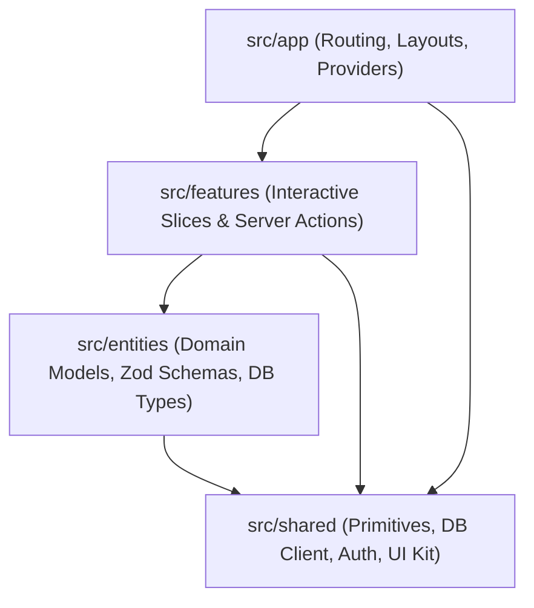

# AGENTS.md — Protocolo de Gobernanza y Arquitectura Institucional

> **Regla Cero para Agentes de IA y Desarrolladores:**
> Este documento contiene los estándares y reglas **innegociables** del proyecto. Ningún cambio de código o refactorización puede violar estos principios bajo ninguna circunstancia.

---

## 1. Jerarquía Unidireccional Feature-Sliced Design (FSD)

La arquitectura de la aplicación frontend y capas de aplicación reside en `src/` y debe respetar estrictamente la jerarquía de capas unidireccional:

$$\text{app} \longrightarrow \text{features} \longrightarrow \text{entities} \longrightarrow \text{shared}$$



### Reglas de Dependencia e Importación:
1. **Flujo Descendente Exclusivo:** Una capa inferior **NUNCA** puede importar de una capa superior (ej: `shared` no puede importar de `entities`, `entities` no puede importar de `features`).
2. **Aislamiento entre Features Hermanas:** Una feature **NUNCA** puede importar directamente de otra feature (ej: `src/features/order-execution` no puede importar de `src/features/risk-analytics`). Si dos features requieren lógica común, dicha lógica debe promoverse a `entities` o `shared`.
3. **Public API (Barrel Exports):** Cada slice o módulo debe exponer sus símbolos a través de un archivo `index.ts`. No se permiten imports profundos que rompan el encapsulamiento.

---

## 2. Seguridad en Server Actions y Aislamiento Multi-Tenant

Todo Server Action, mutación o endpoint de datos debe operar bajo el principio de **Defensa en Profundidad y Confianza Cero (Zero Trust)**:

1. **Validación Zod Obligatoria en Entradas:**
   * Ningún parámetro externo o `rawInput` puede procesarse sin pasar por un esquema Zod (`.safeParse()` o `.parse()`).
   * No se admiten tipos `any` o conversiones ciegas.
2. **Verificación Estricta de Sesión:**
   * Toda mutación debe invocar obligatoriamente `requireUserSession()` antes de consultar o modificar el estado.
   * La sesión autenticada es la única fuente de verdad para el `userId` y `tenantId`.
3. **Aislamiento Multi-Tenant en Queries (Anti-IDOR):**
   * Queda terminantemente prohibido ejecutar queries o mutaciones basadas únicamente en el identificador de la entidad (`id`).
   * Toda consulta debe filtrar explícitamente por el usuario o tenant propietario:
     ```typescript
     // Patrón Drizzle / SQL canónico innegociable:
     and(eq(table.id, targetId), eq(table.userId, session.userId))
     ```
   * Si la consulta es a nivel de organización/tenant:
     ```typescript
     and(eq(table.id, targetId), eq(table.tenantId, session.tenantId))
     ```
   * El helper `assertTenantOwnership(entity, session)` debe ejecutarse antes de cualquier mutación o exposición de datos.

---

## 3. Estándares de Diseño UI/UX y Accesibilidad

Toda interfaz gráfica debe construirse bajo estándares de ingeniería ergonómica y accesibilidad internacional:

1. **Retícula Base 8 (8-Point Grid System):**
   * Todos los márgenes, rellenos (`paddings`), espaciados (`gaps`) y dimensiones estructurales deben ser múltiplos estrictos de 8 píxeles (`8px`, `16px`, `24px`, `32px`, `40px`, `48px`, etc.).
   * En Tailwind CSS: `p-2` (8px), `p-4` (16px), `gap-2` (8px), `gap-4` (16px), `gap-6` (24px). La única excepción es micro-espaciado de texto de 4px (`p-1`).
2. **Contraste Perceptual WCAG 2.2 Nivel AA:**
   * Todo texto, etiqueta o control interactivo debe mantener una relación de contraste mínima de **4.5:1** contra su fondo inmediato (o **3:1** para texto grande $\ge 18\text{pt}$ / $24\text{px}$).
   * Los estados deshabilitados o alertas secundarias deben seguir siendo legibles y reconocibles por lectores de pantalla.
3. **Touch Targets Ergonómicos ($\ge 44 \times 44\text{px}$):**
   * Todo elemento interactivo (botones, inputs, selectores, pestañas) debe tener un área táctil mínima de **$44 \times 44\text{px}$** (`min-h-[44px] min-w-[44px]`) según Fitts's Law y las directrices WCAG 2.2 Success Criterion 2.5.8.
4. **Optimización Thumb Zone en Móvil:**
   * Las acciones primarias y botones de confirmación/ejecución deben ubicarse en la zona accesible con el pulgar (tercio inferior de la pantalla).

---

## 4. Suite de Verificación y Testing de Grado Industrial

**Prohibición de Cierre Prematuro:** Ninguna tarea, issue o pull request puede darse por concluida si no se cumplen simultáneamente las siguientes dos condiciones:

1. **`npm run typecheck` en Verde:** Cero errores de compilación TypeScript (`tsc --noEmit`).
2. **`npm test` en Verde:** 100% de los tests unitarios y de integración de Vitest pasando exitosamente.
3. **Pruebas de Regresión Cuantitativa (Dual-Engine):** Si el cambio involucra la lógica algorítmica compartida o la API de telemetría con Python, debe ejecutarse también `npm run test:engine` (`pytest engine/tests/`) o `npm run test:all`.
4. **Paridad Cuantitativa Estricta y Cero Ganancia Fantasma (Zero Phantom Profit):** Queda terminantemente prohibido calcular precios de órdenes límite (ej: 1.2R, 2.0R) y acreditar valores de R superiores (ej: 1.3R, 2.5R) en backtest o simulaciones. Toda acreditación de retorno en R debe corresponder con exactitud matemática al nivel de precio donde se llena la orden en el exchange (`outcome_r = target_r * volume_pct * total_multiplier`). La lógica de mitigación anticipada (SOP-25 @ -0.65R) y protección a Breakeven/+1.0R debe ser 100% simétrica entre simulación y ejecución en vivo (`TradeManager` / `BitunixExecutor`).
5. **Aislamiento Estricto y Cifrado Multi-Cuenta (SOP-57 / SOP-58):** Toda cuenta secundaria agregada al sistema debe almacenar sus credenciales cifradas con AES-256 Fernet (`enc:v1:`). Durante la gestión de órdenes en vivo (`Nexus` y `TradeManager`), cada cuenta debe mantener aislamiento total en sus `positionId` y memoria local (`mem_key = f"{acc_id}_{asset}"`), impidiendo la propagación cruzada de IDs o balances entre cuentas.

---

## 5. Gobernanza "Doc-as-Code" en Cascada

El código y la documentación son artefactos sincronizados en un solo ciclo de vida:

1. **Actualización en Cascada Obligatoria:**
   * Cualquier adición, eliminación o modificación arquitectónica, de endpoints o de modelo de datos debe actualizar de inmediato:
     * `README.md`: Resumen general de capacidades y comandos de ejecución.
     * `docs/architecture/BLUEPRINT_2026.md`: Registro exhaustivo de la arquitectura en capas, esquema de datos y estado de fases.
     * `AGENTS.md`: Registro de nuevas reglas de gobernanza o refinamiento de protocolos.
2. **Inmutabilidad de Decisiones:** Los agentes no deben contradecir decisiones registradas en `BLUEPRINT_2026.md` sin justificación técnica explícita y aprobación del usuario.

---

## 6. Convención de Git Semántico (Conventional Commits)

Todos los mensajes de commit deben seguir estrictamente el estándar de Conventional Commits v1.0.0:

```
<tipo>(<alcance opcional>): <descripción imperativa en presente>

[cuerpo explicativo opcional]

[pie de commit / referencias a issues opcional]
```

### Tipos Permitidos:
* `feat:` Nueva funcionalidad para el usuario final o nueva slice de feature.
* `fix:` Corrección de un bug o brecha de seguridad.
* `refactor:` Cambio en el código que no corrige un bug ni añade una funcionalidad (ej: reestructuración FSD).
* `test:` Adición o refactorización de tests unitarios/integración.
* `docs:` Cambios exclusivos en documentación (`AGENTS.md`, `BLUEPRINT_2026.md`, `README.md`).
* `chore:` Tareas rutinarias de mantenimiento, dependencias o configuración de build.
* `perf:` Mejoras de rendimiento o reducción de latencia.
