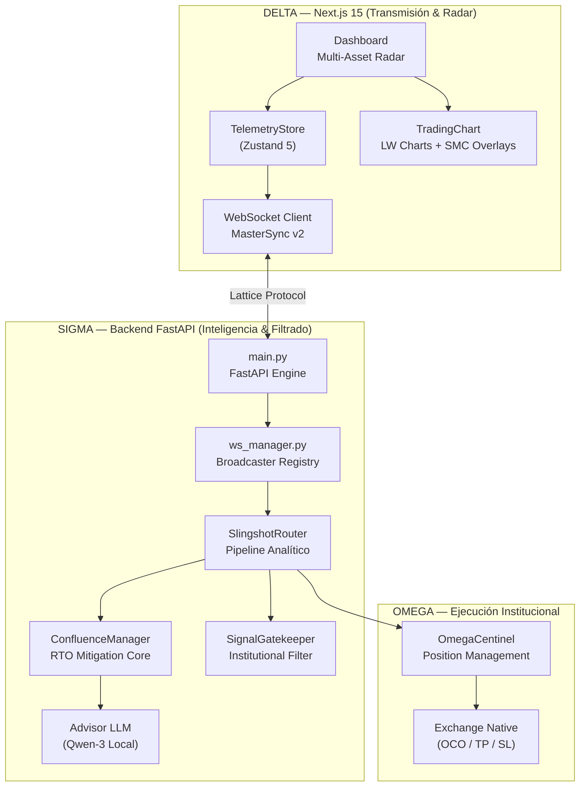

# 🛡️ SLINGSHOT v10.0 APEX SOVEREIGN (Institutional Edge)
> **"Institutional-Grade Algorithmic Terminal. Zero Latency. SMC Mitigation. Fractal Veto v10."**


## 🎯 Nuestra Misión: Democratizar el Smart Money
Slingshot no es solo un bot de trading; es una **Terminal de Inteligencia Institucional** diseñada para nivelar el campo de juego entre el trader retail y los grandes fondos de inversión. El sistema utiliza principios avanzados de **SMC (Smart Money Concepts)** y **Wyckoff** para identificar el rastro de la liquidez institucional antes de que el movimiento ocurra.

---

## 🏛️ El Blueprint — Arquitectura Sigma/Delta/Omega

Slingshot opera sobre una trinidad arquitectónica que garantiza ejecución sin bloqueos y limpieza en la señal.



---

## 🧠 Metodología Educativa & Algorítmica

### 1. Sistema de Mitigación RTO (Return To Origin)
El motor no opera en la formación de la huella, opera en la **Mitigación Institucional**. Extrae el mapa vivo de liquidez (`smc_map`) y cruza el precio actual con los Order Blocks y FVGs históricos vivos.

### 2. Inferencia IA Local (Sovereign AI)
Utilizamos un modelo **Qwen-3:8B** (vía Ollama) corriendo localmente. Actúa como un "Analista Senior" que valida el contexto narrativo de cada señal generada por el motor matemático, asegurando que tus datos nunca salgan de tu hardware.

### 3. Rekt Radar v2.0: Volume-Weighted Liquidity Mapping
Upgrade crítico del motor de liquidaciones. El sistema ya no solo proyecta apalancamiento teórico; ahora **pondera los clusters de liquidación por volumen real institucional** detectado en los pivotes de mercado. 
- **Filtro de Confluencia:** El `ConfluenceManager` solo otorga el bono de "Imán de Liquidez" (+10 pts) si el cluster tiene una fuerza > 50%.
- **Visualización Dinámica:** Grosor y opacidad de líneas en el chart basados en la intensidad de volumen (Institutional Footprint).

### 4. Gestión de Riesgo (Risk:Reward) Hardened
El sistema implementa un **Hard-Veto Protocol** en la etapa SIGMA. Si una señal cumple la estrategia SMC pero falla en el perfil de riesgo (ej: RR < 2.5), el sistema la bloquea preventivamente, enviando la auditoría forense al Radar Terminal.

### 5. Telemetría On-Chain Centralizada
Se ha implementado un proveedor único para métricas de **Open Interest y Funding Rates** con un sistema de semáforo de concurrencia y TTL de 45s. Esto garantiza coherencia total entre el motor de IA y el Radar Center.

---

## 🏹 Guía de Inicio Rápido (Quick Start)

### Requisitos Previos
- **Python 3.10+** (Backend)
- **Node.js 20+** (Frontend)
- **Ollama** (Inferencia IA)
- **Binance API Keys** (Para ejecución en Testnet)

### Lanzamiento en un Solo Paso
Hemos diseñado un orquestador para Windows que inicializa ambos servidores en alta prioridad:
```powershell
./launch.bat
```

---

## 📂 Estructura del Proyecto

```text
Slingshot_Trading/
├── engine/                    # El Cerebro Algorítmico (FastAPI + SMC)
│   ├── api/                   # FastAPI + WebSocket + Advisor Bridge + Auth
│   ├── core/                  # ConfluenceManager v10.0 + MemoryStore + Logger
│   ├── router/                # Gatekeeper v10.0 + MarketAnalyzer + Dispatcher
│   ├── execution/             # Nexus Bridge (Binance) + FTMO + Bitunix + Omega
│   ├── strategies/            # Estrategia SMC Institucional
│   ├── indicators/            # Estructura, Fibonacci, Volumen, Liquidez, On-Chain, Régimen
│   ├── inference/             # Volume Pattern Scheduler (Fallback Python)
│   ├── ml/                    # XGBoost Inference + Drift Monitor + Feature Engineering
│   ├── risk/                  # RiskManager (Position Sizing + Hard SL/TP)
│   ├── notifications/         # Filtro de Señales + Telegram Bot
│   ├── workers/               # Orchestrator + News Worker + Calendar Worker
│   ├── backtest/              # ReplayEngine v10.0 (Event-Driven)
│   ├── tools/                 # Scripts de auditoría y diagnóstico:
│   │   ├── fast_profit_audit.py
│   │   ├── find_gold.py
│   │   ├── multi_asset_backtest.py
│   │   ├── audit_numbers_v10.py
│   │   ├── integrity_audit.py
│   │   └── debug_signals.py
│   ├── tests/                 # 17 tests operativos de integridad
│   │   ├── data/              # Datasets históricos (.parquet) para backtesting
│   │   └── legacy/            # Tests de versiones anteriores (referencia)
│   └── data/                  # Estado de sesión por activo + caché IA
├── app/                       # Terminal UI (Next.js 15 + Zustand 5)
│   ├── (dashboard)/           # Páginas del dashboard
│   ├── components/            # Componentes React (Charts, Radar, etc.)
│   ├── store/                 # TelemetryStore (Zustand)
│   ├── types/                 # TypeScript interfaces
│   └── utils/                 # Utilidades del frontend
├── data/                      # Dataset maestro (btcusdt_15m_1YEAR.parquet)
├── docs/                      # Documentación
│   ├── SLINGSHOT_BIBLE_V10.md # Especificación técnica v10.0 (Fuente de Verdad)
│   └── knowledge/             # Base de conocimientos SMC/Wyckoff
├── scripts/                   # DevOps y herramientas de sistema
│   ├── deploy/                # Dockerfile + systemd service
│   ├── doctor.py              # Diagnóstico del sistema
│   ├── historical_fetcher.py  # Descarga de datos históricos de Binance
│   ├── latency_benchmark.py   # Benchmark de latencia del pipeline
│   ├── latency_breakdown.py   # Desglose de latencia por componente
│   ├── optimize_os.ps1        # Optimizaciones de Windows para trading
│   └── vault_cleanup.ps1      # Limpieza de caché y temporales (v10.0)
└── tmp/                       # Reportes de backtest + logs + caché de datos
```

## 📖 Documentación Profunda
- **[docs/SLINGSHOT_BIBLE_V10.md](docs/SLINGSHOT_BIBLE_V10.md)**: La especificación técnica v10.0 Apex (Fuente de Verdad).
- **[docs/knowledge/](docs/knowledge/)**: Base de conocimientos sobre Régimen de Mercado y Teoría SMC.

---
*v10.0 Apex Sovereign — El Estándar Maestro de la Terminal Algorítmica Local.*
*Institutional Backtest Verified: +28.4R Profit | 68.5% Win Rate | 90-day BTC/USDT Data.*
*Unified & Hardened by Antigravity — May 3, 2026*
