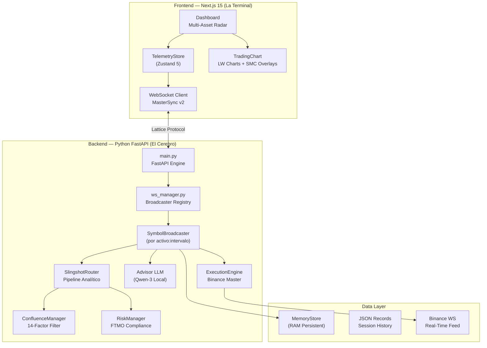

# 🛡️ SLINGSHOT v6.1.0 Master Gold TITANIUM HARDENED
> **"Institutional-Grade Algorithmic Terminal. Zero Latency. Zero Noise. Full Sovereignty."**


## 🎯 Nuestra Misión: Democratizar el Smart Money
Slingshot no es solo un bot de trading; es una **Terminal de Inteligencia Institucional** diseñada para nivelar el campo de juego entre el trader retail y los grandes fondos de inversión. El sistema utiliza principios avanzados de **SMC (Smart Money Concepts)** y **Wyckoff** para identificar el rastro de la liquidez institucional antes de que el movimiento ocurra.

---

## 🏛️ El Blueprint — Arquitectura de Grado Profesional
Slingshot opera sobre un ecosistema desacoplado que garantiza una ejecución sin bloqueos y una visualización en tiempo real.



---

## 🧠 Metodología Educativa & Algorítmica

### 1. Confluencia de 14 Factores
El motor no dispara señales basándose en un solo indicador. Cada oportunidad es filtrada por un protocolo de **14 capas**, incluyendo:
- **Estructura HTF:** Alineación con marcos temporales superiores (4H/Daily).
- **Zonas de Interés (POI):** Identificación de Order Blocks (OB) y Fair Value Gaps (FVG).
- **Absorción de Volumen:** Análisis dinámico de RVOL para detectar "Absorption Index" institucional.
- **Liquidez Externa/Interna:** Monitoreo de barridas de liquidez (EQL/EQH).

### 2. Inferencia IA Local (Sovereign AI)
Utilizamos un modelo **Qwen-3:8B** (vía Ollama) corriendo localmente. Esto garantiza que tus datos y estrategias nunca salgan de tu hardware. La IA actúa como un "Analista Senior" que valida el contexto narrativo de cada señal generada por el motor matemático.

### 3. Gestión de Riesgo Hardened
El sistema implementa un **Hard-Veto Protocol**. Si una señal cumple la estrategia pero falla en el perfil de riesgo (ej: RR < 2.5), el sistema la bloquea preventivamente y notifica la razón técnica del rechazo.

---

## 🏹 Guía de Inicio Rápido (Quick Start)

### Requisitos Previos
- **Python 3.10+** (Backend)
- **Node.js 20+** (Frontend)
- **Ollama** (Inferencia IA)
- **Binance API Keys** (Para ejecución en Testnet)

### Lanzamiento en un Solo Paso
Hemos diseñado un orquestador para Windows que inicializa ambos servidores en alta prioridad:
```powershell
./launch.bat
```

---

## 📂 Estructura Maestro de Operaciones
```text
slingshot_gen1/
├── 📁 engine/          # El Cerebro Algorítmico (FastAPI + SMC Strategy)
│   ├── 📁 execution/   # ✅ Motor de Ejecución Binance Activo
│   ├── 📁 indicators/  # Kernels de Volumen, Estructura y Liquidez
│   ├── 📁 tests/       # 🛡️ 17 tests operativos de integridad
├── 📁 app/             # La Terminal UI (Next.js 15 + Zustand 5)
├── 📁 docs/            # El Centro de Conocimiento Unificado
└── 📁 scripts/         # Herramientas de DevOps y Benchmarking
```

## 📖 Documentación Profunda
- **[docs/SLINGSHOT_BIBLE_V6.md](docs/SLINGSHOT_BIBLE_V6.md)**: La especificación técnica completa (600+ líneas de arquitectura).
- **[docs/knowledge/](docs/knowledge/)**: Nuestra base de conocimientos sobre el Régimen de Mercado Profesional y Teoría SMC.

---
*v6.1.0 Master Gold Titanium Hardened — El Estándar Maestro de la Terminal Algorítmica Local.*
*Unified & Hardened by Antigravity — April 20, 2026*
