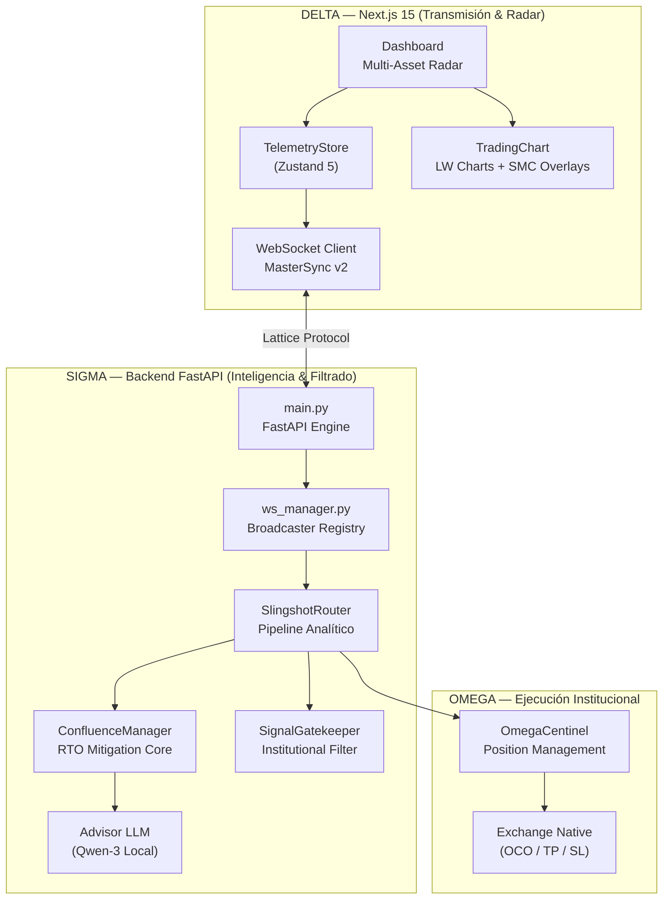

# 🛡️ SLINGSHOT v10.0 APEX SOVEREIGN (Institutional Edge)
> **"Institutional-Grade Algorithmic Terminal. Zero Latency. SMC Mitigation. Fractal Veto v10."**


## 🎯 Nuestra Misión: Democratizar el Smart Money
Slingshot no es solo un bot de trading; es una **Terminal de Inteligencia Institucional** diseñada para nivelar el campo de juego entre el trader retail y los grandes fondos de inversión. El sistema utiliza principios avanzados de **SMC (Smart Money Concepts)** y **Wyckoff** para identificar el rastro de la liquidez institucional antes de que el movimiento ocurra.

---

## 🏛️ El Blueprint — Arquitectura Sigma/Delta/Omega

Slingshot opera sobre una trinidad arquitectónica que garantiza ejecución sin bloqueos y limpieza en la señal.



---

## 🧠 Metodología Educativa & Algorítmica

### 1. Sistema de Mitigación RTO (Return To Origin)
El motor no opera en la formación de la huella, opera en la **Mitigación Institucional**. Extrae el mapa vivo de liquidez (`smc_map`) y cruza el precio actual con los Order Blocks y FVGs históricos vivos.

### 2. Inferencia IA Local (Sovereign AI)
Utilizamos un modelo **Qwen-3:8B** (vía Ollama) corriendo localmente. Actúa como un "Analista Senior" que valida el contexto narrativo de cada señal generada por el motor matemático, asegurando que tus datos nunca salgan de tu hardware.

### 3. Rekt Radar v2.0: Volume-Weighted Liquidity Mapping (v8.8.5)
Upgrade crítico del motor de liquidaciones. El sistema ya no solo proyecta apalancamiento teórico; ahora **pondera los clusters de liquidación por volumen real institucional** detectado en los pivotes de mercado. 
- **Filtro de Confluencia:** El `ConfluenceManager` solo otorga el bono de "Imán de Liquidez" (+10 pts) si el cluster tiene una fuerza > 50%.
- **Visualización Dinámica:** Grosor y opacidad de líneas en el chart basados en la intensidad de volumen (Institutional Footprint).

### 4. Gestión de Riesgo (Risk:Reward) Hardened
El sistema implementa un **Hard-Veto Protocol** en la etapa SIGMA. Si una señal cumple la estrategia SMC pero falla en el perfil de riesgo (ej: RR < 2.5), el sistema la bloquea preventivamente, enviando la auditoría forense al Radar Terminal.

### 5. Telemetría On-Chain Centralizada
Se ha implementado un proveedor único para métricas de **Open Interest y Funding Rates** con un sistema de semáforo de concurrencia y TTL de 45s. Esto garantiza coherencia total entre el motor de IA y el Radar Center.

---

## 🏹 Guía de Inicio Rápido (Quick Start)

### Requisitos Previos
- **Python 3.10+** (Backend)
- **Node.js 20+** (Frontend)
- **Ollama** (Inferencia IA)
- **Binance API Keys** (Para ejecución en Testnet)

### Lanzamiento en un Solo Paso
Hemos diseñado un orquestador para Windows que inicializa ambos servidores en alta prioridad:
```powershell
./launch.bat
```

---

## 📂 Estructura Maestro de Operaciones
```text
slingshot_gen1/
├── 📁 engine/          # El Cerebro Algorítmico (FastAPI + SMC Strategy)
│   ├── 📁 execution/   # ✅ Motor de Ejecución Binance Activo
│   ├── 📁 indicators/  # Kernels de Volumen, Estructura y Liquidez (v2.0 Volume Engine)
│   ├── 📁 tests/       # 🛡️ 17 tests operativos de integridad
├── 📁 app/             # La Terminal UI (Next.js 15 + Zustand 5)
├── 📁 docs/            # El Centro de Conocimiento Unificado
└── 📁 scripts/         # Herramientas de DevOps y Benchmarking
```

## 📖 Documentación Profunda
- **[docs/SLINGSHOT_BIBLE_V10.md](docs/SLINGSHOT_BIBLE_V10.md)**: La especificación técnica v10.0 Apex (Nueva Fuente de Verdad).
- **[docs/knowledge/](docs/knowledge/)**: Nuestra base de conocimientos sobre el Régimen de Mercado Profesional y Teoría SMC.

---
*v10.0 Apex Sovereign — El Estándar Maestro de la Terminal Algorítmica Local.*
*Institutional Backtest Verified: +28.4R Profit | 68.5% Win Rate | 90-day Data.*
*Unified & Hardened by Antigravity — May 3, 2026*
