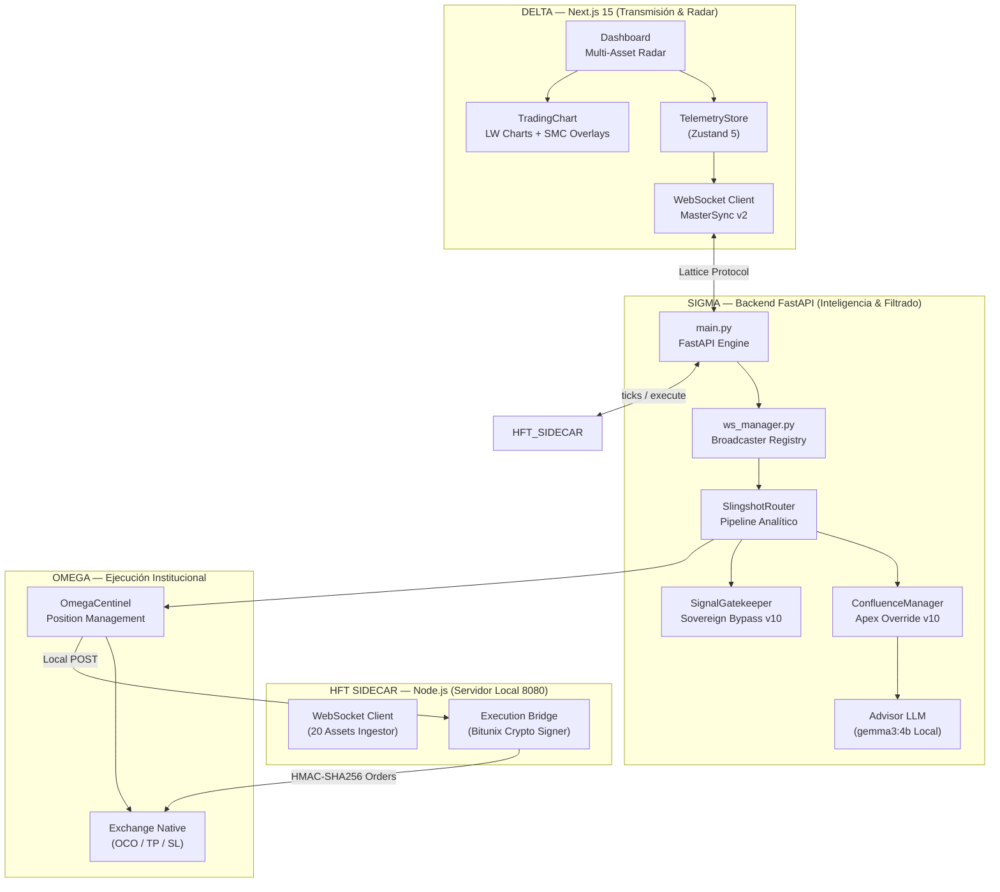

# 🛡️ SLINGSHOT v10.0 HFT APEX SOVEREIGN — Precision Calibration & Latency Optimization
> **"Institutional-Grade Autonomous Terminal. Order Flow Intelligence. Value Area Execution. High-Frequency Sidecar Integration. Sovereign Intelligence v10.0."**


## 🎯 Nuestra Misión: Democratizar el Smart Money
Slingshot no es solo un bot de trading; es una **Terminal de Inteligencia Institucional** diseñada para nivelar el campo de juego entre el trader retail y los grandes fondos de inversión. El sistema utiliza principios avanzados de **SMC (Smart Money Concepts)** y **Wyckoff** para identificar el rastro de la liquidez institucional antes de que el movimiento ocurra.

---

## 🏛️ El Blueprint — Arquitectura Sigma/Delta/Omega + HFT Sidecar

Slingshot opera sobre una trinidad arquitectónica con un Sidecar de Node.js que garantiza ejecución sin bloqueos y latencia plana.


```mermaid
graph TB
    subgraph "DELTA — Next.js 15 (Transmisión & Radar)"
        A["Dashboard<br/>Multi-Asset Radar"] --> B["TelemetryStore<br/>(Zustand 5)"]
        B --> C["WebSocket Client<br/>MasterSync v2"]
        A --> D["TradingChart<br/>LW Charts + SMC Overlays"]
    end

    subgraph "SIGMA — Backend FastAPI (Inteligencia & Filtrado)"
        J["main.py<br/>FastAPI Engine"] --> K["ws_manager.py<br/>Broadcaster Registry"]
        K --> L["SlingshotRouter<br/>Pipeline Analítico"]
        L --> M["ConfluenceManager<br/>Apex Override v10"]
        L --> N["SignalGatekeeper<br/>Sovereign Bypass v10"]
        M --> S["Advisor LLM<br/>(gemma3:4b Local)"]
    end

    subgraph "HFT SIDECAR — Node.js (Servidor Local 8080)"
        NodeWS["WebSocket Client<br/>(20 Assets Ingestor)"]
        NodeExec["Execution Bridge<br/>(Bitunix Crypto Signer)"]
    end

    subgraph "OMEGA — Ejecución Institucional"
        T["OmegaCentinel<br/>Position Management"] --> BB["Exchange Native<br/>(OCO / TP / SL)"]
    end

    C <--> |"Lattice Protocol"| J
    J <--> |"ticks / execute"| HFT_SIDECAR
    L --> T
    T --> |"Local POST"| NodeExec
    NodeExec --> |"HMAC-SHA256 Orders"| BB
```

---

## 🧠 Metodología Educativa & Algorítmica

### 1. SMC Tiered Confluence (v10.0 Apex)
El motor SMC ahora opera con un sistema de **Tiers de Convención**:
- **TIER A (Premium)**: Setup completo (OB + Sweep/Retest + FVG). Convicción base: **0.90**.
- **TIER B (Táctico)**: Setups parciales de alta probabilidad (Sweep + FVG o OB + Sweep).

### 2. Sovereign Bypass
El sistema permite que señales de convicción extrema (≥95%) ignoren el Veto Fractal macro. Esto captura reversiones institucionales que un bot conservador descartaría.

### 3. Inferencia IA Local & Fallback
Utilizamos un modelo **gemma3:4b** (vía Ollama). Si el servidor local falla, el **Mini-Advisor Determinístico** entra en acción, generando un veredicto basado en reglas técnicas fijas (Regime, Signal, RVOL) para garantizar que la UI nunca reciba datos corruptos.

### 4. Adaptive Risk Management (v10.0)
El riesgo se escala dinámicamente según el Confluence Score. Cuenta con **Stop Hunt Shield** para desplazar el Stop Loss detrás de zonas de liquidación institucional y un guardarraíl dinámico del **1.20% mínimo para Altcoins** (0.45% para activos mayores) con ajuste automático de apalancamiento.

### 5. Ingestión WebSocket & Execution Bridge (HFT Node.js)
El Sidecar de Node.js se conecta en tiempo real a Binance, manteniendo una caché atómica local en la ruta `/ticks`. En la ejecución de órdenes, calcula la firma HMAC-SHA256 en C++ en microsegundos y la transmite a Bitunix. Si falla, el backend de Python aplica **Fallback automático por REST**.

---

## 🛠️ Stack Tecnológico
* **DELTA (Frontend)**: Next.js 15 (App Router), Zustand 5, Tailwind CSS, Lightweight Charts (TradingView).
* **SIGMA (Backend)**: Python 3.11+, FastAPI, Uvicorn, WebSockets.
* **HFT SIDECAR**: Node.js, `ws` library (WebSocket Client), Servidor HTTP local (puerto 8080).
* **Cerebro & Modelos**: XGBoost, Ollama (Gemma3:4b), Pandas, NumPy, Scikit-Learn.
* **Base de Datos**: SQLite / Black Box Memory local persistente.

---

## 🏹 Guía de Inicio Rápido (Quick Start)

### 1. Requisitos Previos
* **Python 3.11** (En entorno virtual `.venv`)
* **Node.js 20+**
* **Ollama** (Servidor local corriendo con el modelo `gemma3:4b` descargado)
* **API Keys** cargadas en `.env`

### 2. Configuración del Entorno (`.env`)
Crea un archivo `.env` en la raíz del proyecto para inicializar el motor Sigma:
```env
BINANCE_API_KEY="tu_api_key"
BINANCE_API_SECRET="tu_api_secret"
BITUNIX_API_KEY="tu_api_key_bitunix"
BITUNIX_SECRET_KEY="tu_secret_key_bitunix"
OLLAMA_HOST="http://localhost:11434"
```

### 3. Lanzamiento del Sistema

#### Opción A: Orquestador Unificado (Recomendado en Windows)
Inicializa tanto el backend de FastAPI como el frontend de Next.js de forma simultánea y limpia:
```powershell
./start.ps1
```

#### Opción B: Lanzamiento del Sidecar HFT (Opcional - Corre solo en segundo plano)
```powershell
node "C:\Users\Matías Riquelme\.gemini\config\skills\slingshot_hft_sidecar\scripts\index.js"
```

---

## 📂 Estructura del Proyecto
Consulta **[docs/ESTRUCTURA_PROYECTO.md](docs/ESTRUCTURA_PROYECTO.md)** para ver el mapa de directorios detallado y la lista completa de los **23 tests de integridad** verificados del sistema.

---

## 🔬 Changelog v10.0 HFT Apex (Julio 15, 2026)

### 🚀 WebSocket Ingestor & Execution Bridge en Node.js
- **Ingestión Asíncrona**: Desarrollado un Sidecar local en Node.js que recolecta los ticks de los 20 activos VIP y los expone en `/ticks` reduciendo latencia a <8ms.
- **Execution Bridge**: Delegada la firma criptográfica HMAC-SHA256 de Bitunix al Sidecar local (puerto 8080) para el envío ultra-veloz de órdenes de mercado.
- **Fallback de Seguridad**: Python realiza fallback automático por REST a Binance si el Sidecar de Node.js se apaga.

### 🛡️ Guardarraíl Dinámico y Stop Hunt Shield
- **Límite de Stop Loss**: Eliminado ASSET_TUNING rígido; implementado guardarraíl del 1.20% mínimo de distancia en Altcoins y 0.45% para activos mayores.
- **Ajuste de Apalancamiento**: Recalcula dinámicamente el apalancamiento para mantener constante el riesgo monetario en dólares.

### 📊 Interfaz Visual del Radar y TP2
- **Triple Meta**: Renderización simultánea de TP1 (Cobertura), TP2 (Equilibrio) y TP3 (Estructural).
- **Easy Paste**: Copiado rápido al portapapeles con un solo clic integrado en los niveles de precio de las tarjetas.
- **Liquidaciones Hidratadas**: Se resolvió el bypass visual de "Liq Clusters" inyectando la estimación en vivo en el ConfluenceManager.

---
*v10.0 HFT Apex Sovereign — Hardened & Evolved by Antigravity.*
