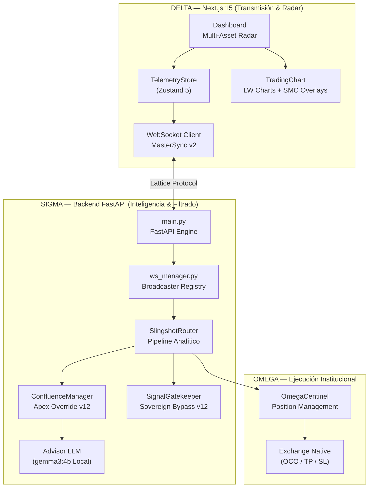

# 🛡️ SLINGSHOT v13.1 SOVEREIGN INTELLIGENCE — Yosh Order Flow Edition
> **"Institutional-Grade Autonomous Terminal. Order Flow Intelligence. Value Area Execution. Sovereign Intelligence v13.1."**


## 🎯 Nuestra Misión: Democratizar el Smart Money
Slingshot no es solo un bot de trading; es una **Terminal de Inteligencia Institucional** diseñada para nivelar el campo de juego entre el trader retail y los grandes fondos de inversión. El sistema utiliza principios avanzados de **SMC (Smart Money Concepts)** y **Wyckoff** para identificar el rastro de la liquidez institucional antes de que el movimiento ocurra.

---

## 🏛️ El Blueprint — Arquitectura Sigma/Delta/Omega

Slingshot opera sobre una trinidad arquitectónica que garantiza ejecución sin bloqueos y limpieza en la señal.


```mermaid
graph TB
    subgraph "DELTA — Next.js 15 (Transmisión & Radar)"
        A["Dashboard<br/>Multi-Asset Radar"] --> B["TelemetryStore<br/>(Zustand 5)"]
        B --> C["WebSocket Client<br/>MasterSync v2"]
        A --> D["TradingChart<br/>LW Charts + SMC Overlays"]
    end

    subgraph "SIGMA — Backend FastAPI (Inteligencia & Filtrado)"
        J["main.py<br/>FastAPI Engine"] --> K["ws_manager.py<br/>Broadcaster Registry"]
        K --> L["SlingshotRouter<br/>Pipeline Analítico"]
        L --> M["ConfluenceManager<br/>Apex Override v12"]
        L --> N["SignalGatekeeper<br/>Sovereign Bypass v12"]
        M --> S["Advisor LLM<br/>(gemma3:4b Local)"]
    end

    subgraph "OMEGA — Ejecución Institucional"
        T["OmegaCentinel<br/>Position Management"] --> BB["Exchange Native<br/>(OCO / TP / SL)"]
    end

    C <--> |"Lattice Protocol"| J
    L --> T
```

---

## 🧠 Metodología Educativa & Algorítmica

### 1. SMC Tiered Confluence (v13.1 Apex)
El motor SMC ahora opera con un sistema de **Tiers de Convención**:
- **TIER A (Premium)**: Setup completo (OB + Sweep/Retest + FVG). Convicción base: **0.90**.
- **TIER B (Táctico)**: Setups parciales de alta probabilidad (Sweep + FVG o OB + Sweep). Convicción base: **0.65**. El Gatekeeper aplica filtros más estrictos a este tier para filtrar ruido.

### 2. Sovereign Bypass v12.0
El sistema permite que señales de convicción extrema (≥95%) ignoren el Veto Fractal macro. Esto captura reversiones institucionales que un bot conservador descartaría.

### 3. Apex Override v12.0
Cuando la absorción institucional supera el 90%, el Confluence Score recibe un bonus de +20 puntos, priorizando la huella de capital real sobre las reglas heurísticas.

### 4. Inferencia IA Local & Fallback (v13.1)
Utilizamos un modelo **gemma3:4b** (vía Ollama). Si el servidor local falla, el **Mini-Advisor Determinístico** entra en acción, generando un veredicto basado en reglas técnicas fijas (Regime, Signal, RVOL) para garantizar que la UI nunca reciba datos corruptos.

### 5. Black Box: Módulo de Memoria de Errores (v13)
Slingshot ahora tiene memoria. El módulo **Black Box** graba la "huella digital" de cada trade perdedor. Si se detecta un patrón similar (>85% coincidencia), se emite un **VETO_BY_MEMORY**.

### 6. Adaptive Risk Management (v13)
El riesgo se escala dinámicamente según el Confluence Score (0.25% - 2.0%).

### 7. Radar Resilience v2 (Visibility Re-hydration)
El **RadarFeed** ya no requiere polling. Utiliza el evento `visibilitychange` para re-hidratar automáticamente el feed global cuando el usuario vuelve a la pestaña, asegurando sincronización total con el WebSocket Maestro.

### 8. 🏦 Yosh Order Flow — Value Area Intelligence (v13.1)
Integración de la metodología institucional de **Yosh**. El sistema ahora opera con inteligencia de **Order Flow puro**:
- **Volume Profile (POC/VAH/VAL)**: Calculado cada 60 segundos.
- **Look Above and Fail (LAF/LBF)**: Detección de trampas institucionales.
- **Scoring de Confluencia Yosh**: Bonus por OTE dinámico (10-25 pts) independiente de la ventana horaria.

---

## 🏹 Guía de Inicio Rápido (Quick Start)

### Requisitos Previos
- **Python 3.10+** (Backend)
- **Node.js 20+** (Frontend)
- **Ollama** (Inferencia IA)
- **Binance API Keys** (Para ejecución en Testnet)

### Lanzamiento en un Solo Paso
Hemos diseñado un orquestador para Windows que inicializa ambos servidores en alta prioridad:
```powershell
./launch.bat
```

---

## 📂 Estructura del Proyecto

```text
Slingshot_Trading/
├── engine/                        # SIGMA: Cerebro Algorítmico (FastAPI + SMC)
│   ├── main_router.py             # Pipeline principal (Async Support v13)
│   ├── api/                       # FastAPI + WebSocket + Advisor + Auth
│   ├── core/                      # Confluence (GP Fix v13.1) + BlackBox + AI Validator
│   ├── router/                    # Gatekeeper v13 + Analyzer + Dispatcher
│   ├── execution/                 # Nexus Bridge (Binance) + Omega Listener
│   ├── strategies/                # SMC Tiers A/B (v13.1 Apex)
│   ├── indicators/                # Structure, Fibonacci, Volume, Liquidity, On-Chain, Regime
│   ├── inference/                 # Volume Pattern Scheduler
│   ├── ml/                        # XGBoost Inference + Drift Monitor
│   ├── risk/                      # RiskManager (Adaptive Risk Scaling v13)
│   ├── notifications/             # Filtro de Señales + Telegram Bot
│   ├── workers/                   # Orchestrator + News Worker + Calendar Worker
│   ├── backtest/                  # ReplayEngine v11.1.2 (Event-Driven)
│   ├── tools/                     # Scripts de auditoría y diagnóstico
│   ├── tests/                     # 17 tests de integridad
│   └── data/                      # Estado de sesión por activo + caché IA
├── app/                           # DELTA: Terminal UI (Next.js 15 + Zustand 5)
│   ├── store/                     # TelemetryStore + IndicatorsStore
│   ├── components/                # TradingChart + Radar (Visibility Sync v13.1)
│   └── ...
└── ...
```

---

## 📖 Documentación Profunda
- **[docs/SLINGSHOT_BIBLE_V10.md](docs/SLINGSHOT_BIBLE_V10.md)**: La especificación técnica Apex.
- **[docs/ESTRUCTURA_PROYECTO.md](docs/ESTRUCTURA_PROYECTO.md)**: Mapa completo del proyecto.
- **[docs/AUDIT_PLAN_V11.md](docs/AUDIT_PLAN_V11.md)**: Plan de auditoría vigente.

---

## 🔬 Changelog v13.1 (Stabilization & Apex Tiers)
### 🏹 Estrategia SMC Evolucionada
- **Tiered Signal System**: Implementado Tier A (Premium) y Tier B (Táctico) con convicción diferenciada (0.9 vs 0.65).
- **Golden Pocket Scoring**: Fix de indentación. GP ahora es independiente de la Yosh Window y tiene scoring dinámico (10-25 pts) según confluencia con Whale Legs.

### 🛡️ Resiliencia & Backend
- **Deterministic Advisor Fallback**: Mini-advisor basado en reglas para caídas de Ollama.
- **Signal Debounce v2**: Score bucketing (S/A/B) para evitar duplicados por micro-variaciones de datos.

### 📊 Frontend & Radar
- **Visibility Sync**: Re-hidratación automática del Radar al cambiar de pestaña.
- **TradingChart v5.1**: Refactorización completa a Lightweight Charts v5.1 API.

### 🔧 Correcciones Críticas
- **Golden Pocket Bypass**: Corregido bug que impedía la evaluación de OTE fuera de horario.
- **Absorción Determinista**: `absorption_score` sanitizado para garantizar rango [0, 100].

## 🔬 Changelog v13.0 (Sovereign Intelligence)
### Evolución de Inteligencia
- **Black Box (Memory Module)**: Grabación persistente de huellas de pérdida para prevenir la repetición de errores técnicos (Similarity Match > 85%).
- **AI Validator Agent**: Auditoría narrativa obligatoria mediante LLM local (gemma3:4b) para señales en zona de incertidumbre (60-80% confluencia).
- **Adaptive Risk Scaling**: Gestión dinámica de la posición (0.25% - 2.0%) vinculada directamente al Confluence Score institucional.
- **Async Pipeline Support**: Refactorización completa del pipeline táctico para soportar inferencia IA no bloqueante.

### Mejoras de UI (Visual Sovereign)
- **AI Narrative Audit Panel**: Desglose visual de la lógica de la IA, confianza del modelo y razonamiento estructural directamente en la tarjeta de señal.
- **Dynamic Scale Indicator**: Visualización en tiempo real del porcentaje de riesgo asignado por el RiskManager según la confluencia detectada.
- **Intelligence Status Monitor**: Indicadores globales en el Market Panel sobre el estado de "Armado" del Black Box y la disponibilidad del Auditor IA.
- **v13 Lifecycle Integration**: Soporte nativo para estados `AI_VETO` y `BLOCKED_BY_MEMORY` con etiquetas visuales específicas.

### Mejoras del Motor
- **Mitigación de OB por Cierre**: Los Order Blocks ahora requieren cierre de vela para su invalidación técnica.
- **Sovereign Bypass**: Las señales de convicción extrema (≥95%) mantienen su prioridad de ignorar el veto fractal.

---
*v13.1 Yosh Order Flow Edition — Institutional Order Flow Intelligence.*
*Hardened & Evolved by Antigravity — May 14, 2026*
