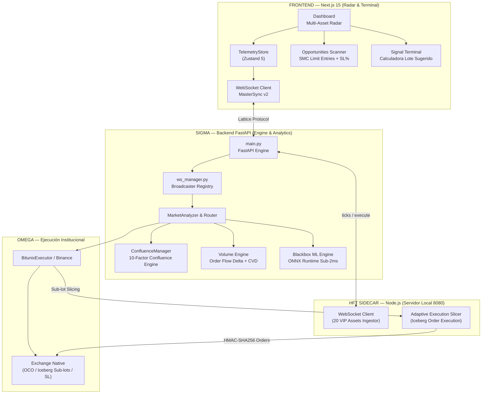

# 🛡️ SLINGSHOT v11.0 APEX ENGINE — High-Frequency Order Flow & Institutional Intelligence

> **"Institutional-Grade Autonomous Quantitative Trading Terminal. Order Flow Delta & Cumulative Volume Delta (CVD). ONNX Runtime Sub-2ms AI Acceleration. Adaptive Iceberg Order Execution Slicer. Sovereign Intelligence v11.0 Apex."**


---

## 🎯 Nuestra Misión: Democratizar el Smart Money

Slingshot es una **Terminal de Inteligencia Institucional** de grado profesional diseñada para cerrar la brecha entre el trader retail y los grandes fondos de inversión (*Smart Money*). El sistema integra física de mercado, análisis **SMC (Smart Money Concepts)**, **Wyckoff**, **CVD (Cumulative Volume Delta)** y **Order Flow Delta (Tick-Rule HFT)** para anticipar acumulaciones y distribuciones antes de la expansión del precio.

---

## 🏛️ El Blueprint — Arquitectura v11.0 Apex


```mermaid
graph TB
    subgraph "FRONTEND — Next.js 15 (Radar & Terminal)"
        A["Dashboard<br/>Multi-Asset Radar"] --> B["TelemetryStore<br/>(Zustand 5)"]
        B --> C["WebSocket Client<br/>MasterSync v2"]
        A --> D["Opportunities Scanner<br/>SMC Limit Entries + SL%"]
        A --> E["Signal Terminal<br/>Calculadora Lote Sugerido"]
    end

    subgraph "SIGMA — Backend FastAPI (Engine & Analytics)"
        J["main.py<br/>FastAPI Engine"] --> K["ws_manager.py<br/>Broadcaster Registry"]
        K --> L["MarketAnalyzer & Router"]
        L --> M["ConfluenceManager<br/>10-Factor Confluence Engine"]
        L --> N["Volume Engine<br/>Order Flow Delta + CVD"]
        L --> O["Blackbox ML Engine<br/>ONNX Runtime Sub-2ms"]
    end

    subgraph "HFT SIDECAR — Node.js (Servidor Local 8080)"
        NodeWS["WebSocket Client<br/>(20 VIP Assets Ingestor)"]
        NodeExec["Adaptive Execution Slicer<br/>(Iceberg Order Execution)"]
    end

    subgraph "OMEGA — Ejecución Institucional"
        T["BitunixExecutor / Binance"] --> BB["Exchange Native<br/>(OCO / Iceberg Sub-lots / SL)"]
    end

    C <--> |"Lattice Protocol"| J
    J <--> |"ticks / execute"| NodeWS
    L --> T
    T --> |"Sub-lot Slicing"| NodeExec
    NodeExec --> |"HMAC-SHA256 Orders"| BB
```

---

## 🧠 Innovaciones Clave de Slingshot v11.0 Apex

### 1. 🌊 Cumulative Volume Delta (CVD) & Order Flow Delta ($\Delta$ Ratio)
- **Tick-Rule Ingestion:** Clasificación en microsegundos de compras vs ventas a mercado (*Taker Orders*).
- **CVD Divergence Engine:** Mide la acumulación o distribución neta en un horizonte móvil de 30–50 velas, detectando absorciones institucionales (`BULLISH_DIVERGENCE` / `BEARISH_DIVERGENCE`).

### 2. 🎯 Entradas Límite SMC Óptimas (Order Blocks & FVG)
- Las señales y el escáner **no entran al precio flotante de mercado**, sino que calculan la **Entrada Límite SMC Óptima** (`optimal_entry`) ubicada en la frontera de mitigación del *Order Block* o *FVG*, eliminando la deriva de precio (*price drifting*).

### 3. 🛡️ Protecciones Anti-Stop Hunt & Calculadora de Lote Sugerido
- **Colchón Anti-Ruido:** Margen estructural de `0.8x - 1.2x ATR` detrás de los bloques y guardarraíl mínimo de `1.80%` en altcoins (`0.60%` en activos mayores).
- **Calculadora de Posición Constante:** El bot recalcula el tamaño nominal de la orden en USDT según la distancia del SL para que **tu pérdida en dólares ($ USDT) permanezca siempre exacta e inalterada**.

### 4. 🧠 Inferencia ML Acelerada con ONNX Runtime C++
- Integración de `onnxruntime` para ejecutar predicciones del modelo probabilístico en **$< 2\text{ms}$**, liberando capacidad del CPU.

### 5. 🧊 Ejecutor Adaptativo Iceberg Slicing (Zero Market Impact)
- Para posiciones superiores a **$2,000 USDT**, el motor fragmenta la entrada en **3 sub-lotes dinámicos (33% c/u)** desfasados por 150ms, anulando el deslizamiento (*Slippage*) en los libros de futuros.

---

## 🛠️ Stack Tecnológico

* **Frontend**: Next.js 15 (App Router), Zustand 5, Tailwind CSS, Lightweight Charts (TradingView).
* **Backend**: Python 3.12, FastAPI, Uvicorn, WebSockets, Pandas, NumPy, Scikit-Learn.
* **HFT Sidecar**: Node.js 20+, WebSocket Client (`ws`), HTTP Local Server (Puerto 8080).
* **IA & ML Engine**: ONNX Runtime, XGBoost (`slingshot_xgb_15m_v2.json`), Ollama (Gemma3:4b).
* **Testing**: Python `unittest` suite (13/13 tests en verde).

---

## 🚀 Guía de Inicio Rápido (Quick Start)

### 1. Requisitos Previos
* **Python 3.12** (Configurado en entorno virtual `.venv`)
* **Node.js 20+**
* **Ollama** (Opcional: con modelo `gemma3:4b` descargado)
* **API Keys** configuradas en el archivo `.env`

### 2. Configuración de Variables de Entorno (`.env`)
```env
BINANCE_API_KEY="tu_api_key"
BINANCE_API_SECRET="tu_api_secret"
BITUNIX_API_KEY="tu_api_key_bitunix"
BITUNIX_SECRET_KEY="tu_secret_key_bitunix"
OLLAMA_HOST="http://localhost:11434"
```

### 3. Lanzamiento del Sistema

#### Orquestador Unificado (Recomendado)
Ejecuta el script unificado de lanzamiento que inicia el Sidecar HFT, el Backend FastAPI y el Frontend Next.js simultáneamente:
```powershell
./launch.bat
```

#### Ejecución Manual por Componente
```powershell
# 1. Iniciar Sidecar HFT (Node.js)
node slingshot_hft_sidecar/scripts/index.js

# 2. Iniciar Backend Engine (Python FastAPI)
$env:PYTHONPATH="."; .\.venv\Scripts\python.exe -m uvicorn engine.api.main:app --host 0.0.0.0 --port 8000 --reload

# 3. Iniciar Frontend UI (Next.js 15)
npm run dev
```

---

## 🔬 Ejecución de Pruebas Unitarias Automatizadas

Para validar los 13 tests de integridad de confluencia, CVD, entradas límite e Iceberg:
```powershell
$env:PYTHONPATH="."; .\.venv\Scripts\python.exe -m unittest discover -s engine/tests -p "test_*.py"
```

---

## 📂 Estructura del Repositorio

```
Slingshot_Trading/
├── app/                        # Frontend Next.js 15 (App Router UI)
│   ├── components/
│   │   ├── radar/              # ActiveAssetsMonitor & OpportunitiesScanner
│   │   ├── signals/            # SignalTerminal & SignalCardItem
│   │   └── ui/                 # PlanOperativoPanel & Navigation
│   └── store/                  # TelemetryStore (Zustand 5 State)
├── engine/                     # Core Backend Python Engine
│   ├── api/                    # FastAPI Endpoints & WebSocket Manager
│   ├── core/                   # ConfluenceManager, Router & MemoryStore
│   ├── execution/              # BitunixExecutor & Iceberg Order Slicer
│   ├── indicators/             # Volume Engine, CVD, SMT & SMC Indicators
│   ├── ml/                     # ONNX Runtime, XGBoost & Feature Engineering
│   ├── risk/                   # RiskManager & Dynamic Lot Sizing
│   ├── tests/                  # Suite de 13 Pruebas Unitarias
│   └── workers/                # MarketScanner & Background Jobs
├── slingshot_hft_sidecar/      # Ingestor HFT en Node.js (Puerto 8080)
├── launch.bat                  # Lanzador Unificado para Windows
└── README.md                   # Documentación Oficial v11.0 Apex
```

---

*v11.0 Apex Engine — Autonomous Institutional Trading System.*
