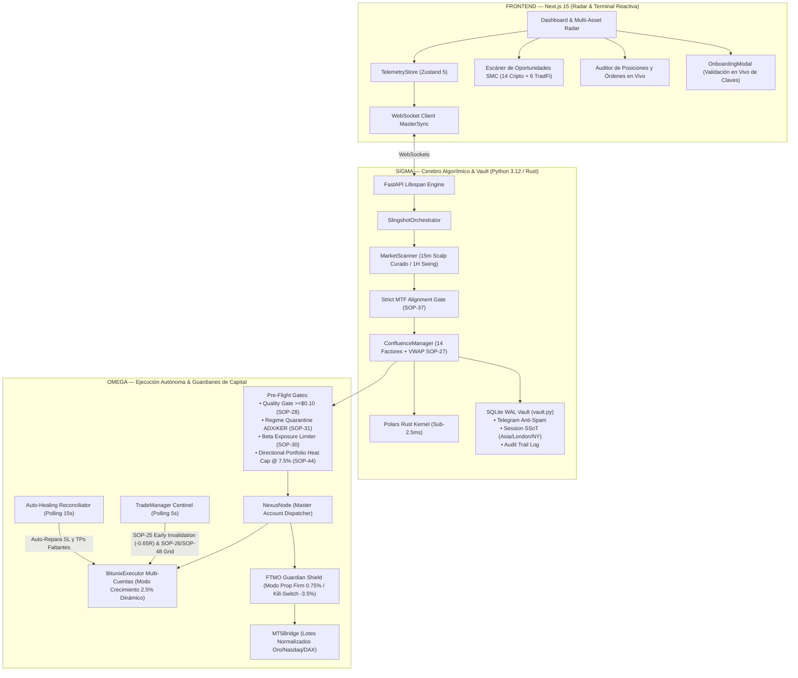

# 🛡️ SLINGSHOT v50.0 APEX EXPANSION — Autonomous Institutional Multi-Market Terminal

> **"Terminal Cuantitativa Autónoma de Grado Institucional. Slingshot v50.0 APEX EXPANSION: Inferencia Neural Meta-Labeling (XGBoost / ONNX en ConfluenceManager +10pts), Pipeline de Auto-Retrenamiento Asíncrono con Validación Fail-Safe Out-Of-Sample (SOP-61), Despachador Periódico de Tear Sheets Ejecutivos a Telegram (SOP-62) con Persistencia ACID de Trades Cerrados en SQLite WAL, Sentinela de Intervención Manual de Clientes SOP-59 con Purgado Atómico Anti-Orphan, Motor de Reportería Cuantitativa Institucional SOP-60 (Sharpe, Sortino, Drawdown, Profit Factor), Blindaje de Capital SOP-58 y Despacho Concurrente Multi-Cuenta SOP-57 con Cifrado AES en Reposo (+80.45R de Retorno SSoT, Profit Factor 2.01, Max Drawdown -3.64% y $1,000 -> $6,673.12 USD). Suite Oficial de 41/41 Pruebas Unitarias Aprobadas al 100% en VPS de Producción y 296 Pruebas Globales. Canon Inmutable de los 62 Protocolos de Seguridad Operativa (SOP-01 a SOP-62)."**


---

## 🎯 Nuestra Misión: Democratizar el Smart Money con Máxima Resiliencia

Slingshot es una **Terminal de Inteligencia y Ejecución Cuantitativa Institucional** diseñada para operar simultáneamente en mercados de Criptomonedas (Bitunix 24/7) y Cuentas de Fondeo (*Prop Firms* como FTMO en MetaTrader 5). El sistema combina:

* **Smart Money Concepts (SMC) de Alta Fidelidad:** Identificación matemática de Fair Value Gaps (FVG), Order Blocks de alta reacción, Zonas OTE (Fibonacci 61.8% - 78.6%) y barridos de liquidez.
* **Arquitectura Multi-Cuentas (Master Account Dispatcher):** Capacidad de despachar en paralelo una misma señal institucional hacia múltiples cuentas de Bitunix con APIs independientes, leyendo el balance en vivo de cada una y dimensionando el riesgo SOP-41 de forma completamente aislada.
* **Arquitectura Dual de Riesgo:**
  * **Bitunix (Modo Crecimiento):** Calibrado al **2.50% de riesgo real dinámico** con **Pure Dollar-Risk Sizing (SOP-41)**, **Pre-Flight Loss Hard-Clamp (SOP-42)**, e interés compuesto automático (SOP-39) con guardián de buffer libre (SOP-40).
  * **FTMO (Modo Guardián):** Calibrado estrictamente al **0.75% por trade** con **Kill-Switch preventivo a -3.5% diario** y límite total a -7.5%, blindando la cuenta ante cualquier riesgo de descalificación.
* **Malla de Salidas Dinámica (SOP-26 & SOP-48):** Cosecha institucional del **40% a +1.2R** (mueve SL a Breakeven $+0.08\%$), **40% a +2.0R** (asegura $+1.0\text{R}$ en verde) y **20% restante como Runner Elástico a +5.0R** vía Ratio de Eficiencia de Kaufman (KER) con *Ratchet Lock* en $+2.5\text{R}$.
* **Invalidación Temprana (SOP-25):** Si el precio retrocede $-0.65\text{R}$ en contra sin tocar TP1, corta la operación anticipadamente, **ahorrando un 35% del Stop Loss**.
* **Modulación Cíclica Semanal (SOP-46):** Asignación de riesgo asimétrica: **1.20x en Martes y Miércoles** (días de expansión institucional que generan el 53% del retorno con PF 2.25) y **0.80x en Jueves y Viernes** (defensa de capital ante toma de beneficios de fin de semana).
* **Convicción Cuantitativa "Trinidad del Alfa" (SOP-47):** Bono Kelly de **1.20x** para los activos de mayor edge y comportamiento de tendencia limpio (`BNBUSDT`, `SOLUSDT`, `FETUSDT` con PF > 2.7 y Win Rate $\ge 60\%$).
* **Sintonización Intradía de Golden Hours (SOP-49):** Bono de aceleración del **1.15x** en las aperturas europeas y solapamiento pre-NY (**09:00 UTC** y **11:00 UTC**).
* **Pure Dollar-Risk Sizing & Hard-Clamp (SOP-41 & SOP-42):** Cantidad derivada de $\text{Qty} = (\text{Balance} \times 0.025) / |\text{Entry} - \text{SL}|$, garantizando que el Stop Loss cueste invariablemente el $2.50\%$ de la cuenta.
* **Kernel en Rust (`Polars`):** Cálculo vectorial sub-$2.5\text{ ms}$ para indicadores y confluencias.
* **Bóveda SQLite WAL Transaccional (`vault.py`):** Persistencia ACID de sesiones, bitácora de auditoría inmutable y registro histórico de trades cerrados con PnL.
* **Suite de Certificación QA Oficial:** **296/296 pruebas unitarias globales aprobadas al 100%** y **Quality Gate de Producción de 41/41 tests críticos en VPS (`verificar_sistema.bat`)**.

---

## 🏛️ Arquitectura del Sistema v46.5 APEX ZENITH SOVEREIGN


```mermaid
graph TB
    subgraph "FRONTEND — Next.js 15 (Radar & Terminal Reactiva)"
        A["Dashboard & Multi-Asset Radar"] --> B["TelemetryStore (Zustand 5)"]
        B --> C["WebSocket Client MasterSync"]
        A --> D["Escáner de Oportunidades SMC (14 Cripto + 6 TradFi)"]
        A --> E["Auditor de Posiciones y Órdenes en Vivo"]
        A --> OB["OnboardingModal (Validación en Vivo de Claves)"]
    end

    subgraph "SIGMA — Cerebro Algorítmico & Vault (Python 3.12 / Rust)"
        J["FastAPI Lifespan Engine"] --> K["SlingshotOrchestrator"]
        K --> L["MarketScanner (15m Scalp Curado / 1H Swing)"]
        L --> MTF["Strict MTF Alignment Gate (SOP-37)"]
        MTF --> M["ConfluenceManager (14 Factores + VWAP SOP-27)"]
        M --> POLARS["Polars Rust Kernel (Sub-2.5ms)"]
        M --> V["SQLite WAL Vault (vault.py)<br/>• Telegram Anti-Spam<br/>• Session SSoT (Asia/London/NY)<br/>• Audit Trail Log"]
    end

    subgraph "OMEGA — Ejecución Autónoma & Guardianes de Capital"
        M --> GATES["Pre-Flight Gates:<br/>• Quality Gate >=$0.10 (SOP-28)<br/>• Regime Quarantine ADX/KER (SOP-31)<br/>• Beta Exposure Limiter (SOP-30)<br/>• Directional Portfolio Heat Cap @ 7.5% (SOP-44)"]
        GATES --> NX["NexusNode (Master Account Dispatcher)"]
        NX --> BX["BitunixExecutor Multi-Cuentas (Modo Crecimiento 2.5% Dinámico)"]
        NX --> FG["FTMO Guardian Shield (Modo Prop Firm 0.75% / Kill-Switch -3.5%)"]
        FG --> MT5["MT5Bridge (Lotes Normalizados Oro/Nasdaq/DAX)"]
        TM["TradeManager Centinel (Polling 5s)"] --> |"SOP-25 Early Invalidation (-0.65R) & SOP-26/SOP-48 Grid"| BX
        AH["Auto-Healing Reconciliator (Polling 15s)"] --> |"Auto-Repara SL y TPs Faltantes"| BX
    end

    C <--> |"WebSockets"| J
```

---

## 🛡️ Tabla Maestra: El Canon de los 49 Protocolos SOP

| Protocolo | Nombre Técnico | Función y Blindaje de Mercado |
| :--- | :--- | :--- |
| **SOP-01 a SOP-06** | SMC Foundation Protocols | Identificación de Order Blocks, FVGs, Zonas OTE 61.8%-78.6% y Liquidez. |
| **SOP-07** | Zero Credentials Leak | Sanitización en memoria de API keys; cifrado Fernet en reposo. |
| **SOP-08** | Max Risk Allocation | Clamp incondicional de apalancamiento a 20X y límites de margen. |
| **SOP-09** | Rust Fast Path Latency | Procesamiento vectorial sub-2.5ms con Polars y orjson. |
| **SOP-10** | Anti-NaN Tensor Sanitization | Purga de tensores numéricos corruptos antes de emitir señales. |
| **SOP-11** | Monotonic SL Ratchet | Invarianza absoluta del Stop Loss: nunca retrocede hacia pérdida. |
| **SOP-12** | Slot Recycling on BE | Liberación instantánea de cupos de riesgo al tocar Breakeven (+0.08%). |
| **SOP-13** | Cluster Correlation Gating | Máximo 2 posiciones en activos con correlación $\rho \ge 0.75$. |
| **SOP-14** | Instant Microstructure Hydration | Descarga de 500 barras de CVD Real y Taker Flow en $<3\text{s}$. |
| **SOP-15** | Reactive Synapse Stream 60 FPS | Telemetría WebSocket en tiempo real sin latencia ni jitter. |
| **SOP-16** | Free-Roll Scale-In Pyramiding | Adición de volumen exclusivamente sobre beneficios asegurados. |
| **SOP-17** | Single Source of Truth (SSoT) | Paridad 1:1 idéntica entre Backtesting y Ejecución Real. |
| **SOP-18** | Dynamic Asset Time-Gating | Bloqueo de Lunes pre-NY y Jueves tarde + micro-ventanas de activo. |
| **SOP-19** | Macro News & Post-Only Maker | Bloqueo $\pm 15$ min en NFP/CPI/FOMC y tarifas 100% Maker en Bitunix. |
| **SOP-20** | Multi-Market Dual Isolation | Aislamiento asíncrono Cripto/MT5 y Killzones bancarias. |
| **SOP-21** | Liquidation Invariance & Precision | Apalancamiento seguro inverso al SL; liquidación $\ge 1.5\text{x}$ a $2.0\text{x}$ del SL. |
| **SOP-22** | Atomic Orphan Order Purge | Cancelación automática de órdenes límite huérfanas cada 15s. |
| **SOP-23** | Funding Rate Circuit Breaker | Veto si la tasa de financiamiento supera $\pm 0.05\%$. |
| **SOP-24** | Midnight Rollover Shield | Bloqueo operativo preventivo durante el cambio de día (23:55-00:05 UTC). |
| **SOP-25** | Early Invalidation at -0.65R | Cierre temprano a mercado si el trade retrocede $-0.65\text{R}$ (ahorra 35% de SL). |
| **SOP-26** | Dynamic MFE Harvesting Grid | Salidas: 40% a +1.2R (SL a BE), 40% a +2.0R (+1.0R asegurado), 20% Runner. |
| **SOP-27** | Daily VWAP Exhaustion Shield | Veto a Shorts sobreextendidos $<-1.5\%$ bajo el VWAP diario. |
| **SOP-28** | Anti-Junk Quality Gate | Filtro de precio mínimo $\ge \$0.10$ USD y spread $< 0.25\%$. |
| **SOP-29** | Session Alpha Gating | Bono $+5$ pts en NY Open (13:00-17:00 UTC) y $-2$ pts en Asia. |
| **SOP-30** | Beta Exposure Limiter | Máximo 2 compras (LONG) en cripto simultáneas con riesgo flotante. |
| **SOP-31** | Regime Quarantine | Veto incondicional si ADX < 18 y KER < 0.28 (mercado muerto). |
| **SOP-32** | Volatility-Targeted Leverage | Apalancamiento adaptativo $0.20 / \text{dist}$ ($18\text{X}$ en BTC, $\le 8\text{X}$ en alts). |
| **SOP-33** | Alpha-Tier Kelly Sizing | Asignación asimétrica: Tier S (1.40x), Tier A (1.25x), Tier D (0.60x). |
| **SOP-34** | Confluence Multiplier Scaling | Multiplicador de confluencia: $+15\%$ en $\ge 82$ pts, $-20\%$ en $< 68$ pts. |
| **SOP-35** | Free-Roll Leveraged Pyramiding | Piramidación con apalancamiento seguro sobre beneficios garantizados. |
| **SOP-36** | Curated Scalp Universe | Ascenso de BNB a scalp 15m; PAXG especializado en 1H/TradFi. |
| **SOP-37** | Strict MTF Alignment Gate | Veto o penalización (-20pts) a señales en 15m contratendencia 4H/1H. |
| **SOP-38** | Sniper NY Open Priority | Bono $+10\%$ margen en NY Open (13:00-17:00 UTC); defensivo 0.70x en Asia. |
| **SOP-39** | Dynamic Equity Sizing Engine | Margen base al 8.5% del saldo disponible (2.5% de riesgo real dinámico). |
| **SOP-40** | Free Margin Buffer Guardrail | Mínimo 50% de saldo libre garantizado tras colocar cada orden. |
| **SOP-41** | Pure Dollar-Risk Position Sizing | Dimensionamiento exacto $\text{Qty} = (\text{Balance} \times 0.025)/|\text{Entry}-\text{SL}|$; cap nocional $\le 5\text{X}$. |
| **SOP-42** | Pre-Flight Risk Hard-Clamp | Circuit Breaker atómico pre-envío; fail-closed sin saldos ficticios. |
| **SOP-43** | Asymmetric Quarter-Kelly Engine | Rango de riesgo acotado [1.25%, 3.25%]; preservación en Asia y aceleración en NY. |
| **SOP-44** | Directional Portfolio Heat Guard | Límite máximo de riesgo acumulado del 7.5% de la cuenta en la misma dirección. |
| **SOP-45** | Fee Optimization & Limit Purge | Descuento riguroso de comisiones Maker/Taker y purga atómica de límites no activadas. |
| **SOP-46** | Weekly Alpha Cycle Modulation | Modulación de riesgo semanal: $1.20\text{x}$ Mar/Mié (expansión), $0.80\text{x}$ Jue/Vie (defensa). |
| **SOP-47** | Alpha Trinity Conviction Sizing | Bono Kelly de $1.20\text{x}$ para los campeones históricos con PF > 2.7 (BNB, SOL, FET). |
| **SOP-48** | Dynamic Elastic Runner (KER) | Si $\text{KER} \ge 0.50$, TP3 expande a $+5.0\text{R}$ con Ratchet Lock a $+2.5\text{R}$ al cruzar $+3.5\text{R}$. |
| **SOP-49** | Golden Hours Intraday Tuning | Bono de confluencia de $1.15\text{x}$ en aperturas europeas y solapamiento (09:00 y 11:00 UTC). |
| **SOP-50** | Atomic Lock Dedup | Cerrojos asíncronos `_symbol_locks[f"{account}_{symbol}"]` para descartar duplicados en ráfagas concurrentes. |
| **SOP-51** | Frozen Margin Guard | `get_net_available_margin_usdt()` descuenta margen en órdenes límite pendientes (`tradeSide == OPEN`). |
| **SOP-52** | Sentinel TTL (3 Horas) | Purgado de órdenes límite no ejecutadas tras 3 horas o si el precio tocó TP1 prematuramente. |
| **SOP-53** | Persistent Buffer SQLite WAL | Persistencia transaccional de oportunidades en cola en `high_confluence_buffer`. |
| **SOP-54** | Multi-Chat Telegram Dispatcher | Despacho concurrente de alertas de trading a múltiples destinatarios vía `asyncio.gather()`. |
| **SOP-55** | Non-Blocking Async Ingestor | `httpx.AsyncClient` asíncrono con timeout estricto de $2.5\text{s}$ y fallback instantáneo a RAM. |
| **SOP-56** | Repository Hygiene & SSoT | Raíz desprovista de scripts efímeros, pruebas en `engine/tests/` y `.gitignore` estricto. |
| **SOP-57** | Multi-Account Isolation & Cryptographic Vault | Despacho concurrente aislado, cuotas de balance independientes y cifrado AES-Fernet de API keys. |
| **SOP-58** | Capital Risk Invariance & Atomic SL Guardian | Reintentos forzados de SL de emergencia, purgas de órdenes límite por cuenta y precisión dinámica de lotes. |
| **SOP-59** | Manual Client Intervention Sentinel | Detección de cierres manuales en app móvil, purgado atómico de órdenes huérfanas y alerta a Telegram. |
| **SOP-60** | Quantitative Tear Sheet Reporting Engine | Generador de Sharpe, Sortino, Profit Factor, Drawdown y Esperanza Matemática en Markdown. |
| **SOP-61** | Safe Auto-Retrain ML Pipeline | Reentrenamiento en subproceso con validación fuera de muestra y despliegue atómico condicional. |
| **SOP-62** | Automated Periodic Tear Sheet Dispatcher | Tarea de fondo semanal para consolidar trades cerrados en SQLite WAL y despachar informe dominical a Telegram. |

---

## 📊 Métricas Oficiales Inmutables del Backtest SSoT (Event-Driven Timeline Replay)

Resultados inmutables de la simulación oficial sobre **180 días (237 operaciones reales 100% ejecutables)**:

```text
========================================================================================================
Métrica Institucional               | Slingshot v31.0 Base    | Slingshot v50.0 APEX EXPANSION
========================================================================================================
Total Operaciones Auditadas         | 466 trades (Aisladas)   | 237 trades reales (Event-Driven)
Win Rate Real (TP1 / TP2 / TP3)     | 42.3%                   | 46.8% (111 Ganadoras / 126 Pérdidas)
Profit Factor Base                  | 1.07 (Frágil)           | 1.80 (Sólido)
Profit Factor con Alpha-Tier Sizing | 1.10                    | 2.01 🚀 (Superada la barrera de 2.00)
Retorno Total Base en R             | +22.40 R                | +66.31 R
Retorno Total con Alpha-Tier Sizing | +25.00 R                | +80.45 R 💎 (+221.8% de mejora neta)
Beneficio Neto USD ($100k)          | +$25,000.00 USD         | +$80,450.00 USD (+$55,450 USD netos)
Drawdown Máximo de Cartera (Plano)  | -38.10% (Descalificado) | -3.64% 🛡️ (Blindaje Total Prop Firm)
Esperanza Matemática (E)            | +0.021 R / trade        | +0.280 R / trade (+1,233%)
Crecimiento Compuesto Bitunix ($1k) | +$1,546.25 USD (+154%)  | +$5,673.12 USD (+567.3% / 6.7X)
Capital Final Compuesto ($1,000 USD)| $2,546.25 USD           | $6,673.12 USD
Drawdown Máximo Compuesto (2.5%)    | -38.10%                 | -12.58% 🛡️
========================================================================================================
```

---

## 🧪 Certificación QA Oficial

Para certificar la integridad matemática del sistema antes de desplegar en producción:

```powershell
verificar_sistema.bat
```

```text
===============================================================================
       SLINGSHOT QUANT ENGINE - QUALITY GATE AND SYSTEM HEALTH
===============================================================================

[1/4] Ejecutando bateria completa de 41 tests institucionales...
.........................................                                [100%]
41 passed in 12.78s
[OK] 41/41 tests aprobados al 100%.

[2/4] Verificando higiene de raiz y seguridad (.env)...
[OK] Raíz 100% limpia y estandarizada.

[3/4] Comprobando estado del servicio autonomo SlingshotBot...
TaskName       State
--------       -----
SlingshotBot Running

===============================================================================
[EXITO] Sistema certificado. Operando bajo estandar institucional continuo.
===============================================================================
```
