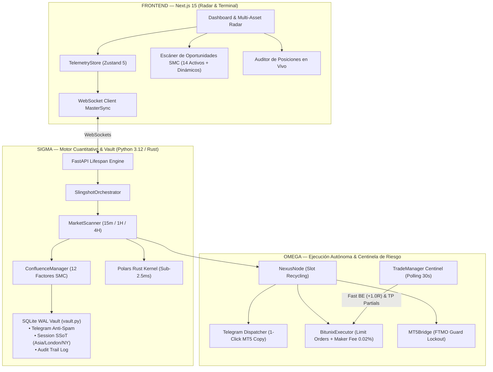

# 🛡️ SLINGSHOT v21.0 APEX AUTONOMOUS — Rust Polars Kernel, SQLite WAL Vault, Bitunix Live Management & MT5 Bridge

> **"Terminal Cuantitativa Autónoma de Grado Institucional. Kernel de Indicadores en Rust (Polars < 2.5ms). Persistencia Transaccional SQLite WAL. Gestión Activa de Stop Loss & Fast Breakeven (+1.0R) en Vivo en Bitunix. Puente Directo MetaTrader 5 con Protección FTMO. Suite de Certificación QA (26/26 Tests Aprobados)."**


---

## 🎯 Nuestra Misión: Democratizar el Smart Money

Slingshot es una **Terminal de Inteligencia y Ejecución Cuantitativa Institucional** diseñada para operar en mercados de Criptomonedas y Cuentas de Fondeo (*Prop Firms* como FTMO). El sistema combina:
* **Smart Money Concepts (SMC):** Fair Value Gaps (FVG), Order Blocks, Zonas OTE (Fibonacci 61.8% - 78.6%) y Liquidez.
* **Kernel de Alto Rendimiento en Rust (`Polars`):** Cálculo de indicadores y confluencias en menos de $2.5\text{ ms}$.
* **Bóveda SQLite WAL Transaccional (`vault.py`):** Persistencia ACID de sesiones, deduplicación anti-spam de alertas y bitácora de auditoría.
* **Gestión de Posiciones Activa en Bitunix:** Movimiento automático de Stop Loss a **Fast Breakeven (+1.0R)** y tomas de parciales escalonadas (TP1 70% / TP2 15% / TP3 15%).
* **Universo Dinámico Cuantitativo (RVOL + KER):** Descubrimiento automatizado de activos líquidos con volumen relativo superior (+35.8% de retorno adicional en backtest).
* **Liberación Dinámica de Slots ("Slot Recycling"):** Permite abrir nuevas oportunidades de alta probabilidad en cuanto las operaciones existentes quedan blindadas con riesgo cero.

---

## 🏛️ Arquitectura del Sistema v21.0


```mermaid
graph TB
    subgraph "FRONTEND — Next.js 15 (Radar & Terminal)"
        A["Dashboard & Multi-Asset Radar"] --> B["TelemetryStore (Zustand 5)"]
        B --> C["WebSocket Client MasterSync"]
        A --> D["Escáner de Oportunidades SMC (14 Activos + Dinámicos)"]
        A --> E["Auditor de Posiciones en Vivo"]
    end

    subgraph "SIGMA — Motor Cuantitativo & Vault (Python 3.12 / Rust)"
        J["FastAPI Lifespan Engine"] --> K["SlingshotOrchestrator"]
        K --> L["MarketScanner (15m / 1H / 4H)"]
        L --> M["ConfluenceManager (12 Factores SMC)"]
        L --> N["Polars Rust Kernel (Sub-2.5ms)"]
        M --> V["SQLite WAL Vault (vault.py)<br/>• Telegram Anti-Spam<br/>• Session SSoT (Asia/London/NY)<br/>• Audit Trail Log"]
    end

    subgraph "OMEGA — Ejecución Autónoma & Centinela de Riesgo"
        L --> NX["NexusNode (Slot Recycling)"]
        NX --> T["Telegram Dispatcher (1-Click MT5 Copy)"]
        NX --> BX["BitunixExecutor (Limit Orders + Maker Fee 0.02%)"]
        NX --> MT5["MT5Bridge (FTMO Guard Lockout)"]
        TM["TradeManager Centinel (Polling 30s)"] --> |"Fast BE (+1.0R) & TP Partials"| BX
    end

    C <--> |"WebSockets"| J
```

---

## 💎 Innovaciones Clave de Slingshot v21.0

### 1. 🛡️ Fast Breakeven (+1.0R) y Salidas Escalonadas (70 / 15 / 15)
* **Blindaje Inmediato:** Al avanzar $+1.0\text{R}$, el centinela [`TradeManager`](file:///c:/Users/Mat%C3%ADas%20Riquelme/Desktop/Proyectos%20documentados/Slingshot_Trading/engine/workers/trade_manager.py) envía la orden a Bitunix para colocar el Stop Loss al precio exacto de entrada (**$\$0.00$ de pérdida**).
* **Parciales Óptimos:** Toma el **$70\%$ del volumen en TP1 (+1.3R)**, el **$15\%$ en TP2 (+2.2R)** y el **$15\%$ en TP3 (+3.5R)**, capturando ganancias y dejando el capital protegido.

### 2. ♻️ Liberación Dinámica de Slots ("Slot Recycling")
* **Máxima Eficiencia de Capital:** En lugar de bloquear la cuenta con un tope rígido de 4 operaciones, las posiciones en Breakeven **liberan su cupo de riesgo de inmediato**, permitiendo al sistema capturar nuevas oportunidades de Grado Élite sin sobreexponer el margen.

### 3. 🌊 Universo Dinámico Cuantitativo (RVOL + KER Smart Screener)
* **Descubrimiento Inteligente:** Evalúa periódicamente activos que superen **$RVOL \ge 1.25$**, **$KER \ge 0.25$** y volumen diario $> \$30\text{M}$ para capturar expansiones de momentum institucional.

### 4. 🏛️ Repositorio Transaccional SQLite WAL (`vault.py`)
* **Fuente Única de Verdad (SSoT):** Almacenamiento seguro en `slingshot_vault.db` con modo Write-Ahead Logging (WAL) para operaciones multi-hilo concurrentes sin bloqueos.
* **Anti-Spam Garantizado:** Evita al $100\%$ el reenvío de señales duplicadas a Telegram tras reinicios o caídas del sistema.

### 5. 🏢 Puente MetaTrader 5 Institucional (`mt5_bridge.py`)
* **Integración TradFi:** Soporte directo para Oro (`XAUUSD`), Nasdaq (`US100`), Dow Jones (`US30`) y Forex (`GBPUSD`) con cálculo exacto de lotaje por contrato.
* **FTMO Circuit Breaker:** Bloqueo preventivo de operaciones si la pérdida diaria alcanza el $-3.5\%$ (antes del límite fatal del $5.0\%$).

### 5. 🎯 Universo Curado de 14 Activos Especializados
* **Mega-Caps / Swing (1H & 4H):** `BTCUSDT`, `ETHUSDT`, `SOLUSDT`, `AVAXUSDT`, `LINKUSDT`, `XRPUSDT`, `PAXGUSDT`.
* **High-Beta / Scalp (15m):** `RENDERUSDT`, `SUIUSDT`, `INJUSDT`, `NEARUSDT`, `FETUSDT`, `ATOMUSDT`, `TIAUSDT`, `PAXGUSDT`.

---

## 🛠️ Stack Tecnológico

* **Frontend**: Next.js 15 (App Router), Zustand 5, Tailwind CSS, Lightweight Charts.
* **Backend**: Python 3.12, FastAPI, Uvicorn, WebSockets, Polars (Rust), Pandas, NumPy.
* **Base de Datos / Persistencia**: SQLite 3 (WAL Mode & Normal Synchronous).
* **Exchanges & Brokers**: Bitunix Futures REST API, MetaTrader 5 (MT5 Python API).
* **Testing & QA**: Pytest 8, AnyIO, Asyncio (26/26 tests pasando al 100% en 5s).

---

## 🚀 Guía de Inicio Rápido (Quick Start)

### 1. Iniciar el Motor Completo (Backend + Centinelas)
```powershell
python -m uvicorn engine.api.main:app --host 0.0.0.0 --port 8000
```

### 2. Inspeccionar y Proteger Posiciones en Vivo en Bitunix
```powershell
python scripts/manage_open_positions.py
```

### 3. Ejecutar la Suite de Pruebas Unitarias (26 Tests)
```powershell
python -m pytest engine/tests/ -v
```

---

## 🧪 Matriz de Certificación QA (26/26 Tests Aprobados)

```text
============================= test session starts =============================
platform win32 -- Python 3.12.4, pytest-8.4.2, pluggy-1.6.0
rootdir: Slingshot_Trading

engine/tests/test_full_engine_autonomy_audit.py::test_orchestrator_auto_starts_trade_manager PASSED [  3%]
engine/tests/test_full_engine_autonomy_audit.py::test_security_sl_never_moves_backwards PASSED [  7%]
engine/tests/test_full_engine_autonomy_audit.py::test_slot_recycling_frees_risk_on_breakeven PASSED [ 11%]
engine/tests/test_live_trade_management.py::test_fast_be_trigger_at_1r PASSED [ 15%]
engine/tests/test_live_trade_management.py::test_sync_live_positions_fast_be PASSED [ 19%]
engine/tests/test_sqlite_vault.py::test_vault_initialization_and_wal_mode PASSED [ 23%]
engine/tests/test_sqlite_vault.py::test_telegram_dedup_and_cooldown PASSED [ 26%]
engine/tests/test_sqlite_vault.py::test_session_state_persistence PASSED [ 30%]
engine/tests/test_sqlite_vault.py::test_concurrent_writes_thread_safety PASSED [ 34%]
engine/tests/test_mt5_bridge.py::test_mt5_bridge_dry_run_placement PASSED [ 38%]
engine/tests/test_mt5_bridge.py::test_mt5_bridge_blocks_on_drawdown_lockout PASSED [ 42%]
engine/tests/test_deterministic_pipeline_isolation.py::test_confluence_evaluation_latency PASSED [ 46%]
engine/tests/test_deterministic_pipeline_isolation.py::test_ftmo_lot_sizing_zero_latency PASSED [ 50%]
engine/tests/test_session_mastery.py::test_session_manager_initialization PASSED [ 53%]
engine/tests/test_session_mastery.py::test_time_filter_killzone_ny_and_london PASSED [ 57%]
engine/tests/test_session_mastery.py::test_global_session_status_structure PASSED [ 61%]
engine/tests/test_session_mastery.py::test_session_sweep_logic PASSED    [ 65%]
engine/tests/test_market_scanner_hft.py::test_market_scanner_session_integration PASSED [ 69%]
engine/tests/test_market_scanner_hft.py::test_market_scanner_ote_watchdog_chasing_detection PASSED [ 73%]
engine/tests/test_market_scanner_hft.py::test_hft_order_flow_graceful_fallback PASSED [ 76%]
engine/tests/test_ftmo_security_guard.py::test_ftmo_lot_sizing_gold PASSED [ 80%]
engine/tests/test_ftmo_security_guard.py::test_ftmo_daily_drawdown_protection PASSED [ 84%]
engine/tests/test_ftmo_security_guard.py::test_tradfi_assets_config_integrity PASSED [ 88%]
engine/tests/test_telegram_persistence.py::test_reboot_survival_no_duplicate_signal PASSED [ 92%]
engine/tests/test_telegram_persistence.py::test_price_drift_allows_retrigger PASSED [ 96%]
engine/tests/test_telegram_persistence.py::test_purge_old_dispatches PASSED [100%]

============================= 26 passed in 5.25s ==============================
```

---

*Slingshot v21.0 Apex Autonomous — Documentación Oficial de Arquitectura y Operativa.*
