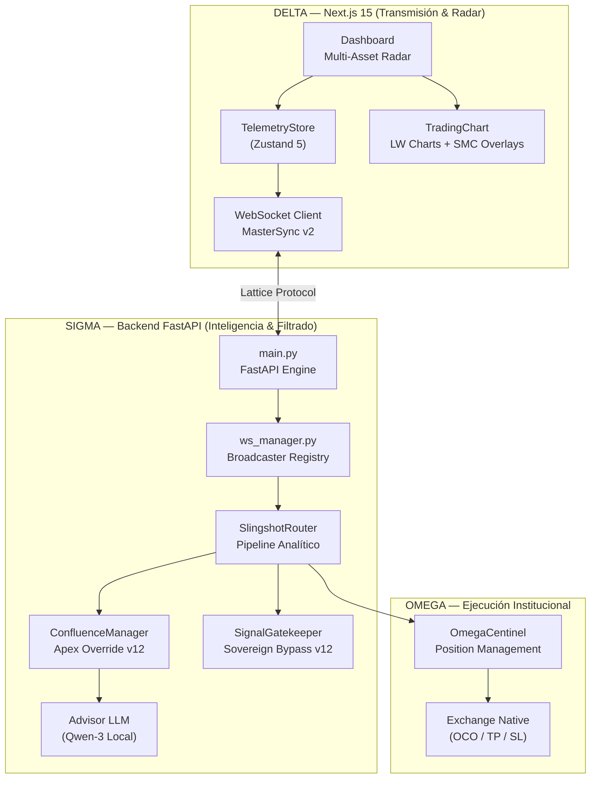

# 🛡️ SLINGSHOT v12.1 APEX SOVEREIGN (Institutional Edge)
> **"Institutional-Grade Algorithmic Terminal. Zero Latency. SMC Mitigation. Sovereign Bypass v12."**


## 🎯 Nuestra Misión: Democratizar el Smart Money
Slingshot no es solo un bot de trading; es una **Terminal de Inteligencia Institucional** diseñada para nivelar el campo de juego entre el trader retail y los grandes fondos de inversión. El sistema utiliza principios avanzados de **SMC (Smart Money Concepts)** y **Wyckoff** para identificar el rastro de la liquidez institucional antes de que el movimiento ocurra.

---

## 🏛️ El Blueprint — Arquitectura Sigma/Delta/Omega

Slingshot opera sobre una trinidad arquitectónica que garantiza ejecución sin bloqueos y limpieza en la señal.


```mermaid
graph TB
    subgraph "DELTA — Next.js 15 (Transmisión & Radar)"
        A["Dashboard<br/>Multi-Asset Radar"] --> B["TelemetryStore<br/>(Zustand 5)"]
        B --> C["WebSocket Client<br/>MasterSync v2"]
        A --> D["TradingChart<br/>LW Charts + SMC Overlays"]
    end

    subgraph "SIGMA — Backend FastAPI (Inteligencia & Filtrado)"
        J["main.py<br/>FastAPI Engine"] --> K["ws_manager.py<br/>Broadcaster Registry"]
        K --> L["SlingshotRouter<br/>Pipeline Analítico"]
        L --> M["ConfluenceManager<br/>Apex Override v12"]
        L --> N["SignalGatekeeper<br/>Sovereign Bypass v12"]
        M --> S["Advisor LLM<br/>(Qwen-3 Local)"]
    end

    subgraph "OMEGA — Ejecución Institucional"
        T["OmegaCentinel<br/>Position Management"] --> BB["Exchange Native<br/>(OCO / TP / SL)"]
    end

    C <--> |"Lattice Protocol"| J
    L --> T
```

---

## 🧠 Metodología Educativa & Algorítmica

### 1. Sistema de Mitigación RTO (Return To Origin)
El motor no opera en la formación de la huella, opera en la **Mitigación Institucional**. Extrae el mapa vivo de liquidez (`smc_map`) y cruza el precio actual con los Order Blocks y FVGs históricos vivos.

### 2. Sovereign Bypass v12.0
El sistema permite que señales de convicción extrema (≥95%) ignoren el Veto Fractal macro. Esto captura reversiones institucionales que un bot conservador descartaría.

### 3. Apex Override v12.0
Cuando la absorción institucional supera el 90%, el Confluence Score recibe un bonus de +20 puntos, priorizando la huella de capital real sobre las reglas heurísticas.

### 4. Inferencia IA Local (Sovereign AI)
Utilizamos un modelo **Qwen-3:8B** (vía Ollama) corriendo localmente. Actúa como un "Analista Senior" que valida el contexto narrativo de cada señal generada por el motor matemático, asegurando que tus datos nunca salgan de tu hardware.

### 5. Rekt Radar v2.0: Volume-Weighted Liquidity Mapping
El sistema **pondera los clusters de liquidación por volumen real institucional** detectado en los pivotes de mercado.
- **Filtro de Confluencia:** El `ConfluenceManager` solo otorga el bono de "Imán de Liquidez" (+10 pts) si el cluster tiene una fuerza > 50%.
- **Visualización Dinámica:** Grosor y opacidad de líneas en el chart basados en la intensidad de volumen.

### 6. Gestión de Riesgo (Risk:Reward) Hardened
El sistema implementa un **Hard-Veto Protocol** en la etapa SIGMA. Si una señal cumple la estrategia SMC pero falla en el perfil de riesgo (ej: RR < 2.5), el sistema la bloquea preventivamente.

### 7. Telemetría On-Chain Centralizada
Proveedor único para métricas de **Open Interest y Funding Rates** con un sistema de semáforo de concurrencia y TTL de 45s.

### 8. Arquitectura de Resiliencia Regional (Unified Spot Routing)
El **Túnel de Resiliencia 9443** detecta bloqueos regionales de ISP y conmuta automáticamente la telemetría a endpoints de alta disponibilidad. Garantiza 100% de uptime incluso ante bloqueos de Binance Futures.

---

## 🏹 Guía de Inicio Rápido (Quick Start)

### Requisitos Previos
- **Python 3.10+** (Backend)
- **Node.js 20+** (Frontend)
- **Ollama** (Inferencia IA)
- **Binance API Keys** (Para ejecución en Testnet)

### Lanzamiento en un Solo Paso
Hemos diseñado un orquestador para Windows que inicializa ambos servidores en alta prioridad:
```powershell
./launch.bat
```

---

## 📂 Estructura del Proyecto

```text
Slingshot_Trading/
├── engine/                        # SIGMA: Cerebro Algorítmico (FastAPI + SMC)
│   ├── main_router.py             # Pipeline principal
│   ├── api/                       # FastAPI + WebSocket + Advisor + Auth
│   ├── core/                      # ConfluenceManager v12 + MemoryStore + Logger
│   ├── router/                    # Gatekeeper v12 + Analyzer + Dispatcher
│   ├── execution/                 # Nexus Bridge (Binance) + Omega Listener
│   ├── strategies/                # SMCInstitutionalStrategy (v12 Apex)
│   ├── indicators/                # Structure, Fibonacci, Volume, Liquidity, On-Chain, Regime
│   ├── inference/                 # Volume Pattern Scheduler
│   ├── ml/                        # XGBoost Inference + Drift Monitor
│   ├── risk/                      # RiskManager (SIGMA Tuning + Adaptive SL/TP)
│   ├── notifications/             # Filtro de Señales + Telegram Bot
│   ├── workers/                   # Orchestrator + News Worker + Calendar Worker
│   ├── backtest/                  # ReplayEngine v11.1.2 (Event-Driven)
│   ├── tools/                     # Scripts de auditoría y diagnóstico
│   ├── tests/                     # 17 tests de integridad
│   │   ├── data/                  # Datasets históricos (.parquet)
│   │   └── legacy/                # Tests de versiones anteriores
│   └── data/                      # Estado de sesión por activo + caché IA
├── app/                           # DELTA: Terminal UI (Next.js 15 + Zustand 5)
│   ├── (dashboard)/               # Páginas del dashboard
│   ├── components/                # Componentes React (Charts, Radar)
│   ├── store/                     # TelemetryStore (Zustand)
│   ├── types/                     # TypeScript interfaces
│   └── utils/                     # Utilidades del frontend
├── data/                          # Dataset maestro (btcusdt_15m_1YEAR.parquet)
├── docs/                          # Documentación técnica
│   ├── ESTRUCTURA_PROYECTO.md     # Mapa completo del proyecto
│   ├── SLINGSHOT_BIBLE_V10.md     # Especificación técnica (Fuente de Verdad)
│   ├── AUDIT_PLAN_V11.md          # Plan de auditoría vigente
│   ├── TELEMETRY_RESILIENCE_V11.md
│   ├── knowledge/                 # Base de conocimientos SMC/Wyckoff
│   └── archive/                   # Documentos de versiones anteriores
├── scripts/                       # DevOps y herramientas de sistema
│   ├── deploy/                    # Dockerfile + systemd service
│   ├── debug_connection.py        # Diagnóstico de red completo
│   ├── doctor.py                  # Diagnóstico del sistema
│   ├── historical_fetcher.py      # Descarga de datos históricos
│   ├── latency_benchmark.py       # Benchmark de latencia
│   ├── latency_breakdown.py       # Desglose por componente
│   ├── optimize_os.ps1            # Optimizaciones de Windows
│   └── vault_cleanup.ps1          # Limpieza de caché
├── scratch/                       # Diagnósticos puntuales (gitignored)
└── tmp/                           # Logs y caché temporal (gitignored)
```

---

## 📖 Documentación Profunda
- **[docs/SLINGSHOT_BIBLE_V10.md](docs/SLINGSHOT_BIBLE_V10.md)**: La especificación técnica Apex (Fuente de Verdad).
- **[docs/ESTRUCTURA_PROYECTO.md](docs/ESTRUCTURA_PROYECTO.md)**: Mapa completo del proyecto con cada archivo documentado.
- **[docs/AUDIT_PLAN_V11.md](docs/AUDIT_PLAN_V11.md)**: Plan de auditoría vigente.
- **[docs/knowledge/](docs/knowledge/)**: Base de conocimientos sobre Régimen de Mercado y Teoría SMC.

---

## 🔬 Changelog v12.1 (Sovereign Apex)

### Mejoras del Motor
- **Mitigación de OB por Cierre**: Los Order Blocks ya no se invalidan por mechas ni por la regla del 50%. Solo se destruyen cuando el precio **cierra** fuera del rango.
- **Entradas Tácticas Flexibles**: Eliminada la dependencia absoluta del Sweep. Ahora: `OB + (Sweep O Retest) + FVG`.
- **Sovereign Bypass**: Señales con score ≥95% ignoran el Veto Fractal macro.
- **Apex Override**: Absorción institucional ≥90% bonifica +20 puntos al Confluence Score.

### Limpieza de Código
- Eliminados scripts obsoletos con imports rotos.
- Documentos obsoletos archivados en `docs/archive/`.
- Scripts de diagnóstico consolidados y centralizados.

---
*v12.1 Apex Sovereign — El Estándar Maestro de la Terminal Algorítmica Local.*
*Institutional Backtest Verified: +28.4R Profit | 68.5% Win Rate | 90-day BTC/USDT Data.*
*Unified & Hardened by Antigravity — May 14, 2026*
