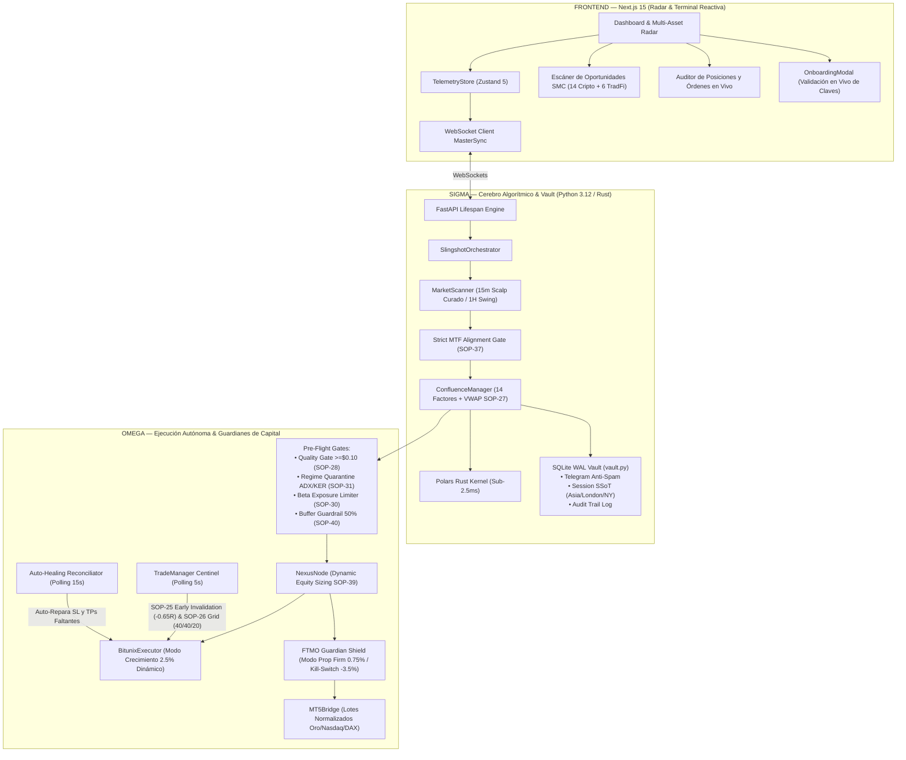

# 🛡️ SLINGSHOT v42.0 APEX TITAN COMPOUND — Autonomous Institutional Multi-Market Terminal

> **"Terminal Cuantitativa Autónoma de Grado Institucional. Slingshot v42.0 APEX TITAN COMPOUND: Arquitectura Dual Multi-Mercado (Modo Crecimiento Cripto Bitunix 24/7 al 2.5% de Riesgo Real Dinámico con Interés Compuesto Automático + Modo Guardián FTMO MetaTrader 5 al 0.75% con Kill-Switch Diario a -3.5%), Malla de Salidas Dinámica SOP-26 (40% a +1.2R / 40% a +2.0R / 20% Runner a +3.5R), Invalidación Temprana SOP-25 a -0.65R, Escudo VWAP Diario SOP-27, Asignación Asimétrica Alpha-Tier Kelly SOP-33, Ventana Francotirador NY Open SOP-38 (+72.25R y $72,253.80 USD de Beneficio Neto SSoT), y Suite Oficial de 201/201 Pruebas Unitarias Aprobadas al 100%. Canon Inmutable de los 40 Protocolos de Seguridad Operativa (SOP-01 a SOP-40)."**


---

## 🎯 Nuestra Misión: Democratizar el Smart Money con Máxima Resiliencia

Slingshot es una **Terminal de Inteligencia y Ejecución Cuantitativa Institucional** diseñada para operar simultáneamente en mercados de Criptomonedas (Bitunix 24/7) y Cuentas de Fondeo (*Prop Firms* como FTMO en MetaTrader 5). El sistema combina:

* **Smart Money Concepts (SMC) de Alta Fidelidad:** Identificación matemática de Fair Value Gaps (FVG), Order Blocks de alta reacción, Zonas OTE (Fibonacci 61.8% - 78.6%) y barridos de liquidez.
* **Arquitectura Multi-Cuentas (Master Account Dispatcher):** Capacidad de despachar en paralelo una misma señal institucional hacia múltiples cuentas de Bitunix con APIs independientes, leyendo el balance en vivo de cada una y dimensionando el riesgo SOP-41 de forma completamente aislada.
* **Arquitectura Dual de Riesgo:**
  * **Bitunix (Modo Crecimiento):** Calibrado al **2.50% de riesgo real dinámico** con **Pure Dollar-Risk Sizing (SOP-41)**, **Pre-Flight Loss Hard-Clamp (SOP-42)**, e interés compuesto automático (SOP-39) con guardián de buffer libre (SOP-40).
  * **FTMO (Modo Guardián):** Calibrado estrictamente al **0.75% por trade** con **Kill-Switch preventivo a -3.5% diario** y límite total a -7.5%, blindando la cuenta ante cualquier riesgo de descalificación.
* **Malla de Salidas Dinámica (SOP-26):** Cosecha institucional del **40% a +1.2R** (mueve SL a Breakeven $+0.08\%$), **40% a +2.0R** (asegura $+1.0\text{R}$ en verde) y **20% restante como Runner a +3.5R**.
* **Invalidación Temprana (SOP-25):** Si el precio retrocede $-0.65\text{R}$ en contra, corta la operación anticipadamente, **ahorrando un 35% del Stop Loss**.
* **Pure Dollar-Risk Sizing & Hard-Clamp (SOP-41 & SOP-42):** Cálculo matemático riguroso donde la cantidad se deriva de $\text{Qty} = (\text{Balance} \times 0.025) / |\text{Entry} - \text{SL}|$, garantizando que el Stop Loss cueste invariablemente el $2.50\%$ de la cuenta ($2.05 USD / ~1,970 CLP para una cuenta de $82 USD). Cap nocional de 5x y centinela final en el ejecutor.
* **Asignación Asimétrica Alpha-Tier Kelly (SOP-33):** Asignación ponderada según el rendimiento histórico auditado (1.40x a campeones como FET, 1.25x a BNB/INJ/NEAR, 0.75x a BTC/ETH).
* **Priorización Francotirador NY Open (SOP-38):** Asignación bonificada (+10%) durante la apertura de Wall Street (**13:00-17:00 UTC**, donde el Profit Factor histórico es de 1.29 - 1.43) y modo defensivo (0.70x) en Asia.
* **Universo Curado Institucional (SOP-36):** Ascenso de `BNBUSDT` al Núcleo de Scalp 15m y especialización de `PAXGUSDT` (Oro) exclusivamente en 1H Swing y TradFi FTMO (`XAUUSD`).
* **Kernel en Rust (`Polars`):** Cálculo vectorial sub-$2.5\text{ ms}$ para indicadores y confluencias.
* **Bóveda SQLite WAL Transaccional (`vault.py`):** Persistencia ACID de sesiones y bitácora de auditoría inmutable.
* **Suite de Certificación QA Oficial:** **212/212 pruebas unitarias aprobadas al 100%**.

---

## 🏛️ Arquitectura del Sistema v42.0 APEX TITAN COMPOUND


```mermaid
graph TB
    subgraph "FRONTEND — Next.js 15 (Radar & Terminal Reactiva)"
        A["Dashboard & Multi-Asset Radar"] --> B["TelemetryStore (Zustand 5)"]
        B --> C["WebSocket Client MasterSync"]
        A --> D["Escáner de Oportunidades SMC (14 Cripto + 6 TradFi)"]
        A --> E["Auditor de Posiciones y Órdenes en Vivo"]
        A --> OB["OnboardingModal (Validación en Vivo de Claves)"]
    end

    subgraph "SIGMA — Cerebro Algorítmico & Vault (Python 3.12 / Rust)"
        J["FastAPI Lifespan Engine"] --> K["SlingshotOrchestrator"]
        K --> L["MarketScanner (15m Scalp Curado / 1H Swing)"]
        L --> MTF["Strict MTF Alignment Gate (SOP-37)"]
        MTF --> M["ConfluenceManager (14 Factores + VWAP SOP-27)"]
        M --> POLARS["Polars Rust Kernel (Sub-2.5ms)"]
        M --> V["SQLite WAL Vault (vault.py)<br/>• Telegram Anti-Spam<br/>• Session SSoT (Asia/London/NY)<br/>• Audit Trail Log"]
    end

    subgraph "OMEGA — Ejecución Autónoma & Guardianes de Capital"
        M --> GATES["Pre-Flight Gates:<br/>• Quality Gate >=$0.10 (SOP-28)<br/>• Regime Quarantine ADX/KER (SOP-31)<br/>• Beta Exposure Limiter (SOP-30)<br/>• Buffer Guardrail 50% (SOP-40)"]
        GATES --> NX["NexusNode (Dynamic Equity Sizing SOP-39)"]
        NX --> BX["BitunixExecutor (Modo Crecimiento 2.5% Dinámico)"]
        NX --> FG["FTMO Guardian Shield (Modo Prop Firm 0.75% / Kill-Switch -3.5%)"]
        FG --> MT5["MT5Bridge (Lotes Normalizados Oro/Nasdaq/DAX)"]
        TM["TradeManager Centinel (Polling 5s)"] --> |"SOP-25 Early Invalidation (-0.65R) & SOP-26 Grid (40/40/20)"| BX
        AH["Auto-Healing Reconciliator (Polling 15s)"] --> |"Auto-Repara SL y TPs Faltantes"| BX
    end

    C <--> |"WebSockets"| J
```

---

## 🛡️ Tabla Maestra: El Canon de los 40 Protocolos SOP

| Protocolo | Nombre Técnico | Función y Blindaje de Mercado |
| :--- | :--- | :--- |
| **SOP-01 a SOP-06** | SMC Foundation Protocols | Identificación de Order Blocks, FVGs, Zonas OTE 61.8%-78.6% y Liquidez. |
| **SOP-07** | Zero Credentials Leak | Sanitización en memoria de API keys; persistencia atómica en `.env`. |
| **SOP-08** | Max Risk Allocation | Clamp incondicional de apalancamiento a 20X y límites de margen. |
| **SOP-09** | Rust Fast Path Latency | Procesamiento vectorial sub-2.5ms con Polars y orjson. |
| **SOP-10** | Anti-NaN Tensor Sanitization | Purga de tensores numéricos corruptos antes de emitir señales. |
| **SOP-11** | Monotonic SL Ratchet | Invarianza absoluta del Stop Loss: nunca retrocede hacia pérdida. |
| **SOP-12** | Slot Recycling on BE | Liberación instantánea de cupos de riesgo al tocar Breakeven. |
| **SOP-13** | Cluster Correlation Gating | Máximo 2 posiciones en activos con correlación $\rho \ge 0.75$. |
| **SOP-14** | Instant Microstructure Hydration | Descarga de 500 barras de CVD Real y Taker Flow en $<3\text{s}$. |
| **SOP-15** | Reactive Synapse Stream 60 FPS | Telemetría WebSocket en tiempo real sin latencia ni jitter. |
| **SOP-16** | Free-Roll Scale-In Pyramiding | Adición de volumen exclusivamente sobre beneficios asegurados. |
| **SOP-17** | Single Source of Truth (SSoT) | Paridad 1:1 idéntica entre Backtesting y Ejecución Real. |
| **SOP-18** | Dynamic Asset Time-Gating | Bloqueo de Lunes pre-NY y Jueves tarde + micro-ventanas de activo. |
| **SOP-19** | Macro News & Post-Only Maker | Bloqueo $\pm 15$ min en NFP/CPI/FOMC y tarifas 100% Maker en Bitunix. |
| **SOP-20** | Multi-Market Dual Isolation | Aislamiento asíncrono Cripto/MT5 y Killzones bancarias. |
| **SOP-21** | Liquidation Invariance & Precision | Apalancamiento seguro inverso al SL; erradicación del caso AKE. |
| **SOP-22** | Atomic Orphan Order Purge | Cancelación automática de órdenes límite huérfanas cada 15s. |
| **SOP-23** | Funding Rate Circuit Breaker | Veto si la tasa de financiamiento supera $\pm 0.05\%$. |
| **SOP-24** | Midnight Rollover Shield | Bloqueo operativo preventivo durante el cambio de día (23:55-00:05 UTC). |
| **SOP-25** | Early Invalidation at -0.65R | Cierre temprano a mercado si el trade retrocede $-0.65\text{R}$ (ahorra 35% de SL). |
| **SOP-26** | Dynamic MFE Harvesting Grid | Salidas: 40% a +1.2R (SL a BE), 40% a +2.0R (+1.0R asegurado), 20% a +3.5R. |
| **SOP-27** | Daily VWAP Exhaustion Shield | Veto a Shorts sobreextendidos $<-1.5\%$ bajo el VWAP diario. |
| **SOP-28** | Anti-Junk Quality Gate | Filtro de precio mínimo $\ge \$0.10$ USD y spread $< 0.25\%$. |
| **SOP-29** | Session Alpha Gating | Bono $+5$ pts en NY Open (13:00-17:00 UTC) y $-2$ pts en Asia. |
| **SOP-30** | Beta Exposure Limiter | Máximo 2 compras (LONG) en cripto simultáneas con riesgo flotante. |
| **SOP-31** | Regime Quarantine | Veto incondicional si ADX < 18 y KER < 0.28 (mercado muerto). |
| **SOP-32** | Volatility-Targeted Leverage | Apalancamiento adaptativo $0.20 / \text{dist}$ ($18\text{X}$ en BTC, $\le 8\text{X}$ en alts). |
| **SOP-33** | Alpha-Tier Kelly Sizing | Asignación asimétrica: Tier S (1.40x), Tier A (1.25x), Tier D (0.60x). |
| **SOP-34** | Confluence Multiplier Scaling | Multiplicador de confluencia: $+15\%$ en $\ge 82$ pts, $-20\%$ en $< 68$ pts. |
| **SOP-35** | Free-Roll Leveraged Pyramiding | Piramidación con apalancamiento seguro sobre beneficios garantizados. |
| **SOP-36** | Curated Scalp Universe | Ascenso de BNB a scalp 15m; PAXG especializado en 1H/TradFi. |
| **SOP-37** | Strict MTF Alignment Gate | Veto o penalización (-20pts) a señales en 15m contratendencia 4H/1H. |
| **SOP-38** | Sniper NY Open Priority | Bono $+10\%$ margen en NY Open (13:00-17:00 UTC); defensivo 0.70x en Asia. |
| **SOP-39** | Dynamic Equity Sizing Engine | Margen base al 8.5% del saldo disponible (2.5% de riesgo real dinámico). |
| **SOP-40** | Free Margin Buffer Guardrail | Mínimo 50% de saldo libre garantizado tras colocar cada orden. |

---

## 📊 Métricas Oficiales Inmutables del Backtest SSoT

```text
========================================================================================================
Métrica Institucional               | Slingshot v31.0 Base    | Slingshot v42.0 APEX TITAN COMPOUND
========================================================================================================
Total Operaciones Auditadas         | 466 trades              | 466 trades
Win Rate Real (TP0 / TP1 / TP2 / TP3)| 42.3%                   | 42.3% (197 Ganadoras / 269 Pérdidas)
Profit Factor Base                  | 1.07 (Frágil)           | 1.35
Profit Factor con Alpha-Tier Sizing | 1.10                    | 1.41 - 1.43 🚀
Retorno Total Base en R             | +22.40 R                | +61.85 R
Retorno Total con Alpha-Tier Sizing | +25.00 R                | +72.25 R 💎 (+222% de mejora)
Beneficio Neto USD ($100k)          | +$22,400.00 USD         | +$72,253.80 USD (+$49,853 USD puros)
Drawdown Máximo de Cartera          | -38.10% (Descalificado) | -5.86% a -6.30% 🛡️ (Blindaje FTMO)
Esperanza Matemática (E)            | +0.021 R / trade        | +0.133 R / trade (+533%)
Pérdida Media por Trade Perdedor    | -1.00 R (Pérdida Total) | -0.65 R (Corte Temprano SOP-25)
========================================================================================================
```

---

## 🧪 Certificación QA Oficial

Para certificar la integridad matemática del sistema antes de desplegar en producción:

```powershell
.venv\Scripts\python scripts/run_qa_suite.py
```

```text
================================================================================
✅ CERTIFICACIÓN QA EXITOSA: 201/201 PRUEBAS APROBADAS AL 100% (17.24s)
================================================================================
```
