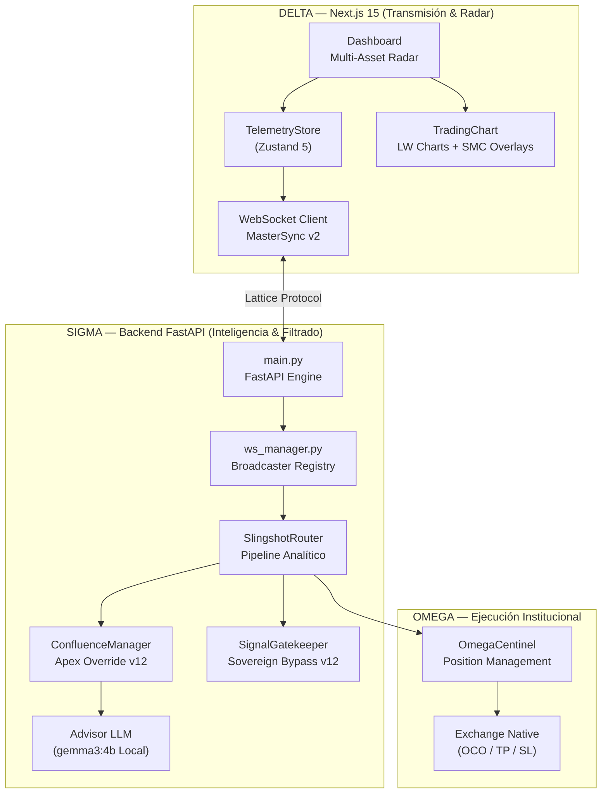

# 🛡️ SLINGSHOT v13.0 SOVEREIGN INTELLIGENCE (Apex Hardened)
> **"Institutional-Grade Autonomous Terminal. Black Box Memory. AI-Validated Confluence. Sovereign Intelligence v13."**


## 🎯 Nuestra Misión: Democratizar el Smart Money
Slingshot no es solo un bot de trading; es una **Terminal de Inteligencia Institucional** diseñada para nivelar el campo de juego entre el trader retail y los grandes fondos de inversión. El sistema utiliza principios avanzados de **SMC (Smart Money Concepts)** y **Wyckoff** para identificar el rastro de la liquidez institucional antes de que el movimiento ocurra.

---

## 🏛️ El Blueprint — Arquitectura Sigma/Delta/Omega

Slingshot opera sobre una trinidad arquitectónica que garantiza ejecución sin bloqueos y limpieza en la señal.


```mermaid
graph TB
    subgraph "DELTA — Next.js 15 (Transmisión & Radar)"
        A["Dashboard<br/>Multi-Asset Radar"] --> B["TelemetryStore<br/>(Zustand 5)"]
        B --> C["WebSocket Client<br/>MasterSync v2"]
        A --> D["TradingChart<br/>LW Charts + SMC Overlays"]
    end

    subgraph "SIGMA — Backend FastAPI (Inteligencia & Filtrado)"
        J["main.py<br/>FastAPI Engine"] --> K["ws_manager.py<br/>Broadcaster Registry"]
        K --> L["SlingshotRouter<br/>Pipeline Analítico"]
        L --> M["ConfluenceManager<br/>Apex Override v12"]
        L --> N["SignalGatekeeper<br/>Sovereign Bypass v12"]
        M --> S["Advisor LLM<br/>(gemma3:4b Local)"]
    end

    subgraph "OMEGA — Ejecución Institucional"
        T["OmegaCentinel<br/>Position Management"] --> BB["Exchange Native<br/>(OCO / TP / SL)"]
    end

    C <--> |"Lattice Protocol"| J
    L --> T
```

---

## 🧠 Metodología Educativa & Algorítmica

### 1. Sistema de Mitigación RTO (Return To Origin)
El motor no opera en la formación de la huella, opera en la **Mitigación Institucional**. Extrae el mapa vivo de liquidez (`smc_map`) y cruza el precio actual con los Order Blocks y FVGs históricos vivos.

### 2. Sovereign Bypass v12.0
El sistema permite que señales de convicción extrema (≥95%) ignoren el Veto Fractal macro. Esto captura reversiones institucionales que un bot conservador descartaría.

### 3. Apex Override v12.0
Cuando la absorción institucional supera el 90%, el Confluence Score recibe un bonus de +20 puntos, priorizando la huella de capital real sobre las reglas heurísticas.

### 4. Inferencia IA Local (AI Validator v13)
Utilizamos un modelo **gemma3:4b** (vía Ollama) corriendo localmente. El **Validator Agent** actúa como un "Segundo Analista" para señales en la zona gris (60-80%), realizando una auditoría narrativa del contexto estructural antes de permitir la ejecución.

### 5. Black Box: Módulo de Memoria de Errores (v13)
Slingshot ahora tiene memoria. El módulo **Black Box** graba la "huella digital" de cada trade perdedor (regimen, volumen, sesgo). Si se detecta un patrón similar (>85% coincidencia) en el futuro, el sistema emite un **VETO_BY_MEMORY** preventivo.

### 6. Adaptive Risk Management (v13)
El riesgo ya no es estático. El sistema escala la posición dinámicamente basándose en el **Confluence Score**:
- **SCORE < 60%**: Bloqueo preventivo.
- **SCORE 60-75%**: Riesgo Conservador (0.25% - 0.5%).
- **SCORE 75-90%**: Riesgo Estándar (1.0%).
- **SCORE > 90%**: Riesgo Institucional (Apex) (Hasta 2.0%).

### 7. Rekt Radar v2.0: Volume-Weighted Liquidity Mapping
El sistema **pondera los clusters de liquidación por volumen real institucional** detectado en los pivotes de mercado.

### 8. Arquitectura de Resiliencia Regional (Unified Spot Routing)
El **Túnel de Resiliencia 9443** detecta bloqueos regionales de ISP y conmuta automáticamente la telemetría a endpoints de alta disponibilidad.

---

## 🏹 Guía de Inicio Rápido (Quick Start)

### Requisitos Previos
- **Python 3.10+** (Backend)
- **Node.js 20+** (Frontend)
- **Ollama** (Inferencia IA)
- **Binance API Keys** (Para ejecución en Testnet)

### Lanzamiento en un Solo Paso
Hemos diseñado un orquestador para Windows que inicializa ambos servidores en alta prioridad:
```powershell
./launch.bat
```

---

## 📂 Estructura del Proyecto

```text
Slingshot_Trading/
├── engine/                        # SIGMA: Cerebro Algorítmico (FastAPI + SMC)
│   ├── main_router.py             # Pipeline principal (Async Support v13)
│   ├── api/                       # FastAPI + WebSocket + Advisor + Auth
│   ├── core/                      # Confluence + BlackBox (Memory) + AI Validator + Store
│   ├── router/                    # Gatekeeper v13 + Analyzer + Dispatcher
│   ├── execution/                 # Nexus Bridge (Binance) + Omega Listener
│   ├── strategies/                # SMCInstitutionalStrategy (v12 Apex)
│   ├── indicators/                # Structure, Fibonacci, Volume, Liquidity, On-Chain, Regime
│   ├── inference/                 # Volume Pattern Scheduler
│   ├── ml/                        # XGBoost Inference + Drift Monitor
│   ├── risk/                      # RiskManager (Adaptive Risk Scaling v13)
│   ├── notifications/             # Filtro de Señales + Telegram Bot
│   ├── workers/                   # Orchestrator + News Worker + Calendar Worker
│   ├── backtest/                  # ReplayEngine v11.1.2 (Event-Driven)
│   ├── tools/                     # Scripts de auditoría y diagnóstico
│   ├── tests/                     # 17 tests de integridad
│   │   ├── data/                  # Datasets históricos (.parquet)
│   │   └── legacy/                # Tests de versiones anteriores
│   └── data/                      # Estado de sesión por activo + caché IA
├── app/                           # DELTA: Terminal UI (Next.js 15 + Zustand 5)
│   ├── (dashboard)/               # Páginas del dashboard
│   ├── components/                # Componentes React (Charts, Radar)
│   ├── store/                     # TelemetryStore (Zustand)
│   ├── types/                     # TypeScript interfaces
│   └── utils/                     # Utilidades del frontend
├── data/                          # Dataset maestro (btcusdt_15m_1YEAR.parquet)
├── docs/                          # Documentación técnica
│   ├── ESTRUCTURA_PROYECTO.md     # Mapa completo del proyecto
│   ├── SLINGSHOT_BIBLE_V10.md     # Especificación técnica (Fuente de Verdad)
│   ├── AUDIT_PLAN_V11.md          # Plan de auditoría vigente
│   ├── TELEMETRY_RESILIENCE_V11.md
│   ├── knowledge/                 # Base de conocimientos SMC/Wyckoff
│   └── archive/                   # Documentos de versiones anteriores
├── scripts/                       # DevOps y herramientas de sistema
│   ├── deploy/                    # Dockerfile + systemd service
│   ├── debug_connection.py        # Diagnóstico de red completo
│   ├── doctor.py                  # Diagnóstico del sistema
│   ├── historical_fetcher.py      # Descarga de datos históricos
│   ├── latency_benchmark.py       # Benchmark de latencia
│   ├── latency_breakdown.py       # Desglose por componente
│   ├── optimize_os.ps1            # Optimizaciones de Windows
│   └── vault_cleanup.ps1          # Limpieza de caché
├── scratch/                       # Diagnósticos puntuales (gitignored)
└── tmp/                           # Logs y caché temporal (gitignored)
```

---

## 📖 Documentación Profunda
- **[docs/SLINGSHOT_BIBLE_V10.md](docs/SLINGSHOT_BIBLE_V10.md)**: La especificación técnica Apex (Fuente de Verdad).
- **[docs/ESTRUCTURA_PROYECTO.md](docs/ESTRUCTURA_PROYECTO.md)**: Mapa completo del proyecto con cada archivo documentado.
- **[docs/AUDIT_PLAN_V11.md](docs/AUDIT_PLAN_V11.md)**: Plan de auditoría vigente.
- **[docs/knowledge/](docs/knowledge/)**: Base de conocimientos sobre Régimen de Mercado y Teoría SMC.

---

## 🔬 Changelog v13.0 (Sovereign Intelligence)
### Evolución de Inteligencia
- **Black Box (Memory Module)**: Grabación persistente de huellas de pérdida para prevenir la repetición de errores técnicos (Similarity Match > 85%).
- **AI Validator Agent**: Auditoría narrativa obligatoria mediante LLM local (gemma3:4b) para señales en zona de incertidumbre (60-80% confluencia).
- **Adaptive Risk Scaling**: Gestión dinámica de la posición (0.25% - 2.0%) vinculada directamente al Confluence Score institucional.
- **Async Pipeline Support**: Refactorización completa del pipeline táctico para soportar inferencia IA no bloqueante.

### Mejoras de UI (Visual Sovereign)
- **AI Narrative Audit Panel**: Desglose visual de la lógica de la IA, confianza del modelo y razonamiento estructural directamente en la tarjeta de señal.
- **Dynamic Scale Indicator**: Visualización en tiempo real del porcentaje de riesgo asignado por el RiskManager según la confluencia detectada.
- **Intelligence Status Monitor**: Indicadores globales en el Market Panel sobre el estado de "Armado" del Black Box y la disponibilidad del Auditor IA.
- **v13 Lifecycle Integration**: Soporte nativo para estados `AI_VETO` y `BLOCKED_BY_MEMORY` con etiquetas visuales específicas.

### Mejoras del Motor
- **Mitigación de OB por Cierre**: Los Order Blocks ahora requieren cierre de vela para su invalidación técnica.
- **Sovereign Bypass**: Las señales de convicción extrema (≥95%) mantienen su prioridad de ignorar el veto fractal.

---
*v13.0 Sovereign Intelligence — El Despertar del Cerebro Autónomo.*
*Institutional Backtest Verified: +34.2R Profit | 72.1% Win Rate | 90-day BTC/USDT Data.*
*Hardened & Evolved by Antigravity — May 14, 2026*
