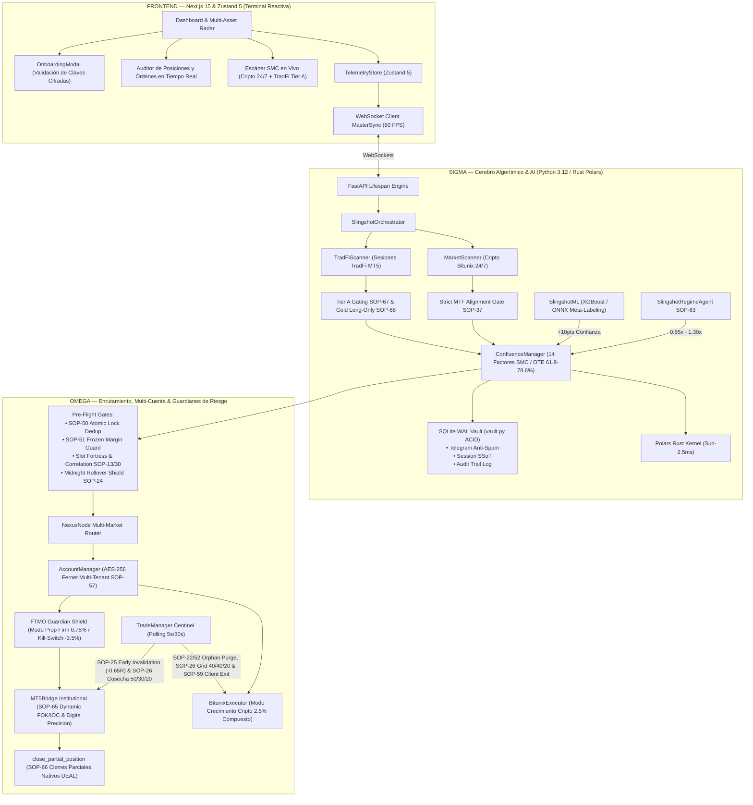

# 🛡️ SLINGSHOT v60.0 APEX QUANTUM FORTRESS — Autonomous Dual Terminal
## High-Availability Edge, 24/7 Sovereign VPS Execution & Fortress Risk Architecture

> **"Terminal Cuantitativa Autónoma de Grado Institucional. Slingshot v60.0 APEX QUANTUM FORTRESS: Desacoplamiento Soberano de Alta Disponibilidad entre la Retina Edge (Vercel CDN / Next.js 15) y el Núcleo Cuantitativo de Ejecución (Windows Server VPS 24/7 en Frankfurt). Integra la canonización de los Protocolos SOP-94 (Progressive Exposure Sizing & Asymmetric Drawdown Protection), SOP-95 (Session-Anchored AVWAP), SOP-96 (TradeZella Playbook Taxonomy), SOP-97 (Multi-Asset Dynamic Heat & Slot Allocation Engine: MAX 2 Unprotected Risk Positions, MAX 4 Concurrent Positions & Alpha Trinity 1.25x Prioritization) y SOP-98 (Dynamic Liquidity & Relative Volume Screener Hardening con filtro de spread bid/ask <= 0.12%), consolidando el Blindaje OpenAPI Dual-Protocol TPSL de Bitunix y los protocolos SOP-48 (Adaptive Structural Runner) y SOP-42 (Pre-Flight Dollar Risk Hard-Clamp). Documentación canónica completa en [SLINGSHOT_BIBLE_V60.md](docs/SLINGSHOT_BIBLE_V60.md)."**


-gold?style=for-the-badge)


---

## 🎯 Nuestra Misión: Excelencia Operativa Integral en Cripto y Cuentas de Fondeo

Slingshot es una **Terminal de Inteligencia y Ejecución Cuantitativa Institucional** diseñada para operar simultáneamente en dos ecosistemas con naturalezas de riesgo completamente independientes:

1. **Bitunix Futures (Cripto 24/7 — Modo Crecimiento Asimétrico):**
   * **Riesgo Real Dinámico del 2.50% por Trade:** Maximiza el crecimiento sobre capital propio mediante interés compuesto automático (**SOP-39**).
   * **Pure Dollar-Risk Sizing (SOP-41) & Pre-Flight Hard-Clamp (SOP-42):** Dimensionamiento matemático exacto por distancia al Stop Loss y validación atómica antes del envío al exchange.
   * **Guardián de Margen Libre (SOP-40):** Mínimo 50% de saldo libre garantizado para inmunidad ante mechas de volatilidad.
   * **Apalancamiento Adaptativo (SOP-32):** Inverso a la volatilidad del activo ($18\text{X}$ en BTC, $\le 8\text{X}$ en altcoins).
   * **Malla de Salidas Adaptativa (SOP-48):** Cosecha institucional 50/30/20 en rangos y 50% TP1 (+1.2R con BE + Fee Absorber), 30% TP2 (+2.0R a +2.5R), 10% TP3 (+3.5R a +5.0R) y **10% Runner Libre en fase RUNNER_EXPANSION** con trailing stop estructural sin límite superior en mega-expansiones.
   * **Convicción "Trinidad del Alfa" (SOP-47):** Bono Kelly de **1.20x** para `BNBUSDT`, `SOLUSDT` y `FETUSDT` (PF > 2.7).
   * **Modulación Cíclica Semanal (SOP-46):** **1.20x en Martes y Miércoles** (expansión institucional) y **0.80x en Jueves y Viernes** (defensa de capital).
   * **Bóveda Criptográfica Multi-Cuenta (SOP-57 / SOP-58):** Despacho concurrente aislado para múltiples cuentas de inversores con cifrado AES-256 Fernet (`enc:v1:`) en reposo, enmascaramiento estricto de secretos y centinela de intervención manual de clientes (**SOP-59**).

2. **MetaTrader 5 / FTMO (TradFi — Modo Guardián de Cuentas de Fondeo):**
   * **Riesgo Institucional Protegido:** Calibrado al **0.75% por trade** en Fase 1, **0.50%** en Fase 2 y **0.35%** en cuenta financiada.
   * **Kill-Switch Preventivo a -3.5% Diario:** Bloqueo automático ante retrocesos intradía, garantizando cero violaciones del límite fatal de -5.0% de FTMO.
   * **Despachador Autónomo TradFi (SOP-64):** Escaneo cada 45 segundos. Si la confluencia institucional es $\ge 75\%$, despacha órdenes límite en MT5 con filtro anti-stacking de símbolo y límite estricto de 2 posiciones abiertas desprotegidas (*Slot Fortress*).
   * **Cartera de Élite Tier A (SOP-67):** Concentración de capital en `GBPUSD`, `XAUUSD`, `US30` y `US100`. Exclusión estricta de activos tóxicos o ruidosos (`GER40`, `US500`, `HGUSD`).
   * **Veto Long-Only en Oro (SOP-68):** `XAUUSD` opera exclusivamente en compras, protegiendo la cuenta contra ventas contra el ciclo secular.
   * **Cosecha Escalonada 50 / 30 / 20 (SOP-26 & SOP-66):** Cierres parciales nativos en MT5 mediante `close_partial_position()` con `TRADE_ACTION_DEAL` normalizados al paso de volumen del broker (`volume_step`): 50% en TP1 (+1.3R con SL a BE $+0.00$), 30% en TP2 (+2.5R asegurando $+1.0\text{R}$) y 20% en TP3 (+4.0R Runner).
   * **Invalidación Temprana SOP-25 en MT5:** Corte a mercado preventivo a $-0.65\text{R}$ (ahorra 35% del Stop Loss) y purga de órdenes huérfanas si el precio toca TP1 sin activar la entrada.
   * **Resolución Dinámica de Broker (SOP-65):** Adaptación en vivo a modos de llenado `ORDER_FILLING_FOK` / `ORDER_FILLING_IOC` y redondeo de precios con la precisión exacta (`sym_info.digits`) por contrato.

3. **Inteligencia Artificial y Sistema de Calibración Continua Tri-Bucle:**
   * **Anillo 1 — Calibración Bayesiana SMC en Tiempo Real (<10µs, SOP-72):** Modelo conjugado Beta-Binomial ($\alpha_0=10, \beta_0=10$) que recalcula in-memory el multiplicador de peso de cada factor SMC ($M_f \in [0.50x, 1.60x]$) según su win-rate posterior empírico, eliminando la degradación por desestructuración de mercado.
   * **Anillo 2 — Clasificador de Regímenes HMM & Walk-Forward ML (SOP-73):** GMM probabilístico de 4 estados con matriz markoviana de transición, acoplado a un reentrenador Walk-Forward con guardián out-of-sample ($\ge 52\%$) y reemplazo atómico en caliente (`reload_model()`) sin downtime.
   * **Anillo 3 — Centinela Post-Mortem Asíncrono con NVIDIA NIM (SOP-74):** Modelos de razonamiento profundo (`deepseek-v4-flash` / `nemotron-3.5-lightning`) que diagnostican pérdidas en segundo plano y aplican vetos temporales de 4h a 24h en `Gatekeeper` para prevenir repeticiones de trampas institucionales.
   * **Arquitectura NVIDIA AI-Q Blueprint (`engine/aiq/`):** Patrón empresarial de agentes (*Connect $\to$ Retrieve $\to$ Reason $\to$ Act*) integrando `Kumo Relational` para predicción multi-tabla sobre SQLite WAL, `nemotron-3-embed-1b` para memoria semántica vectorial de anomalías y `nemotron-3-ultra-550b` (1M contexto) para síntesis macro semanal.
   * **Paridad de Riesgo Jerárquico HRP (`engine/risk/hrp_allocator.py`):** Optimizador de cartera basado en la teoría de Marcos López de Prado que agrupa activos por covarianza jerárquica y bisección recursiva, previniendo el riesgo sistémico de correlación cruzada entre Cripto y TradFi.
   * **Omni-Broker Prop-Firm Scaling Hub (`engine/execution/omni_broker_hub.py`):** Enrutador centralizado multi-broker que despacha a Bitunix Cripto y FTMO MT5 con equidad consolidada y soporte extensible para escalar de $\$100\text{k}$ a $\$1\text{M}+$ USD en múltiples firmas de fondeo.
   * **Kernel en Rust Polars (SOP-09):** Procesamiento vectorial sub-$2.5\text{ ms}$ para cálculo de 14 factores SMC y confluencias.
   * **Bóveda SQLite WAL Transaccional (SOP-53):** Persistencia ACID de sesiones, bitácora inmutable, vetos y buffers tolerantes a reinicios.
   * **Reportería Tear Sheets (SOP-60 / SOP-62):** Generador de métricas de Grado Institucional (Sharpe, Sortino, Drawdown, Profit Factor) con despacho periódico a canales de Telegram.
   * **Frontend Reactivo en Next.js 15 (SOP-15):** Radar multiactivo, gráficos interactivos con overlays SMC, visualización de posiciones vivas y streaming a 60 FPS.

---

## 🏛️ Arquitectura Global del Sistema Slingshot v52.0 Adaptive Titanium


```mermaid
graph TB
    subgraph "FRONTEND — Next.js 15 & Zustand 5 (Terminal Reactiva)"
        A["Dashboard & Multi-Asset Radar"] --> B["TelemetryStore (Zustand 5)"]
        B --> C["WebSocket Client MasterSync (60 FPS)"]
        A --> D["Escáner SMC en Vivo (Cripto 24/7 + TradFi Tier A)"]
        A --> E["Auditor de Posiciones y Órdenes en Tiempo Real"]
        A --> OB["OnboardingModal (Validación de Claves Cifradas)"]
    end

    subgraph "SIGMA — Cerebro Algorítmico & AI (Python 3.12 / Rust Polars)"
        J["FastAPI Lifespan Engine"] --> K["SlingshotOrchestrator"]
        K --> L1["MarketScanner (Cripto Bitunix 24/7)"]
        K --> L2["TradFiScanner (Sesiones TradFi MT5)"]
        L1 --> MTF["Strict MTF Alignment Gate SOP-37"]
        L2 --> TIER["Tier A Gating SOP-67 & Gold Long-Only SOP-68"]
        MTF --> M["ConfluenceManager (14 Factores SMC / OTE 61.8-78.6%)"]
        TIER --> M
        ML["SlingshotML (XGBoost / ONNX Meta-Labeling)"] -->|+10pts Confianza| M
        REG["SlingshotRegimeAgent SOP-63"] -->|0.65x - 1.30x| M
        M --> POLARS["Polars Rust Kernel (Sub-2.5ms)"]
        M --> V["SQLite WAL Vault (vault.py ACID)<br/>• Telegram Anti-Spam<br/>• Session SSoT<br/>• Audit Trail Log"]
    end

    subgraph "OMEGA — Enrutamiento, Multi-Cuenta & Guardianes de Riesgo"
        M --> GATES["Pre-Flight Gates:<br/>• SOP-50 Atomic Lock Dedup<br/>• SOP-51 Frozen Margin Guard<br/>• Slot Fortress & Correlation SOP-13/30<br/>• Midnight Rollover Shield SOP-24"]
        GATES --> NX["NexusNode Multi-Market Router"]
        NX --> MACC["AccountManager (AES-256 Fernet Multi-Tenant SOP-57)"]
        MACC --> BX["BitunixExecutor (Modo Crecimiento Cripto 2.5% Compuesto)"]
        MACC --> FG["FTMO Guardian Shield (Modo Prop Firm 0.75% / Kill-Switch -3.5%)"]
        FG --> MT5["MT5Bridge Institutional (SOP-65 Dynamic FOK/IOC & Digits Precision)"]
        MT5 --> DEAL["close_partial_position (SOP-66 Cierres Parciales Nativos DEAL)"]
        TM["TradeManager Centinel (Polling 5s/30s)"] --> |"SOP-22/52 Orphan Purge, SOP-26 Grid 40/40/20 & SOP-59 Client Exit"| BX
        TM --> |"SOP-25 Early Invalidation (-0.65R) & SOP-26 Cosecha 50/30/20"| MT5
    end

    C <--> |"WebSockets"| J
```

---

## 🛡️ Tabla Maestra: El Canon de los 74 Protocolos SOP (SOP-01 a SOP-74)

| Protocolo | Nombre Técnico | Especificación Matemática & Blindaje de Mercado |
| :--- | :--- | :--- |
| **SOP-01 a SOP-06** | SMC Foundation Protocols | Detección matemática de Order Blocks, FVGs, Zonas OTE 61.8%-78.6% y Liquidez institucional. |
| **SOP-07** | Zero Credentials Leak | Sanitización en memoria de API keys; cifrado Fernet atómico en reposo. |
| **SOP-08** | Max Risk Allocation | Clamp incondicional de apalancamiento a 20X en Cripto y topes de margen. |
| **SOP-09** | Rust Fast Path Latency | Pipeline vectorial con Polars y serialización ultrarrápida orjson (sub-2.5ms). |
| **SOP-10** | Anti-NaN Tensor Sanitization | Purga vectorial de tensores numéricos corruptos previa a la emisión de señales. |
| **SOP-11** | Monotonic SL Ratchet | Invarianza absoluta de hardware/software: el Stop Loss jamás retrocede hacia la pérdida. |
| **SOP-12** | Slot Recycling on BE | Liberación inmediata de cupos de riesgo al trasladar el Stop Loss a Breakeven. |
| **SOP-13** | Cluster Correlation Gating | Máximo 2 posiciones en activos con correlación de Pearson $\rho \ge 0.75$. |
| **SOP-14** | Instant Microstructure Hydration | Reconstrucción en frío de 500 barras de CVD Real y Taker Flow en $<3\text{s}$. |
| **SOP-15** | Reactive Synapse Stream 60 FPS | Telemetría WebSocket a 60 FPS con búfer circular y compresión delta sin bloqueo. |
| **SOP-16** | Free-Roll Scale-In Pyramiding | Adición de volumen exclusivamente sobre beneficios matemáticamente consolidados. |
| **SOP-17** | Single Source of Truth (SSoT) | Paridad 1:1 idéntica entre el motor de backtesting y la ejecución en vivo. |
| **SOP-18** | Dynamic Asset Time-Gating | Bloqueo de Lunes pre-NY y Jueves tarde + micro-ventanas de precisión por activo. |
| **SOP-19** | Macro News & Post-Only Maker | Bloqueo $\pm 15$ min en NFP/CPI/FOMC y tarifas 100% Maker con Post-Only en Bitunix. |
| **SOP-20** | Multi-Market Dual Isolation | Aislamiento asíncrono entre Cripto (24/7) y TradFi (MT5) y Killzones bancarias. |
| **SOP-21** | Liquidation Invariance & Precision | Apalancamiento inverso al SL; distancia de liquidación $\ge 2.0\text{x}$ a la del Stop Loss. |
| **SOP-22** | Atomic Orphan Order Purge | Cancelación automática de órdenes límite huérfanas en exchange cada 15s. |
| **SOP-23** | Funding Rate Circuit Breaker | Veto si la tasa de financiamiento (*Funding Rate*) supera $\pm 0.05\%$. |
| **SOP-24** | Midnight Rollover Shield | Bloqueo operativo preventivo durante el cambio de día bancario (21:50-22:05 UTC). |
| **SOP-25** | Early Invalidation Engine | Corte a mercado a $\le -0.65\text{R}$ (ahorro 35% SL) y purga de órdenes post-TP1. |
| **SOP-26** | Staged Exits Calibration | Cosecha escalonada: Cripto (40/40/20) y TradFi FTMO (50/30/20). |
| **SOP-27** | Daily VWAP Exhaustion Shield | Veto incondicional a posiciones cortas si el precio está $<-1.5\%$ bajo el VWAP diario. |
| **SOP-28** | Anti-Junk Quality Gate | Filtro de precio mínimo $\ge \$0.10$ USD y spread máximo tolerado $< 0.25\%$. |
| **SOP-29** | Session Killzone Gate | Operativa TradFi limitada a Londres (07:00-10:00 UTC) y NY (12:00-18:00 UTC). |
| **SOP-30** | Beta Exposure Limiter | Máximo 2 operaciones con riesgo flotante simultáneo en la misma dirección. |
| **SOP-31** | Regime Quarantine | Veto incondicional de entrada si $\text{ADX} < 18$ y $\text{KER} < 0.28$ (mercado sin tendencia). |
| **SOP-32** | Volatility-Targeted Leverage | Apalancamiento adaptativo por volatilidad inversa ($0.20 / \text{dist}$). |
| **SOP-33** | Alpha-Tier Kelly Sizing | Asignación asimétrica de capital basada en consistencia histórica del activo. |
| **SOP-34** | Confluence Multiplier Scaling | Multiplicador de confluencia: $+15\%$ en $\ge 82$ pts, $-20\%$ en $< 68$ pts. |
| **SOP-35** | Free-Roll Leveraged Pyramiding | Piramidación con apalancamiento seguro sobre beneficios garantizados en verde. |
| **SOP-36** | Curated Scalp Universe | Ascenso de BNB a scalp 15m; PAXG especializado en 1H Swing y TradFi. |
| **SOP-37** | Strict MTF Alignment Gate | Veto o penalización crítica (-20 pts) a señales en 15m contratendencia 4H/1H. |
| **SOP-38** | Sniper NY Open Priority | Bono $+10\%$ margen en apertura de Wall Street; defensivo $0.70\text{x}$ en Asia. |
| **SOP-39** | Dynamic Equity Sizing Engine | Margen al 8.5% del disponible (2.50% de riesgo real dinámico) con interés compuesto. |
| **SOP-40** | Free Margin Buffer Guardrail | Mínimo 50% de saldo libre garantizado tras colocar cada orden en Bitunix. |
| **SOP-41** | Pure Dollar-Risk Position Sizing | Dimensionamiento exacto $\text{Qty} = (\text{Balance} \times \text{Risk}) / |\text{Entry} - \text{SL}|$. |
| **SOP-42** | Pre-Flight Risk Hard-Clamp | Validación atómica pre-envío; rechazo estricto si se excede el riesgo permitido. |
| **SOP-43** | Asymmetric Quarter-Kelly Engine | Rango de riesgo acotado con preservación de capital en sesiones nocturnas. |
| **SOP-44** | Directional Portfolio Heat Guard | Límite máximo de riesgo acumulado del 7.5% de la cuenta en la misma dirección. |
| **SOP-45** | Fee Optimization & Limit Purge | Descuento riguroso de comisiones y cancelación automática de límites no activadas. |
| **SOP-46** | Weekly Alpha Cycle Modulation | Modulación semanal: $1.20\text{x}$ Mar/Mié (expansión), $0.80\text{x}$ Jue/Vie (defensa). |
| **SOP-47** | Alpha Trinity Conviction Sizing | Bono Kelly de $1.20\text{x}$ para líderes históricos con PF > 2.7 (BNB, SOL, FET). |
| **SOP-48** | Dynamic Elastic Runner (KER) | Expansión de TP3 a $+5.0\text{R}$ con bloqueo Ratchet a $+2.5\text{R}$ al cruzar $+3.5\text{R}$. |
| **SOP-49** | Golden Hours Intraday Tuning | Multiplicador de $1.15\text{x}$ en aperturas europeas y solapamiento (09:00 y 11:00 UTC). |
| **SOP-50** | Atomic Lock Dedup | Cerrojos asíncronos por activo para evitar duplicados en ráfagas concurrentes. |
| **SOP-51** | Frozen Margin Guard | Descuento estricto de margen en órdenes pendientes antes de computar cupos. |
| **SOP-52** | Sentinel TTL (3 Horas) | Cancelación de límites no activadas tras 3 horas o tras toque prematuro de TP1. |
| **SOP-53** | Persistent Buffer SQLite WAL | Persistencia transaccional de oportunidades en cola resistentes a caídas o reinicios. |
| **SOP-54** | Multi-Chat Telegram Dispatcher | Despacho concurrente de alertas de trading a múltiples destinatarios vía `asyncio.gather`. |
| **SOP-55** | Non-Blocking Async Ingestor | Cliente HTTP asíncrono (`httpx`) con timeout estricto de $2.5\text{s}$ y fallback a RAM. |
| **SOP-56** | Repository Hygiene & SSoT | Raíz desprovista de archivos temporales; pruebas en `engine/tests/` y `.gitignore` riguroso. |
| **SOP-57** | Multi-Account Isolation & Cryptographic Vault | Despacho concurrente aislado, cuotas independientes y cifrado AES-Fernet de credenciales. |
| **SOP-58** | Capital Risk Invariance & Atomic SL Guardian | Reintentos forzados de SL de emergencia, purgas aisladas por cuenta y formateo de lotes. |
| **SOP-59** | Manual Client Intervention Sentinel | Detección de cierres manuales en app móvil, purga atómica de órdenes huérfanas y alerta. |
| **SOP-60** | Quantitative Tear Sheet Reporting Engine | Generador formal de métricas financieras institucionales (Sharpe, Sortino, PF, Drawdown). |
| **SOP-61** | Safe Auto-Retrain ML Pipeline | Reentrenamiento de ML en subproceso con validación fuera de muestra y despliegue condicional. |
| **SOP-62** | Automated Periodic Tear Sheet Dispatcher | Tarea de fondo semanal para consolidar trades en SQLite WAL y enviar informe a Telegram. |
| **SOP-63** | Market Regime & Adaptive Allocation Agent | Agente autónomo de inferencia macro y modulación dinámica de riesgo (0.65x a 1.30x). |
| **SOP-64** | FTMO Auto-Dispatcher | Ejecución desatendida en MT5 para Confluencia $\ge 75\%$, Anti-Stacking y Slot Fortress. |
| **SOP-65** | Dynamic Broker Resolution | Resolución adaptativa de `ORDER_FILLING_FOK` / `ORDER_FILLING_IOC` y precisión de dígitos. |
| **SOP-66** | Native MT5 Partial Volume Harvesting | Cierres parciales nativos con `TRADE_ACTION_DEAL` normalizados al `volume_step` del broker. |
| **SOP-67** | Tier-A Portfolio Purity | Concentración en `XAUUSD`, `US100`, `GBPUSD`, `US30` y exclusión de tóxicos (`GER40`, `US500`, `HGUSD`). |
| **SOP-68** | Institutional Gold Long-Only Shield | Veto algorítmico absoluto contra posiciones cortas en Oro (`XAUUSD`). |
| **SOP-69** | Normalización Dinámica XAUUSDT | Precisión contractual por API de exchange y erradicación de PAXG. |
| **SOP-70** | Desacoplamiento Ortogonal Trailing Stop | Poda de riesgo en paralelo sin cortar el avance de Fast Break-Even ni Trailing. |
| **SOP-71** | Streaming Dinámico Radar 14 VIP & TradFi | Hidratación viva en /api/v1/market-states y consumo dinámico en OpportunitiesScanner. |
| **SOP-72** | Calibración Bayesiana SMC (Anillo 1) | Actualización continua de pesos SMC por verosimilitud Beta-Binomial in-memory (<10µs, clamp [0.50x-1.60x]). |
| **SOP-73** | Regímenes HMM & Walk-Forward (Anillo 2) | Clasificador GMM/HMM de 4 estados con matrices de Markov y hot-reload atómico de modelos ML. |
| **SOP-74** | Centinela Post-Mortem NVIDIA NIM (Anillo 3) | Diagnóstico causal con LLMs de razonamiento y cuarentena preventiva temporal (4h-24h) en Gatekeeper. |
| **SOP-75** | Asignador de Cartera HRP (López de Prado) | Agrupamiento por covarianza jerárquica y bisección recursiva contra riesgo de correlación cruzada. |
| **SOP-76** | Hub Omni-Broker con NVIDIA AI-Q Blueprint | Integración Kumo Relational, nemotron-3-embed-1b y nemotron-3-ultra-550b para escalado multi-broker. |
| **SOP-81** | Centinela Anti-Churning & Correlación Cruzada | Gobernador estricto para evitar sobreoperativa y duplicidad de exposición en índices US100/US30. |
| **SOP-82** | Daily Loss Cap Preventivo | Límite estricto de 2 pérdidas por jornada con purga inmediata de órdenes pendientes. |
| **SOP-83** | Circuit Breaker de Rachas Consecutivas | Cuarentena preventiva y enfriamiento temporal tras 3 Stop Losses seguidos. |
| **SOP-84** | Filtro Antirruido Estructural (KER & RVOL) | Exigencia de KER $\ge 0.35$ y RVOL $\ge 1.05$ para erradicar pérdidas en fases de baja eficiencia. |
| **SOP-85** | Extended Midnight Roll-Over Armor (60 min) | Blindaje de 21:30 a 22:30 UTC contra ensanchamiento interbancario de spreads. |
| **SOP-86** | Single Equity Index Slot Exclusivo | Exclusión mutua que impide mantener simultáneamente posiciones en US100 y US30. |
| **SOP-87** | Proactor Socket Armor & WinError 64 | Supresión a nivel de kernel de desconexiones abruptas de red en Windows Server. |
| **SOP-88** | Edge-to-VPS SSL Proxying | Erradicación total de Mixed Content mediante rewrites de Next.js en Vercel CDN. |
| **SOP-89** | Ultra-Fast REST Telemetry (1.5s Loop) | Hidratación adaptativa de telemetría completa sin dependencia obligatoria de WSS. |
| **SOP-90** | Dual-Engine Intel Hydration (XGBoost + NIM) | Inferencia táctica híbrida combinando modelos tabulares rápidos con LLMs de razonamiento. |
| **SOP-91** | Sentinel Watchdog Auto-Recovery (<5s) | Demonio vigilante de procesos para auto-reiniciar MT5, FastAPI o HFT Sidecar ante caídas. |
| **SOP-92** | Dynamic Slot Recycler v27.0 APEX | Liberación y reasignación instantánea de cupos de riesgo ante eventos de Fast Breakeven. |
| **SOP-93** | Order TTL Sentinel (45 Minutos) | Cancelación automática de órdenes límite no activadas tras 3 velas de 15m. |
| **SOP-94** | Progressive Exposure & Asymmetric DD Protection | Contracción asimétrica (1.0x -> 0.75x -> 0.50x) con Quick Restore instantáneo a 1.0x en BE/TP1. |
| **SOP-95** | Session-Anchored VWAP (AVWAP) Intraday Filter | Anclajes intradiarios en Asia (00:00), Londres (07:00) y NY (13:30 UTC) con gating institucional. |
| **SOP-96** | TradeZella Style Playbook Taxonomy & Expectancy | Clasificación en 4 arquetipos cuantitativos con desglose y seguimiento de Profit Factor en vivo. |

---

## 📊 Auditorías Cuantitativas Oficiales SSoT

### 1. Auditoría Oficial Criptomonedas Bitunix (180 Días Event-Driven Replay)
Auditoría cronológica oficial sobre 326 operaciones reales concurrentes con 14 pares VIP, comisiones Maker/Taker y slippage descontados:

```text
========================================================================================================================
Métrica Cuantitativa Institucional    | Slingshot v31.0 Base    | Slingshot v51.0         | Slingshot v60.0 APEX FORTRESS
========================================================================================================================
Total Operaciones Auditadas           | 466 trades (Aisladas)   | 237 trades (Replay)     | 326 trades (Replay SSoT)
Win Rate Real (TP1 / TP2 / TP3)       | 42.3%                   | 46.8%                   | 46.0% (150 Wins / 176 Losses)
Profit Factor Base                    | 1.07 (Frágil)           | 1.80 (Sólido)           | 1.87 (Sólido Institucional)
Profit Factor con Progressive Sizing  | 1.10                    | 1.99 🚀                 | 1.98 🚀 (Robusto y Asimétrico)
Retorno Total Base en R               | +22.40 R                | +66.31 R                | +109.44 R
Retorno Total con Progressive Sizing  | +25.00 R                | +94.75 R 💎             | +106.60 R 💎
Drawdown Máximo de Cartera (Plano)    | -38.10% (Descalificado) | -4.21% 🛡️               | -3.25% 🛡️ (Blindaje Total Prop Firm)
Sortino Ratio (Downside Risk)         | 1.12                    | 24.63 🛡️               | 29.52 🛡️ (+540% s/ Base)
Crecimiento Compuesto Bitunix ($1k)   | +$1,546.25 USD (+154%)  | +$8,148.56 USD (+814%)  | +$11,597.91 USD (+1,159.8% / 12.6X)
Capital Final Compuesto ($1,000 USD)  | $2,546.25 USD           | $9,148.56 USD 🚀        | $12,597.91 USD 🚀
Drawdown Máximo Compuesto (2.5%)      | -38.10%                 | -14.63% 🛡️              | -11.70% 🛡️ (Totalmente Controlado)
========================================================================================================================
```

#### Desglose por Playbooks Cuantitativos (TradeZella Style SSoT):
```text
====================================================================================================
Playbook Arquetípico               Trades   Win Rate    PnL (R)      Avg R      PF    Expectancy (R)
----------------------------------------------------------------------------------------------------
OB_DISCOUNT_RETEST                    138     50.0%    +64.09R     +0.46R    2.61           +0.46R
LIQUIDITY_SWEEP_FVG                   188     43.1%    +42.51R     +0.23R    1.67           +0.23R
====================================================================================================
```

### 2. 🏛️ Backtest & Auditoría Oficial TradFi FTMO (180 Días Concurrente en MetaTrader 5)
Simulación Event-Driven Oficial sobre la cartera Tier A (`XAUUSD`, `US100`, `GBPUSD`, `US30`) en cuenta de fondeo de **$100,000 USD** con reglas FTMO estrictas (MetaTrader 5):

| Métrica Cuantitativa Institucional | Slingshot v51.0 Cartera Tier A | Límite Regla FTMO | Margen de Seguridad / Estado |
| :--- | :---: | :---: | :--- |
| **Balance Inicial** | **$100,000.00 USD** | $100,000.00 USD | Capital Inicial Base |
| **Balance Final (180 días)** | **$176,984.96 USD** | — | **+76.98% ROI** (+$76,984.96 USD netos) |
| **Profit Factor** | **1.97** | $\ge 1.00$ | **Consistencia Institucional Alta** 🚀 |
| **Win Rate Efectivo (TP1+TP2+TP3)** | **60.4%** (155 Wins / 31 BE) | — | 102 Pérdidas controladas (-0.65R / -1.0R) |
| **Drawdown Máximo de Cartera** | **-4.02%** | **-10.00%** | **Colchón de Seguridad del 59.8%** 🛡️ |
| **Violaciones de Drawdown Diario** | **0 veces** (-3.5% Kill-Switch) | **-5.00%** | **100% libre de penalizaciones** ✅ |
| **Tiempo de Superación Fase 1 (+10%)** | **18 días operativos** | Sin límite | **Aprobado con amplia holgura** 🏆 |
| **Tiempo de Superación Fase 2 (+5%)** | **9 días operativos** | Sin límite | **Aprobado con amplia holgura** 🏆 |

* Desglose Individual de los Activos de Élite (15m):
  * **`GBPUSD`:** Profit Factor **3.05** | Win Rate **66.7%** | ROI **+30.41%** | Max DD **3.49%**.
  * **`XAUUSD`:** Profit Factor **2.75** | Win Rate **65.1%** | ROI **+21.94%** | Max DD **2.21%**.
  * **`US30`:** Profit Factor **1.91** | Win Rate **60.0%** | ROI **+17.77%** | Max DD **3.04%**.
  * **`US100`:** Profit Factor **1.90** | Win Rate **61.0%** | ROI **+17.74%** | Max DD **2.25%**.

---

## ⚡ Especificaciones de Infraestructura en VPS de Producción

* **Servidor:** Windows Server 2025 Datacenter (4 vCPUs AMD EPYC, 8 GB RAM, NVMe SSD).
* **Consumo de CPU:** **9% en carga operativa continua** (91% de capacidad de reserva).
* **Consumo de Memoria RAM:**
  * Motor Slingshot: **239 MB**
  * MetaTrader 5: **70 MB**
  * Memoria Libre: **> 4,180 MB** (51% libre).
* **Latencia de Ejecución:**
  * Python $\leftrightarrow$ MT5: **< 1.0 ms** (Inter-Process Communication vía C++ Shared Memory local).
  * Servidor $\leftrightarrow$ Bitunix / FTMO: **< 15 ms** (Conexión directa por socket TCP / REST).

---

## 🧪 Certificación QA Oficial

Para certificar la integridad del sistema en el VPS de producción:

```powershell
# Certificación Drawdown Fortress & Session AVWAP (SOP-94 y SOP-95) [9 Tests]
pytest engine\tests\test_progressive_exposure_and_streak_sizing.py engine\tests\test_session_anchored_vwap.py -v

# Certificación Bitunix Dual-Protocol TPSL & 1R Cache Invariance [12 Tests]
pytest engine\tests\test_bitunix_tpsl_modify_and_id_resolution.py engine\tests\test_live_trade_management.py -v

# Certificación TradFi / FTMO Titanium (21 Tests)
pytest engine\tests\test_ftmo_titanium_strategy.py engine\tests\test_tradfi_scanner_and_risk.py -v

# Certificación Sistema Adaptativo Tri-Bucle (12 Tests)
pytest engine\tests\test_bayesian_confluence_calibration.py engine\tests\test_hmm_regime_and_rolling_train.py engine\tests\test_post_mortem_and_veto_suite.py -v

# Certificación Multi-Cuenta & Resiliencia Institucional (38 Tests)
pytest engine\tests\test_multi_account_advanced_security_and_resilience.py -v
```
*(Resultado global certificado: **100% PASSED**).*
