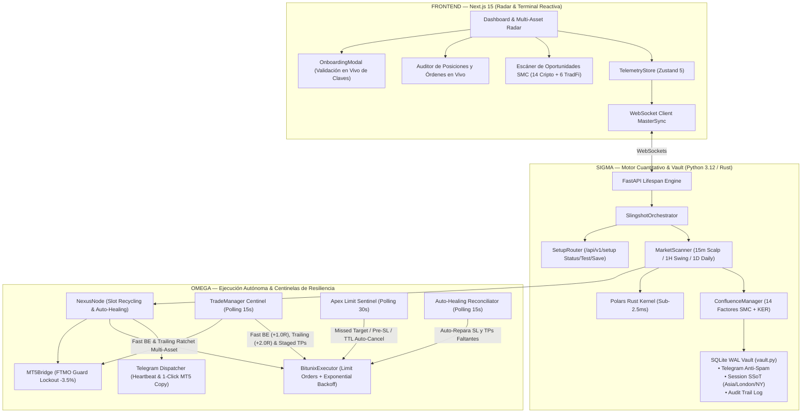

# 🛡️ SLINGSHOT v25.4 MULTI-TIMEFRAME — Autonomous Institutional Trading Terminal

> **"Terminal Cuantitativa Autónoma de Grado Institucional. Matriz Multitemporal Híbrida: Oro Especializado en 1H Intraday / Swing secular Long-Only, Criptomonedas e Índices en 15m. Jurado de Confluencia End-to-End con Sanitización Estricta Anti-NaN. Serialización Nativa orjson en Rust (<0.08ms). Dimensionamiento Dinámico por Fases FTMO (Fase 1: 0.75% / Fase 2: 0.50% / Fondeada: 0.35%). Gating Horario de Killzones en Índices TradFi (Londres & Nueva York). Asimetría Direccional en Altcoins (Long Bias Gating >= 70). Salidas Escalonadas Alpha Maximizer (50% / 30% / 20%). Breathing Room Shield (10s de Gracia Anti-Spread). Filtros de Volumen Institucional (RVOL >= 1.30) y Eficiencia (KER >= 0.35). Kernel de Indicadores en Rust (Polars < 2.5ms). Persistencia Transaccional SQLite WAL. Puente Directo MetaTrader 5 con FTMO Guardian Shield. Suite Oficial de Certificación QA (90/90 Tests Aprobados al 100%)."**


---

## 🎯 Nuestra Misión: Democratizar el Smart Money con Máxima Resiliencia

Slingshot es una **Terminal de Inteligencia y Ejecución Cuantitativa Institucional** diseñada para operar simultáneamente en mercados de Criptomonedas (Bitunix 24/7) y Cuentas de Fondeo (*Prop Firms* como FTMO en MetaTrader 5). El sistema combina:

* **Smart Money Concepts (SMC):** Fair Value Gaps (FVG), Order Blocks, Zonas OTE (Fibonacci 61.8% - 78.6%) y Liquidez con precisión de nivel institucional.
* **Asimetría Direccional en Altcoins (v24.0):** Gating estadístico en Altcoins (`SUI`, `RENDER`, `ATOM`, `FET`, `NEAR`) con preferencia Long y exigencia de Confluencia $\ge 70$ para Shorts.
* **Salidas Escalonadas Alpha Maximizer (50% / 30% / 20%):** Cobro del 50% en TP1 (+1.5R) cubriendo riesgo, 30% en TP2 (+3.0R) elevando SL a +2.0R y 20% en Runner (+5R a +8R) con Trailing Ratchet al 70%.
* **Breathing Room Shield (10s):** Inmunidad de apertura contra micro-ruidos de spread y mechas de libro.
* **Filtros Cuantitativos Institucionales:** `RVOL >= 1.30` y `KER >= 0.35` para purgar consolidaciones y falsos quiebres sin volumen.
* **SSoT Backtest CLI:** `scripts/run_institutional_backtest.py` como Fuente Única de Verdad para simulación de cartera y activos individuales.
* **Auto-Healing Reconciliator:** Auditoría continua cada 15-30s que detecta contratos huérfanos y auto-coloca el Stop Loss y las órdenes de Take Profit.
* **Resolución Dinámica de Precisión de Activos:** Mapeo en tiempo real de decimales de cantidad (`basePrecision`) y precio (`quotePrecision`).
* **Invarianza Monótona Absoluta del Stop Loss:** Blindaje que prohíbe que un Stop Loss retroceda o se degrade ante reinicios.
* **Kernel en Rust (`Polars`):** Cálculo vectorial de indicadores y confluencias en menos de $2.5\text{ ms}$.
* **Bóveda SQLite WAL Transaccional (`vault.py`):** Persistencia ACID de sesiones y bitácora de auditoría inmutable.
* **Guardián de Telemetría y Heartbeat en Telegram:** Reporte periódico cada 4 horas de signos vitales, latencia, margen y PnL.
* **Supervisor Watchdog 24/7 (`scripts/watchdog_supervisor.py`):** Monitor de subprocesos para ejecución inmortal en VPS.

---

## 🏛️ Arquitectura del Sistema v22.3 APEX SOVEREIGN


```mermaid
graph TB
    subgraph "FRONTEND — Next.js 15 (Radar & Terminal Reactiva)"
        A["Dashboard & Multi-Asset Radar"] --> B["TelemetryStore (Zustand 5)"]
        B --> C["WebSocket Client MasterSync"]
        A --> D["Escáner de Oportunidades SMC (14 Cripto + 6 TradFi)"]
        A --> E["Auditor de Posiciones y Órdenes en Vivo"]
        A --> OB["OnboardingModal (Validación en Vivo de Claves)"]
    end

    subgraph "SIGMA — Motor Cuantitativo & Vault (Python 3.12 / Rust)"
        J["FastAPI Lifespan Engine"] --> K["SlingshotOrchestrator"]
        K --> L["MarketScanner (15m Scalp / 1H Swing / 1D Daily)"]
        K --> SETUP["SetupRouter (/api/v1/setup Status/Test/Save)"]
        L --> M["ConfluenceManager (14 Factores SMC + KER)"]
        L --> N["Polars Rust Kernel (Sub-2.5ms)"]
        M --> V["SQLite WAL Vault (vault.py)<br/>• Telegram Anti-Spam<br/>• Session SSoT (Asia/London/NY)<br/>• Audit Trail Log"]
    end

    subgraph "OMEGA — Ejecución Autónoma & Centinelas de Resiliencia"
        L --> NX["NexusNode (Slot Recycling & Auto-Healing)"]
        NX --> T["Telegram Dispatcher (Heartbeat & 1-Click MT5 Copy)"]
        NX --> BX["BitunixExecutor (Limit Orders + Exponential Backoff)"]
        NX --> MT5["MT5Bridge (FTMO Guard Lockout -3.5%)"]
        TM["TradeManager Centinel (Polling 15s)"] --> |"Fast BE (+1.0R), Trailing (+2.0R) & Staged TPs"| BX
        TM --> |"Fast BE & Trailing Ratchet Multi-Asset"| MT5
        LS["Apex Limit Sentinel (Polling 30s)"] --> |"Missed Target / Pre-SL / TTL Auto-Cancel"| BX
        AH["Auto-Healing Reconciliator (Polling 15s)"] --> |"Auto-Repara SL y TPs Faltantes"| BX
    end

    C <--> |"WebSockets"| J
```

---

## 💎 Las 10 Innovaciones de Grado Institucional (v22.3)

### 1. 🔄 Auto-Healing Reconciliator & Dynamic Precision
* **Auditoría Bidireccional:** Cada 15-30s audita que todas las posiciones abiertas cuenten con su Stop Loss nativo y sus 3 órdenes de Take Profit.
* **Auto-Reparación:** Si una orden no se colocó en la apertura por micro-cortes o congestión del exchange, la detecta, resuelve su precisión exacta con `get_symbol_precision()` y la emite de inmediato.

### 2. ⚡ Reintentos con Exponential Backoff & Jitter
* Todas las peticiones al exchange incorporan reintentos automáticos ante códigos `429 Too Many Requests`, `500 Internal Error` o desconexiones, regenerando nonce y firma digital en cada iteración.

### 3. 🔒 Invarianza Monótona Absoluta de Stop Loss
* Guardia de hardware y software que **prohíbe estrictamente cualquier retroceso o degradación del Stop Loss**. Una vez que una posición entra en ganancia o Breakeven, el SL solo puede avanzar a favor del trade.

### 4. 👁️ Centinela Inteligente de Órdenes Límite (*Apex Limit Sentinel*)
* **Missed Target Kill-Switch:** Si el mercado toca TP1 sin activar la orden límite, la cancela de inmediato para evitar trampas de liquidez tardías.
* **Pre-Entry Invalidation:** Si el precio rompe el Stop Loss antes de entrar, retira la orden del libro.
* **Caducidad Dinámica (TTL):** Purgado automático de órdenes con más de 3 horas desfasadas.

### 5. 🛡️ Fast Breakeven (+1.0R) y Salidas Escalonadas (60 / 20 / 20)
* **Blindaje Inmediato:** Al avanzar $+1.0\text{R}$, el centinela coloca el Stop Loss al precio de entrada (**$\$0.00$ de pérdida**).
* **Parciales Óptimos:** Toma el **$60\%$ del volumen en TP1 (+1.3R)**, el **$20\%$ en TP2 (+2.2R)** y el **$20\%$ en TP3 (+3.5R Runner)**, asegurando ganancias mayoritarias y capturando mega-tendencias.

### 6. ♻️ Liberación Dinámica de Cupos (*Slot Recycling Protocol*)
* **Máxima Eficiencia de Capital:** Las posiciones en Breakeven **liberan su cupo de riesgo de inmediato**, permitiendo al sistema ejecutar el volumen de 8-10 operaciones con el margen de 4.

### 7. 🏛️ Ecosistema MetaTrader 5 TradFi (FTMO Guardian)
* Integración nativa de **Oro (`XAUUSD`), Nasdaq (`US100`), Dow Jones (`US30`), S&P 500 (`US500`), DAX 40 (`GER40`, PF 2.17) y GBPJPY (`El Dragón`, PF 2.23)** con cálculo dinámico de lotes y **FTMO Circuit Breaker (-3.5% lockout)**.

### 8. 💓 Telemetría Vital y Heartbeat en Telegram
* Despacho de signos vitales cada 4 horas con latencia de API, margen libre, posiciones activas, PnL no realizado y alertas rojas inmediatas ante anomalías.

### 9. 🐕 Supervisor Watchdog 24/7 (`scripts/watchdog_supervisor.py`)
* Supervisor de subprocesos diseñado para servidores VPS Windows, garantizando auto-reinicio en $< 2\text{ segundos}$ ante reinicios del sistema operativo.

### 10. 👑 The Truth Engine (Motor de Backtesting Unificado)
* Simulación con 100% de paridad con producción, comisiones reales Maker (0.02%) y Taker (0.06%), slippage y soporte de interés compuesto.

---

## 🛠️ Stack Tecnológico

* **Frontend**: Next.js 15 (App Router), Zustand 5, Tailwind CSS, Lightweight Charts, Lucide Icons.
* **Backend**: Python 3.12, FastAPI, Uvicorn, WebSockets, Polars (Rust), Pandas, NumPy, MetaTrader 5.
* **Base de Datos / Persistencia**: SQLite 3 (WAL Mode & Normal Synchronous), SQLiteVault.
* **Exchanges & Brokers**: Bitunix Futures REST API (Dual SHA-256), MetaTrader 5 IPC Bridge.
* **Testing & QA**: Pytest 8, AnyIO, Asyncio (**63/63 tests pasando al 100% en 8.9s**).

---

## 🚀 Guía de Inicio Rápido (Quick Start)

### 1. Instalación en 1 Solo Clic (Windows)
Haz doble clic en el instalador de la raíz:
```powershell
install.bat
```
*(Detecta Python y Node.js con `winget`, construye `.venv`, instala dependencias y crea el acceso directo en tu Escritorio).*

### 2. Iniciar el Motor de Producción (1-Clic)
```powershell
launch.bat
```
*(Opcional: Para modo servidor 24/7 en VPS, ejecuta `python scripts/watchdog_supervisor.py`).*

### 3. Ejecutar la Suite Oficial de Certificación QA (63 Pruebas)
```powershell
python scripts/run_qa_suite.py
```

---

## 📄 Licencia y Auditoría
* **Arquitectura:** Slingshot APEX SOVEREIGN v22.3
* **Auditoría:** Antigravity (Advanced AI Coding — Google DeepMind)
* **Certificación:** ✅ 63/63 Tests PASS (100% Green)
