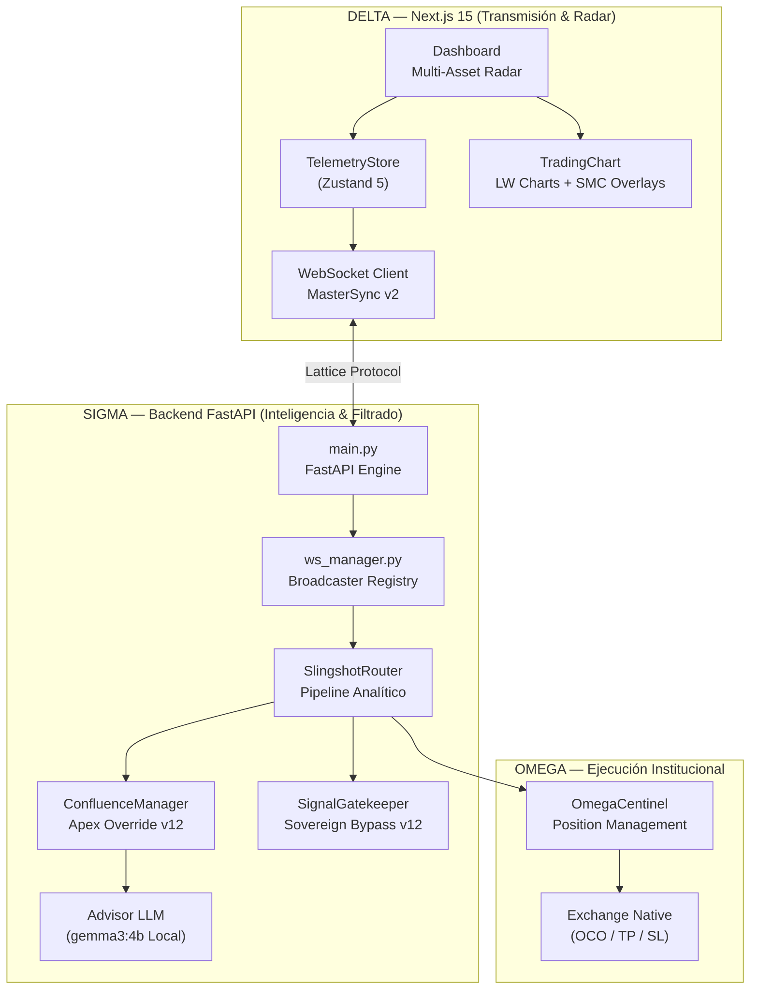

# 🛡️ SLINGSHOT v13.6 APEX SOVEREIGN — Precision Calibration & State Unification
> **"Institutional-Grade Autonomous Terminal. Order Flow Intelligence. Value Area Execution. Sovereign Intelligence v13.6."**


## 🎯 Nuestra Misión: Democratizar el Smart Money
Slingshot no es solo un bot de trading; es una **Terminal de Inteligencia Institucional** diseñada para nivelar el campo de juego entre el trader retail y los grandes fondos de inversión. El sistema utiliza principios avanzados de **SMC (Smart Money Concepts)** y **Wyckoff** para identificar el rastro de la liquidez institucional antes de que el movimiento ocurra.

---

## 🏛️ El Blueprint — Arquitectura Sigma/Delta/Omega

Slingshot opera sobre una trinidad arquitectónica que garantiza ejecución sin bloqueos y limpieza en la señal.


```mermaid
graph TB
    subgraph "DELTA — Next.js 15 (Transmisión & Radar)"
        A["Dashboard<br/>Multi-Asset Radar"] --> B["TelemetryStore<br/>(Zustand 5)"]
        B --> C["WebSocket Client<br/>MasterSync v2"]
        A --> D["TradingChart<br/>LW Charts + SMC Overlays"]
    end

    subgraph "SIGMA — Backend FastAPI (Inteligencia & Filtrado)"
        J["main.py<br/>FastAPI Engine"] --> K["ws_manager.py<br/>Broadcaster Registry"]
        K --> L["SlingshotRouter<br/>Pipeline Analítico"]
        L --> M["ConfluenceManager<br/>Apex Override v12"]
        L --> N["SignalGatekeeper<br/>Sovereign Bypass v12"]
        M --> S["Advisor LLM<br/>(gemma3:4b Local)"]
    end

    subgraph "OMEGA — Ejecución Institucional"
        T["OmegaCentinel<br/>Position Management"] --> BB["Exchange Native<br/>(OCO / TP / SL)"]
    end

    C <--> |"Lattice Protocol"| J
    L --> T
```

---

## 🧠 Metodología Educativa & Algorítmica

### 1. SMC Tiered Confluence (v13.1 Apex)
El motor SMC ahora opera con un sistema de **Tiers de Convención**:
- **TIER A (Premium)**: Setup completo (OB + Sweep/Retest + FVG). Convicción base: **0.90**.
- **TIER B (Táctico)**: Setups parciales de alta probabilidad (Sweep + FVG o OB + Sweep). Convicción base: **0.65**. El Gatekeeper aplica filtros más estrictos a este tier para filtrar ruido.

### 2. Sovereign Bypass v12.0
El sistema permite que señales de convicción extrema (≥95%) ignoren el Veto Fractal macro. Esto captura reversiones institucionales que un bot conservador descartaría.

### 3. Apex Override v12.0
Cuando la absorción institucional supera el 90%, el Confluence Score recibe un bonus de +20 puntos, priorizando la huella de capital real sobre las reglas heurísticas.

### 4. Inferencia IA Local & Fallback (v13.1)
Utilizamos un modelo **gemma3:4b** (vía Ollama). Si el servidor local falla, el **Mini-Advisor Determinístico** entra en acción, generando un veredicto basado en reglas técnicas fijas (Regime, Signal, RVOL) para garantizar que la UI nunca reciba datos corruptos.

### 5. Black Box: Módulo de Memoria de Errores (v13)
Slingshot ahora tiene memoria. El módulo **Black Box** graba la "huella digital" de cada trade perdedor. Si se detecta un patrón similar (>85% coincidencia), se emite un **VETO_BY_MEMORY**.

### 6. Adaptive Risk Management (v13)
El riesgo se escala dinámicamente según el Confluence Score (0.25% - 2.0%).

### 7. Radar Resilience v2 (Visibility Re-hydration)
El **RadarFeed** ya no requiere polling. Utiliza el evento `visibilitychange` para re-hidratar automáticamente el feed global cuando el usuario vuelve a la pestaña, asegurando sincronización total con el WebSocket Maestro.

### 8. 🏦 Yosh Order Flow — Value Area Intelligence (v13.1)
Integración de la metodología institucional de **Yosh**. El sistema ahora opera con inteligencia de **Order Flow puro**:
- **Volume Profile (POC/VAH/VAL)**: Calculado cada 60 segundos.
- **Look Above and Fail (LAF/LBF)**: Detección de trampas institucionales.
- **Scoring de Confluencia Yosh**: Bonus por OTE dinámico (10-25 pts) independiente de la ventana horaria.

## 🛠️ Stack Tecnológico
* **DELTA (Frontend)**: Next.js 15 (App Router), Zustand 5, Tailwind CSS, Lightweight Charts (TradingView).
* **SIGMA (Backend)**: Python 3.11+, FastAPI, Uvicorn, WebSockets.
* **Cerebro & Modelos**: XGBoost, Ollama (Gemma3:4b), Pandas, NumPy, Scikit-Learn.
* **Base de Datos**: SQLite / Black Box Memory local persistente.

---

## 🏹 Guía de Inicio Rápido (Quick Start)

### 1. Requisitos Previos
* **Python 3.10+** (Recomendado 3.11 en entorno virtual `.venv`)
* **Node.js 20+**
* **Ollama** (Servidor local corriendo con el modelo `gemma3:4b` descargado)
* **Binance Testnet API Keys** (Para la ejecución táctica en vivo de Nexus)

### 2. Configuración del Entorno (`.env`)
Crea un archivo `.env` en la raíz del proyecto para inicializar el motor Sigma:
```env
BINANCE_API_KEY="tu_api_key_testnet"
BINANCE_API_SECRET="tu_api_secret_testnet"
OLLAMA_HOST="http://localhost:11434"
TELEGRAM_BOT_TOKEN="tu_token_opcional"
TELEGRAM_CHAT_ID="tu_chat_id_opcional"
```

### 3. Lanzamiento del Sistema

#### Opción A: Orquestador Unificado (Recomendado en Windows)
Inicializa tanto el backend de FastAPI como el frontend de Next.js en alta prioridad con un solo comando:
```powershell
./launch.bat
```

#### Opción B: Ejecución Granular (Depuración & Desarrollo)
Si prefieres ver la telemetría y los logs de compilación de forma independiente en consolas separadas:

* **Paso 1: Levantar el Backend (FastAPI)**
  ```powershell
  .\.venv\Scripts\python.exe -m uvicorn engine.api.main:app --host 0.0.0.0 --port 8000
  ```
* **Paso 2: Levantar el Frontend (Next.js)**
  ```powershell
  node .\node_modules\next\dist\bin\next dev
  ```

---

## 📂 Estructura del Proyecto

```text
Slingshot_Trading/
├── engine/                        # SIGMA: Cerebro Algorítmico (FastAPI + SMC)
│   ├── main_router.py             # Pipeline principal (Async Support v13)
│   ├── api/                       # FastAPI + WebSocket + Advisor + Auth
│   ├── core/                      # Confluence (GP Fix v13.1) + BlackBox + AI Validator
│   ├── router/                    # Gatekeeper v13 + Analyzer + Dispatcher
│   ├── execution/                 # Nexus Bridge (Binance) + Omega Listener
│   ├── strategies/                # SMC Tiers A/B (v13.1 Apex)
│   ├── indicators/                # Structure, Fibonacci, Volume, Liquidity, On-Chain, Regime
│   ├── inference/                 # Volume Pattern Scheduler
│   ├── ml/                        # XGBoost Inference + Drift Monitor
│   ├── risk/                      # RiskManager (Adaptive Risk Scaling v13)
│   ├── notifications/             # Filtro de Señales + Telegram Bot
│   ├── workers/                   # Orchestrator + News Worker + Calendar Worker
│   ├── backtest/                  # ReplayEngine v13.4 (Event-Driven) & Ecosistema de Backtesting
│   │   ├── data/                  # Datos históricos unificados (.parquet)
│   │   ├── reports/               # Reportes de auditoría en JSON
│   │   ├── replay_engine.py       # Motor de backtesting principal (Async/Await)
│   │   ├── fast_audit.py          # Auditoría rápida con ATR real (True Range EWM 14)
│   │   ├── multi_asset.py         # Simulación de portafolio multi-activo
│   │   ├── stress_audit.py        # Evaluación de precisión del Gatekeeper
│   │   └── find_signals.py        # Buscador de señales Gold (SMC)
│   ├── tools/                     # Scripts auxiliares y herramientas de desarrollo
│   ├── tests/                     # 17 tests de integridad
│   └── data/                      # Estado de sesión por activo + caché IA
├── app/                           # DELTA: Terminal UI (Next.js 15 + Zustand 5)
│   ├── store/                     # TelemetryStore + IndicatorsStore
│   ├── components/                # TradingChart + Radar (Visibility Sync v13.1)
│   └── ...
└── ...
```

---

## 📖 Documentación Profunda
- **[docs/SOVEREIGN_INTELLIGENCE_V13.md](docs/SOVEREIGN_INTELLIGENCE_V13.md)**: La especificación técnica de la v13, v13.4 y v13.6 Apex Sovereign.
- **[docs/SLINGSHOT_BIBLE_V10.md](docs/SLINGSHOT_BIBLE_V10.md)**: La especificación técnica Apex.
- **[docs/ESTRUCTURA_PROYECTO.md](docs/ESTRUCTURA_PROYECTO.md)**: Mapa completo del proyecto.
- **[docs/AUDIT_PLAN_V11.md](docs/AUDIT_PLAN_V11.md)**: Plan de auditoría vigente.

---

## 🔬 Changelog v13.6 (Precision Calibration & State Unification)
### 🛡️ Calibración de Precisión en Gatekeeper
- **Umbral OTE Estricto**: Se elevó el parámetro `ote_min_confidence` a **85%** en `gatekeeper_config.json`. Cualquier señal detectada fuera de la zona óptima de entrada (OTE) debe cumplir ahora con una confluencia mínima de 85% para omitir el veto técnico y ser aprobada, previniendo operaciones de baja confluencia en zonas de riesgo.

### 📊 Saneamiento Visual de la Interfaz
- **Lista Blanca de Estados Operativos**: Se resolvió el bug de fuga visual que renderizaba erróneamente señales vetadas (ej. con baja confluencia al 40% y estado `"LOW_CONFLUENCE"` o `"BLACKBOX_VETO"`) como activas.
- **Unificación de Filtros**: Se reemplazó el filtro legacy basado en prefijo `startsWith('BLOCKED')` en el frontend por un filtrado estricto basado en una lista blanca explícita de estados autorizados: `['ACTIVE', 'APPROVED', 'PENDING', 'FILLED', 'CLOSED_TP_MAX', 'STOPPED_OUT']`.
- **Implementación Consistente**: Aplicada esta lista blanca en `SignalTerminal.tsx`, `RadarFeed.tsx`, `SignalCardItem.tsx` y la lógica auxiliar en `signalLogic.ts`. Las señales bloqueadas ahora se muestran correctamente como vetadas en la UI del Radar Center y de la Terminal y se desactivan sus controles interactivos.

## 🔬 Changelog v13.4 (Institutional Backtesting & Fidelity Edition)
### 📈 Reconstrucción de Fidelidad en Backtesting
- **Fidelidad de Canal Asíncrono**: Se convirtió el `replay_engine.py` para procesar señales usando `await self.router.process_market_data(...)`. Anteriormente, el pipeline asíncrono descartaba silenciosamente los coroutines de señales en modo offline, haciendo que el backtest no procesara señales en absoluto. Ahora el flujo de backtest es 100% fiel al WebSocket de producción.
- **Centralización Física de Componentes**: Se agrupó el ecosistema de backtesting bajo `engine/backtest/`, creando carpetas dedicadas para datos históricos (`engine/backtest/data/`) y reportes automatizados (`engine/backtest/reports/`).
- **Corrección de Firma y Métricas en Fast Audit**: Se corrigió el error en la firma de llamada a `evaluate_signal()` en `fast_audit.py`, eliminando parámetros inexistentes que invalidaban la confluencia. Además, se reemplazó la desviación estándar simple por el Average True Range (ATR) real calculado mediante True Range de suavizado exponencial (EWM 14) para SL/TP de precisión.
- **Integración Asíncrona en Scripts de Diagnóstico**: Se refactorizaron `stress_audit.py` y `multi_asset.py` para que sus ejecuciones e integraciones con `SignalGatekeeper` y `EventDrivenReplayEngine` sean completamente asíncronas utilizando `asyncio.run` y `await`, erradicando bloqueos y corrutinas muertas.
- **Estadísticas de Backtest Robustas**: El motor ahora guarda reportes detallados en formato JSON con timestamps en `engine/backtest/reports/` para facilitar su auditoría y carga desde el frontend.

## 🔬 Changelog v13.3 (Latency Optimization & Live Validation)
### ⚡ Optimizaciones en UI
- **Memoización de Feeds Híbridos**: Implementado `useMemo` en `SignalTerminal`, `RadarFeed` y `ActiveAssetsMonitor` para evitar ciclos redundantes de ordenamiento y filtrado de señales sobre eventos de WebSocket.
- **Latencia UI Sub-5ms**: Interfaz fluida sin bloqueos del hilo principal del navegador incluso bajo estrés extremo de ticks.

## 🔬 Changelog v13.2 (Sovereign Execution & Smart Trailing)
### 🏦 Motor de Ejecución en Vivo (Nexus)
- **Smart Trailing (BE)**: Ajuste automático del Stop Loss a precio de entrada + comisión tras alcanzar el objetivo TP1.
- **Averaging Up de Yosh**: Adición dinámica de contratos (+50% de la posición original) al retestear el POC con SL ya en Breakeven.
- **Integración de Binance Futures Testnet**: Ejecución real respetando flags de `dry_run`.

## 🔬 Changelog v13.1 (Stabilization & Apex Tiers)
### 🏹 Estrategia SMC Evolucionada
- **Tiered Signal System**: Implementado Tier A (Premium) y Tier B (Táctico) con convicción diferenciada (0.9 vs 0.65).
- **Golden Pocket Scoring**: Fix de indentación. GP ahora es independiente de la Yosh Window y tiene scoring dinámico (10-25 pts) según confluencia con Whale Legs.

### 🛡️ Resiliencia & Backend
- **Deterministic Advisor Fallback**: Mini-advisor basado en reglas para caídas de Ollama.
- **Signal Debounce v2**: Score bucketing (S/A/B) para evitar duplicados por micro-variaciones de datos.

### 📊 Frontend & Radar
- **Visibility Sync**: Re-hidratación automática del Radar al cambiar de pestaña.
- **TradingChart v5.1**: Refactorización completa a Lightweight Charts v5.1 API.

### 🔧 Correcciones Críticas
- **Golden Pocket Bypass**: Corregido bug que impedía la evaluación de OTE fuera de horario.
- **Absorción Determinista**: `absorption_score` sanitizado para garantizar rango [0, 100].

## 🔬 Changelog v13.0 (Sovereign Intelligence)
### Evolución de Inteligencia
- **Black Box (Memory Module)**: Grabación persistente de huellas de pérdida para prevenir la repetición de errores técnicos (Similarity Match > 85%).
- **AI Validator Agent**: Auditoría narrativa obligatoria mediante LLM local (gemma3:4b) para señales en zona de incertidumbre (60-80% confluencia).
- **Adaptive Risk Scaling**: Gestión dinámica de la posición (0.25% - 2.0%) vinculada directamente al Confluence Score institucional.
- **Async Pipeline Support**: Refactorización completa del pipeline táctico para soportar inferencia IA no bloqueante.

### Mejoras de UI (Visual Sovereign)
- **AI Narrative Audit Panel**: Desglose visual de la lógica de la IA, confianza del modelo y razonamiento estructural directamente en la tarjeta de señal.
- **Dynamic Scale Indicator**: Visualización en tiempo real del porcentaje de riesgo asignado por el RiskManager según la confluencia detectada.
- **Intelligence Status Monitor**: Indicadores globales en el Market Panel sobre el estado de "Armado" del Black Box y la disponibilidad del Auditor IA.
- **v13 Lifecycle Integration**: Soporte nativo para estados `AI_VETO` y `BLOCKED_BY_MEMORY` con etiquetas visuales específicas.

### Mejoras del Motor
- **Mitigación de OB por Cierre**: Los Order Blocks ahora requieren cierre de vela para su invalidación técnica.
- **Sovereign Bypass**: Las señales de convicción extrema (≥95%) mantienen su prioridad de ignorar el veto fractal.

---
*v13.6 Apex Sovereign — Precision Calibration & State Unification.*
*Hardened & Evolved by Antigravity — May 21, 2026*
