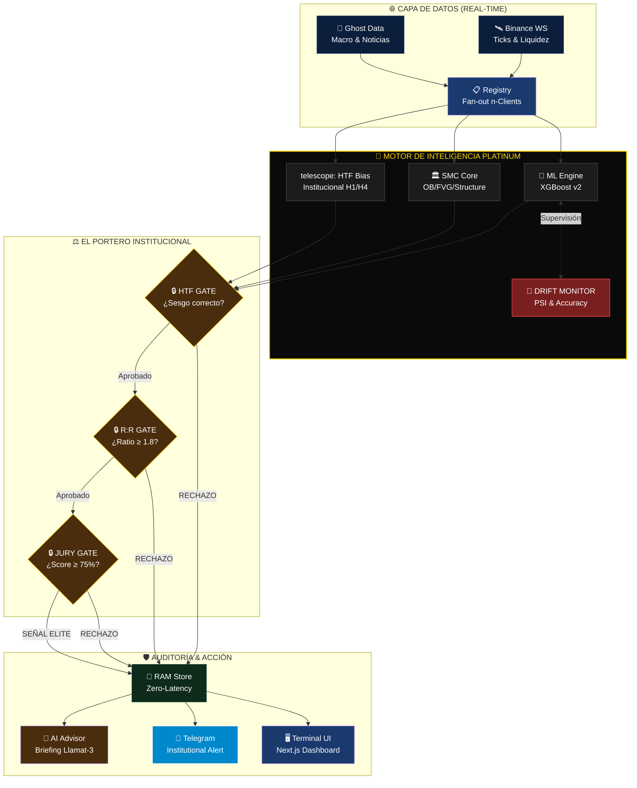

# 🏹 SLINGSHOT v4.3 — DIAMANTE INSTITUCIONAL (MASTERPLAN)

> **"La precisión no es una opción, es nuestra arquitectura."**
> **Versión:** 4.3 Platinum Masterplan | **Actualizado:** 02 de Abril, 2026

---

## 💎 Visión General del Sistema (Capa Platinum)

Este diagrama representa el flujo de datos de baja latencia (Zero-Latency) desde la captura del tick hasta la ejecución de la señal filtrada por el Portero Institucional.

---

## 🔄 Flujo de Datos Institucional (Táctico)

---

## 🏆 Hitos Logrados (V4.3 Diamond Phase)

| Estado | Módulo | Descripción |
|:---:|---|---|
| ✅ | **Drift Monitor** | PSI (Population Stability Index) & Rolling Accuracy activo. |
| ✅ | **Modular Router** | Separación en `analyzer.py`, `gatekeeper.py` y `dispatcher.py`. |
| ✅ | **Telegram Core** | Pipeline de alertas institucionales con MarkdownV2. |
| ✅ | **Memory Store** | Hidratación Zero-Latency para el AI Advisor. |
| ✅ | **SMC Engine** | Identificación de Liquidez, OBs y FVGs en tiempo real. |

---

## 🔭 Roadmap Siguiente Nivel

1.  **Capa SMT Dinámica**: Comparación multiactivo parametrizable (no solo BTC/ETH).
2.  **Backtest en Caliente**: Simulación de la estrategia actual en el histórico local al detectar drift.
3.  **Radar de Clusters**: Agrupación masiva de órdenes en el heatmap para prever barridas mayores.

---
*Actualizado por Antigravity — Slingshot v4.3 Platinum — 02 Abril 2026*
