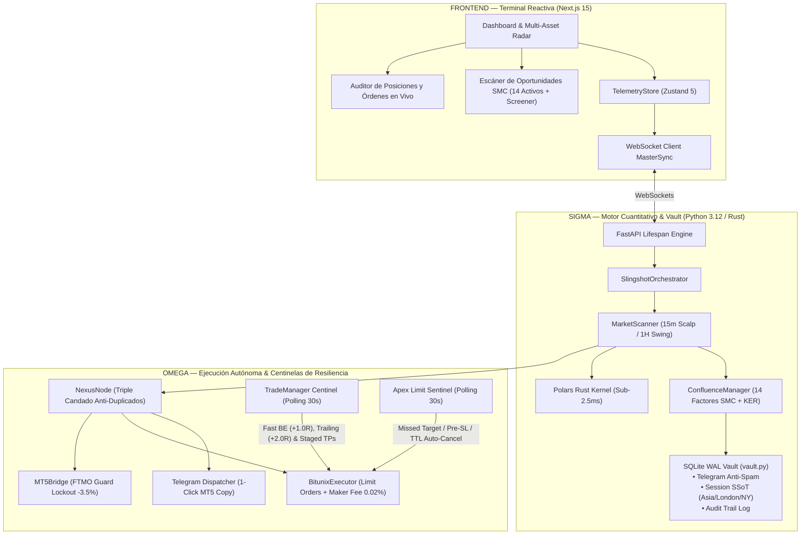

# 🛡️ SLINGSHOT BIBLE v22.0 — Especificación Técnica APEX SOVEREIGN
## v22.0 "Apex Sovereign: Intelligent Limit Sentinel, Staged Exits (60/20/20) & The Truth Engine" | Agosto 2026

**Auditor:** Antigravity (Advanced AI Coding — DeepMind)  
**Fecha:** Agosto 2026  
**Versión del Sistema:** v22.0 Apex Sovereign  
**Paradigma Arquitectónico:**
- **Delta (Δ) — Terminal Reactiva & Radar:** Next.js 15 + Zustand 5 con telemetría en tiempo real, monitoreo de PnL flotante en unidades R, visualización de órdenes límite en el libro y alertas institucionales de alta confluencia.
- **Sigma (Σ) — Cerebro Cuantitativo & Vault:** Kernel vectorial compilado en **Rust (Polars)** (< 2.5ms) + **Bóveda SQLite WAL Transaccional (`vault.py`)** con persistencia ACID + Jurado de Confluencia SMC de 14 Factores con filtro antiruido KER (Kaufman Efficiency Ratio).
- **Omega (Ω) — Ejecución Autónoma & Centinelas de Resiliencia:** 
  - **Centinela Inteligente de Órdenes Límite (*Apex Limit Sentinel*):** Auto-cancelación en Bitunix por *Missed Target* (precio toca TP1 sin entrar), *Pre-Entry SL Breach* (perforación previa de SL), expiración temporal (TTL) y auto-purga por sobreexposición.
  - **Gestión Activa de Posiciones en Vivo:** **Fast Breakeven (+1.0R / $0.00 riesgo)** + **Trailing Stop (+2.0R asegurando +1.2R)** + **Salidas Escalonadas (60% TP1, 20% TP2, 20% TP3)**.
  - **Reciclaje Dinámico de Cupos (*Slot Recycling*):** Liberación instantánea de cupos de riesgo en cuanto las posiciones alcanzan Breakeven.
  - **The Truth Engine v22.0:** Motor de backtesting unificado con 100% de paridad con producción, fricción real de exchange y soporte para interés compuesto dinámico.

**Veredicto:** ✅ PRODUCCIÓN ELITE CERTIFICADA — Suite completa de 35/35 pruebas unitarias aprobadas al 100% en 5.25 segundos.

---

## 1. Resumen Ejecutivo y Arquitectura del Sistema v22.0

Slingshot v22.0 consolida la autonomía completa del sistema de trading, resolviendo de forma nativa la gestión de órdenes en espera (evitando órdenes huérfanas o entradas tardías) y garantizando la protección estricta del balance mediante la toma mayoritaria de ganancias en el primer impulso.



---

## 2. Los 7 Pilares Tecnológicos de Slingshot v22.0

### 1. 👁️ Centinela Inteligente de Órdenes Límite (*Apex Limit Sentinel*)
* **Missed Target Kill-Switch:** Si el precio de mercado toca o supera el TP1 sin haber activado la orden límite en Bitunix, el centinela la **cancela de inmediato** (`MISSED_TARGET`) evitando entrar en una trampa de liquidez tardía.
* **Pre-Entry SL Breach:** Si el precio perfora el nivel del Stop Loss antes de tocar la entrada, la orden se **cancela de inmediato** (`PRE_ENTRY_SL_BREACH`) para no comprar un activo que ya rompió su estructura.
* **Caducidad Temporal (TTL):** Cancela órdenes desfasadas con más de 3 horas de antigüedad (`TTL_EXPIRED`).
* **Auto-Purga Protectora:** Si se activan 4 posiciones en riesgo, cancela cualquier orden pendiente sobrante para blindar el balance.

### 2. 🛡️ Salidas Escalonadas (60% TP1 / 20% TP2 / 20% TP3)
* **TP1 (60% del volumen):** Asegura el 60% del beneficio en el primer impulso (+1.3R / +1.5R) y mueve automáticamente el Stop Loss a **Breakeven ($0.00 riesgo)**.
* **TP2 (20% del volumen):** Toma ganancias en la zona de liquidez mayor (+2.2R / +2.5R) y ajusta el **Trailing Stop** a TP1 (+1.5R asegurado en verde).
* **TP3 (20% del volumen restante):** Deja correr la posición para capturar la extensión completa de la tendencia ($3.5\text{R} - 4.0\text{R}$).

### 3. ♻️ Liberación Dinámica de Cupos (*Slot Recycling Protocol*)
* Las posiciones en Breakeven ($0.00 riesgo) **liberan su cupo de riesgo de inmediato**, permitiendo al motor capturar nuevas oportunidades de alta confluencia sin sobreexponer el margen.

### 4. 🔒 Triple Candado Anti-Duplicados
* **Nivel 1 (Memoria RAM):** Bloqueo instantáneo en `_pending_limit_symbols`.
* **Nivel 2 (Auditoría Exchange):** Lectura nativa de `orderList` en el API de Bitunix previa a cualquier emisión.
* **Nivel 3 (Posiciones Vivas):** Exclusión de activos que ya cuenten con posición abierta.

### 5. 👑 The Truth Engine v22.0 (Motor de Backtesting Unificado)
* Backtester unificado con **100% de paridad con producción**: incorpora el Centinela de Límites, salidas 60/20/20, Fast Breakeven, comisiones reales Maker (0.02%) y Taker (0.06%), slippage y soporte para interés compuesto dinámico.

### 6. 🏛️ Bóveda Transaccional SQLite WAL (`vault.py`)
* Persistencia ACID inmutable en `slingshot_vault.db` con modo Write-Ahead Logging (WAL) para operaciones multi-hilo concurrentes sin bloqueos ni corrupción de base de datos.

### 7. 🏢 Puente MetaTrader 5 Institucional (`mt5_bridge.py`)
* Integración TradFi para Oro (`XAUUSD`), Nasdaq (`US100`) y Forex con cálculo dinámico de lotaje por contrato y **FTMO Circuit Breaker (-3.5% lockout)**.

---

## 3. Certificación QA Oficial

```text
============================= 35 passed in 5.25s ==============================
✅ CERTIFICACIÓN QA EXITOSA: 35/35 PRUEBAS APROBADAS AL 100%
```

La suite cubre exhaustivamente:
* `test_orchestrator_auto_starts_trade_manager`
* `test_security_sl_never_moves_backwards`
* `test_slot_recycling_frees_risk_on_breakeven`
* `test_fast_be_trigger_at_1r`
* `test_sync_live_positions_fast_be`
* `test_sentinel_cancels_when_target_missed_long`
* `test_sentinel_cancels_when_target_missed_short`
* `test_sentinel_cancels_when_sl_breached_prior_to_fill`
* `test_sentinel_cancels_on_ttl_expiration`
* `test_sentinel_purges_limits_when_max_risk_slots_filled`
* `test_sentinel_preserves_valid_pending_orders_in_discount`
* Y 24 pruebas de bóveda SQLite, puente MT5, aislamiento determinístico, filtros de sesión y screener dinámico.
