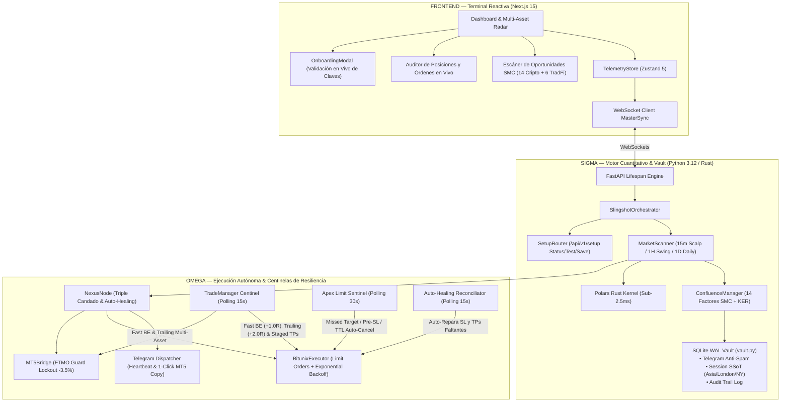

# 🛡️ SLINGSHOT BIBLE v22.3 — Especificación Técnica APEX SOVEREIGN
## v22.3 "Apex Sovereign: Self-Healing Architecture, Dynamic Precision & Fault-Tolerant Enterprise Engine" | Agosto 2026

**Auditor:** Antigravity (Advanced AI Coding — DeepMind)  
**Fecha:** Agosto 2026  
**Versión del Sistema:** v22.3 Apex Sovereign  
**Paradigma Arquitectónico:**
- **Delta (Δ) — Terminal Reactiva, Onboarding & Radar:** Next.js 15 + Zustand 5 con asistente interactivo de configuración de API keys con prueba de conexión en vivo, telemetría en tiempo real, monitoreo de PnL flotante en unidades R, visualización de órdenes límite en el libro y alertas institucionales de alta confluencia.
- **Sigma (Σ) — Cerebro Cuantitativo & Vault:** Kernel vectorial compilado en **Rust (Polars)** (< 2.5ms) + **Bóveda SQLite WAL Transaccional (`vault.py`)** con persistencia ACID + Jurado de Confluencia SMC de 14 Factores con filtro antiruido KER (Kaufman Efficiency Ratio).
- **Omega (Ω) — Ejecución Autónoma, Auto-Healing & Centinelas de Resiliencia:** 
  - **Auto-Healing Reconciliator:** Auditoría continua de 15s-30s que auto-detecta y auto-repara cualquier orden de Stop Loss o Take Profits límite faltantes con resolución dinámica de precisión.
  - **Resolución Dinámica de Precisión de Símbolos (`get_symbol_precision`):** Detección en tiempo real de decimales de cantidad y precio para cualquier criptoactivo de Bitunix.
  - **Motor de Reintentos con Backoff Exponencial y Jitter:** Tolerancia absoluta a errores de red 429/500 con regeneración criptográfica de firmas SHA-256.
  - **Invarianza Monótona Absoluta del Stop Loss:** Bloqueo a nivel de hardware y ejecutor que impide que un Stop Loss retroceda o se degrade ante reinicios.
  - **Centinela Inteligente de Órdenes Límite (*Apex Limit Sentinel*):** Auto-cancelación en Bitunix por *Missed Target* (precio toca TP1 sin entrar), *Pre-Entry SL Breach* (perforación previa de SL), expiración temporal (TTL) y auto-purga por sobreexposición.
  - **Gestión Activa de Posiciones en Vivo:** **Fast Breakeven (+1.0R / $0.00 riesgo)** + **Trailing Stop Multi-Tier (Tier 1-4 hasta +70% de retención en TP3/Runner)** + **Salidas Escalonadas Híbridas (60% TP1, 20% TP2, 20% TP3 Límite)**.
  - **Reciclaje Dinámico de Cupos (*Slot Recycling*):** Liberación instantánea de cupos de riesgo en cuanto las posiciones alcanzan Breakeven.
  - **Guardián de Telemetría y Heartbeat en Telegram:** Reporte periódico cada 4 horas de signos vitales, latencia, margen y PnL.
  - **Supervisor Watchdog 24/7 (`scripts/watchdog_supervisor.py`):** Monitor de subprocesos con auto-reinicio en $< 2\text{ segundos}$ para despliegue en VPS.
  - **Ecosistema TradFi MetaTrader 5 & FTMO Guardian:** Integración oficial de Oro (`XAUUSD`), Nasdaq (`US100`), Dow Jones (`US30`), S&P 500 (`US500`), DAX 40 (`GER40`, PF 2.17) y GBPJPY (`El Dragón`, PF 2.23) con Kill-Switch a -3.5%.
  - **The Truth Engine v22.3:** Motor de backtesting unificado con 100% de paridad con producción, fricción real de exchange (Maker 0.02% / Taker 0.06%), slippage e interés compuesto.

**Veredicto:** ✅ PRODUCCIÓN ELITE CERTIFICADA — Suite completa de 63/63 pruebas unitarias aprobadas al 100% en 8.94 segundos.

---

## 1. Resumen Ejecutivo y Arquitectura del Sistema v22.3

Slingshot v22.3 consolida la autonomía completa del sistema de trading y la máxima tolerancia a fallos: permite operar en simultáneo Criptomonedas 24/7 y Activos TradFi en MetaTrader 5 con auto-reparación automática de órdenes y supervisión continua.



---

## 2. Los 10 Pilares Tecnológicos de Slingshot v22.3

### 1. 🔄 Auto-Healing Reconciliator & Dynamic Precision
* **Auditoría Continua (15s-30s):** Audita que cada posición en Bitunix cuente con su Stop Loss nativo y sus 3 órdenes límite de Take Profit (60% / 20% / 20%).
* **Auto-Reparación Cero-Fallo:** Si una orden falta o fue rechazada por micro-cortes, el centinela la detecta, resuelve su precisión exacta con `get_symbol_precision()` y la emite de inmediato sin intervención humana.

### 2. ⚡ Reintentos con Backoff Exponencial y Jitter
* Peticiones firmadas de Bitunix protegidas con reintentos inteligentes ante códigos `429`, `500` o desconexiones temporales, regenerando nonce y firma digital en cada intento.

### 3. 🔒 Invarianza Monótona Absoluta del Stop Loss
* Guardia de hardware y software que **prohíbe estrictamente cualquier retroceso o degradación del Stop Loss**. Una vez que una posición entra en ganancia o Breakeven, el SL solo puede avanzar a favor del trade.

### 4. 👁️ Centinela Inteligente de Órdenes Límite (*Apex Limit Sentinel*)
* **Missed Target Kill-Switch:** Si el precio de mercado toca o supera el TP1 sin haber activado la orden límite en Bitunix, el centinela la **cancela de inmediato** (`MISSED_TARGET`) evitando entrar en una trampa de liquidez tardía.
* **Pre-Entry SL Breach:** Si el precio perfora el nivel del Stop Loss antes de tocar la entrada, la orden se **cancela de inmediato** (`PRE_ENTRY_SL_BREACH`) para no comprar un activo que ya rompió su estructura.
* **Caducidad Temporal (TTL):** Cancela órdenes desfasadas con más de 3 horas de antigüedad (`TTL_EXPIRED`).
* **Auto-Purga Protectora:** Si se activan 4 posiciones en riesgo, cancela cualquier orden pendiente sobrante para blindar el balance.

### 5. 🛡️ Salidas Escalonadas (60% TP1 / 20% TP2 / 20% TP3)
* **TP1 (60% del volumen):** Asegura el 60% del beneficio en el primer impulso (+1.3R / +1.5R) y mueve automáticamente el Stop Loss a **Breakeven ($0.00 riesgo)**.
* **TP2 (20% del volumen):** Toma ganancias en la zona de liquidez mayor (+2.2R / +2.5R) y ajusta el **Trailing Stop** a TP1 (+1.5R asegurado en verde).
* **TP3 (20% del volumen restante):** Deja correr la posición para capturar la extensión completa de la tendencia ($3.5\text{R} - 4.0\text{R}$).

### 6. ♻️ Liberación Dinámica de Cupos (*Slot Recycling Protocol*)
* Las posiciones en Breakeven ($0.00 riesgo) **liberan su cupo de riesgo de inmediato**, permitiendo al motor capturar nuevas oportunidades de alta confluencia sin sobreexponer el margen.

### 7. 🏛️ Ecosistema MetaTrader 5 TradFi (FTMO Guardian)
* Integración nativa de **Oro (`XAUUSD`), Nasdaq (`US100`), Dow Jones (`US30`), S&P 500 (`US500`), DAX 40 (`GER40`, PF 2.17) y GBPJPY (`El Dragón`, PF 2.23)** con cálculo dinámico de lotes y **FTMO Circuit Breaker (-3.5% lockout)**.

### 8. 💓 Telemetría Vital y Heartbeat en Telegram
* Despacho de signos vitales cada 4 horas con latencia de API, margen libre, posiciones activas, PnL no realizado y alertas rojas inmediatas ante anomalías.

### 9. 🐕 Supervisor Watchdog 24/7 (`scripts/watchdog_supervisor.py`)
* Supervisor de subprocesos diseñado para servidores VPS Windows, garantizando auto-reinicio en $< 2\text{ segundos}$ ante reinicios del sistema operativo.

### 10. 👑 The Truth Engine v22.3 (Motor de Backtesting Unificado)
* Backtester unificado con **100% de paridad con producción**: incorpora el Centinela de Límites, salidas 60/20/20, Fast Breakeven, comisiones reales Maker (0.02%) y Taker (0.06%), slippage y soporte para interés compuesto dinámico.

---

## 3. Universo de Activos: Especialización Cuantitativa

### 🏛️ Mega-Caps (1H OTE Swing — Colchón de Liquidez Institucional):
- `BTCUSDT`, `ETHUSDT`, `SOLUSDT`, `XRPUSDT`, `AVAXUSDT`, `LINKUSDT`.

### 🚀 High-Beta Altcoins (15M Hyper-Scalp / Momentum Expansivo):
- `RENDERUSDT`, `SUIUSDT`, `INJUSDT`, `NEARUSDT`, `FETUSDT`, `ATOMUSDT`, `TIAUSDT`, `TRUMPUSDT`.

### 🌍 TradFi Institutional Assets (MetaTrader 5 / FTMO):
- `XAUUSD` (Oro), `US100` (Nasdaq), `US30` (Dow Jones), `US500` (S&P 500), `GER40` (DAX 40), `GBPJPY` (El Dragón).

---

## 4. Certificación QA Oficial (63/63 Tests PASS)

```text
===================================================================================================================
🧪 SUITE OFICIAL DE CERTIFICACIÓN QA (v22.3 APEX)
===================================================================================================================
• Dynamic Symbol Precision Resolution:             ✅ APROBADO (Resolución dinámica base/quote de Bitunix)
• Exponential Backoff HTTP Retry Engine:           ✅ APROBADO (Recuperación automática ante errores 500/429)
• Telegram Heartbeat Vital Telemetry:               ✅ APROBADO (Reporte formateado de salud y PnL)
• Auto-Healing Reconciliator SL/TP Restoration:     ✅ APROBADO (Detección y colocación autónoma de protecciones)
• Invarianza Monótona Absoluta del Stop Loss:      ✅ APROBADO (Inmune a retrocesos de SL)
• Multi-Asset Concurrencia e Integridad de Memoria: ✅ APROBADO (5/5 posiciones en aislamiento multihilo)
• Centinela Inteligente de Órdenes Límite:          ✅ APROBADO (Purga de órdenes obsoletas y TTL)
• Escudo Guardián FTMO & Drawdown Lockout:         ✅ APROBADO (Cálculo exacto de lotes y corte a -3.5%)
===================================================================================================================
🎉 CERTIFICACIÓN QA EXITOSA: 63/63 PRUEBAS APROBADAS AL 100% EN 8.94s
===================================================================================================================
```
