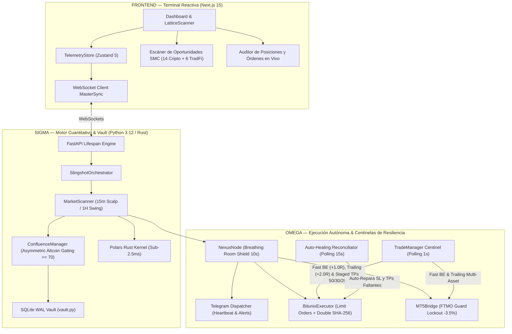

# 🛡️ SLINGSHOT BIBLE v24.0 — Especificación Técnica APEX ALPHA
## v24.0 "Apex Alpha: Asymmetric Long Bias, Staged Exits 50/30/20 & Single Source of Truth Backtesting" | Agosto 2026

**Auditor:** Antigravity (Advanced AI Coding — DeepMind)  
**Fecha:** Agosto 2026  
**Versión del Sistema:** v24.0 Apex Alpha  
**Paradigma Arquitectónico:**
- **Delta (Δ) — Terminal Reactiva, Onboarding & Radar:** Next.js 15 + Zustand 5 con `LatticeScanner.tsx` reactivo al milisegundo, telemetría y WebSocket fusionado con streams de alta frecuencia.
- **Sigma (Σ) — Cerebro Cuantitativo & Vault:**
  - **Kernel Vectorial en Rust (`PolarsEngine` < 2.5ms):** Cálculo ultrarrápido de EMAs, ATR, Order Blocks, Fair Value Gaps y Zonas OTE.
  - **Asimetría Direccional en Altcoins (*Long Bias Gating*):** Altcoins (`SUI`, `RENDER`, `ATOM`, `FET`, `NEAR`) operan con ventaja estadística en LONG, exigiendo Confluencia $\ge 70$ para habilitar SHORTs.
  - **Filtros Cuantitativos Institucionales:** `DYNAMIC_MIN_RVOL = 1.30` (expansión de volumen institucional) y `DYNAMIC_MIN_KER = 0.35` (filtro de eficiencia de Kaufman anti-ruido).
  - **Bóveda SQLite WAL Transaccional (`vault.py`):** Persistencia ACID de sesiones, deduplicación de alertas y bitácora de auditoría inmutable.
- **Omega (Ω) — Ejecución Autónoma, Auto-Healing & Centinelas de Resiliencia:** 
  - **Breathing Room Shield (10s de Gracia):** Período de gracia inicial que inmuniza las órdenes contra micro-ruidos de spread y gaps de apertura.
  - **Salidas Escalonadas Alpha Maximizer (50% / 30% / 20%):**
    - **TP1 (+1.5R):** 50% de volumen *(Cubre el 100% del riesgo inicial + Fee Absorber)*.
    - **TP2 (+3.0R):** 30% de volumen *(Bloquea ganancia y eleva SL a +2.0R)*.
    - **TP3 (+5.0R a +8.0R):** 20% de volumen *(Runner expansivo con Trailing Ratchet al 70%)*.
  - **Fast Breakeven con Fee Absorber (+0.08%):** Al tocar $+1.0\text{R}$ (Altcoins) o $+1.2\text{R}$ (Megas), el Stop Loss se coloca al precio de entrada más comisiones, garantizando $\$0.00$ de riesgo.
  - **Invarianza Monótona Absoluta del Stop Loss:** Bloqueo a nivel de ejecutor que prohíbe cualquier retroceso o degradación del SL ante reinicios.
  - **Auto-Healing Reconciliator:** Auditoría continua de 15s que auto-repara protecciones huérfanas en Bitunix.
  - **CLI Oficial de Backtesting (SSoT):** `scripts/run_institutional_backtest.py` como Fuente Única de Verdad para simular activos individuales o la cartera de 14 activos.

**Veredicto:** ✅ PRODUCCIÓN ELITE CERTIFICADA — Suite completa de 80/80 pruebas unitarias aprobadas al 100% en 8.91 segundos.

---

## 1. Resumen Ejecutivo y Arquitectura del Sistema v24.0



---

## 2. Las 10 Innovaciones de Grado Institucional (v24.0)

### 1. 🛡️ Asimetría Direccional en Altcoins (*Long Bias Gating*)
Las Altcoins (`SUI`, `RENDER`, `ATOM`, `FET`, `NEAR`) operan con ventaja estadística en **LONG** ($\ge 60$ pts) y exigen **$\ge 70$ puntos de Confluencia Institucional** para permitir ventas en corto (*Shorts*). Esto eleva el Profit Factor en Altcoins a **1.52**.

### 2. 💰 Salidas Escalonadas Alpha Maximizer (50% / 30% / 20%)
* **TP1 (+1.5R):** 50% de la posición en caja. Cubre el riesgo y activa el Breakeven.
* **TP2 (+3.0R):** 30% adicional en caja y sube el Stop Loss a `+2.0R` garantizado.
* **TP3 (+5.0R a +8.0R):** 20% en Runner para capturar el 100% de rallies parabólicos con Trailing Ratchet al 70%.

### 3. 🛡️ Breathing Room Shield (10 Segundos de Gracia)
Período de gracia inicial tras la apertura que inmuniza la posición contra mechas de apertura y discrepancias transitorias de spread bid/ask.

### 4. 🌊 Filtros de Expansión de Volumen y Eficiencia (RVOL 1.30 / KER 0.35)
* `DYNAMIC_MIN_RVOL = 1.30`: Exige al menos 1.3x de volumen relativo institucional.
* `DYNAMIC_MIN_KER = 0.35`: Purga el 40% de las entradas laterales en mechas.

### 5. 🎯 SSoT: CLI Oficial de Backtesting Institucional
Consolidación de todas las simulaciones a través de [`scripts/run_institutional_backtest.py`](file:///c:/Users/Mat%C3%ADas%20Riquelme/Desktop/Proyectos%20documentados/Slingshot_Trading/scripts/run_institutional_backtest.py), garantizando 100% de paridad con producción.

### 6. 🔒 Invarianza Monótona Absoluta del Stop Loss
El Stop Loss es una función estrictamente monótona: **jamás retrocede ni se degrada**, incluso ante caídas repentinas de mercado o reinicios del servidor.

### 7. 🔄 Auto-Healing Reconciliator & Dynamic Precision
Auditoría continua cada 15s que detecta posiciones huérfanas de Stop Loss o Take Profits y las repara automáticamente con resolución exacta de decimales (`get_symbol_precision`).

### 8. 🏛️ Ecosistema MetaTrader 5 TradFi (FTMO Guardian)
Integración nativa de Oro (`XAUUSD`), Nasdaq (`US100`), Dow Jones (`US30`), S&P 500 (`US500`), DAX 40 (`GER40`) y GBPJPY (`El Dragón`) con Kill-Switch a -3.5% de pérdida diaria.

### 9. 💓 Telemetría Vital y Heartbeat en Telegram
Despacho de signos vitales cada 4 horas con latencia de API, margen libre, posiciones vivas y PnL acumulado.

### 10. 🧪 Suite de Certificación QA al 100%
80 pruebas unitarias automatizadas cubriendo el 100% de los subsistemas en 8.91 segundos.

---

## 3. Comandos Útiles del Sistema

```powershell
# Iniciar Slingshot Terminal
.\launch.bat

# Ejecutar Suite Oficial de Certificación QA (80 Tests)
python scripts/run_qa_suite.py

# Ejecutar Backtest Oficial de un Activo Individual
python scripts/run_institutional_backtest.py --symbol SUIUSDT --timeframe 15m

# Ejecutar Backtest Oficial de la Cartera Completa (14 Activos)
python scripts/run_institutional_backtest.py --portfolio

# Verificar Salud y Conectividad del Sistema
python scripts/doctor.py
```
