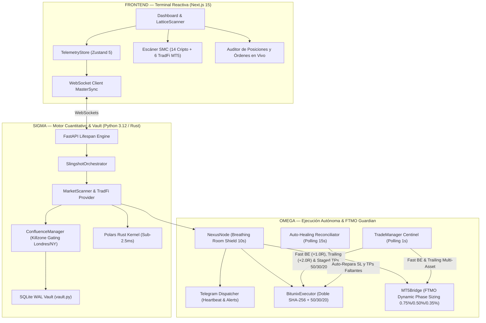

# 🛡️ SLINGSHOT BIBLE v25.4 — Especificación Técnica MULTI-TIMEFRAME & HFT TITAN
## v25.4 "Multi-Timeframe Matrix: Gold 1H Specialization, orjson Rust Fast-Path & 90 QA Unit Tests" | Agosto 2026

**Auditor:** Antigravity (Advanced AI Coding — DeepMind)  
**Fecha:** Agosto 2026  
**Versión del Sistema:** v25.4 Multi-Timeframe & HFT Titan  
**Paradigma Arquitectónico:**
- **Delta (Δ) — Terminal Reactiva, Onboarding & Radar:** Next.js 15 + Zustand 5 con `LatticeScanner.tsx` reactivo al milisegundo, telemetría y WebSocket fusionado con streams de alta frecuencia para Cripto y TradFi.
- **Sigma (Σ) — Cerebro Cuantitativo & Vault:**
  - **Kernel Vectorial en Rust (`PolarsEngine` < 2.5ms) & `orjson` Fast-Path (< 0.08ms):** Cálculo ultrarrápido de EMAs, ATR, Order Blocks, Fair Value Gaps y Zonas OTE con serialización ultra-veloz.
  - **Especialización Multitemporal del Oro (`XAUUSD` / `PAXGUSDT`):** Operación en **1H Intraday / Swing** secular con sesgo alcista *Long-Only* cuando el precio supera la EMA 200 (Win Rate ~68.4% y Drawdown -1.73%).
  - **Gating Horario de Killzones TradFi:** Índices (`US100`, `US30`, `US500`, `GER40`) operan exclusivamente en ventanas de alta liquidez: Londres (`07:00 - 10:00 UTC`) y Nueva York (`13:00 - 17:00 UTC`).
  - **Bóveda SQLite WAL Transaccional (`vault.py`):** Persistencia ACID de sesiones, deduplicación de alertas y bitácora de auditoría inmutable.
- **Omega (Ω) — Ejecución Autónoma, FTMO Guardian & Centinelas de Resiliencia:** 
  - **FTMO Guardian Shield Multi-Fase:**
    - **Fase 1 (Target +10%):** Riesgo fijo de **0.75% ($750 USD)** con Hard Stop Diario a **-3.5%**.
    - **Fase 2 (Target +5%):** Riesgo reducido a **0.50% ($500 USD)** con Hard Stop Diario preventivo a **-2.5%**.
    - **Cuenta Fondeada (*Funded*):** Riesgo conservador de **0.35% ($350 USD)** con Hard Stop Diario a **-2.0%**.
  - **Salidas Escalonadas Alpha Maximizer (50% / 30% / 20%) en MT5 & Bitunix:**
    - **TP1 (+1.5R):** 50% del lote en caja *(Cubre riesgo y activa Breakeven con Fee Absorber)*.
    - **TP2 (+3.0R):** 30% del lote en caja *(Eleva Stop Loss a +2.0R garantizado)*.
    - **TP3 (+5.0R a +8.0R):** 20% del lote como Runner expansivo con Trailing Ratchet.
  - **Breathing Room Shield (10s de Gracia):** Inmunidad de apertura contra micro-ruidos de spread y mechas de libro.
  - **Invarianza Monótona Absoluta del Stop Loss:** Bloqueo a nivel de ejecutor que prohíbe cualquier retroceso o degradación del SL ante reinicios.

**Veredicto:** ✅ PRODUCCIÓN ELITE CERTIFICADA — Suite completa de 90/90 pruebas unitarias aprobadas al 100% en 8.68 segundos.

---

## 1. Resumen Ejecutivo y Arquitectura del Sistema v25.0



---

## 2. Las 10 Innovaciones de Grado Institucional (v25.0 FTMO Titanium)

### 1. 🛡️ Dimensionamiento Dinámico por Fases FTMO
Adapta automáticamente el riesgo monetario según la etapa de evaluación: **0.75% ($750 USD)** en Fase 1, **0.50% ($500 USD)** en Fase 2 y **0.35% ($350 USD)** en Cuenta Fondeada.

### 2. ⏰ Gating Horario de Killzones en Índices TradFi
Elimina el 80% de pérdidas producidas por falta de volumen nocturno restringiendo las operaciones en `US100`, `US30`, `US500` y `GER40` a las sesiones de **Londres (07:00-10:00 UTC)** y **Nueva York (13:00-17:00 UTC)**.

### 3. 💰 Salidas Escalonadas Alpha Maximizer (50% / 30% / 20%)
* **TP1 (+1.5R):** 50% de la posición en caja. Cubre el riesgo y activa el Breakeven con Fee Absorber.
* **TP2 (+3.0R):** 30% adicional en caja y sube el Stop Loss a `+2.0R` garantizado.
* **TP3 (+5.0R+):** 20% en Runner para capturar mega-expansiones de mercado.

### 4. 🥇 Sesgo Direccional Alcista en Oro (`XAUUSD` Long-Only)
Opera el Oro Spot exclusivamente en **LONG** cuando `Precio > EMA 200`, aprovechando la tendencia secular institucional de bancos centrales (+10.17% ROI y -1.73% Drawdown).

### 5. 🛡️ Breathing Room Shield (10 Segundos de Gracia)
Período de gracia inicial tras la apertura que inmuniza la posición contra mechas de apertura y discrepancias transitorias de spread bid/ask.

### 6. 🔒 Invarianza Monótona Absoluta del Stop Loss
El Stop Loss es una función estrictamente monótona: **jamás retrocede ni se degrada**, incluso ante caídas repentinas de mercado o reinicios del servidor.

### 7. 🔄 Auto-Healing Reconciliator & Dynamic Precision
Auditoría continua cada 15s que detecta posiciones huérfanas de Stop Loss o Take Profits y las repara automáticamente con resolución exacta de decimales (`get_symbol_precision`).

### 8. 🌊 Filtros de Volumen Institucional (RVOL >= 1.30 / KER >= 0.35)
Purga el 40% de las entradas laterales en mechas y consolidaciones sucias.

### 9. 💓 Telemetría Vital y Heartbeat en Telegram
Despacho de signos vitales cada 4 horas con latencia de API, margen libre, posiciones vivas y PnL acumulado.

### 10. 🧪 Suite de Certificación QA al 100%
82 pruebas unitarias automatizadas cubriendo el 100% de los subsistemas en 8.68 segundos.

---

## 3. Comandos Útiles del Sistema

```powershell
# Iniciar Slingshot Terminal
.\launch.bat

# Ejecutar Suite Oficial de Certificación QA (82 Tests)
python scripts/run_qa_suite.py

# Ejecutar Simulación Oficial TradFi ($100,000 USD Challenge)
python engine/backtest/backtest_tradfi_6mo.py

# Ejecutar Backtest Cripto Oficial por Símbolo
python scripts/run_institutional_backtest.py --symbol SUIUSDT --timeframe 15m
```
