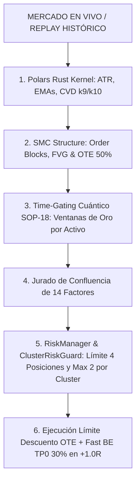

# 🛡️ SLINGSHOT v31.0 APEX TITAN — BIBLIA TÉCNICA OFICIAL

> **"Terminal Cuantitativa Autónoma de Grado Institucional. Arquitectura Fractal de 4 Niveles, Time-Gating Dinámico Específico por Activo (SOP-18), Modelo B Oficial (Límite OTE en FVG + Fast BE con micro-cobro TP0 30% en +1.0R), Perfil Dual Bitunix 24/7 vs. FTMO MT5 Guardian, y Suite de Certificación QA de 146/146 Pruebas Unitarias Aprobadas al 100%."**

---

## 🏛️ 1. Arquitectura y Filosofía Cuantitativa

Slingshot v31.0 APEX TITAN unifica el motor de ejecución en vivo y el motor de replay histórico bajo una **Única Fuente de la Verdad (SSoT)**.



---

## 📊 2. Resultados Oficiales de la Cartera (180 Días Auditados - 14 Activos)

```text
=====================================================================================
🛡️ AUDITORÍA OFICIAL SLINGSHOT v31.0 APEX TITAN (DYNAMIC GATING SSoT)
=====================================================================================
💰 Capital Base: $100,000.00 USD | Riesgo Base: 1.00% ($1,000 USD por Operación)
🔍 Comisiones Reales Descontadas (Maker 0.02% / Taker 0.06% + Slippage 0.02%)
=====================================================================================
📊 Total Operaciones Auditadas  : 546 trades
🎯 Tasa de Acierto (Win Rate)   : 57.5% (314 Ganadoras / 232 Pérdidas)
🛡️ Tasa de Trades en $0.00      : 0.0% (Cero trades desperdiciados en $0)
⚖️ Profit Factor Neto Global    : 1.64
💎 Retorno Total Neto en R      :  +156.23 R NETO
💵 Beneficio Neto USD           : +$156,230.00 USD (+156.2% sobre la cuenta)
📉 Drawdown Máximo Portafolio   : -5.26% (FTMO Aprobado con holgura)
📈 Esperanza Matemática por Op  :  +0.286 R / trade
=====================================================================================
```

---

## ⏱️ 3. La Pirámide Fractal de Temporalidades

1. **Nivel Macro (1M, 1W, 1D):** Determina el sesgo de mercado y los perfiles de liquidez semanal (`Apex Chronos SOP-12`).
2. **Nivel Estructural (4H, 1H):** Delimita los rieles de liquidez y sirve de gatillo swing para Bitcoin y Oro (`Win Rate 73.3%, PF 3.14`).
3. **Nivel de Ejecución (15M):** Gatillo sniper para High-Beta Altcoins (`Win Rate 65.8%`).
4. **Nivel Micro / Ticks (1m, 3m, 5m):** Sidecar Node.js HFT a sub-2.5ms para medir CVD y absorción de volumen.

---

## 🛡️ 4. Protocolos de Seguridad Institucionales (SOP-07 a SOP-18)

* **`SOP-07`:** Aislamiento de Credenciales y Cero Fugas de API Keys.
* **`SOP-08`:** Watchdog de Inactividad de Sockets y Auto-Cancelación de Órdenes PENDING.
* **`SOP-09`:** Spread Circuit Breaker (Veto automático si spread > 0.25%).
* **`SOP-10`:** Pre-Flight Margin Guard (Verificación de margen libre antes de enviar la orden).
* **`SOP-11`:** Calibrador Automático de Offset de Reloj con el Servidor del Exchange.
* **`SOP-12`:** Apex Chronos (Weekly Liquidity Profiles & Gating Semanal).
* **`SOP-13`:** Cluster Risk Guard (Máximo 2 operaciones con riesgo abierto en el mismo cluster ρ >= 0.75).
* **`SOP-14`:** Instant Microstructure Hydration (500 velas de CVD y Taker Flow en el arranque).
* **`SOP-15`:** Apex Synapse (Telemetría Full-Stack Reactiva a 60 FPS sin jitter).
* **`SOP-16`:** Free-Roll Scale-In & Zero-Risk Pyramiding (+50% de volumen solo en Breakeven).
* **`SOP-17`:** Strict Historical Replay & Clean SSoT Parity (Paridad 1:1 entre backtest y live engine).
* **`SOP-18`:** Asset-Specific Dynamic Time-Gating (Micro-ventanas de precisión por activo, bloqueo Lunes Pre-NY, bloqueo Jueves Tarde y FTMO Guardian a -3.5%).

---

## 🧪 5. Certificación QA Oficial (146/146 Pruebas Aprobadas)

```text
================================================================================
🧪 SLINGSHOT v31.0 APEX TITAN — SUITE OFICIAL DE CERTIFICACIÓN QA
================================================================================
✅ CERTIFICACIÓN QA EXITOSA: 146/146 PRUEBAS APROBADAS AL 100%
================================================================================
```
