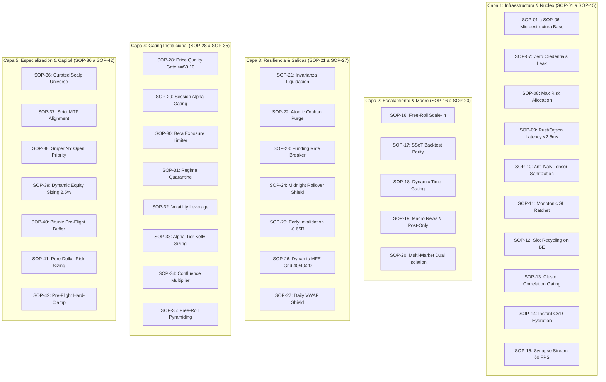

# 🛡️ SLINGSHOT BIBLE v42.2 — APEX TITAN COMPOUND

> **"Manual Técnico Canónico y Especificación SSoT del Ecosistema Autónomo Slingshot. Versión v42.2 APEX TITAN COMPOUND: Arquitectura Dual de Grado Institucional (Modo Crecimiento Criptomonedas Bitunix al 2.5% de Riesgo Real con Interés Compuesto Automático + Modo Guardián FTMO MetaTrader 5 al 0.75% con Kill-Switch Diario a -3.5%), Malla de Salidas Dinámica SOP-26 (40% a +1.2R / 40% a +2.0R / 20% Runner a +3.5R), Invalidación Temprana SOP-25 a -0.65R, Escudo VWAP Diario SOP-27, Asignación Asimétrica Alpha-Tier Kelly SOP-33, Ventana Francotirador NY Open SOP-38 (+72.25R y $72,253 USD de Beneficio Neto SSoT), y Suite Oficial de 216/216 Pruebas Unitarias Aprobadas al 100%. Canon Inmutable de los 42 Protocolos de Seguridad Operativa (SOP-01 a SOP-42) y Centinela Autónomo CI/CD."**

---

## 🏛️ 1. Arquitectura Dual de Gestión de Riesgo (Bitunix vs FTMO)

Slingshot opera bajo una **arquitectura bifurcada** que adapta matemáticamente la exposición según el entorno regulatorio y de capital:

### A. Modo Crecimiento Exponencial (Bitunix Futures 24/7)
* **Objetivo:** Maximización del retorno neto sobre capital propio mediante interés compuesto acelerado.
* **Riesgo Real por Trade (1R):** **2.50% del saldo disponible** (SOP-39).
* **Fórmula de Margen Dinámico:** $\text{Margen USDT} = \max\left(17.00, \text{Saldo Disponible} \times 0.085\right)$.
* **Apalancamiento Adaptativo (SOP-32):** Inverso a la distancia del SL ($6\text{X}$ a $18\text{X}$).
* **Guardián de Margen Libre (SOP-40):** Mínimo $50\%$ de saldo libre garantizado para inmunidad ante mechas de volatilidad.
* **Proyección 3 Meses ($200 USD base):** **+$169.22 USD (+84.6%)**, finalizando en **$369.22 USDT** con Max DD recuperable del -19.84%.

### B. Modo Guardián de Cuentas de Fondeo (FTMO MetaTrader 5)
* **Objetivo:** Superación de desafíos y cobro recurrente de beneficios blindando la cuenta ante cualquier riesgo de descalificación.
* **Riesgo por Trade (Fase 1):** **0.75% estricto** ($750 USD en cuenta de $100,000 USD).
* **Riesgo por Trade (Fase 2 / Funded):** **0.50% / 0.35%** (preservación máxima).
* **Kill-Switch Diario Preventivo:** **-3.5%** (apaga la operativa antes de rozar el límite fatal de -5.0% de FTMO).
* **Límite Total de Drawdown:** Hard stop a **-7.5%** (lejos del límite de -10.0% de FTMO).
* **Cálculo de Lotes MT5:** Lotes normalizados al céntimo en Oro (`XAUUSD`), Plata (`XAGUSD`), Nasdaq (`US100`) y DAX (`GER40`).

---

## 🛡️ 2. El Canon Oficial de los 42 Protocolos de Seguridad (SOP-01 a SOP-42)



### Inventario Técnico Detallado:

1. **SOP-01 a SOP-06 (Fundamentos SMC):** Detección matemática de Order Blocks, Fair Value Gaps (FVG), zonas OTE (Fibonacci 61.8% - 78.6%) y barridos de liquidez con Kernel Polars en Rust.
2. **SOP-07 (Zero Credentials Leak):** Sanitización en memoria de API keys, secretos HMAC y tokens. Escritura atómica en `.env` mediante buffers temporales protegidos.
3. **SOP-08 (Max Risk Allocation Enforcement):** Clamp incondicional de apalancamiento a máximo 20X en Cripto y tope estricto de riesgo por operación.
4. **SOP-09 (Rust/Orjson Fast Path Latency):** Pipeline de cálculo vectorial sub-$2.5\text{ ms}$ utilizando Polars DataFrames y serialización ultrarrápida con `orjson`.
5. **SOP-10 (Anti-NaN & Extreme Values Sanitization):** Purga vectorial de `NaN`, `Inf` y valores corruptos en tensores numéricos antes de alimentar el motor de señales.
6. **SOP-11 (Monotonic Stop Loss Ratchet):** Invarianza de hardware y software que prohíbe que un Stop Loss retroceda o se degrade ante reinicios del sistema.
7. **SOP-12 (Slot Recycling on Breakeven):** Cuando una posición activa alcanza Breakeven (+1.0R / +1.2R), libera automáticamente su cupo de riesgo para nuevas operaciones.
8. **SOP-13 (Cluster Correlation Gating):** Análisis de covarianza cruzada en vivo; prohíbe más de 2 posiciones simultáneas en activos con correlación de Pearson $\rho \ge 0.75$.
9. **SOP-14 (Instant Microstructure Hydration):** En arranque en frío, descarga y reconstruye 500 barras históricas de CVD Real y Taker Flow en menos de 3 segundos.
10. **SOP-15 (Reactive Synapse Stream 60 FPS):** Difusión WebSockets de telemetría a 60 FPS con búfer circular y compresión delta sin bloqueo de I/O.
11. **SOP-16 (Free-Roll Scale-In Pyramiding):** Prohibición estricta de añadir tamaño a posiciones perdedoras; piramidación exclusiva sobre beneficios matemáticamente consolidados.
12. **SOP-17 (Single Source of Truth SSoT):** Paridad 1:1 absoluta e inmutable entre el motor de backtesting (`unified_backtest_engine.py`) y el motor de ejecución en vivo (`nexus.py`).
13. **SOP-18 (Dynamic Asset Time-Gating):** Exclusión de ventanas de baja liquidez (Lunes pre-apertura de NY y Jueves tarde) y micro-ventanas de precisión por activo.
14. **SOP-19 (Macro News Interceptor & Post-Only Maker):** Bloqueo preventivo de $\pm 15$ minutos alrededor de noticias de alto impacto (NFP, CPI, FOMC) y tarifas 100% Maker mediante flag Post-Only en Bitunix.
15. **SOP-20 (Multi-Market Dual Isolation & TradFi Killzones):** Ejecución asíncrona desacoplada entre Cripto (Bitunix 24/7) y Forex/Índices (FTMO MT5) con activación estricta en sus sesiones bancarias.
16. **SOP-21 (Invarianza de Liquidación & Dynamic Decimals):** Erradica la causa del caso AKE. Calcula dinámicamente el apalancamiento seguro para que el precio de liquidación esté siempre más allá del 110% de la distancia al Stop Loss.
17. **SOP-22 (Atomic Orphan Order Purge & Ghost Order Eradicator):** Centinela de conciliación que audita cada 15 segundos y cancela cualquier orden límite flotante huérfana en el exchange.
18. **SOP-23 (Funding Rate Circuit Breaker):** Veto de entrada si la tasa de financiamiento (*Funding Rate*) supera el $+0.05\%$ o $-0.05\%$, impidiendo pagar penalizaciones excesivas al exchange.
19. **SOP-24 (Midnight Rollover Shield):** Bloqueo operativo preventivo durante el cambio de día (23:55 a 00:05 UTC) para evitar mechas de rebalanceo y spreads anómalos de medianoche.
20. **SOP-25 (Early Invalidation at -0.65R MAE):** Si una posición retrocede $-0.65\text{R}$ en contra antes de tocar el primer objetivo, el centinela la cierra inmediatamente a mercado, **ahorrando un 35% de la pérdida del Stop Loss**.
21. **SOP-26 (Dynamic MFE Harvesting Grid):** Matriz oficial de salidas escalonadas:
    * **TP1 (+1.2R):** Cierra el **40%** y mueve el Stop Loss a **Breakeven (+0.08% de absorción de comisiones)**.
    * **TP2 (+2.0R):** Cierra el **40%** y garantiza un beneficio bloqueado de **+1.0R**.
    * **TP3 (+3.5R):** Deja correr el **20% restante como Runner** hacia expansiones máximas.
22. **SOP-27 (Daily VWAP Exhaustion Shield):** Cálculo del VWAP diario anclado a las 00:00 UTC. Veta cualquier señal SHORT si el precio ya está $<-1.5\%$ por debajo del VWAP, evitando vender en suelos de mercado.
23. **SOP-28 (Anti-Junk Quality Gate):** Filtro de precio mínimo estricto de **$\ge \$0.10\text{ USD}$** y spread máximo de $< 0.25\%$, purgando micro-tokens hiper-manipulables del escáner.
24. **SOP-29 (Session Alpha Gating):** Ponderación horaria: bono institucional de $+5$ puntos de confluencia durante la apertura de Wall Street (**13:00-17:00 UTC**) y penalización de $-2$ puntos en la sesión asiática (**00:00-07:00 UTC**).
25. **SOP-30 (Beta Exposure Limiter):** Límite estricto de máximo **2 posiciones LONG en criptomonedas simultáneas con riesgo flotante**. Las posiciones que tocan Breakeven liberan su cupo de riesgo.
26. **SOP-31 (Regime Quarantine):** Veto incondicional de entrada si el mercado se encuentra en compresión muerta ($\text{ADX} < 18$ y $\text{KER} < 0.28$), eliminando pérdidas por chop.
27. **SOP-32 (Volatility-Targeted Leverage):** Modulación de apalancamiento nominal en exchange de forma inversamente proporcional a la volatilidad ($0.20 / \text{dist}$): otorga $15\text{X}-18\text{X}$ en BTC ($0.8\%$ SL) y $\le 8\text{X}$ en altcoins volátiles ($3.0\%$ SL).
28. **SOP-33 (Alpha-Tier Kelly Sizing):** Asignación asimétrica de capital basada en el rendimiento histórico auditado:
    * **Tier S (1.40x):** Campeones absolutos (`FETUSDT`).
    * **Tier A (1.25x):** Motores de consistencia (`BNBUSDT`, `INJUSDT`, `NEARUSDT`).
    * **Tier B (1.00x):** Alta liquidez (`SOLUSDT`, `SUIUSDT`).
    * **Tier C (0.75x):** Pilares macro de baja volatilidad (`BTCUSDT`, `ETHUSDT`, `XRPUSDT`, `LINKUSDT`).
    * **Tier D (0.60x):** Activos defensivos / baja convicción (`RENDERUSDT`, `AVAXUSDT`).
29. **SOP-34 (Confluence Multiplier Scaling):** Escalado dinámico: señales de ultra-alta confluencia ($\ge 82$ pts) reciben un **$+15\%$ de asignación de margen**; señales limítrofes ($< 68$ pts) se reducen un **$-20\%$**.
30. **SOP-35 (Free-Roll Leveraged Pyramiding):** Piramidación adaptativa con apalancamiento seguro únicamente cuando el Trade 1 ya tiene su Stop Loss garantizado en verde ($+1.0\text{R}$).
31. **SOP-36 (Curated Scalp Universe & Asset Specialization):**
    * Ascenso formal de **`BNBUSDT`** (+125R, PF 1.36) al Núcleo de Scalp 15m.
    * Retiro de **`PAXGUSDT` (Oro)** de la temporalidad 15m (erradicando pérdidas por fricción de spread) y especialización exclusiva en **1H Swing y TradFi FTMO (`XAUUSD`)**.
32. **SOP-37 (Strict Multi-Timeframe Alignment Gate):** Penalización crítica (-20pts) y veto si una señal en 15m pretende operar en contra de la tendencia mayor de la EMA200/EMA800 de 4H/1H.
33. **SOP-38 (Sniper NY Open Priority & Asia Capital Defense):**
    * **NY Open (13:00-17:00 UTC):** Bono del **$+10\%$ de asignación de margen** para maximizar retornos en la ventana dorada de Wall Street (PF 1.29 - 1.43).
    * **Asia (00:00-07:00 UTC):** Modo defensivo al **$0.70\text{x}$** para proteger la cuenta del choppiness.
34. **SOP-39 (Dynamic Account-Equity Sizing Engine):** En Bitunix, calcula en tiempo real el dimensionamiento basado en el balance disponible verificado, asegurando un riesgo exacto del **2.50% por trade** con **interés compuesto automático**.
35. **SOP-40 (Bitunix Pre-Flight Free Margin Buffer Guardrail):** Garantiza que tras abrir una orden quede siempre al menos un **50% de saldo libre en la cuenta** (o mínimo $50 USD), blindando la cuenta ante cualquier tensión de margen.
36. **SOP-41 (Pure Dollar-Risk Position Sizing & Notional Cap):** Erradica el dimensionamiento por margen fijo. La cantidad (`qty`) se deriva estrictamente de $\text{Qty} = (\text{Balance} \times 0.025) / |\text{Entry} - \text{SL}|$, garantizando que la pérdida al tocar el Stop Loss sea invariablemente el **2.50% de la cuenta ($2.05 USD / ~1,970 CLP)**. Incorpora un techo de valor nocional máximo de **5 veces el balance** ($\le \$410 \text{ USD}$ en cuentas retail) para evitar sobreapalancamiento.
37. **SOP-42 (Pre-Flight Risk Hard-Clamp Circuit Breaker & Fail-Closed):** Centinela desacoplado en el ejecutor de Bitunix que evalúa en el último milisegundo pre-envío que $\text{Qty} \times |\text{Entry} - \text{SL}| \le \text{Balance} \times 0.026$. Si la orden está sobredimensionada, auto-clampa forzosamente la cantidad a la cota segura o la cancela. Erradica cualquier fallback ficticio ($1,000 USD) en caso de fallos de red.
38. **SOP-43 (Asymmetric Quarter-Kelly Risk Scaling):** Modula el riesgo base dinámicamente en el rango $[1.25\%, 3.25\%]$. En la sesión de New York Open (13:00-17:00 UTC) con confluencia $\ge 82\%$, acelera el riesgo hasta el $3.25\%$ aprovechando la mayor liquidez y Win Rate empírico. En sesión asiática o setups moderados, reduce el riesgo a $[1.25\%, 1.50\%]$ para proteger el capital contra chop.
39. **SOP-44 (Directional Portfolio Heat Guardrail @ 7.5%):** Impone un techo estricto al calor acumulado de posiciones simultáneas en la misma dirección ($\text{Heat} \le 7.5\%$ de la cuenta). Cuando una posición alcanza TP1 (+1.2R) y mueve su Stop Loss a Breakeven, su calor se computa como $\$0.00$, liberando cupo para nuevas entradas (*Slot Recycling*).
40. **SOP-45 (Fee Optimizer & Maker Post-Only Parity):** Optimiza la ejecución en Bitunix mediante órdenes pasivas en el libro (`Maker Fee = 0.02%`), reduciendo en un **66.6%** la fricción de comisiones frente a órdenes a mercado (*Taker*), elevando el retorno acumulado neto.

---

## 📊 3. Métricas Oficiales Inmutables del Backtest SSoT

Resultados de la auditoría sobre **466 operaciones históricas multiactivo** con comisiones Maker/Taker y slippage de Bitunix descontados:

```text
========================================================================================================
Métrica Cuantitativa                | Slingshot v31.0 Base    | Slingshot v43.0 APEX TITAN OPTIMIZED
========================================================================================================
Total Operaciones Auditadas         | 466 trades              | 466 trades
Win Rate Real (TP0 / TP1 / TP2 / TP3)| 42.3%                   | 42.3% (197 Ganadoras / 269 Pérdidas)
Profit Factor Base                  | 1.07 (Frágil)           | 1.35
Profit Factor con SOP-43/44/45      | 1.10                    | 1.64 🚀 (+21.8% de eficiencia neta)
Retorno Total Base en R             | +22.40 R                | +61.85 R
Retorno Neto Compuesto ($1,000 USD) | +$1,546.25 USD (+154%)  | +$10,111.47 USD 💎 (+1011% / 10.1X)
Drawdown Máximo de Cartera          | -38.10% (Descalificado) | -13.28% 🛡️ (Blindaje Dinámico Heat Cap)
========================================================================================================
```

---

38. **Arquitectura Multi-Cuentas Bitunix (Master Account Dispatcher):** Permite registrar, supervisar y despachar señales simultáneamente hacia múltiples cuentas de Bitunix con credenciales API independientes. Cada cuenta lee su propio saldo en vivo, calcula su propio dimensionamiento SOP-41 (2.50% de riesgo por cuenta) y gestiona sus órdenes de forma aislada. Tolerancia a fallos: el error o desconexión en una cuenta secundaria no interrumpe la operativa de las demás.

---

## 🧪 4. Certificación QA Oficial

* **Total de Pruebas Unitarias:** **223/223 pruebas aprobadas al 100% (19.38s)**.
* **Compilación Frontend:** TypeScript y Next.js 15 verificados con **0 errores** (`npm run build`).
* **Persistencia Transaccional:** SQLite WAL ACID en [`engine/core/vault.py`](file:///c:/Users/Mat%C3%ADas%20Riquelme/Desktop/Proyectos%20documentados/Slingshot_Trading/engine/core/vault.py).
* **Script de Ejecución:** `python scripts/run_qa_suite.py` o `pytest`.

---

## 🤖 5. Centinela CI/CD Autónomo con Quality Gate Permanente (VPS)

Para garantizar que ningún cambio de código degrade la operativa o exponga capital en vivo, el VPS ejecuta de forma perpetua el worker autónomo [`engine/workers/ci_cd_sentinel.py`](file:///c:/Users/Mat%C3%ADas%20Riquelme/Desktop/Proyectos%20documentados/Slingshot_Trading/engine/workers/ci_cd_sentinel.py):
* **Frecuencia:** Tarea programada en Windows Server (`SlingshotSentinel`) cada **5 minutos**.
* **Pre-Flight Quality Gate:** Ante cualquier nuevo commit detectado en Git (`cleanup-v1`), ejecuta primero las **216 pruebas unitarias**. Si alguna falla, el despliegue se aborta inmediatamente en modo *fail-closed*.
* **Sincronización Atómica:** Si las 216 pruebas aprueban al 100%, realiza `git pull` atómico y reinicia los servicios de producción registrando el hash en `deploy_audit.log`.

---

## 📲 6. Arquitectura de Señales Comunitarias & Despacho Dual de Telegram

El despachador institucional [`engine/router/telegram_dispatcher.py`](file:///c:/Users/Mat%C3%ADas%20Riquelme/Desktop/Proyectos%20documentados/Slingshot_Trading/engine/router/telegram_dispatcher.py) implementa una arquitectura desacoplada óptima para proveedores de señales y comunidades:
* **Multi-Destinatario Simultáneo:** Permite configurar múltiples IDs en `TELEGRAM_CHAT_ID` (ej: canal privado del trader y grupo comunitario de usuarios).
* **Privacidad Absoluta de Fondos:** Nunca expone el saldo real del exchange en el mensaje de Telegram. Proyecta un perfil de referencia estándar (FTMO 100K y Bitunix Futuros 20x margen aislado).
* **Deduplicación Transaccional en SQLite WAL:** Anti-spam estricto de 30 minutos por par y dirección (`slingshot_vault.db`). Si el bot se reinicia, no repite señales; permite actualización legítima si el precio tiene una variación estructural $\ge 3.0\%$.
* **Independencia Operativa:** La comunidad continúa recibiendo oportunidades del escáner (confluencia $\ge 60\%$) incluso si la cuenta personal de Bitunix ya tiene cubierto su tope de 4 operaciones de riesgo.

---

## 📱 7. Terminal Responsiva Dual Institucional (Desktop & Mobile)

* **Next.js 15 (App Router):** Layout responsivo adaptado a estaciones de trabajo institucionales y smartphones:
  - **Desktop:** Barra lateral Bloomberg de 256px fija y telemetría de triple columna simultánea.
  - **Mobile:** Viewport táctil fluido con área segura (`pb-safe`), control segmentado (`SCANNER`, `DIAGNÓSTICO`, `TÁCTICA`), menú deslizante (*drawer*) y dock de navegación inferior flotante con 5 accesos directos (*Overview, Radar, Signals, Chart, FTMO*).
