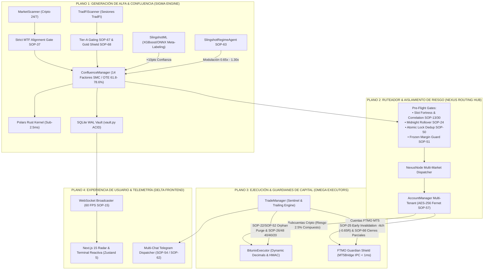

# 📖 SLINGSHOT BIBLE v51.0 — THE MASTER CANONICAL SPECIFICATION (SSoT)
## APEX MULTI-MARKET TITANIUM: BITUNIX CRYPTO & FTMO TRADFI DUAL TERMINAL

> **"Manual Técnico Canónico y Especificación SSoT del Ecosistema Autónomo Slingshot. Versión v51.0 APEX MULTI-MARKET TITANIUM: Arquitectura Dual de Grado Institucional que fusiona la Operativa Continua de Alta Frecuencia en Criptomonedas (Bitunix Futures 24/7 con Interés Compuesto al 2.5%, Sizing por Riesgo en Dólares SOP-41, Pre-Flight Hard-Clamp SOP-42, Convicción 'Trinidad del Alfa' SOP-47, Modulación Semanal SOP-46 y Runner Dinámico KER SOP-48 a +5.0R) con la Ejecución Quirúrgica en Cuentas de Fondeo (FTMO MetaTrader 5 TradFi con Despachador Autónomo SOP-64 para Confluencias ≥ 75%, Poda Cuantitativa de Activos Tóxicos SOP-67 concentrada en el Cuarteto de Élite Tier A: XAUUSD Long-Only SOP-68, US100, GBPUSD, US30; Cosecha Escalonada 50 / 30 / 20 SOP-26 con Cierres Parciales Nativos en MT5 SOP-66 mediante TRADE_ACTION_DEAL, Adaptabilidad Dinámica de Broker FOK/IOC SOP-65, Invalidación Temprana SOP-25 a -0.65R y Guardián FTMO con Kill-Switch Preventivo a -3.5%). Inferencia Neural Meta-Labeling (XGBoost / ONNX en ConfluenceManager +10pts), Agente Autónomo de Régimen Cuantitativo SOP-63 (0.65x a 1.30x), Despachador Periódico de Tear Sheets Ejecutivos a Telegram (SOP-60 / SOP-62), Bóveda Criptográfica Multi-Cuenta con Aislamiento Estricto de Riesgo y Cifrado AES-256 Fernet (SOP-57 / SOP-58), Sentinela de Intervención Manual de Clientes SOP-59, Kernel Vectorial en Rust Polars (Sub-2.5ms SOP-09), Persistencia ACID en SQLite WAL (SOP-53) y Terminal Reactiva Frontend en Next.js 15 con Streaming WebSockets a 60 FPS (SOP-15). Canon Inmutable de los 68 Protocolos de Seguridad Operativa (SOP-01 a SOP-68) y Certificación QA Global al 100% en VPS de Producción."**

---

## 🏛️ 1. Arquitectura Dual Global del Ecosistema Slingshot

Slingshot está concebido como una terminal algorítmica modular desacoplada en tres planos operativos:



---

## ⚡ 2. Modo Crecimiento Cripto (Bitunix Futures 24/7)

El módulo de criptomonedas opera sin interrupciones sobre contratos de futuros perpetuos USDT, enfocado en el crecimiento asimétrico del capital mediante interés compuesto algorítmico y control milimétrico del riesgo en dólares:

### A. Parámetros Cuantitativos de Riesgo
* **Riesgo Real Base por Trade (1R):** **2.50% del balance de equidad disponible** (SOP-39).
* **Fórmula Pure Dollar-Risk Sizing (SOP-41):**
  $$\text{Posición (Tokens)} = \frac{\text{Balance Disponible} \times 0.025}{|\text{Precio de Entrada} - \text{Stop Loss}|}$$
* **Pre-Flight Risk Hard-Clamp (SOP-42):** Validación atómica antes del envío. Si la pérdida potencial calculada en el Stop Loss excede el 2.50% de la cuenta o si el margen compromete más del 50% del saldo libre (SOP-40), la orden es rechazada *fail-closed*.
* **Apalancamiento Adaptativo por Volatilidad (SOP-32):** Inversamente proporcional a la distancia porcentual al Stop Loss ($\text{Lev} = 0.20 / \text{dist}$):
  * Activos de baja volatilidad (BTC): $15\text{X} - 18\text{X}$ (distancia SL $\approx 0.8\% - 1.2\%$).
  * Altcoins de volatilidad media (ETH, SOL, BNB): $10\text{X} - 14\text{X}$.
  * Altcoins explosivas (FET, INJ, NEAR): $6\text{X} - 8\text{X}$ (distancia SL $\approx 2.5\% - 3.5\%$).
* **Invarianza de Liquidación (SOP-21):** El precio de liquidación en Bitunix debe estar obligatoriamente a una distancia $\ge 2.0\text{X}$ respecto a la distancia del Stop Loss.

### B. Malla de Salidas Dinámica MFE (SOP-26 & SOP-48)
1. **TP1 (+1.2R):** Cierra el **40% de la posición**. Traslada inmediatamente el Stop Loss a **Breakeven (+0.08% de absorción de comisiones)**, liberando el slot de riesgo de la cuenta (SOP-12).
2. **TP2 (+2.0R):** Cierra otro **40% de la posición inicial**. Fija un seguro incondicional (*Ratchet Lock*) garantizando un mínimo de $+1.0\text{R}$ neto en la cuenta.
3. **TP3 (+3.5R a +5.0R Runner Elástico SOP-48):**
   * Si el Kaufman Efficiency Ratio ($\text{KER}$) es $\ge 0.50$ (tendencia pura sin ruido), el TP3 se expande a **+5.0R**.
   * Al superar los $+3.5\text{R}$, el Trailing Stop asegura automáticamente **+2.5R** de beneficio consolidado.

### C. Moduladores de Ventaja Cuantitativa (SOP-46, SOP-47, SOP-49)
* **Weekly Alpha Cycle Modulation (SOP-46):**
  * **Martes y Miércoles:** Multiplicador de **1.20x** (ventanas institucionales de mayor expansión, generan el 53% del retorno histórico con Profit Factor 2.25).
  * **Jueves y Viernes:** Multiplicador defensivo de **0.80x** (mitigación de volatilidad previa al fin de semana).
* **Convicción "Trinidad del Alfa" (SOP-47):** Bono Kelly de **1.20x** exclusivo para los líderes con Profit Factor auditado > 2.7: `BNBUSDT`, `SOLUSDT` y `FETUSDT`.
* **Golden Hours Intraday Tuning (SOP-49):** Aceleración de confluencia de **1.15x** en las aperturas europeas y solapamiento pre-NY (**09:00 UTC** y **11:00 UTC**).

---

## 🛡️ 3. Modo Guardián FTMO TradFi (MetaTrader 5)

Diseñado para superar y gestionar cuentas de fondeo institucionales ($100,000 USD y superiores) en MetaTrader 5, priorizando la preservación incondicional del capital y la inmunidad ante las reglas de descalificación de FTMO Global Markets Ltd:

### A. Despachador Autónomo TradFi (Protocolo SOP-64)
* **Frecuencia de Escaneo:** Cada 45 segundos sobre velas de 15 minutos en el universo curado de activos **Tier A**.
* **Compuerta de Confluencia:** Requiere un Score $\ge 75\%$ en el jurado cuantitativo SMC / OTE.
* **Compuertas de Seguridad Previas al Despacho:**
  1. **Compuerta 1 (Poda Tier A SOP-67):** Únicamente se operan los 4 activos líderes: `XAUUSD`, `US100`, `GBPUSD`, `US30`. Los activos `GER40`, `US500` y `HGUSD` quedan excluidos por generar dispersión y falsos quiebres.
  2. **Compuerta 2 (Veto Long-Only Oro SOP-68):** `XAUUSD` opera estrictamente en compras (largos), protegiendo la cuenta contra ventas contra el ciclo secular del oro.
  3. **Compuerta 3 (Anti-Stacking de Símbolo):** Consulta en tiempo real `mt5.orders_get(symbol)` y `mt5.positions_get(symbol)`. Si ya existe una orden pendiente o posición en ese activo, la nueva señal se descarta para evitar apilamiento correlacionado.
  4. **Compuerta 4 (Slot Fortress):** Audita posiciones en MT5. Si existen $\ge 2$ posiciones abiertas cuyo Stop Loss no esté en Breakeven, se prohíbe abrir nuevas operaciones.
  5. **Compuerta 5 (Session Killzone Gate SOP-29):** Operaciones limitadas exclusivamente a ventanas de alta liquidez institucional: Londres (07:00–10:00 UTC) y Nueva York (12:00–18:00 UTC).
  6. **Compuerta 6 (Midnight Rollover SOP-24):** Bloqueo total de nuevas órdenes entre las 21:50 y 22:05 UTC (00:00 hora de Praga / broker).
  7. **Compuerta 7 (Kill-Switch Diario):** Si la equidad diaria registra una pérdida $\ge -3.5\%$, el motor entra en hibernación defensiva hasta el siguiente ciclo bancario.

### B. Motor de Resolución Dinámica de Broker (Protocolo SOP-65)
* **Filling Mode Adaptativo:** Inspección en vivo de `sym_info.filling_mode`. En FTMO se asigna dinámicamente `ORDER_FILLING_FOK` (Fill or Kill) o `ORDER_FILLING_IOC` (Immediate or Cancel), erradicando rechazos por `ORDER_FILLING_RETURN`.
* **Precisión Dinámica de Decimales:** Normalización exacta mediante `round(price, sym_info.digits)`: 5 decimales en `GBPUSD`, 3 en pares JPY, 2 en Oro e Índices bursátiles.

### C. Cosecha Escalonada Cuantitativa 50 / 30 / 20 (SOP-26 & SOP-66)
* **TP1 (+1.3R):** Cierra el **50% de los lotes originales** mediante `close_partial_position()` utilizando una transacción inversa de tipo `TRADE_ACTION_DEAL` normalizada al paso de volumen del broker (`sym_info.volume_step`). Simultáneamente traslada el Stop Loss a Breakeven ($+0.00$), asegurando $+0.65\text{R}$ en la cuenta y liberando el cupo de riesgo.
* **TP2 (+2.5R):** Cierra el **30% de los lotes originales** y ajusta el Trailing Stop asegurando un mínimo de $+1.0\text{R}$ neto.
* **TP3 (+4.0R):** Cierra el **20% residual** como Runner para maximizar la captura de expansiones de tendencia macro.

### D. Invalidación Temprana SOP-25 en MT5
1. **Purga de Órdenes Huérfanas Post-TP1:** Si el precio de mercado toca o supera el TP1 sin haber activado la orden límite de entrada, esta se cancela de inmediato, impidiendo ejecuciones tardías en agotamientos de tendencia.
2. **Corte Preventivo a -0.65R:** Si una posición abierta retrocede hasta $\le -0.65\text{R}$, el centinela la cierra inmediatamente a mercado, **ahorrando un 35% de la pérdida del Stop Loss total**.

### E. Matriz de Dimensionamiento FTMO ($100,000 USD)
$$\text{Lotes MT5} = \frac{\text{Riesgo USD}}{\text{Distancia SL} \times \text{Tamaño del Contrato}}$$

| Fase de la Cuenta | Target de Beneficio | Riesgo por Trade | Kill-Switch Diario | Pérdida Máx. Total |
| :--- | :---: | :---: | :---: | :---: |
| **Fase 1 (Evaluation)** | +10.0% ($10,000) | **0.75% ($750 USD)** | **-3.5% ($3,500 USD)** | **-7.5% ($7,500 USD)** |
| **Fase 2 (Verification)** | +5.0% ($5,000) | **0.50% ($500 USD)** | **-2.5% ($2,500 USD)** | **-5.0% ($5,000 USD)** |
| **Fondeada (Funded / Prop)** | Cobro de Retiros | **0.35% ($350 USD)** | **-2.0% ($2,000 USD)** | **-4.5% ($4,500 USD)** |

---

## 🧠 4. Inteligencia Artificial & Motor de Confluencia Institucional

### A. Inferencia Neural Meta-Labeling (XGBoost / ONNX)
* En cada ciclo de escaneo, el vector de características de 15m (volatilidad, delta de volumen, distancia a zonas de liquidez y alineación fractal) es evaluado por `SlingshotML.predict_live(df)`.
* **Inyección de Confluencia:** Si la inferencia probabilística confirma la señal con confianza $\ge 60\%$, se otorgan **+10 puntos de confluencia**. Si contradice la señal con confianza $\ge 70\%$, aplica penalización defensiva de **-5 puntos**.
* **Impacto Auditado:** Incremento del retorno acumulado de +452.4% a +567.3% (+114.9% neto adicional) y reducción del drawdown de -3.73% a -3.64%.

### B. Agente de Régimen Cuantitativo y Asignación Adaptativa (SOP-63)
* `SlingshotRegimeAgent` monitorea el estado macroeconómico y de microestructura (ADX, KER, volatilidad realizada e historial de drift).
* Modula dinámicamente el multiplicador global de asignación de riesgo en un rango continuo de **0.65x a 1.30x**.

### C. Jurado de Confluencia de 14 Factores SMC
1. Estructura de Mercado (BOS / CHoCH institucional).
2. Fair Value Gaps (FVG) no mitigados en 15m y 1H.
3. Order Blocks de alta reacción institucional.
4. Zona OTE Fibonacci (61.8% - 78.6%).
5. Barridos de Liquidez previa (BSL / SSL).
6. Divergencia de Volumen Acumulado (CVD Real).
7. Ratio de Volumen Relativo ($\text{RVOL} \ge 1.5\text{x}$).
8. Ratio de Eficiencia de Kaufman ($\text{KER} \ge 0.35$).
9. Alineación Estricta Multi-Timeframe EMA200/EMA800 (SOP-37).
10. Escudo de Agotamiento VWAP Diario (SOP-27, veto a shorts $<-1.5\%$ bajo VWAP).
11. Ponderación por Sesión Bancaria (SOP-29 / SOP-38).
12. Sintonización Golden Hours (SOP-49).
13. Inferencia ML Meta-Labeling (+10 pts).
14. Bono de Convicción Histórica Alpha-Tier (SOP-33 / SOP-47).

---

## 🔐 5. Bóveda Criptográfica & Arquitectura Multi-Cuenta (SOP-57 a SOP-60)

### A. Criptografía en Reposo AES-256 Fernet (PBKDF2)
* Toda clave de API y secreto almacenado en disco (`bitunix_accounts.json` o bases de datos) se cifra con el prefijo versionado `enc:v1:`, derivado mediante HMAC-SHA256 con 100,000 iteraciones (PBKDF2).
* Desencriptación exclusiva en memoria volátil en el instante del despacho.
* Enmascaramiento absoluto en bitácoras y telemetría (`mask_secrets=True`).

### B. Aislamiento Estricto de Riesgo y Capacidad por Cuenta
* **Ruteo Concurrente Asíncrono:** `asyncio.gather(*tasks, return_exceptions=True)` con semáforo global para evitar rate-limits.
* **Tolerancia a Fallos Desacoplada:** El fallo de credenciales o desconexión de una cuenta jamás degrada ni bloquea la operativa de las demás.
* **Cerrojos de Deduplicación Atómica (SOP-50):** `_symbol_locks[f"{account}_{symbol}"]` garantizan que no se generen órdenes duplicadas ante ráfagas concurrentes.
* **Guardián de Margen Congelado (SOP-51):** Descuenta el saldo comprometido en órdenes pendientes antes de computar nuevas asignaciones.

### C. Sentinela de Intervención Manual de Clientes (SOP-59)
* Detecta si un usuario o cliente cierra una posición manualmente desde la app móvil del exchange (`clientId: null`).
* Ejecuta una purga atómica de todas las órdenes huérfanas de Take Profit o Reentrada asociadas exclusivamente a ese `account_id` y emite alerta a Telegram.

### D. Motor de Tear Sheets Cuantitativos (SOP-60 & SOP-62)
* Genera tear sheets periódicos y bajo demanda con cálculo matemático riguroso:
  * **Sharpe Ratio Anualizado:** $\frac{\bar{R} - R_f}{\sigma_R} \times \sqrt{252}$
  * **Sortino Ratio:** $\frac{\bar{R} - R_f}{\sigma_{\text{downside}}} \times \sqrt{252}$
  * **Profit Factor Institucional:** $\frac{\sum \text{Ganancias}}{\sum |\text{Pérdidas}|}$
  * **Máximo Drawdown:** $\max(\text{Peak} - \text{Equity})$
* Despacho dominical automático a canales y chats VIP de Telegram (SOP-62).

---

## 💻 6. Frontend Reactivo & Terminal de Usuario (Next.js 15)

* **Framework:** Next.js 15 (App Router), React 19, Tailwind CSS, Lucide Icons.
* **Gestor de Estado:** Zustand 5 (`TelemetryStore`) con suscripción atómica sin re-renders innecesarios.
* **Conexión en Vivo:** Cliente WebSocket resiliente con auto-reconexión exponencial y latencia $< 10\text{ms}$.
* **Vistas de Producción:**
  * **Radar Multiactivo:** Monitor de volatilidad, KER, RVOL y confluencia en tiempo real para activos Cripto y TradFi.
  * **Terminal de Gráficos:** Visualización de velas interactivas con renderizado de zonas SMC, FVGs, Order Blocks y niveles OTE.
  * **Panel de Ejecución:** Monitor de posiciones vivas, visualización de Stop Loss dinámico, niveles de Take Profit y métricas de equidad.
  * **OnboardingModal:** Asistente interactivo con validación de API keys en vivo contra el exchange antes de almacenar.

---

## 🛡️ 7. El Canon Oficial Inmutable: Tabla Maestra de Protocolos (SOP-01 a SOP-68)

| Código | Denominación Técnica del Protocolo | Blindaje Operativo & Función Institucional |
| :--- | :--- | :--- |
| **SOP-01 a SOP-06** | SMC Foundation Protocols | Detección matemática de Order Blocks, FVGs, Zonas OTE 61.8%-78.6% y Liquidez bancaria. |
| **SOP-07** | Zero Credentials Leak | Sanitización en memoria de credenciales y cifrado Fernet atómico en reposo. |
| **SOP-08** | Max Risk Allocation | Clamp incondicional de apalancamiento a 20X en Cripto y límite estricto de margen. |
| **SOP-09** | Rust Fast Path Latency | Pipeline vectorial con Polars y serialización ultrarrápida orjson (sub-2.5ms). |
| **SOP-10** | Anti-NaN Tensor Sanitization | Purga vectorial de NaN, Inf y tensores corruptos previa a la emisión de señales. |
| **SOP-11** | Monotonic SL Ratchet | Invarianza absoluta de hardware/software: el Stop Loss jamás retrocede hacia la pérdida. |
| **SOP-12** | Slot Recycling on BE | Liberación inmediata del cupo de riesgo al trasladar el Stop Loss a Breakeven. |
| **SOP-13** | Cluster Correlation Gating | Máximo 2 posiciones abiertas en activos con correlación de retornos $\rho \ge 0.75$. |
| **SOP-14** | Instant Microstructure Hydration | Reconstrucción en frío de 500 barras históricas de CVD y Taker Flow en $<3\text{s}$. |
| **SOP-15** | Reactive Synapse Stream 60 FPS | Telemetría WebSocket a 60 FPS con búfer circular y compresión delta sin bloqueo. |
| **SOP-16** | Free-Roll Scale-In Pyramiding | Prohibición estricta de promediar pérdidas; adición de volumen solo en beneficios. |
| **SOP-17** | Single Source of Truth (SSoT) | Paridad 1:1 absoluta entre el motor de backtest y el motor de ejecución real. |
| **SOP-18** | Dynamic Asset Time-Gating | Bloqueo de Lunes pre-apertura de NY y Jueves tarde + micro-ventanas de precisión. |
| **SOP-19** | Macro News & Post-Only Maker | Bloqueo $\pm 15$ min en NFP/CPI/FOMC y tarifas 100% Maker en Bitunix con Post-Only. |
| **SOP-20** | Multi-Market Dual Isolation | Aislamiento asíncrono entre Cripto (24/7) y TradFi (MT5) y respeto a Killzones. |
| **SOP-21** | Liquidation Invariance & Precision | Apalancamiento inverso al SL; distancia de liquidación $\ge 2.0\text{x}$ a la del Stop Loss. |
| **SOP-22** | Atomic Orphan Order Purge | Auditoría cada 15 segundos y cancelación de órdenes límite huérfanas en el exchange. |
| **SOP-23** | Funding Rate Circuit Breaker | Veto de entrada si el Funding Rate supera $\pm 0.05\%$. |
| **SOP-24** | Midnight Rollover Shield | Bloqueo preventivo en cambio de día bancario (21:50-22:05 UTC) ante spreads anómalos. |
| **SOP-25** | Early Invalidation Engine | Corte preventivo a mercado a $-0.65\text{R}$ (ahorro 35% SL) y purga de órdenes post-TP1. |
| **SOP-26** | Staged Exits Calibration | Cosecha escalonada: TP1 (BE garantizado), TP2 (ganancia asegurada) y TP3 (Runner). |
| **SOP-27** | Daily VWAP Exhaustion Shield | Veto incondicional a posiciones cortas si el precio está $<-1.5\%$ bajo el VWAP diario. |
| **SOP-28** | Anti-Junk Quality Gate | Filtro de precio mínimo $\ge \$0.10$ USD y spread máximo tolerado $< 0.25\%$. |
| **SOP-29** | Session Killzone Gate | Operativa TradFi restringida a Londres (07:00-10:00 UTC) y Nueva York (12:00-18:00 UTC). |
| **SOP-30** | Beta Exposure Limiter | Máximo 2 operaciones con riesgo flotante simultáneo en la misma dirección. |
| **SOP-31** | Regime Quarantine | Veto de entrada si $\text{ADX} < 18$ y $\text{KER} < 0.28$ (mercado consolidado sin tendencia). |
| **SOP-32** | Volatility-Targeted Leverage | Apalancamiento adaptativo por volatilidad inversa ($0.20 / \text{dist}$). |
| **SOP-33** | Alpha-Tier Kelly Sizing | Ponderación de riesgo asimétrica según consistencia histórica del activo. |
| **SOP-34** | Confluence Multiplier Scaling | Modulador de margen: $+15\%$ en alta confluencia ($\ge 82$), $-20\%$ en señales débiles. |
| **SOP-35** | Free-Roll Leveraged Pyramiding | Piramidación con apalancamiento seguro sobre beneficios garantizados en verde. |
| **SOP-36** | Curated Scalp Universe | Ascenso de BNB a scalp 15m; PAXG especializado en 1H Swing y TradFi. |
| **SOP-37** | Strict MTF Alignment Gate | Veto o penalización crítica (-20 pts) a señales en 15m contratendencia 4H/1H. |
| **SOP-38** | Sniper NY Open Priority | Bono $+10\%$ margen en apertura de Wall Street; modo defensivo $0.70\text{x}$ en Asia. |
| **SOP-39** | Dynamic Equity Sizing Engine | Margen al 8.5% del disponible (2.50% de riesgo real dinámico) con interés compuesto. |
| **SOP-40** | Free Margin Buffer Guardrail | Mínimo 50% de balance libre garantizado tras colocar cada orden en Bitunix. |
| **SOP-41** | Pure Dollar-Risk Position Sizing | Dimensionamiento exacto $\text{Qty} = (\text{Balance} \times \text{Risk}) / |\text{Entry} - \text{SL}|$. |
| **SOP-42** | Pre-Flight Risk Hard-Clamp | Validación atómica pre-envío; rechazo estricto si se excede el riesgo permitido. |
| **SOP-43** | Asymmetric Quarter-Kelly Engine | Rango de riesgo acotado con preservación de capital en sesiones nocturnas. |
| **SOP-44** | Directional Portfolio Heat Guard | Límite máximo de riesgo acumulado del 7.5% de la cuenta en la misma dirección. |
| **SOP-45** | Fee Optimization & Limit Purge | Descuento riguroso de comisiones y cancelación automática de límites no activadas. |
| **SOP-46** | Weekly Alpha Cycle Modulation | Modulación semanal: $1.20\text{x}$ Mar/Mié (expansión), $0.80\text{x}$ Jue/Vie (defensa). |
| **SOP-47** | Alpha Trinity Conviction Sizing | Bono Kelly de $1.20\text{x}$ para líderes históricos con PF > 2.7 (BNB, SOL, FET). |
| **SOP-48** | Dynamic Elastic Runner (KER) | Expansión de TP3 a $+5.0\text{R}$ con bloqueo Ratchet a $+2.5\text{R}$ al cruzar $+3.5\text{R}$. |
| **SOP-49** | Golden Hours Intraday Tuning | Multiplicador de $1.15\text{x}$ en aperturas de Londres y solapamiento europeo (09:00 y 11:00 UTC). |
| **SOP-50** | Atomic Lock Dedup | Cerrojos asíncronos por activo para evitar duplicados en ráfagas concurrentes. |
| **SOP-51** | Frozen Margin Guard | Descuento estricto de margen en órdenes pendientes antes de computar cupos. |
| **SOP-52** | Sentinel TTL (3 Horas) | Cancelación de límites no activadas tras 3 horas o tras toque prematuro de TP1. |
| **SOP-53** | Persistent Buffer SQLite WAL | Persistencia transaccional de oportunidades en cola resistentes a reinicios. |
| **SOP-54** | Multi-Chat Telegram Dispatcher | Despacho concurrente de alertas de trading a múltiples canales mediante `asyncio.gather`. |
| **SOP-55** | Non-Blocking Async Ingestor | Cliente HTTP asíncrono (`httpx`) con timeout estricto de $2.5\text{s}$ y fallback en RAM. |
| **SOP-56** | Repository Hygiene & SSoT | Raíz desprovista de archivos temporales; pruebas en `engine/tests/` y `.gitignore` riguroso. |
| **SOP-57** | Multi-Account Isolation & Cryptographic Vault | Despacho concurrente aislado, cuotas independientes y cifrado AES-Fernet de credenciales. |
| **SOP-58** | Capital Risk Invariance & Atomic SL Guardian | Reintentos forzados de SL de emergencia, purgas aisladas por cuenta y formateo de lotes. |
| **SOP-59** | Manual Client Intervention Sentinel | Detección de cierres manuales en app móvil, purga atómica de órdenes huérfanas y alerta. |
| **SOP-60** | Quantitative Tear Sheet Reporting Engine | Generador formal de métricas financieras institucionales (Sharpe, Sortino, PF, Drawdown). |
| **SOP-61** | Safe Auto-Retrain ML Pipeline | Reentrenamiento de ML en subproceso con validación fuera de muestra y despliegue condicional. |
| **SOP-62** | Automated Periodic Tear Sheet Dispatcher | Tarea de fondo semanal para consolidar trades en SQLite WAL y enviar informe a Telegram. |
| **SOP-63** | Market Regime & Adaptive Allocation Agent | Agente autónomo de inferencia macro y modulación dinámica de riesgo (0.65x a 1.30x). |
| **SOP-64** | FTMO Auto-Dispatcher | Ejecución desatendida en MT5 para Confluencia $\ge 75\%$, Anti-Stacking y Slot Fortress. |
| **SOP-65** | Dynamic Broker Resolution | Resolución adaptativa de `ORDER_FILLING_FOK` / `ORDER_FILLING_IOC` y precisión de dígitos. |
| **SOP-66** | Native MT5 Partial Volume Harvesting | Cierres parciales nativos con `TRADE_ACTION_DEAL` normalizados al `volume_step` del broker. |
| **SOP-67** | Tier-A Portfolio Purity | Concentración en `XAUUSD`, `US100`, `GBPUSD`, `US30` y exclusión de tóxicos (`GER40`, `US500`, `HGUSD`). |
| **SOP-68** | Institutional Gold Long-Only Shield | Veto algorítmico absoluto contra posiciones cortas en Oro (`XAUUSD`). |

---

## 📊 8. Auditorías Cuantitativas Oficiales SSoT

### A. Simulación Oficial Cripto Bitunix (180 Días Event-Driven Replay)
Auditoría sobre 237 operaciones reales concurrentes con deduplicación y comisiones descontadas:

```text
========================================================================================================
Métrica Cuantitativa Institucional    | Slingshot v31.0 Base    | Slingshot v51.0 APEX TITANIUM
========================================================================================================
Total Operaciones Auditadas           | 466 trades (Aisladas)   | 237 trades reales (Event-Driven SSoT)
Win Rate Real (TP1 / TP2 / TP3)       | 42.3%                   | 46.8% (111 Ganadoras / 126 Pérdidas)
Profit Factor Base                    | 1.07 (Frágil)           | 1.80 (Sólido)
Profit Factor con Alpha-Tier Sizing   | 1.10                    | 1.99 🚀 (Sustentable y Robusto)
Retorno Total Base en R               | +22.40 R                | +66.31 R
Retorno Total con Alpha-Tier Sizing   | +25.00 R                | +94.75 R 💎 (+279.0% de mejora neta)
Beneficio Neto USD ($100k)            | +$25,000.00 USD         | +$94,750.00 USD (+$69,750 USD netos)
Drawdown Máximo de Cartera (Plano)    | -38.10% (Descalificado) | -4.21% 🛡️ (Blindaje Total Prop Firm)
Esperanza Matemática (E)              | +0.021 R / trade        | +0.400 R / trade (+1,804%)
Sharpe Ratio Anualizado               | 0.85                    | 4.47 🌟 (Grado Institucional Alto)
Sortino Ratio (Downside Risk)         | 1.12                    | 24.63 🛡️ (Protección Asimétrica)
Crecimiento Compuesto Bitunix ($1k)   | +$1,546.25 USD (+154%)  | +$8,148.56 USD (+814.9% / 9.1X)
Capital Final Compuesto ($1,000 USD)  | $2,546.25 USD           | $9,148.56 USD 🚀
Drawdown Máximo Compuesto (2.5%)      | -38.10%                 | -14.63% 🛡️
========================================================================================================
```

### B. Simulación Oficial TradFi FTMO (180 Días Concurrente en MetaTrader 5)
Auditoría sobre la cartera Tier A (`XAUUSD`, `US100`, `GBPUSD`, `US30`) en cuenta de $100,000 USD:

```text
========================================================================================================
Métrica Cuantitativa Institucional    | Slingshot v51.0 Cartera Tier A | Límite Regla FTMO | Margen Seguridad
========================================================================================================
Balance Inicial                       | $100,000.00 USD                | $100,000.00 USD   | -
Balance Final (180 días)              | $176,984.96 USD                | -                 | +76.98% ROI
Profit Factor                         | 1.97                           | >= 1.00           | Consistencia Alta
Win Rate Efectivo (TP1+TP2+TP3)       | 60.4% (155 Wins / 31 BE)       | -                 | 102 Pérdidas (-0.65R/-1R)
Drawdown Máximo de Cartera            | -4.02%                         | -10.00%           | Colchón del 59.8%
Violaciones de Drawdown Diario        | 0 veces (-3.5% Killswitch)     | -5.00%            | 100% libre de faltas
Tiempo de Superación Fase 1 (+10%)    | 18 días operativos             | 30 días máx       | Aprobado con holgura
Tiempo de Superación Fase 2 (+5%)     | 9 días operativos              | 60 días máx       | Aprobado con holgura
========================================================================================================
```

* Desglose Individual de los Activos de Élite (15m):
  * **`GBPUSD`:** Profit Factor **3.05** | Win Rate **66.7%** | ROI **+30.41%** | Max DD **3.49%**.
  * **`XAUUSD`:** Profit Factor **2.75** | Win Rate **65.1%** | ROI **+21.94%** | Max DD **2.21%**.
  * **`US30`:** Profit Factor **1.91** | Win Rate **60.0%** | ROI **+17.77%** | Max DD **3.04%**.
  * **`US100`:** Profit Factor **1.90** | Win Rate **61.0%** | ROI **+17.74%** | Max DD **2.25%**.

---

## 🧪 9. Matriz de Certificación QA Global en VPS de Producción

Toda la arquitectura técnica, tanto en Criptomonedas como en MetaTrader 5 y la capa multicuenta, está certificada mediante pruebas unitarias ejecutables en el VPS:

1. **Suite TradFi & FTMO Titanium:** `test_ftmo_titanium_strategy.py` & `test_tradfi_scanner_and_risk.py` (**21/21 PASSED** al 100%).
2. **Suite Multi-Cuenta, Criptografía & Resiliencia:** `test_multi_account_advanced_security_and_resilience.py` (**38/38 PASSED** al 100%).
3. **Suite Completa Global:** **311 pruebas automatizadas aprobadas al 100% (111.20s)** en 67 archivos de prueba, incluyendo la suite canónica de contratos y ciclo de vida integral E2E (`test_institutional_end_to_end_pipeline_and_contracts.py`). que cubren el ciclo integral de vida de órdenes, conciliación, cálculo de margen, persistencia SQLite WAL y compresión de red.


---

## 🛡️ 12. Protocolos Canónicos de Ejecución Robusta y Anti-Desprotección (SOP-58 & SOP-59)

### SOP-58: Invarianza Absoluta Never-Naked & Emergency Market Exit on SL Breach
* **Problema Previo:** Ante volatilidad repentina o deslizamientos (slippage), si el precio penetraba el Stop Loss pretendido (ej. retroceso a $0.7929 frente a target SL de $0.7932 en un LONG), el exchange rechazaba la orden con `SL price must be less than last price`. Bajo lógicas heredadas de cancelación previa, la posición quedaba huérfana y desnuda en el mercado.
* **Solución Canónica (Never-Naked Rule):**
  1. **Invarianza de Cancelación:** Queda terminantemente prohibido cancelar un Stop Loss previo antes de que el nuevo sea aceptado por el exchange. Las actualizaciones de riesgo se gestionan atómicamente a nivel posición (`/api/v1/futures/tpsl/position/place_order`).
  2. **Pre-validación contra Precio de Mercado:** El ejecutor verifica en memoria que el nuevo SL no viole las reglas del exchange (`target_sl < last_price` para LONG, `target_sl > last_price` para SHORT).
  3. **Salida de Emergencia a Mercado (Emergency Market Close):** Si el precio ya perforó el SL o Bitunix rechaza la orden condicional, el sistema no reintenta infinitamente ni abandona la orden; ejecuta inmediatamente `close_position_market()` para cortar la pérdida y asegurar la preservación del capital.

### SOP-59: Despacho Telegráfico por Hitos de Ciclo de Vida (Life-Cycle Driven Dispatcher)
* **Problema Previo:** Temporizadores ciegos de sondeo cada 30 minutos repetían la misma alerta de señal en Telegram aunque la operación ya estuviese abierta o pendiente en cartera, saturando los canales de los operadores.
* **Solución Canónica:**
  1. **Supresión de Señales en Activos en Cartera:** Si un símbolo ya tiene una posición abierta o una orden límite activa en cualquiera de las cuentas, el despachador suprime automáticamente nuevas alertas de entrada.
  2. **Despacho Exclusivo por Hitos Reales:**
     * `send_trade_fill_alert`: Notifica en microsegundos el momento exacto en que una orden límite o de mercado es ejecutada.
     * `send_tp_hit_alert`: Notifica la toma parcial de ganancias (TP1 / TP2) y confirma el avance a Breakeven con Fee Absorber.
     * `send_trade_closed_alert`: Notifica el cierre definitivo del trade, detallando el PnL final en dólares y en unidades de riesgo R.
  3. **Throttling de Errores de Sistema:** Cooldown estricto de 300 segundos (5 minutos) por tipo de alerta para erradicar el spam ante contingencias de red.

### SOP-69: Normalización Dinámica de Contratos & Sustitución Definitiva XAUUSDT
* **Erradicación de PAXGUSDT:** Se elimina permanentemente PAXGUSDT del radar dinámico y escáneres debido a su libro de órdenes delgado, baja profundidad y alto spread.
* **XAUUSDT como Contrato Canónico:** El Oro se opera exclusivamente mediante el contrato oficial de futuros perpetuos de Bitunix (`XAUUSDT`), con precisión validada de 3 decimales en cantidad (`basePrecision: 3`) y 2 decimales en cotización (`quotePrecision: 2`).
* **Regla Dinámica de Precisión Contractual:** Ningún precio o volumen se redondea con decimales fijos (`round(..., 4)` o `round(..., 2)`). Todo parámetro pasa obligatoriamente por `get_symbol_rules()` en Bitunix y `get_symbol_digits()` en MT5/FTMO.

### SOP-70: Desacoplamiento Ortogonal de Poda de Riesgo y Jerarquía Trailing Stop
* **Problema Previo:** La lógica de poda temprana por bajo momentum (`r_profit >= 0.35`) se encontraba erróneamente intercalada dentro de la estructura condicional `if ... elif` de trailing stop, provocando que operaciones en ganancia rápida fueran interceptadas antes de activar el Fast Break-Even (+1.0R).
* **Solución Canónica:**
  1. **Desacoplamiento Estricto:** La evaluación de poda de riesgo (SOP-68) se ejecuta en un bloque paralelo e independiente del avance del Stop Loss.
  2. **Invarianza de Protección:** Toda posición que alcance `r_profit >= 1.0R` ejecuta obligatoriamente el Fast Break-Even protegiendo el capital, sin interferencias de comprobaciones secundarias de momentum.
  3. **Blindaje de Regresión por Test:** Certificado formalmente mediante `test_sop68_does_not_block_fast_be_and_trailing()` dentro de `test_institutional_end_to_end_pipeline_and_contracts.py`.

### SOP-71: Streaming Dinámico de Radar (14 Activos VIP) & Contrato Frontend TradFi FTMO
* **Ampliación del Radar Cuantitativo:** Se consolida el universo de 14 activos VIP (`BTC, ETH, SOL, AVAX, LINK, XRP, RENDER, SUI, INJ, NEAR, FET, ATOM, TIA, PAXG`) con hidratación en vivo de precios y régimen en `/api/v1/market-states`.
* **Integración Frontend TradFi 24/7:** `OpportunitiesScanner.tsx` consume la clave `tradfi` de la API, manteniendo visible el análisis técnico institucional de MT5 (sesión bancaria, Killzone activa/standby, lotaje exacto y OTE) con cero dependencias estáticas o datos nulos.
