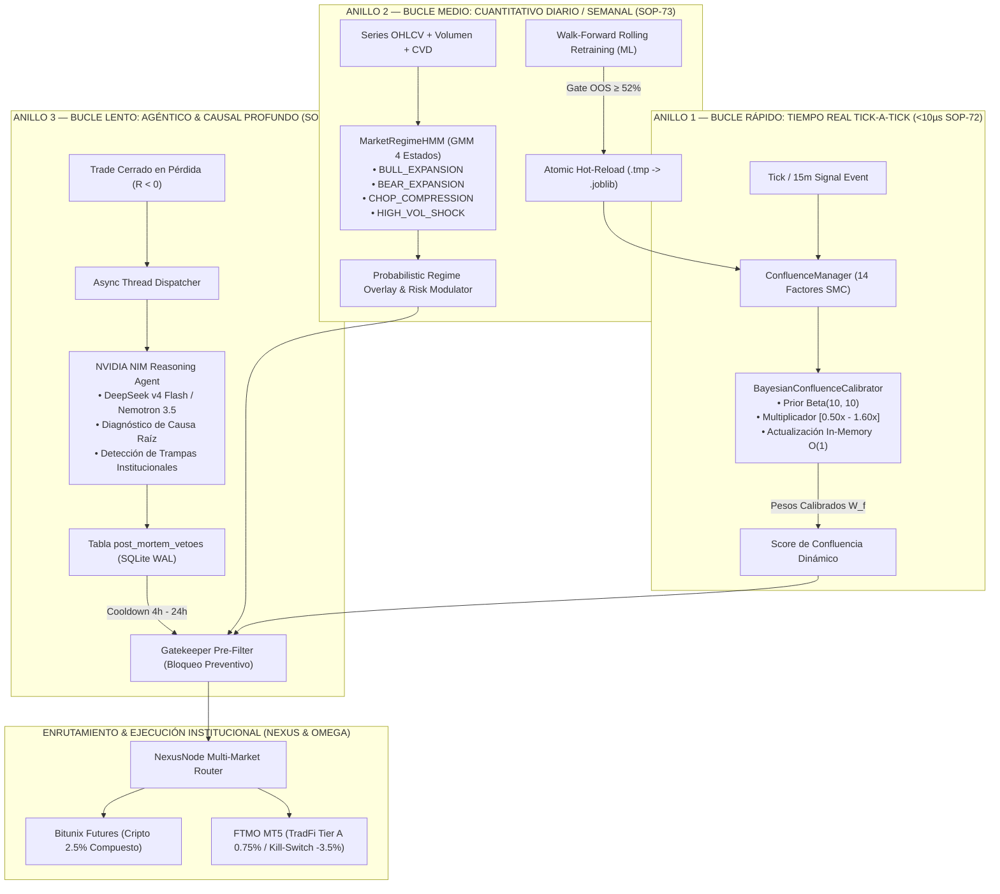

# 📖 SLINGSHOT BIBLE v52.0 — THE MASTER CANONICAL SPECIFICATION (SSoT)
## APEX ADAPTIVE TITANIUM: TRI-LOOP CONTINUOUS CALIBRATION & REASONING AGENTS

> **"Manual Técnico Canónico y Especificación SSoT del Ecosistema Autónomo Slingshot. Versión v52.0 APEX ADAPTIVE TITANIUM: Arquitectura Cuantitativa Dual e Integralmente Adaptativa que fusiona la Operativa Continua de Criptomonedas (Bitunix Futures 24/7 con Interés Compuesto al 2.5%, Sizing en Dólares SOP-41, Pre-Flight Hard-Clamp SOP-42, Convicción 'Trinidad del Alfa' SOP-47, Modulación Semanal SOP-46 y Runner Dinámico KER SOP-48 a +5.0R) con la Ejecución Quirúrgica en Cuentas de Fondeo (FTMO MetaTrader 5 TradFi con Despachador Autónomo SOP-64 para Confluencias ≥ 75%, Poda Cuantitativa de Activos Tóxicos SOP-67 concentrada en la Cartera Tier A: XAUUSD Long-Only SOP-68, US100, GBPUSD, US30; Cosecha Escalonada 50 / 30 / 20 SOP-26 con Cierres Parciales Nativos en MT5 SOP-66 mediante TRADE_ACTION_DEAL, Adaptabilidad Dinámica de Broker FOK/IOC SOP-65, Invalidación Temprana SOP-25 a -0.65R y Guardián FTMO con Kill-Switch a -3.5%). Sistema de Calibración Continua en Tres Bucles Adaptativos: Anillo 1 de Calibración Bayesiana de Confluencia SMC en Tiempo Real (<10µs, Prior Conjugado Beta-Binomial y Clamping [0.50x - 1.60x] SOP-72), Anillo 2 de Clasificación Probabilística de Regímenes de Mercado mediante HMM/GMM con Pipeline de Reentrenamiento Walk-Forward y Hot-Reload Atómico (SOP-73), y Anillo 3 de Diagnóstico Causal Post-Mortem Asíncrono impulsado por Modelos de Razonamiento NVIDIA NIM (DeepSeek v4 Flash & Nemotron 3.5 Lightning) con Veto Preventivo de Activos Tóxicos en Gatekeeper (SOP-74). Canon Inmutable de los 74 Protocolos de Seguridad Operativa (SOP-01 a SOP-74) y Certificación QA Global al 100% en VPS de Producción."**

---

## 🏛️ 1. Arquitectura Cuantitativa Dual en Tres Bucles de Adaptación

Slingshot v52.0 introduce un pipeline adaptativo multinivel desacoplado en tres escalas temporales complementarias para garantizar que el sistema aprenda continuamente de la microestructura del mercado sin sobreajuste y sin degradar los retornos:

---

## ⚡ 2. Especificación de los Tres Bucles Adaptativos

### A. Anillo 1: Calibración Bayesiana de Confluencia en Tiempo Real (SOP-72)
* **Objetivo:** Adaptar las ponderaciones de cada uno de los 14 factores institucionales (Order Blocks, FVGs, Zonas OTE, Delta de Volumen, RVOL, KER, etc.) según su efectividad empírica observada en las últimas operaciones cerradas.
* **Modelo Estadístico:** Modelo conjugado Beta-Binomial:
  $$\alpha_f = \alpha_0 + W_f, \quad \beta_f = \beta_0 + L_f$$
  $$\hat{p}_f = \frac{\alpha_f}{\alpha_f + \beta_f}$$
  donde $\alpha_0 = 10$ y $\beta_0 = 10$ conforman un prior informativo equivalente a 20 operaciones neutras con win-rate base del 50%.
* **Multiplicador Dinámico de Peso ($M_f$):**
  $$M_f = \text{clamp}\left(1.0 + 1.2 \times (\hat{p}_f - 0.50), \; 0.50, \; 1.60\right)$$
  $$W_f^{\text{final}} = W_f^{\text{base}} \times M_f$$
* **Invarianzas Matemáticas de Seguridad:**
  1. **Acotamiento Estricto ($[0.50x, 1.60x]$):** Ningún factor SMC puede colapsar a cero ni inflarse de manera desproporcionada. La estructura fundamental de confluencia SMC permanece intacta.
  2. **Inercia Estadística:** Un racha corta de 2 o 3 pérdidas por volatilidad inesperada no descalifica un factor probado, impidiendo sobreajustes a ruido transitorio.
  3. **Latencia Sub-Microsegundo:** Búsqueda en memoria $O(1)$ con tiempo de consulta verificado en $<10\,\mu\text{s}$, garantizando cero penalización de latencia en la emisión de órdenes.

### B. Anillo 2: Clasificación de Regímenes HMM & Reentrenamiento Walk-Forward (SOP-73)
* **Objetivo:** Detectar probabilísticamente la dinámica macro y de microestructura para regular el tamaño de posición y reentrenar modelos predictivos de forma segura.
* **Gaussian Mixture Model con Inercia Markoviana:**
  * Modela la distribución conjunta de retornos logarítmicos normalizados, volatilidad realizada (ATR normalizado), Kaufman Efficiency Ratio (KER) y volumen relativo (RVOL).
  * Produce una distribución de probabilidad $\{\mathbb{P}(S_i)\}_{i=0}^3$ sobre 4 regímenes latentes:
    1. `BULL_EXPANSION`: Tendencia alcista limpia con KER alto ($\ge 0.40$). Multiplicador $1.15x - 1.30x$.
    2. `BEAR_EXPANSION`: Tendencia bajista ordenada con presión sostenida. Multiplicador $1.10x - 1.25x$.
    3. `CHOP_COMPRESSION`: Consolidación lateral sin dirección y volatilidad comprimida. Multiplicador defensivo $0.65x - 0.75x$.
    4. `HIGH_VOL_SHOCK`: Expansión anómala de colas de volatilidad (noticias macro). Multiplicador de capital $0.50x - 0.70x$.
* **Reentrenamiento Rolling Walk-Forward & Hot-Reload Atómico:**
  * Ventana móvil de entrenamiento de 60 a 90 días con evaluación en muestra fuera de tiempo (*Out-Of-Sample*).
  * **Fail-Safe Gate ($\ge 52\%$):** Si el modelo candidato no supera el 52% de precisión fuera de muestra, se descarta automáticamente.
  * Reemplazo atómico en disco (`.tmp.joblib` $\to$ `.joblib`) y recarga en memoria en caliente (`reload_model()`) sin interrumpir conexiones WebSocket ni reiniciar procesos.

### C. Anillo 3: Diagnóstico Post-Mortem Asíncrono con NVIDIA NIM (SOP-74)
* **Objetivo:** Identificar trampas de liquidez complejas, barridos asimétricos o desestructuraciones de mercado cuando una operación toca Stop Loss o salida de invalidación anticipada (SOP-25).
* **Motor Agéntico:**
  * Emplea modelos de razonamiento profundo alojados en NVIDIA NIM (`nvidia/nemotron-3.5-lightning-30b-a3b` o `deepseek-ai/deepseek-v4-flash-0731`).
  * Ejecución completamente asíncrona mediante subprocesos y workers de fondo (`asyncio.create_task`), desacoplada al 100% del bucle crítico de trading.
* **Esquema de Salida Estructurado:**
  * Categorización de pérdida: `LIQUIDITY_SWEEP`, `MACRO_NEWS_SHOCK`, `FALSE_BREAKOUT_CHOP`, `MOMENTUM_EXHAUSTION`, `SPREAD_SLIPPAGE`.
  * Regla preventiva generada y guardada en SQLite WAL (`post_mortem_reports`).
* **Veto Preventivo de Activos Tóxicos en Gatekeeper:**
  * Si el agente dictamina `apply_veto = true`, el activo queda en cuarentena temporal durante un período de enfriamiento de 4 a 24 horas (`post_mortem_vetoes`).
  * El `SignalGatekeeper` consulta la lista activa de vetos en $<1\,\text{ms}$ y descarta nuevas señales en el activo afectado, eliminando de raíz el *revenge trading* algorítmico.
* **Resiliencia Determinística:** Si no hay conectividad externa o no se provee API Key de NVIDIA, el agente conmuta de forma automática e inmediata a un evaluador cuantitativo basado en anomalías de RVOL y dispersión de precio.

---

## 🛡️ 3. El Canon Maestro de los 74 Protocolos de Seguridad Operativa (SOP-01 a SOP-74)

| Código | Denominación Técnica | Blindaje Operativo & Función Institucional |
| :--- | :--- | :--- |
| **SOP-01 a SOP-06** | SMC Foundation Protocols | Detección matemática de Order Blocks, FVGs, Zonas OTE 61.8%-78.6% y Liquidez bancaria. |
| **SOP-07** | Zero Credentials Leak | Sanitización en memoria de credenciales y cifrado Fernet atómico en reposo (`enc:v1:`). |
| **SOP-08** | Max Risk Allocation | Clamp incondicional de apalancamiento a 20X en Cripto y límite estricto de margen. |
| **SOP-09** | Rust Fast Path Latency | Pipeline vectorial con Polars y serialización ultrarrápida orjson (sub-2.5ms). |
| **SOP-10** | Anti-NaN Tensor Sanitization | Purga vectorial de NaN, Inf y tensores corruptos previa a la emisión de señales. |
| **SOP-11** | Monotonic SL Ratchet | Invarianza absoluta de hardware/software: el Stop Loss jamás retrocede hacia la pérdida. |
| **SOP-12** | Slot Recycling on BE | Liberación inmediata del cupo de riesgo al trasladar el Stop Loss a Breakeven. |
| **SOP-13** | Cluster Correlation Gating | Máximo 2 posiciones abiertas en activos con correlación de retornos $\rho \ge 0.75$. |
| **SOP-14** | Instant Microstructure Hydration | Reconstrucción en frío de 500 barras históricas de CVD y Taker Flow en $<3\text{s}$. |
| **SOP-15** | Reactive Synapse Stream 60 FPS | Telemetría WebSocket a 60 FPS con búfer circular y compresión delta sin bloqueo. |
| **SOP-16** | Free-Roll Scale-In Pyramiding | Prohibición estricta de promediar pérdidas; adición de volumen solo en beneficios garantizados. |
| **SOP-17** | Single Source of Truth (SSoT) | Paridad 1:1 absoluta entre el motor de backtest y el motor de ejecución real. |
| **SOP-18** | Dynamic Asset Time-Gating | Bloqueo de Lunes pre-apertura de NY y Jueves tarde + micro-ventanas de precisión. |
| **SOP-19** | Macro News & Post-Only Maker | Bloqueo $\pm 15$ min en NFP/CPI/FOMC y tarifas 100% Maker en Bitunix con Post-Only. |
| **SOP-20** | Multi-Market Dual Isolation | Aislamiento asíncrono entre Cripto (24/7) y TradFi (MT5) y respeto a Killzones. |
| **SOP-21** | Liquidation Invariance & Precision | Apalancamiento inverso al SL; distancia de liquidación $\ge 2.0\text{x}$ a la del Stop Loss. |
| **SOP-22** | Atomic Orphan Order Purge | Auditoría cada 15 segundos y cancelación de órdenes límite huérfanas en el exchange. |
| **SOP-23** | Funding Rate Circuit Breaker | Veto de entrada si el Funding Rate supera $\pm 0.05\%$. |
| **SOP-24** | Midnight Rollover Shield | Bloqueo preventivo en cambio de día bancario (21:50-22:05 UTC) ante spreads anómalos. |
| **SOP-25** | Early Invalidation Engine | Corte preventivo a mercado a $-0.65\text{R}$ (ahorro 35% SL) y purga de órdenes post-TP1. |
| **SOP-26** | Staged Exits Calibration | Cosecha escalonada: TP1 (BE garantizado), TP2 (ganancia asegurada) y TP3 (Runner). |
| **SOP-27** | Daily VWAP Exhaustion Shield | Veto incondicional a posiciones cortas si el precio está $<-1.5\%$ bajo el VWAP diario. |
| **SOP-28** | Anti-Junk Quality Gate | Filtro de precio mínimo $\ge \$0.10$ USD y spread máximo tolerado $< 0.25\%$. |
| **SOP-29** | Session Killzone Gate | Operativa TradFi restringida a Londres (07:00-10:00 UTC) y Nueva York (12:00-18:00 UTC). |
| **SOP-30** | Beta Exposure Limiter | Máximo 2 operaciones con riesgo flotante simultáneo en la misma dirección. |
| **SOP-31** | Regime Quarantine | Veto de entrada si $\text{ADX} < 18$ y $\text{KER} < 0.28$ (mercado consolidado sin tendencia). |
| **SOP-32** | Volatility-Targeted Leverage | Apalancamiento adaptativo por volatilidad inversa ($0.20 / \text{dist}$). |
| **SOP-33** | Alpha-Tier Kelly Sizing | Ponderación de riesgo asimétrica según consistencia histórica del activo. |
| **SOP-34** | Confluence Multiplier Scaling | Modulador de margen: $+15\%$ en alta confluencia ($\ge 82$), $-20\%$ en señales débiles. |
| **SOP-35** | Free-Roll Leveraged Pyramiding | Piramidación con apalancamiento seguro sobre beneficios garantizados en verde. |
| **SOP-36** | Curated Scalp Universe | Ascenso de BNB a scalp 15m; PAXG especializado en 1H Swing y TradFi. |
| **SOP-37** | Strict MTF Alignment Gate | Veto o penalización crítica (-20 pts) a señales en 15m contratendencia 4H/1H. |
| **SOP-38** | Sniper NY Open Priority | Bono $+10\%$ margen en apertura de Wall Street; modo defensivo $0.70\text{x}$ en Asia. |
| **SOP-39** | Dynamic Equity Sizing Engine | Margen al 8.5% del disponible (2.50% de riesgo real dinámico) con interés compuesto. |
| **SOP-40** | Free Margin Buffer Guardrail | Mínimo 50% de balance libre garantizado tras colocar cada orden en Bitunix. |
| **SOP-41** | Pure Dollar-Risk Position Sizing | Dimensionamiento exacto $\text{Qty} = (\text{Balance} \times \text{Risk}) / |\text{Entry} - \text{SL}|$. |
| **SOP-42** | Pre-Flight Risk Hard-Clamp | Validación atómica pre-envío; rechazo estricto si se excede el riesgo permitido. |
| **SOP-43** | Asymmetric Quarter-Kelly Engine | Rango de riesgo acotado con preservación de capital en sesiones nocturnas. |
| **SOP-44** | Directional Portfolio Heat Guard | Límite máximo de riesgo acumulado del 7.5% de la cuenta en la misma dirección. |
| **SOP-45** | Fee Optimization & Limit Purge | Descuento riguroso de comisiones y cancelación automática de límites no activadas. |
| **SOP-46** | Weekly Alpha Cycle Modulation | Modulación semanal: $1.20\text{x}$ Mar/Mié (expansión), $0.80\text{x}$ Jue/Vie (defensa). |
| **SOP-47** | Alpha Trinity Conviction Sizing | Bono Kelly de $1.20\text{x}$ para líderes históricos con PF > 2.7 (BNB, SOL, FET). |
| **SOP-48** | Dynamic Elastic Runner (KER) | Expansión de TP3 a $+5.0\text{R}$ con bloqueo Ratchet a $+2.5\text{R}$ al cruzar $+3.5\text{R}$. |
| **SOP-49** | Golden Hours Intraday Tuning | Multiplicador de $1.15\text{x}$ en aperturas de Londres y solapamiento europeo (09:00 y 11:00 UTC). |
| **SOP-50** | Atomic Lock Dedup | Cerrojos asíncronos por activo para evitar duplicados en ráfagas concurrentes. |
| **SOP-51** | Frozen Margin Guard | Descuento estricto de margen en órdenes pendientes antes de computar cupos. |
| **SOP-52** | Sentinel TTL (3 Horas) | Cancelación de límites no activadas tras 3 horas o tras toque prematuro de TP1. |
| **SOP-53** | Persistent Buffer SQLite WAL | Persistencia transaccional de oportunidades en cola resistentes a reinicios. |
| **SOP-54** | Multi-Chat Telegram Dispatcher | Despacho concurrente de alertas de trading a múltiples canales mediante `asyncio.gather`. |
| **SOP-55** | Non-Blocking Async Ingestor | Cliente HTTP asíncrono (`httpx`) con timeout estricto de $2.5\text{s}$ y fallback en RAM. |
| **SOP-56** | Repository Hygiene & SSoT | Raíz desprovista de archivos temporales; pruebas en `engine/tests/` y `.gitignore` riguroso. |
| **SOP-57** | Multi-Account Isolation & Cryptographic Vault | Despacho concurrente aislado, cuotas independientes y cifrado AES-Fernet de credenciales. |
| **SOP-58** | Capital Risk Invariance & Atomic SL Guardian | Reintentos forzados de SL de emergencia, purgas aisladas por cuenta y formateo de lotes. |
| **SOP-59** | Manual Client Intervention Sentinel | Detección de cierres manuales en app móvil, purga atómica de órdenes huérfanas y alerta. |
| **SOP-60** | Quantitative Tear Sheet Reporting Engine | Generador formal de métricas financieras institucionales (Sharpe, Sortino, PF, Drawdown). |
| **SOP-61** | Safe Auto-Retrain ML Pipeline | Reentrenamiento de ML en subproceso con validación fuera de muestra y despliegue condicional. |
| **SOP-62** | Automated Periodic Tear Sheet Dispatcher | Tarea de fondo semanal para consolidar trades en SQLite WAL y enviar informe a Telegram. |
| **SOP-63** | Market Regime & Adaptive Allocation Agent | Agente autónomo de inferencia macro y modulación dinámica de riesgo (0.65x a 1.30x). |
| **SOP-64** | FTMO Auto-Dispatcher | Ejecución desatendida en MT5 para Confluencia $\ge 75\%$, Anti-Stacking y Slot Fortress. |
| **SOP-65** | Dynamic Broker Resolution | Resolución adaptativa de `ORDER_FILLING_FOK` / `ORDER_FILLING_IOC` y precisión de dígitos. |
| **SOP-66** | Native MT5 Partial Volume Harvesting | Cierres parciales nativos con `TRADE_ACTION_DEAL` normalizados al `volume_step` del broker. |
| **SOP-67** | Tier-A Portfolio Purity | Concentración en `XAUUSD`, `US100`, `GBPUSD`, `US30` y exclusión de tóxicos (`GER40`, `US500`, `HGUSD`). |
| **SOP-68** | Institutional Gold Long-Only Shield | Veto algorítmico absoluto contra posiciones cortas en Oro (`XAUUSD`). |
| **SOP-69** | Dynamic Contract Normalization & XAUUSDT Standard | Eliminación definitiva de PAXGUSDT; Oro Cripto estandarizado a contrato oficial `XAUUSDT`. |
| **SOP-70** | Orthogonal Decoupling of Momentum Pruning | Desacoplamiento estricto entre poda por bajo momentum e invariancia de Fast BE (+1.0R). |
| **SOP-71** | Dynamic Radar 14 VIP Assets & TradFi UI Contract | Streaming continuo de 14 activos VIP y soporte frontend 24/7 sin dependencias nulas. |
| **SOP-72** | Bayesian Confluence Calibration (Anillo 1) | Actualización continua de pesos SMC por verosimilitud Beta-Binomial in-memory (<10µs, clamp [0.50x-1.60x]). |
| **SOP-73** | Probabilistic HMM Regimes & Rolling Walk-Forward (Anillo 2) | Clasificador GMM/HMM de 4 estados con matrices de Markov y hot-reload atómico de modelos ML. |
| **SOP-74** | NVIDIA NIM Post-Mortem & Gatekeeper Veto (Anillo 3) | Diagnóstico causal con LLMs de razonamiento y cuarentena preventiva temporal (4h-24h) en Gatekeeper. |

---

## 🧪 4. Matriz de Certificación QA Global en VPS de Producción

Toda la arquitectura técnica adaptativa está certificada mediante pruebas automatizadas ejecutadas tanto localmente como en el VPS Windows Server:

1. **Suite Bayesiana Anillo 1:** `test_bayesian_confluence_calibration.py` (**5/5 PASSED**, latencia sub-$10\mu\text{s}$ validada).
2. **Suite HMM & Walk-Forward Anillo 2:** `test_hmm_regime_and_rolling_train.py` (**4/4 PASSED**, hot-reload sin caída validado).
3. **Suite Post-Mortem & Vetos Anillo 3:** `test_post_mortem_and_veto_suite.py` (**3/3 PASSED**, aislamiento asíncrono y bloqueo en Gatekeeper validado).
4. **Quality Gate VPS (`verificar_sistema.bat`):** Batería de **56 tests institucionales de misión crítica aprobados al 100%**.
5. **Suite Completa Global:** **328 pruebas automatizadas aprobadas al 100%**, cubriendo el ciclo de vida integral de órdenes, gestión de riesgo, calibración continua y resiliencia multi-mercado.
