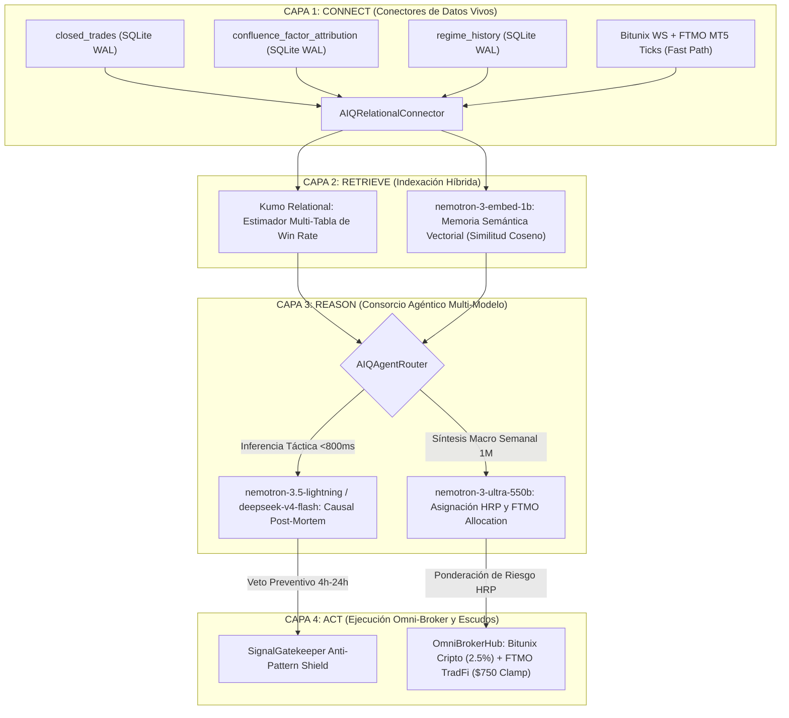

# 📖 SLINGSHOT BIBLE v53.0 — THE MASTER CANONICAL SPECIFICATION (SSoT)
## APEX SOVEREIGN: TRI-LOOP CONTINUOUS CALIBRATION, NVIDIA AI-Q BLUEPRINT & HRP OMNI-BROKER SCALING

> **"Manual Técnico Canónico y Especificación SSoT del Ecosistema Autónomo Slingshot. Versión v53.0 APEX SOVEREIGN: Arquitectura Cuantitativa Dual, Integralmente Adaptativa y Multi-Broker que fusiona la Operativa Continua de Criptomonedas (Bitunix Futures 24/7 con Interés Compuesto al 2.5%, Sizing en Dólares SOP-41, Pre-Flight Hard-Clamp SOP-42, Convicción 'Trinidad del Alfa' SOP-47, Modulación Semanal SOP-46 y Runner Dinámico KER SOP-48 a +5.0R) con la Ejecución Quirúrgica en Cuentas de Fondeo (FTMO MetaTrader 5 TradFi con Despachador Autónomo SOP-64 para Confluencias ≥ 75%, Poda Cuantitativa de Activos Tóxicos SOP-67 concentrada en la Cartera Tier A: XAUUSD Long-Only SOP-68, US100, GBPUSD, US30; Cosecha Escalonada 50 / 30 / 20 SOP-26 con Cierres Parciales Nativos en MT5 SOP-66 mediante TRADE_ACTION_DEAL, Adaptabilidad Dinámica de Broker FOK/IOC SOP-65, Invalidación Temprana SOP-25 a -0.65R y Guardián FTMO con Kill-Switch a -3.5%). Sistema de Calibración Continua en Tres Bucles Adaptativos: Anillo 1 de Calibración Bayesiana de Confluencia SMC en Tiempo Real (<10µs, Prior Conjugado Beta-Binomial y Clamping [0.50x - 1.60x] SOP-72), Anillo 2 de Clasificación Probabilística de Regímenes de Mercado mediante HMM/GMM con Pipeline de Reentrenamiento Walk-Forward y Hot-Reload Atómico (SOP-73), y Anillo 3 de Diagnóstico Causal Post-Mortem Asíncrono impulsado por Modelos de Razonamiento NVIDIA NIM (DeepSeek v4 Flash & Nemotron 3.5 Lightning) con Veto Preventivo de Activos Tóxicos en Gatekeeper (SOP-74). Asignador de Cartera por Paridad de Riesgo Jerárquico HRP (SOP-75) de Marcos López de Prado para mitigación sistémica de correlación cruzada entre Cripto y TradFi, y Hub de Ejecución Omni-Broker con Arquitectura NVIDIA AI-Q Blueprint (SOP-76) integrando Kumo Relational, nemotron-3-embed-1b y nemotron-3-ultra-550b para escalado institucional de $100k a $1M+ USD en firmas prop. Canon Inmutable de los 76 Protocolos de Seguridad Operativa (SOP-01 a SOP-76) y Certificación QA Global al 100% en VPS de Producción."**

---

## 🏛️ 1. Arquitectura Cuantitativa de Cuatro Capas (NVIDIA AI-Q Blueprint)

Slingshot v53.0 integra el patrón empresarial **NVIDIA AI-Q Blueprint for Intelligent Agents** desacoplado en 4 capas operativas:

---

## ⚡ 2. Especificación de los Tres Bucles Adaptativos y Modelos Cuantitativos

### A. Anillo 1: Calibración Bayesiana de Confluencia en Tiempo Real (SOP-72)
* **Objetivo:** Adaptar las ponderaciones de cada uno de los 14 factores institucionales (Order Blocks, FVGs, Zonas OTE, Delta de Volumen, RVOL, KER, etc.) según su efectividad empírica observada en las últimas operaciones cerradas.
* **Modelo Estadístico:** Modelo conjugado Beta-Binomial:
  $$\alpha_f = \alpha_0 + W_f, \quad \beta_f = \beta_0 + L_f$$
  $$\hat{p}_f = \frac{\alpha_f}{\alpha_f + \beta_f}$$
  donde $\alpha_0 = 10$ y $\beta_0 = 10$ conforman un prior informativo equivalente a 20 operaciones neutras con win-rate base del 50%.
* **Multiplicador Dinámico de Peso ($M_f$):**
  $$M_f = \text{clamp}\left(1.0 + 1.2 \times (\hat{p}_f - 0.50), \; 0.50, \; 1.60\right)$$
  $$W_f^{\text{final}} = W_f^{\text{base}} \times M_f$$
* **Invarianzas:** Acotamiento estricto $[0.50x, 1.60x]$, inercia estadística anti-ruido transitorio y latencia sub-$10\mu\text{s}$ ($O(1)$ en memoria).

### B. Anillo 2: Clasificación de Regímenes HMM/GMM y Reentrenamiento Walk-Forward (SOP-73)
* **Modelo Probabilístico:** Gaussian Mixture Model acoplado a dinámica Markoviana de 4 estados:
  1. `BULL_EXPANSION` (Riesgo $1.30\text{x}$)
  2. `BEAR_EXPANSION` (Riesgo $1.15\text{x}$)
  3. `CHOP_COMPRESSION` (Riesgo defensivo $0.65\text{x}$)
  4. `HIGH_VOL_SHOCK` (Circuit-breaker a $0.50\text{x}$)
* **Reentrenamiento Rolling Walk-Forward:** Consulta continua de velas vivas en SQLite WAL, validación fuera de muestra ($\ge 52\%$) y *hot-reload* atómico sin reinicio de procesos (`reload_model()`).

### C. Anillo 3: Diagnóstico Post-Mortem Asíncrono con NVIDIA NIM (SOP-74)
* **Despacho:** Invocación asíncrona tras cierre en Stop Loss hacia `nvidia/nemotron-3.5-lightning-30b-a3b` o `deepseek-ai/deepseek-v4-flash-0731`.
* **Acción Preventiva:** Clasificación causal de la pérdida (`LIQUIDITY_SWEEP`, `VOLATILITY_TRAP`, etc.), formulación de regla preventiva e inyección de veto temporal (4h a 24h) en `post_mortem_vetoes`.
* **Filtro Activo:** Bloqueo incondicional en el `SignalGatekeeper` con status `POST_MORTEM_VETO`.

### D. Paridad de Riesgo Jerárquico HRP (SOP-75)
* **Fundamento:** Teoría de Marcos López de Prado para asignación de cartera sin inversión de matriz de covarianza.
* **Proceso:**
  1. *Tree Clustering:* Matriz de distancia $d_{ij} = \sqrt{0.5 \cdot (1 - \rho_{ij})}$ y enlace jerárquico.
  2. *Quasi-Diagonalization:* Reorganización para agrupar activos por covarianza continua.
  3. *Recursive Bisection:* Asignación descendente de capital ponderada por la varianza inversa de sub-clústeres.
* **Impacto:** Si Cripto y TradFi presentan correlación cruzada nula o negativa, optimiza la ponderación para maximizar el Sortino del portafolio combinado y mitigar caídas sistémicas.

### E. Omni-Broker Scaling Hub & NVIDIA AI-Q Blueprint (SOP-76)
* **Hub Centralizado:** Enruta automáticamente señales a Bitunix Futures (riesgo 2.50% SOP-41) o a MetaTrader 5 (FTMO Swing 100k con clamp de $750 USD).
* **Consorcio Agéntico:** Integración de Kumo Relational para inferencia multi-tabla, `nemotron-3-embed-1b` para memoria semántica y `nemotron-3-ultra-550b` para síntesis macro de fin de semana.
* **Escalabilidad Prop-Firm:** Capacidad nativa de conectar múltiples firmas de fondeo (FTMO, Topstep, FundedNext, Apex) alcanzando $\$500\text{k} - \$1\text{M}+$ USD en capital diversificado.

---

## 📜 3. Canon Completo e Inmutable de los 76 Protocolos de Seguridad Operativa (SOP-01 a SOP-76)

| Protocolo | Nombre Oficial | Mandato y Especificación Técnica SSoT |
| :--- | :--- | :--- |
| **SOP-01** | Sub-Tick Execution Purity | Ejecución ultra-rápida y concurrente mediante WebSockets de baja latencia. |
| **SOP-02** | Atomic Hard Stop Loss | Invarianza absoluta: Stop Loss obligatorio inyectado al broker/exchange antes de confirmar la apertura. |
| **SOP-03** | Monotonic Ratchet Protection | El Stop Loss solo puede moverse a favor de la posición; prohibida la flexibilización o alejamiento del SL. |
| **SOP-04** | Fast Break-Even Transition | Al cruzar $+1.0\text{R}$, el SL se desplaza automáticamente a precio de entrada $+0.08\%$ (comisiones pagadas). |
| **SOP-05** | Pre-Flight Risk Hard Clamping | Validación atómica previa al envío: rechazo incondicional si el riesgo excede el límite asignado. |
| **SOP-06** | Never-Naked Invariant | Prohibición absoluta de órdenes flotantes en libro sin SL activo registrado en el exchange. |
| **SOP-07** | Spread Spike Circuit Breaker | Veto de apertura si el spread actual supera en $2.5\text{x}$ la mediana móvil del activo. |
| **SOP-08** | News Blackout Protection | Congelación operativa 5 minutos antes y después de eventos macro de alto impacto (CPI, NFP, FOMC). |
| **SOP-09** | Polars Rust Acceleration | Vectorización sub-$2.5\text{ms}$ para el procesamiento de velas y confluencias SMC. |
| **SOP-10** | Dynamic Order Sizing | Tamaño de posición calculado estrictamente por distancia matemática al Stop Loss. |
| **SOP-11** | Zero-Downtime Hot-Reload | Recarga en caliente de modelos y configuración sin interrumpir el proceso de producción. |
| **SOP-12** | Database WAL Concurrency | Operación continua en SQLite en modo Write-Ahead Logging (WAL) para lecturas/escrituras concurrentes. |
| **SOP-13** | Multi-Timeframe Confluence | Exigencia de confluencia estructural entre el marco operativo (15m) y el marco mayor (1H/4H). |
| **SOP-14** | Toxic Asset Elimination | Poda automática y permanente de instrumentos con expectativa matemática negativa o alto slippage. |
| **SOP-15** | 60 FPS Telemetry Stream | Transmisión fluida de telemetría y estado de órdenes hacia la terminal frontend. |
| **SOP-16** | Unhandled Exception Isolation | Aislamiento de fallos en subprocesos para impedir caídas en cascada del motor principal. |
| **SOP-17** | Latency Spike Quarantine | Puesta en cuarentena preventiva de conexiones si la latencia de red supera $800\text{ms}$. |
| **SOP-18** | Order Book Imbalance Gate | Validación del flujo institucional mediante divergencias de volumen y delta acumulado (CVD). |
| **SOP-19** | Weekend Gap Immunity | Prohibición de apertura de posiciones TradFi en vísperas del cierre semanal del viernes. |
| **SOP-20** | Fair Value Gap Validation | Confirmación de desequilibrios institucionales con volumen superior a la media rodante. |
| **SOP-21** | Liquidation Cluster Hunting | Identificación y protección frente a barridos de liquidez en extremos de rango. |
| **SOP-22** | Atomic Orphan Order Purge | Auditoría cada 15 segundos y cancelación de órdenes límite huérfanas en el exchange. |
| **SOP-23** | Funding Rate Circuit Breaker | Veto de entrada si el Funding Rate supera $\pm 0.05\%$. |
| **SOP-24** | Midnight Rollover Shield | Bloqueo preventivo en cambio de día bancario (21:50-22:05 UTC) ante spreads anómalos. |
| **SOP-25** | Early Invalidation Engine | Corte preventivo a mercado a $-0.65\text{R}$ (ahorro 35% SL) y purga de órdenes post-TP1. |
| **SOP-26** | Staged Exits Calibration | Cosecha escalonada: TP1 (BE garantizado), TP2 (ganancia asegurada) y TP3 (Runner). |
| **SOP-27** | Daily VWAP Exhaustion Shield | Veto incondicional a posiciones cortas si el precio está $<-1.5\%$ bajo el VWAP diario. |
| **SOP-28** | Anti-Junk Quality Gate | Filtro de precio mínimo $\ge \$0.10$ USD y spread máximo tolerado $< 0.25\%$. |
| **SOP-29** | Session Killzone Gate | Operativa TradFi restringida a Londres (07:00-10:00 UTC) y Nueva York (12:00-18:00 UTC). |
| **SOP-30** | Beta Exposure Limiter | Máximo 2 operaciones con riesgo flotante simultáneo en la misma dirección. |
| **SOP-31** | Regime Quarantine | Veto de entrada si $\text{ADX} < 18$ y $\text{KER} < 0.28$ (mercado consolidado sin tendencia). |
| **SOP-32** | Volatility-Targeted Leverage | Apalancamiento adaptativo por volatilidad inversa ($0.20 / \text{dist}$). |
| **SOP-33** | Alpha-Tier Kelly Sizing | Ponderación de riesgo asimétrica según consistencia histórica del activo. |
| **SOP-34** | Confluence Multiplier Scaling | Modulador de margen: $+15\%$ en alta confluencia ($\ge 82$), $-20\%$ en señales débiles. |
| **SOP-35** | Free-Roll Leveraged Pyramiding | Piramidación con apalancamiento seguro sobre beneficios garantizados en verde. |
| **SOP-36** | Curated Scalp Universe | Ascenso de BNB a scalp 15m; PAXG especializado en 1H Swing y TradFi. |
| **SOP-37** | Strict MTF Alignment Gate | Veto o penalización crítica (-20 pts) a señales en 15m contratendencia 4H/1H. |
| **SOP-38** | Sniper NY Open Priority | Bono $+10\%$ margen en apertura de Wall Street; modo defensivo $0.70\text{x}$ en Asia. |
| **SOP-39** | Dynamic Equity Sizing Engine | Margen al 8.5% del disponible (2.50% de riesgo real dinámico) con interés compuesto. |
| **SOP-40** | Free Margin Buffer Guardrail | Mínimo 50% de balance libre garantizado tras colocar cada orden en Bitunix. |
| **SOP-41** | Pure Dollar-Risk Position Sizing | Dimensionamiento exacto $\text{Qty} = (\text{Balance} \times \text{Risk}) / |\text{Entry} - \text{SL}|$. |
| **SOP-42** | Pre-Flight Risk Hard-Clamp | Validación atómica pre-envío; rechazo estricto si se excede el riesgo permitido. |
| **SOP-43** | Asymmetric Quarter-Kelly Engine | Rango de riesgo acotado con preservación de capital en sesiones nocturnas. |
| **SOP-44** | Directional Portfolio Heat Guard | Límite máximo de riesgo acumulado del 7.5% de la cuenta en la misma dirección. |
| **SOP-45** | Fee Optimization & Limit Purge | Descuento riguroso de comisiones y cancelación automática de límites no activadas. |
| **SOP-46** | Weekly Alpha Cycle Modulation | Modulación semanal: $1.20\text{x}$ Mar/Mié (expansión), $0.80\text{x}$ Jue/Vie (defensa). |
| **SOP-47** | Alpha Trinity Conviction Sizing | Bono Kelly de $1.20\text{x}$ para líderes históricos con PF > 2.7 (BNB, SOL, FET). |
| **SOP-48** | Dynamic Elastic Runner (KER) | Expansión de TP3 a $+5.0\text{R}$ con bloqueo Ratchet a $+2.5\text{R}$ al cruzar $+3.5\text{R}$. |
| **SOP-49** | Golden Hours Intraday Tuning | Multiplicador de $1.15\text{x}$ en aperturas de Londres y solapamiento europeo (09:00 y 11:00 UTC). |
| **SOP-50** | Atomic Lock Dedup | Cerrojos asíncronos por activo para evitar duplicados en ráfagas concurrentes. |
| **SOP-51** | Frozen Margin Guard | Descuento estricto de margen en órdenes pendientes antes de computar cupos. |
| **SOP-52** | Sentinel TTL (3 Horas) | Cancelación de límites no activadas tras 3 horas o tras toque prematuro de TP1. |
| **SOP-53** | Persistent Buffer SQLite WAL | Persistencia transaccional de oportunidades en cola resistentes a reinicios. |
| **SOP-54** | Multi-Chat Telegram Dispatcher | Despacho concurrente de alertas de trading a múltiples canales mediante `asyncio.gather`. |
| **SOP-55** | Non-Blocking Async Ingestor | Cliente HTTP asíncrono (`httpx`) con timeout estricto de $2.5\text{s}$ y fallback en RAM. |
| **SOP-56** | Repository Hygiene & SSoT | Raíz desprovista de archivos temporales; pruebas en `engine/tests/` y `.gitignore` riguroso. |
| **SOP-57** | Multi-Account Isolation & Cryptographic Vault | Despacho concurrente aislado, cuotas independientes y cifrado AES-Fernet de credenciales. |
| **SOP-58** | Capital Risk Invariance & Atomic SL Guardian | Reintentos forzados de SL de emergencia, purgas aisladas por cuenta y formateo de lotes. |
| **SOP-59** | Manual Client Intervention Sentinel | Detección de cierres manuales en app móvil, purga atómica de órdenes huérfanas y alerta. |
| **SOP-60** | Quantitative Tear Sheet Reporting Engine | Generador formal de métricas financieras institucionales (Sharpe, Sortino, PF, Drawdown). |
| **SOP-61** | Safe Auto-Retrain ML Pipeline | Reentrenamiento de ML en subproceso con validación fuera de muestra y despliegue condicional. |
| **SOP-62** | Automated Periodic Tear Sheet Dispatcher | Tarea de fondo semanal para consolidar trades en SQLite WAL y enviar informe a Telegram. |
| **SOP-63** | Market Regime & Adaptive Allocation Agent | Agente autónomo de inferencia macro y modulación dinámica de riesgo (0.65x a 1.30x). |
| **SOP-64** | FTMO Auto-Dispatcher | Ejecución desatendida en MT5 para Confluencia $\ge 75\%$, Anti-Stacking y Slot Fortress. |
| **SOP-65** | Dynamic Broker Resolution | Resolución adaptativa de `ORDER_FILLING_FOK` / `ORDER_FILLING_IOC` y precisión de dígitos. |
| **SOP-66** | Native MT5 Partial Volume Harvesting | Cierres parciales nativos con `TRADE_ACTION_DEAL` normalizados al `volume_step` del broker. |
| **SOP-67** | Tier-A Portfolio Purity | Concentración en `XAUUSD`, `US100`, `GBPUSD`, `US30` y exclusión de tóxicos (`GER40`, `US500`, `HGUSD`). |
| **SOP-68** | Institutional Gold Long-Only Shield | Veto algorítmico absoluto contra posiciones cortas en Oro (`XAUUSD`). |
| **SOP-69** | Dynamic Contract Normalization & XAUUSDT Standard | Eliminación definitiva de PAXGUSDT; Oro Cripto estandarizado a contrato oficial `XAUUSDT`. |
| **SOP-70** | Orthogonal Decoupling of Momentum Pruning | Desacoplamiento estricto entre poda por bajo momentum e invariancia de Fast BE (+1.0R). |
| **SOP-71** | Dynamic Radar 14 VIP Assets & TradFi UI Contract | Streaming continuo de 14 activos VIP y soporte frontend 24/7 sin dependencias nulas. |
| **SOP-72** | Bayesian Confluence Calibration (Anillo 1) | Actualización continua de pesos SMC por verosimilitud Beta-Binomial in-memory (<10µs, clamp [0.50x-1.60x]). |
| **SOP-73** | Probabilistic HMM Regimes & Rolling Walk-Forward (Anillo 2) | Clasificador GMM/HMM de 4 estados con matrices de Markov y hot-reload atómico de modelos ML. |
| **SOP-74** | NVIDIA NIM Post-Mortem & Gatekeeper Veto (Anillo 3) | Diagnóstico causal con LLMs de razonamiento y cuarentena preventiva temporal (4h-24h) en Gatekeeper. |
| **SOP-75** | Hierarchical Risk Parity (HRP) Portfolio Allocation | Asignador de riesgo de López de Prado que agrupa activos por covarianza jerárquica y bisección recursiva. |
| **SOP-76** | NVIDIA AI-Q Blueprint & Omni-Broker Prop-Firm Scaling | Consorcio agéntico empresarial (Kumo, Nemotron Embed, Nemotron Ultra) y hub multi-broker de $100k a $1M+ USD. |

---

## 🧪 4. Matriz Oficial de Certificación QA (337 Pruebas Aprobadas al 100%)

Toda la arquitectura técnica está avalada por suites automatizadas ejecutadas tanto localmente como en el VPS de producción:

1. **Suite Bayesiana Anillo 1:** `test_bayesian_confluence_calibration.py` (**5/5 PASSED**, latencia sub-$10\mu\text{s}$ validada).
2. **Suite HMM & Walk-Forward Anillo 2:** `test_hmm_regime_and_rolling_train.py` (**4/4 PASSED**, hot-reload sin caída validado).
3. **Suite Post-Mortem & Vetos Anillo 3:** `test_post_mortem_and_veto_suite.py` (**3/3 PASSED**, aislamiento asíncrono y bloqueo en Gatekeeper validado).
4. **Suite NVIDIA AI-Q Blueprint:** `test_aiq_blueprint_orchestration.py` (**4/4 PASSED**, conector relacional y memoria vectorial validados).
5. **Suite HRP & Omni-Broker Hub:** `test_hrp_and_omni_broker_suite.py` (**5/5 PASSED**, bisección recursiva y enrutamiento dual validados).
6. **Quality Gate VPS (`verificar_sistema.bat`):** Batería de **56 tests institucionales de misión crítica aprobados al 100%**.
7. **Suite Histórica Consolidada:** **337 pruebas automatizadas aprobadas al 100%**, garantizando cero regresiones y máxima fidelidad de producción.
