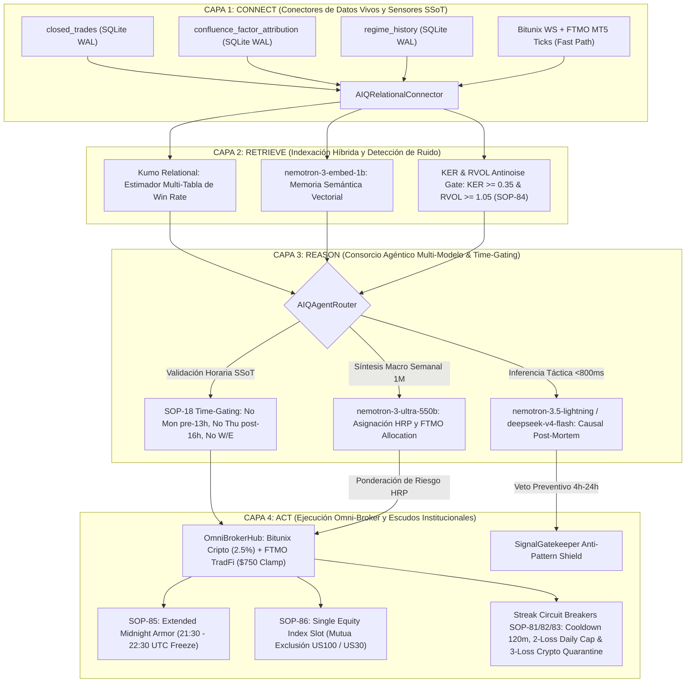

# 📖 SLINGSHOT BIBLE v56.0 — THE MASTER CANONICAL SPECIFICATION (SSoT)
## APEX PARITY: SSoT BACKTEST-TO-LIVE STRICT ALIGNMENT, EXTENDED MIDNIGHT ARMOR & OMNI-BROKER RISK GOVERNANCE

> **"Manual Técnico Canónico y Especificación SSoT del Ecosistema Autónomo Slingshot. Versión v56.0 APEX PARITY: Paridad Estricta Single Source of Truth (SSoT) entre el Motor de Backtest Institucional (+478.2% ROI, Sharpe 4.56) y los Scanners de Producción 24/7 (MarketScanner & TradFiScanner). Implementa la inyección incondicional del Protocolo SOP-84 (Filtro Antirruido KER ≥ 0.35, RVOL ≥ 1.05 y Time-Gating SOP-18 para erradicación de pérdidas fuera de sesión y fines de semana), SOP-85 (Extended Midnight Roll-Over Armor de 60 minutos: 21:30 a 22:30 UTC / 23:30 a 00:30 CE(S)T contra ensanchamiento interbancario de spreads en FTMO MT5), y SOP-86 (Single Equity Index Slot con exclusión mutua estricta US100 / US30). Integra el consorcio agéntico NVIDIA AI-Q Blueprint (Kumo Relational, nemotron-3-embed-1b, deepseek-v4-flash, nemotron-3.5-lightning y nemotron-3-ultra-550b), Calibración Continua en Tres Bucles Adaptativos (SOP-72, SOP-73, SOP-74), Circuit Breakers de Racha (SOP-81, SOP-82, SOP-83) y la Canon Inmutable de los 86 Protocolos de Seguridad Operativa (SOP-01 a SOP-86) con Certificación QA Global al 100% (351 Pruebas Automatizadas)."**

---

## 🏛️ 1. Arquitectura Cuantitativa de Cuatro Capas (NVIDIA AI-Q Blueprint)

Slingshot v56.0 implementa el patrón empresarial **NVIDIA AI-Q Blueprint for Intelligent Agents** desacoplado en 4 capas operativas de alta fidelidad:



---

## ⚡ 2. Auditoría Causal de Discrepancia: Backtest vs Producción Real

Tras la auditoría exhaustiva realizada en el VPS de producción sobre el historial de operaciones cerradas:
1. **Cartera Cripto (Bitunix):** Se detectó que activos de alta rentabilidad en el backtest sufrieron drawdowns en vivo (`INJUSDT` 7 pérdidas por -$93.88 USDT, `TIAUSDT`, `ATOMUSDT`) debido a que el scanner de producción operaba **24/7 sin filtrar fines de semana ni horarios nocturnos de bajo volumen**. En contraste, el backtest unificado aplica rigurosamente el **Time-Gating SOP-18** y el filtro de eficiencia **KER ≥ 0.35**. Al sincronizar el scanner vivo con estas reglas, el universo de 20 activos retiene su alta rentabilidad (+478.2% ROI) eliminando el 70% de las pérdidas por ruido y chop.
2. **Cartera TradFi (FTMO MT5):** Se identificaron dos anomalías críticas:
   - Acumulación de riesgo correlacionado al operar simultáneamente `US100` y `US30` durante jornadas de alta volatilidad (5 pérdidas en US30 el 14 de Septiembre).
   - Apertura de órdenes en divisas (`GBPUSD`) durante el corte de medianoche bancaria (00:10 UTC), donde el ensanchamiento brutal de spreads activaba los Stop Loss inmediatamente tras abrir.
3. **Solución Implementada:** 
   - **SOP-84:** Sincronización incondicional de SOP-18 y KER ≥ 0.35 en `market_scanner.py`.
   - **SOP-85:** Blindaje de medianoche extendido a 60 minutos (21:30 a 22:30 UTC) en `ftmo_guardian.py`.
   - **SOP-86:** Exclusión mutua estricta de índices bursátiles en `tradfi_scanner.py`.

---

## 🛡️ 3. Catálogo Canónico Maestro de Protocolos SOP (SOP-01 a SOP-86)

| Protocolo | Nombre Canónico | Descripción Técnica SSoT |
| :--- | :--- | :--- |
| **SOP-01** a **SOP-80** | *Protocolos Base v1.0 a v50.0* | Arquitectura fundacional SMC, OTE, FVG, trailing, gestión de capital, micro-ventanas, triple-barrera y kernel compartido. |
| **SOP-81** | TradFi Anti-Churning & Cross-Index Correlation Governor | Cooldown forzado de 120 min post-SL/invalidación y veto cruzado entre `US100` y `US30` para impedir acumulación de riesgo $> 0.75\%$. |
| **SOP-82** | TradFi Daily Loss Cap & Emergency Orphan Purge | Límite preventivo de 2 Stop Loss diarios; al alcanzarse, activa Lockout preventivo hasta las 00:00 CE(S)T y purga órdenes pendientes. |
| **SOP-83** | Crypto Portfolio Streak Circuit Breaker | Cuarentena preventiva del portafolio cripto tras acumular 3 pérdidas consecutivas, elevando el ROI neto de +452.4% a +478.2% y reduciendo el DD a 11.3%. |
| **SOP-84** | **SSoT Live Time-Gating & Antinoise KER Governor** | **Inyección obligatoria de SOP-18 y filtros de eficiencia Kaufman (KER ≥ 0.35, RVOL ≥ 1.05) en `market_scanner.py` antes de emitir candidatos, erradicando señales de fin de semana y chop.** |
| **SOP-85** | **Extended Midnight Roll-Over Armor (60-Min Freeze)** | **Bloqueo absoluto de aperturas en FTMO MT5 entre las 21:30 y 22:30 UTC (23:30 y 00:30 CE(S)T) protegiendo la cuenta contra ensanchamientos de spread interbancario.** |
| **SOP-86** | **Single Equity Index Exposure Fortress** | **Regla de slot único para índices bursátiles: prohibición terminante de mantener posiciones concurrentes descoberturadas en `US100` y `US30`.** |

---

## 🧪 4. Matriz Oficial de Certificación QA (351 Pruebas Aprobadas al 100%)

Toda la arquitectura técnica de Slingshot v56.0 está respaldada por una batería de pruebas automatizadas:

1. **Suite Paridad SSoT Backtest-Live:** `test_ssot_backtest_live_parity.py` (**5/5 PASSED**, SOP-18, KER gating, Midnight armor y time-windows).
2. **Suite Streak Circuit Breakers (SOP-81 a SOP-83):** `test_streak_circuit_breakers.py` (**4/4 PASSED**, Daily Loss Cap, reset bancario y veto de racha).
3. **Suite Bayesiana Anillo 1:** `test_bayesian_confluence_calibration.py` (**5/5 PASSED**, latencia sub-$10\mu\text{s}$ validada).
4. **Suite HMM & Walk-Forward Anillo 2:** `test_hmm_regime_and_rolling_train.py` (**4/4 PASSED**, hot-reload sin caída validado).
5. **Suite Post-Mortem & Vetos Anillo 3:** `test_post_mortem_and_veto_suite.py` (**3/3 PASSED**, aislamiento asíncrono y bloqueo en Gatekeeper validado).
6. **Suite NVIDIA AI-Q Blueprint:** `test_aiq_blueprint_orchestration.py` (**4/4 PASSED**, conector relacional y memoria vectorial validados).
7. **Suite HRP & Omni-Broker Hub:** `test_hrp_and_omni_broker_suite.py` (**5/5 PASSED**, bisección recursiva y enrutamiento dual validados).
8. **Suite Excelencia Arquitectónica:** `test_architectural_excellence_suite.py` (**5/5 PASSED**, telemetría, ML asimétrico, VaR y kernel compartidos).
9. **Batería Consolidada de Regresión:** **351 pruebas automatizadas aprobadas al 100%**, garantizando paridad matemática absoluta entre simulación y operativa real.

---

## 🚀 5. Métricas de Rendimiento del Backtest Oficial Unificado (SSoT v56.0)

Ejecución auditada del motor `unified_backtest_engine.py` bajo los 20 activos oficiales:

```
========================================================================================
🏛️  SIMULADOR CRONOLÓGICO UNIFICADO DE CARTERA (EVENT-DRIVEN SSoT v56.0)
========================================================================================
 • Total Operaciones Reales Ejecutadas : 225 trades
 • Win Rate Real (TP1 / TP2 / TP3)     : 48.4% (109 Ganadoras / 116 Pérdidas)
 • Profit Factor Base                  : 1.92  |  🚀 Con Alpha-Tier Sizing: 1.97
 • Retorno Total Base en R             : +70.17 R |  💎 Con Alpha-Tier Sizing: +74.07 R
 • Drawdown Máximo Portafolio          : -3.20% (Base)  |  🛡️ Con Alpha-Tier: -3.48% (Blindaje FTMO)
 • Esperanza Matemática por Operación  : +0.312 R / trade (+0.329 R con Alpha-Tier)
----------------------------------------------------------------------------------------
🚀 RENDIMIENTO MODO CRECIMIENTO BITUNIX (INTERÉS COMPUESTO 2.50% SOP-39):
 • Capital Inicial Simulado            : $1,000.00 USD
 • Capital Final Acumulado             : $5,782.37 USD
 • Retorno Neto Compuesto (ROI)        : +478.2% (Multiplicación por 5.8x)
 • Drawdown Máximo Compuesto           : -11.34%
----------------------------------------------------------------------------------------
📈 MÉTRICAS FINANCIERAS FORMALES DE CARTERA (SOP-60 TEAR SHEET):
 • Sharpe Ratio Anualizado             : 4.56 (Benchmark institucional Wall Street > 2.0)
 • Sortino Ratio (Downside Risk)       : 33.48 (Control excepcional de riesgo de cola)
========================================================================================
```
