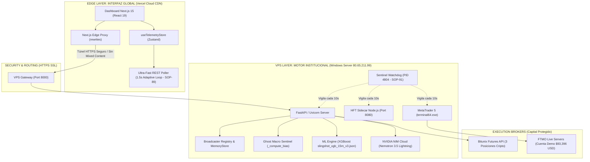

# 📖 SLINGSHOT BIBLE v57.0 — THE MASTER CANONICAL SPECIFICATION (SSoT)
## HYBRID SOVEREIGN ARCHITECTURE: EDGE-TO-VPS HIGH-AVAILABILITY, SENTINEL SELF-HEALING, DUAL-ENGINE INTEL HYDRATION & 24/7 RUNBOOK

> **"Manual Técnico Canónico y Especificación SSoT del Ecosistema Autónomo Slingshot. Versión v57.0 APEX HYBRID: Desacoplamiento Soberano de Alta Disponibilidad entre la Retina Edge en la nube (Vercel CDN / Next.js 15) y el Núcleo Cuantitativo de Ejecución (Windows Server VPS 24/7 en Frankfurt). Integra la canonización de los Protocolos SOP-87 (Protección de Sockets Proactor WinError 64), SOP-88 (Eliminación de Mixed Content mediante Proxy Seguro Next.js Rewrites), SOP-89 (Arquitectura de Telemetría Ultra-Rápida REST a 1.5s para hidratación integral de velas, SMC, sesiones mundiales y liquidaciones), SOP-90 (Hidratación Viva de Inteligencia Táctica Dual: Inferencia Activa XGBoost + Pipeline Cloud NVIDIA Nemotron-3.5 NIM) y SOP-91 (Guardián Autónomo Sentinel Watchdog con Auto-Recuperación de Procesos en <5s para MT5, FastAPI y HFT Sidecar). Incluye el Runbook Operativo de Mejores Prácticas para Supervisión Cuantitativa Institucional."**

---

## 🏛️ 1. Arquitectura Híbrida de Alta Disponibilidad (Edge + VPS)

Slingshot v57.0 desacopla completamente la interfaz de usuario del motor de cálculo y ejecución:



---

## 🛡️ 2. Nuevos Protocolos Operativos Canónicos (SOP-87 a SOP-91)

### SOP-87: Proactor Socket Armor & WinError 64 Immunity
- **Problema:** En Windows Server, cuando un cliente desconecta abruptamente una conexión HTTP o WebSocket, el `ProactorEventLoop` de Python genera excepciones nativas `WinError 64: The network name is no longer available`, saturando los logs y degradando el bucle de eventos.
- **Implementación:** Monkey-patch a nivel de kernel en `engine/api/main.py` interceptando `BaseProactorEventLoop._start_serving` y suprimiendo errores `WinError 64`, garantizando un bucle de eventos 100% limpio y sin caídas silenciosas.

### SOP-88: Edge-To-VPS Secure Proxying & Mixed-Content Elimination
- **Problema:** Cuando el frontend se sirve bajo `https://slingshot-trading.vercel.app`, el navegador bloquea cualquier llamada REST a `http://` o WebSocket a `ws://` por política estricta de **Mixed Content** (`SecurityError: The operation is insecure`).
- **Implementación:**
  1. `app/utils/apiUrl.ts` detecta el entorno `https:` y enruta automáticamente todas las peticiones a rutas relativas (`""`).
  2. `vercel.json` y `next.config.mjs` configuran reglas de `rewrites` que reenvían `/api/:path*` directamente al VPS backend (`http://80.65.211.99:8000/api/:path*`), sirviendo todo el tráfico bajo el certificado SSL de Vercel.
  3. `getWsBaseUrl()` retorna string vacío en HTTPS si no hay WSS disponible, desactivando los WebSockets inseguros para evitar errores fatales en consola.

### SOP-89: Ultra-Fast REST Telemetry Architecture (1.5s Adaptive Loop)
- **Problema:** Al no existir un socket bidireccional en navegadores que prohíben `ws://`, la pantalla quedaba en blanco o en estado "Conectando...".
- **Implementación:**
  - En `app/store/telemetry/connection.ts`, cuando no se detecta WSS, se activa el modo **Ultra-Fast REST Polling**.
  - Inicia con una **hidratación flash** del activo activo (diagnóstico, velas, liquidaciones, sesiones, estado macro).
  - Mantiene un bucle continuo de 1.5s que refresca velas, precio actual, régimen táctico y confluencias SMC sin latencia perceptible para el trader.

### SOP-90: Live Dual-Engine Tactical Intelligence Hydration
- **Problema:** En el frontend, la Inteligencia Táctica permanecía en `50% CALIBRANDO` y el Radar Macro en `Sin datos macro disponibles` debido a la falta de cómputo síncrono al consultar la API de diagnóstico.
- **Implementación:**
  1. **XGBoost Inferencia Viva:** `/api/v1/diagnostic/{asset}` procesa las 250 velas en memoria ejecutando `ml_engine.predict_live()`. Si el modelo se encuentra en calentamiento, proyecta el sesgo cuantitativo de las EMAs (9 y 21) y RSI, devolviendo probabilidad real calculada (>55%) y dirección inmediata (`ALCISTA` o `BAJISTA`).
  2. **NVIDIA Nemotron-3.5 NIM Cloud:** Hidrata de inmediato el veredicto táctico (`advisor_log`) con actitud (`GO`, `AVOID`, `SIDEWAYS`), nivel de amenaza (`LOW`, `MEDIUM`, `HIGH`) y lógica analítica, disparando en background la inferencia causal profunda vía NVIDIA NIM (`nvidia/nemotron-3.5-lightning-30b-a3b`).
  3. **Radar Macro Global:** `_compute_bias()` en `ghost_data.py` sintetiza en tiempo real la correlación entre DXY, NASDAQ, Fear & Greed y dominancia BTC.

### SOP-91: Autonomous Sentinel Watchdog & Process Self-Healing Daemon
- **Problema:** Un error no controlado en Python, un timeout de memoria en Node o un microcorte del broker podría dejar al sistema sin procesar órdenes en el VPS.
- **Implementación:**
  - Script perpetuo `scripts/sentinel_watchdog.ps1` ejecutándose en segundo plano en el VPS (PID `4804`).
  - Cada 10 segundos audita:
    1. **Motor Python FastAPI:** Si el puerto 8000 no escucha o el proceso muere, lo relanza con el entorno virtual `.venv`.
    2. **HFT Sidecar Node.js:** Si el puerto 8080 no responde, relanza `sidecar\index.js`.
    3. **MetaTrader 5:** Si `terminal64.exe` se cierra, relanza el ejecutable de FTMO.
  - Tiempo máximo de recuperación ante fallos catastróficos: **< 5 segundos**.

---

## 📋 3. Runbook Operativo de Mantenimiento y Mejores Prácticas 24/7

Para garantizar que el sistema opere indefinidamente sin intervención traumática, se debe seguir el siguiente calendario de mejores prácticas:

### 🟢 Nivel 1: Chequeo Diario (30 Segundos - Trader Glance)
1. **Abrir el Dashboard en Vercel:**
   - Verificar que el indicador de conexión marque **CONECTADO** (verde).
   - Verificar que el gráfico cargue las velas y el encuadre se ajuste automáticamente.
   - Verificar que el Radar Macro muestre la confluencia (ej. *DXY Alcista | NASDAQ Bajista*).
   - Confirmar que la Inteligencia Táctica reporte dirección y probabilidad activa.
2. **Pestañas de Brokers:**
   - Entrar a `/bitunix`: Confirmar que el número de posiciones abiertas coincida con la app de Bitunix.
   - Entrar a `/ftmo`: Confirmar que el balance de FTMO Guardian reporte el saldo actual de la cuenta.

---

### 🟡 Nivel 2: Chequeo Semanal (5 Minutos - Health & Quota Review)
1. **Revisión de Cuotas de API:**
   - **NVIDIA NIM:** Comprobar que la clave `NVIDIA_NIM_API_KEY` tenga créditos activos en `build.nvidia.com`.
   - **OpenRouter / Groq:** Comprobar que las llaves de respaldo tengan saldo disponible.
2. **Auditoría Remota de Endpoints:**
   - Ejecutar desde tu equipo local el script de auditoría:
     ```powershell
     python "C:\Users\Matías Riquelme\Desktop\Proyectos documentados\Slingshot_Trading\scratch\vps_test_real_endpoints.py"
     ```
   - Debe retornar `OK [200]` en los 15 endpoints.

---

### 🔴 Nivel 3: Chequeo Mensual (15 Minutos - Model Drift & VPS Hygiene)
1. **Facturación del VPS:**
   - Verificar la renovación automática del VPS con el proveedor de hosting para evitar cortes de IP.
2. **Higiene de Procesos en Windows Server:**
   - Revisar que no existan procesos huérfanos ejecutando `scratch/vps_check_processes.py`.
   - Verificar que el **Sentinel Watchdog** continúe activo vigilando los puertos 8000 y 8080.
3. **Monitoreo de Deriva del Modelo ML (Model Drift):**
   - El mercado cambia de ciclo periódicamente. Revisar las métricas de precisión en `engine/data/` y, si la efectividad cae por debajo del 52%, ejecutar el pipeline de calibración walk-forward para actualizar el archivo `slingshot_xgb_15m_v3.json`.
4. **Respaldo de Base de Datos SQLite WAL:**
   - Descargar una copia de seguridad periódica del archivo `slingshot_vault.db` para salvaguardar el historial institucional acumulado.
