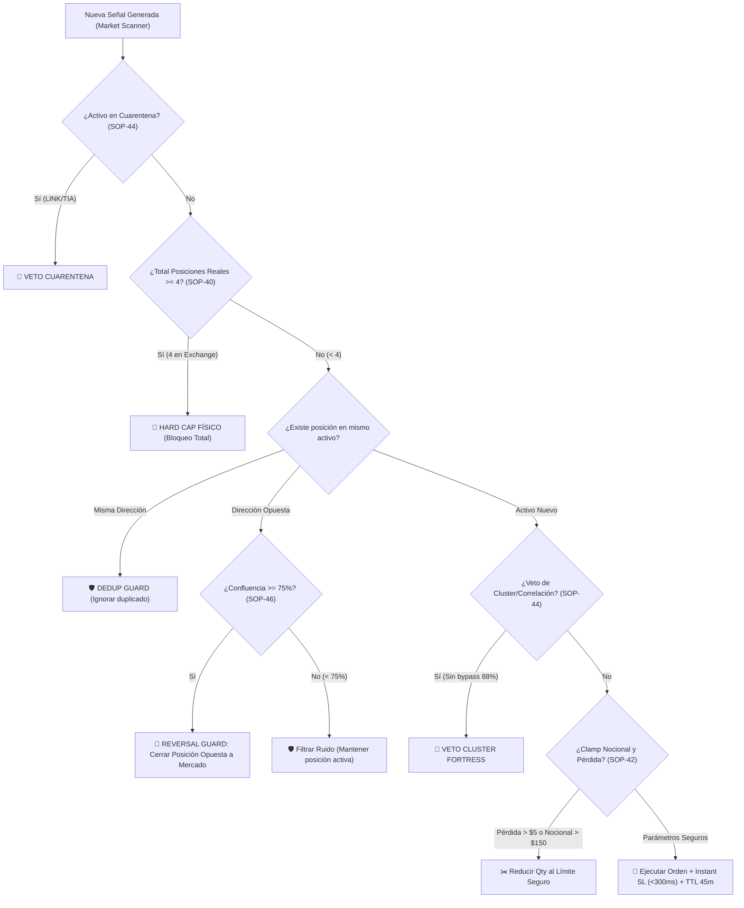

# 📖 SLINGSHOT BIBLE v58.0 — THE MASTER CANONICAL SPECIFICATION (SSoT)
## INSTITUTIONAL RISK HARDENING: PHYSICAL HARD CAP (SOP-40), SIGNAL-AWARE REVERSAL GUARD (SOP-46), PRE-FLIGHT HARD-CLAMP (SOP-42), CLUSTER FORTRESS (SOP-44) & BROKER DECOUPLING RUNBOOK

> **"Manual Técnico Canónico y Especificación SSoT del Ecosistema Autónomo Slingshot. Versión v58.0 APEX INSTITUTIONAL HARDENING: Incorpora la canonización de los Protocolos SOP-40 (Hard Cap Físico Absoluto de 4 Posiciones Abiertas en Broker/Exchange, aboliendo el sobreapalancamiento por liberación de cupos en Breakeven), SOP-46 (Signal-Aware Position Management & Reversal Guard con Cierre Preventivo a Mercado ante Señales Opuestas de Confluencia $\ge 75\%$), SOP-42 (Pre-Flight Dollar Risk & Notional Hard-Clamp con Límite de Pérdida Máxima de $5.00 USDT y Nocional de $150 USD), SOP-44 (Cluster Fortress sin Bypasses con Cuarentena Preventiva de Activos Tóxicos) y SOP-93 (Order TTL Sentinel de 45 minutos para Órdenes Límite). Incluye la Guía Canónica de Desacoplamiento de Brokers y Transición Segura de Cuentas FTMO."**

---

## 🏛️ 1. Matriz Canónica de Protocolos de Riesgo y Ejecución v58.0



---

## 🛡️ 2. Especificación Técnica de los Nuevos Protocolos Institucionales

### SOP-40: Physical Hard Cap Absoluto de Posiciones Abiertas
- **Definición:** Ninguna cuenta (primaria o delegada) podrá tener más de **4 posiciones abiertas simultáneamente** en el broker/exchange bajo ninguna circunstancia.
- **Abolición del Reciclaje en Breakeven:** En versiones previas, cuando una posición alcanzaba Breakeven ($0.00 de riesgo flotante), el sistema liberaba el cupo y abría nuevas posiciones, llegando a acumular 6 o 7 contratos abiertos al mismo tiempo. En la v58.0, **el límite mide contratos físicos en el exchange**, no cupos de riesgo, protegiendo el margen libre y el colateral de liquidación.
- **Implementación:**
  * [`engine/execution/nexus.py`](file:///c:/Users/Matías%20Riquelme/Desktop/Proyectos%20documentados/Slingshot_Trading/engine/execution/nexus.py): Conteo cruzado entre memoria (`_active_positions`) y el broker (`executor.get_pending_positions()`). Si `len(total_active_symbols) >= 4`, rechazo tajante de órdenes a mercado y límites.
  * [`engine/workers/trade_manager.py`](file:///c:/Users/Matías%20Riquelme/Desktop/Proyectos%20documentados/Slingshot_Trading/engine/workers/trade_manager.py): Sentinel de órdenes límite purga automáticamente cualquier orden pendiente si se detectan 4 posiciones abiertas.

### SOP-46: Signal-Aware Position Management & Reversal Guard
- **Definición:** El gestor de posiciones ya no opera aislado del escáner técnico. Adapta activamente la vida de las operaciones ante cambios violentos en la estructura del mercado.
- **Lógica de Ejecución:**
  1. **Misma Dirección:** Si llega una señal en la misma dirección de una posición abierta, actúa el *Dedup Guard* para evitar la sobreexposición en un mismo activo.
  2. **Dirección Opuesta con Confluencia Élite ($\ge 75\%$):** Si el escáner detecta un cambio de tendencia institucional confirmado (CHoCH / MSS bajista mientras estamos en `BUY`), el sistema ejecuta un **cierre preventivo a mercado (`close_position_market`)** de la posición en curso, cortando la pérdida tempranamente antes de recibir el impacto del Stop Loss completo.
  3. **Dirección Opuesta Débil ($< 75\%$):** Si la confluencia es insuficiente, la señal se descarta como ruido técnico y se mantiene intacto el trade en curso.

### SOP-42: Pre-Flight Dollar Risk & Notional Hard-Clamp (Anti-Outliers)
- **Definición:** Imposibilidad matemática de que una orden sufra pérdidas desproporcionadas por errores de dimensionamiento o fallas de liquidez.
- **Límites Canónicos:**
  * **Pérdida Máxima Estricta:** `MAX_ABSOLUTE_LOSS_USDT = 5.00` por operación (2.5% estricto de una cuenta de $200 USD). Si `projected_loss = qty * sl_dist > $5.00`, el sistema recalcula inmediatamente `safe_qty = 5.00 / sl_dist`.
  * **Nocional Máximo de Cuenta:** `MAX_NOTIONAL_USDT = 150.00` (evita órdenes sobredimensionadas como el caso histórico de `LINK` con $672 USD nocionales).
  * **Garantía de Instant SL:** Bucle de reintentos rápidos (<300ms) para consultar el `positionId` del exchange y registrar el Stop Loss formal de inmediato.

### SOP-44: Cluster Fortress & Cuarentena Preventiva
- **Eliminación del Bypass de Confluencia:** Se suprimió la excepción de confluencia $\ge 88\%$ que permitía una 3ª o 4ª posición en criptomonedas. La regla de correlación es una restricción matemática de portafolio y es inviolable.
- **Cuarentena Preventiva de Activos (`QUARANTINE_ASSETS`):**
  * `LINKUSDT`: Excluido por comportamiento anómalo y sobredimensionamiento.
  * `TIAUSDT`: Excluido por racha perdedora persistente (-$53.27 USDT en 8 pérdidas).
  * Cualquier señal generada en estos activos es vetada inmediatamente antes del dimensionamiento.

### SOP-93: Order TTL Sentinel (Expiración a 45 Minutos)
- **Definición:** Toda orden límite colocada en el libro de órdenes tiene un tiempo de vida máximo de **45 minutos** (2700 segundos / 3 velas de 15m).
- **Justificación:** Los setups SMC pierden validez probabilística si el precio tarda más de 3 velas en capitalizar el Order Block. Si transcurren 45 minutos sin llenar la orden, el `TradeManager` la cancela automáticamente para evitar ejecuciones huérfanas en contra de una nueva tendencia.

---

## 🏛️ 3. Runbook: Desacoplamiento de Brokers y Transición de Cuenta FTMO

> [!NOTE]
> **¿Se desconfigura Slingshot cuando termina la cuenta de prueba de FTMO?**
> **RESPUESTA ROTUNDA: NO.** El sistema fue diseñado bajo el principio de **Desacoplamiento Modular Agnóstico**.

### A. Aislamiento Total entre Brokers
1. **Bitunix Futures:** Opera en su propio subsistema completamente independiente a través de API REST y WebSockets con llaves criptográficas dedicadas. Las operaciones, balances y posiciones de Bitunix no tienen ninguna dependencia con MetaTrader 5.
2. **MetaTrader 5 (FTMO):** Opera en un carril aislado a través del puente de IPC `mt5_bridge.py`.

### B. Procedimiento de Transición de Cuenta FTMO (Paso a Paso en 60 Segundos)
Cuando finalices el período de prueba o pases de la fase de evaluación (Challenge) a la cuenta financiada (Funded Account):

1. **Recibir las nuevas credenciales de FTMO:**
   - Número de cuenta (Login).
   - Contraseña de trading (Password).
   - Servidor FTMO (ej. `FTMO-Demo` o `FTMO-Server`).

2. **Actualizar el archivo `.env` en el VPS:**
   Abrir `C:\Slingshot\.env` y actualizar únicamente estas tres líneas:
   ```dotenv
   MT5_LOGIN=TU_NUEVO_LOGIN
   MT5_PASSWORD=TU_NUEVO_PASSWORD
   MT5_SERVER=TU_SERVIDOR_FTMO
   ```

3. **Reiniciar el Servicio Slingshot en el VPS:**
   Ejecutar en PowerShell en el VPS:
   ```powershell
   Stop-Process -Name "python" -Force -ErrorAction SilentlyContinue
   Start-ScheduledTask -TaskName "SlingshotBot"
   ```

4. **Resultado Inmediato:**
   - Slingshot se conecta a la nueva cuenta en MetaTrader 5.
   - El **FTMO Guardian** recalcula dinámicamente el balance inicial del día (`daily_starting_equity`), el objetivo de fase y los límites de pérdida diaria y total (5% y 10%).
   - **Ninguna línea de código, estrategia, indicador ni configuración del bot requiere modificación.**
