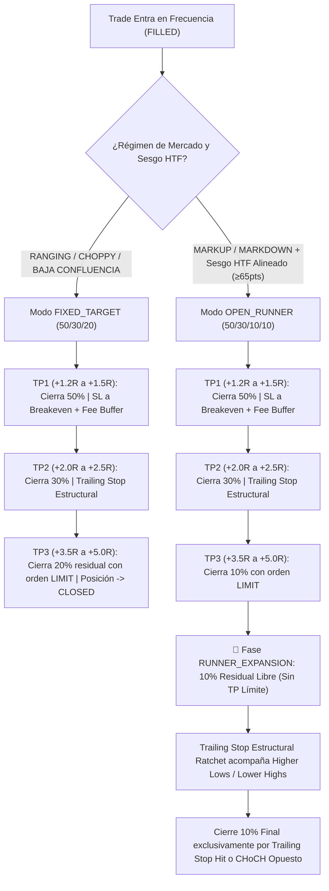

# 📖 SLINGSHOT BIBLE v59.0 — THE MASTER CANONICAL SPECIFICATION (SSoT)
## INSTITUTIONAL RISK HARDENING: ADAPTIVE STRUCTURAL RUNNER (SOP-48), PHYSICAL HARD CAP (SOP-40), SIGNAL-AWARE REVERSAL GUARD (SOP-46), PRE-FLIGHT HARD-CLAMP (SOP-42), CLUSTER FORTRESS (SOP-44) & BROKER DECOUPLING RUNBOOK

> **"Manual Técnico Canónico y Especificación SSoT del Ecosistema Autónomo Slingshot. Versión v59.0 APEX SOVEREIGN RUNNER: Incorpora la canonización del Protocolo SOP-48 (Adaptive Structural Runner & Regime-Conditioned Exit Engine con esquema 50/30/10/10 en tendencias de alta eficiencia y toma completa 50/30/20 en rangos), consolidando los Protocolos SOP-40 (Hard Cap Físico Absoluto de 4 Posiciones), SOP-46 (Reversal Guard ante Confluencia $\ge 75\%$), SOP-42 (Pre-Flight Dollar Risk & Notional Hard-Clamp), SOP-44 (Cluster Fortress sin Bypasses) y SOP-93 (Order TTL Sentinel de 45 minutos)."**

---

## 🏛️ 1. Matriz Canónica de Salidas y Gestión de Trades (SOP-48 v59.0)

---

## 🛡️ 2. Especificación Técnica de los Protocolos Institucionales

### SOP-48: Adaptive Structural Runner & Regime-Conditioned Exit Engine
- **Definición:** El sistema adapta dinámicamente la estructura de salida de cada trade según el régimen de mercado detectado (`regime.py`) y el sesgo fractal (`htf_analyzer.py`):
  1. **Modo FIXED_TARGET (Consolidaciones / Rangos):**
     * **Distribución:** 50% TP1, 30% TP2, 20% TP3.
     * **Comportamiento:** En rangos y compresiones, el precio tiende a revertir violentamente tras barrer los extremos. El sistema coloca las 3 órdenes LIMIT en el exchange y liquida el 100% de la posición en TP3 para embolsar el máximo beneficio antes de la reversión.
  2. **Modo OPEN_RUNNER (Mega-Expansiones / Tendencias Claras):**
     * **Distribución:** 50% TP1 (+1.2R a +1.5R), 30% TP2 (+2.0R a +2.5R), 10% TP3 (+3.5R a +5.0R), 10% Runner Libre.
     * **Comportamiento:** Al tocar TP3, el 10% residual **no se cierra**. La señal entra en la fase canónica `RUNNER_EXPANSION`.
     * **Trailing Stop Sin Techo:** El Stop Loss se eleva inmediatamente a TP2 o al último soporte estructural (`_find_structural_sl`), garantizando ganancias de al menos $+2.0\text{R}$ en caso de giro súbito. A partir de allí, el Stop Loss escala con cada nuevo mínimo mayor (en Long) o máximo menor (en Short) sin orden límite superior, permitiendo capturar expansiones de $+10\text{R}$, $+20\text{R}$ o más (estilo SOX o corridas cripto).
- **Invariantes Inquebrantables de SOP-48:**
  * **Monotonía del Stop Loss:** Todo movimiento de SL es estrictamente unidireccional y ratcheted (`_sl_improved`). Jamás puede aumentarse el riesgo de una posición abierta.
  * **Zero-Orphan en Exchange:** Aunque no exista un límite superior para el 10% runner, **siempre existe una orden Stop Loss viva en los servidores del exchange** (`modify_position_tpsl`). Si el VPS pierde conexión, la cuenta permanece 100% protegida.
  * **Fee Absorber:** Breakeven y Trailing aplican un buffer mínimo de comisiones (`entry * 0.0008` o `0.3 * ATR`) garantizando PnL neto positivo.
  * **Lote Mínimo Fallback:** Si el 10% queda por debajo de `min_trade_volume` del exchange, se consolida automáticamente hacia TP2/TP3 fixed.

### SOP-40: Physical Hard Cap Absoluto de Posiciones Abiertas
- **Definición:** Ninguna cuenta podrá tener más de **4 posiciones abiertas simultáneamente** en el broker/exchange bajo ninguna circunstancia.
- **Abolición del Reciclaje en Breakeven:** El límite mide contratos físicos en el exchange, no cupos de riesgo, protegiendo el margen libre y el colateral de liquidación.

### SOP-46: Signal-Aware Position Management & Reversal Guard
- **Definición:** Cierre preventivo a mercado (`close_position_market`) de posiciones en curso si el escáner detecta una señal opuesta de confluencia $\ge 75\%$, cortando pérdidas tempranamente antes de recibir el impacto del Stop Loss completo.

### SOP-42: Pre-Flight Dollar Risk & Notional Hard-Clamp (Anti-Outliers)
- **Pérdida Máxima Estricta:** `MAX_ABSOLUTE_LOSS_USDT = 5.00` por operación.
- **Nocional Máximo de Cuenta:** `MAX_NOTIONAL_USDT = 150.00`.

### SOP-44: Cluster Fortress & Cuarentena Preventiva
- **Eliminación del Bypass:** Restricción estricta de correlación de portafolio sin excepciones.
- **Cuarentena:** Activos tóxicos o altamente ruidosos son bloqueados antes del dimensionamiento.

### SOP-93: Order TTL Sentinel (Expiración a 45 Minutos)
- Toda orden límite colocada en el libro tiene un tiempo de vida máximo de 45 minutos (3 velas de 15m) antes de ser cancelada por inacción.

---

## 🏛️ 3. Runbook: Desacoplamiento de Brokers y Transición de Cuenta FTMO
Slingshot opera bajo un desacoplamiento modular total:
1. **Bitunix Futures:** Carril nativo REST/WS 24/7 con gestión SOP-48 (50/30/10/10).
2. **MetaTrader 5 (FTMO):** Carril IPC mediante `mt5_bridge.py` con guardianes de drawdown diario (-3.5%) y total (-10%).
Cambiar credenciales en `.env` no desconfigura ninguna regla algorítmica ni requiere modificar código.
