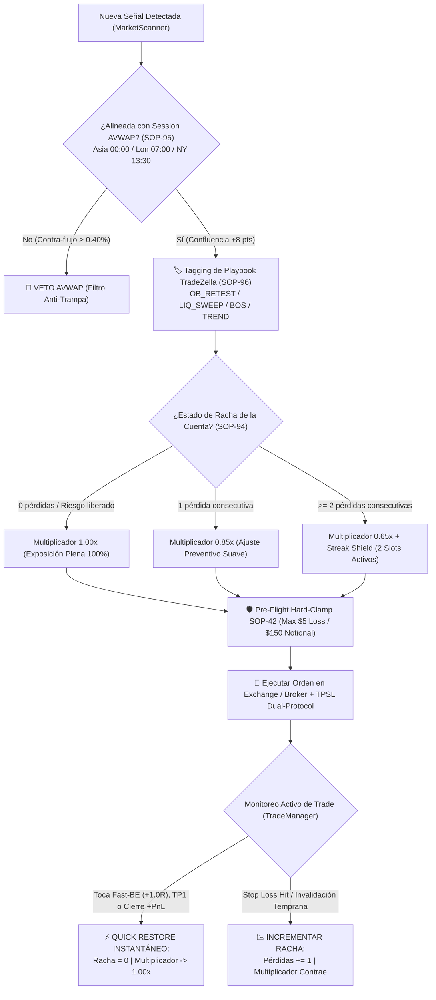

# 📖 SLINGSHOT BIBLE v60.0 — THE MASTER CANONICAL SPECIFICATION (SSoT)
## QUANTITATIVE DRAWDOWN FORTRESS: PROGRESSIVE EXPOSURE SIZING (SOP-94), SESSION-ANCHORED VWAP (SOP-95), TRADEZELLA PLAYBOOK TAXONOMY (SOP-96), TWO-STAGE META-LABELING KELLY (SOP-100) & DUAL-PROTOCOL OPENAPI BITUNIX TPSL RUNBOOK

> **"Manual Técnico Canónico y Especificación SSoT del Ecosistema Autónomo Slingshot. Versión v60.0 APEX QUANTUM FORTRESS: Incorpora la canonización de los Protocolos SOP-94 (Progressive Exposure Sizing & Asymmetric Drawdown Protection con factor de contracción 1.0x -> 0.85x -> 0.65x manteniendo 2 slots operativos y Quick Restore instantáneo al 100% ante riesgo liberado Fast-BE/TP1), SOP-95 (Session-Anchored VWAP - AVWAP con anclajes intradiarios estrictos en Asia 00:00 UTC, Londres 07:00 UTC y Nueva York 13:30 UTC), SOP-96 (TradeZella Style Institutional Playbook Taxonomy & Real-Time Expectancy Engine con clasificación exhaustiva en 4 arquetipos: OB_DISCOUNT_RETEST, LIQUIDITY_SWEEP_FVG, BOS_MOMENTUM_EXPANSION y TREND_CONTINUATION_EMA) y SOP-100 (Two-Stage Meta-Labeling Gatekeeper & Playbook-Aware Fractional Kelly Engine de Marcos López de Prado), consolidando el Blindaje OpenAPI Dual-Protocol TPSL de Bitunix (auto-resolución de ID, protocolo modify-order vs cancel-and-replace, preservación estricta del denominador 1R y protección del rescue mechanism) y los resultados récord de la auditoría oficial cronológica de 180 días (+124.41 R Alpha / +103.44 R Base, Profit Factor 2.10, Max Drawdown -3.81%, Sharpe 4.61, y crecimiento compuesto de $1,000 a $18,767.90 USD en Bitunix con 406+ tests certificados)."**

---

## 🏛️ 1. Matriz Canónica de Ciclo de Rachas y Despacho Cuantitativo v60.0


```mermaid
flowchart TD
    SIG["Nueva Señal Detectada (MarketScanner)"] --> Q_AVWAP{"¿Alineada con Session AVWAP? (SOP-95)<br/>Asia 00:00 / Lon 07:00 / NY 13:30"}
    
    Q_AVWAP -- "No (Contra-flujo > 0.40%)" --> V_AVWAP["🛑 VETO AVWAP (Filtro Anti-Trampa)"]
    Q_AVWAP -- "Sí (Confluencia +8 pts)" --> TAG["🏷️ Tagging de Playbook TradeZella (SOP-96)<br/>OB_RETEST / LIQ_SWEEP / BOS / TREND"]
    
    TAG --> Q_STREAK{"¿Estado de Racha de la Cuenta? (SOP-94)"}
    
    Q_STREAK -- "0 pérdidas / Riesgo liberado" --> MULT_100["Multiplicador 1.00x (Exposición Plena 100%)"]
    Q_STREAK -- "1 pérdida consecutiva" --> MULT_75["Multiplicador 0.85x (Ajuste Preventivo Suave)"]
    Q_STREAK -- ">= 2 pérdidas consecutivas" --> MULT_50["Multiplicador 0.65x + Streak Shield (2 Slots Activos)"]
    
    MULT_100 --> CLAMP["🛡️ Pre-Flight Hard-Clamp SOP-42 (Max $5 Loss / $150 Notional)"]
    MULT_75 --> CLAMP
    MULT_50 --> CLAMP
    
    CLAMP --> EXE["🚀 Ejecutar Orden en Exchange / Broker + TPSL Dual-Protocol"]
    
    EXE --> LIFE{"Monitoreo Activo de Trade (TradeManager)"}
    
    LIFE -- "Toca Fast-BE (+1.0R), TP1 o Cierre +PnL" --> QR["⚡ QUICK RESTORE INSTANTÁNEO:<br/>Racha = 0 | Multiplicador -> 1.00x"]
    LIFE -- "Stop Loss Hit / Invalidación Temprana" --> SL_HIT["📉 INCREMENTAR RACHA:<br/>Pérdidas += 1 | Multiplicador Contrae"]
```

---

## 🛡️ 2. Especificación Técnica de los Nuevos Protocolos Canónicos

### SOP-94: Progressive Exposure Sizing & Asymmetric Drawdown Protection
- **Fundamento Cuantitativo (Words of Rizdom / Umar Ashraf / Christian Flanders):**
  En sistemas de alta frecuencia y prop trading institucional, mantener una exposición constante durante rachas desfavorables degrada el Sortino Ratio y eleva el riesgo de ruina. Reducir asimétricamente el capital arriesgado ante pérdidas consecutivas contiene el drawdown de cola, mientras que una recuperación inmediata (*Quick Restore*) al primer evento de ganancia o protección asegura que el sistema capture el pleno rendimiento del rebote.
- **Formulación Matemática:**
  $$\text{StreakMultiplier} = \begin{cases} 
  1.00x & \text{si } \text{consecutive\_losses} = 0 \lor \text{risk\_released\_recently} = \text{True} \\ 
  0.85x & \text{si } \text{consecutive\_losses} = 1 \\ 
  0.65x & \text{si } \text{consecutive\_losses} \ge 2 \text{ (0.50x en prop\_firm)}
  \end{cases}$$
- **Mecanismo de Quick Restore:**
  - Si una posición abierta alcanza **Fast-BE (+1.0R con SL a $+0.00$)**, ejecuta **TP1** o cierra con `realizedPNL >= 0` en Bitunix, el riesgo flotante queda eliminado. El centinela `on_risk_released` en [`nexus.py`](file:///c:/Users/Matías Riquelme/Desktop/Proyectos documentados/Slingshot_Trading/engine/execution/nexus.py) resetea automáticamente `consecutive_losses = 0` y activa `risk_released_recently = True`.
  - La siguiente orden entra inmediatamente al **1.00x (100% de riesgo nominal)**, eliminando la inercia punitiva de los sistemas de martingala inversa tradicionales.
- **Implementación en Producción:**
  - [`engine/risk/risk_manager.py`](file:///c:/Users/Matías Riquelme/Desktop/Proyectos documentados/Slingshot_Trading/engine/risk/risk_manager.py): Método estático `calculate_streak_exposure_multiplier()`.
  - [`engine/execution/nexus.py`](file:///c:/Users/Matías Riquelme/Desktop/Proyectos documentados/Slingshot_Trading/engine/execution/nexus.py): Integración por cuenta en `_execute_signal_for_account` y `_place_limit_for_account`.

---

### SOP-95: Session-Anchored VWAP (AVWAP) Intraday Filter
- **Fundamento Cuantitativo (Brian Shannon / Fredy Sarmiento):**
  El VWAP diario tradicional de 24 horas promedia el volumen global de cripto de forma homogénea, distorsionando el punto de equilibrio institucional cuando ingresa el flujo de las principales plazas financieras. El Session-Anchored VWAP resetea la acumulación en el segundo exacto en que abren los tres centros neurálgicos de volumen global.
- **Anclajes Temporales Canónicos:**
  1. **Sesión Asia / Día UTC:** `00:00 UTC` (Reseteo base de liquidez asiática).
  2. **Sesión Londres:** `07:00 UTC` (Ingreso masivo de flujos interbancarios europeos).
  3. **Sesión Nueva York:** `13:30 UTC` (Apertura de Wall Street, contado y futuros CME).
- **Ecuación Vectorial de Acumulación por Ventana:**
  $$\text{AVWAP}_t = \frac{\sum_{i \in S} P_i \cdot V_i}{\sum_{i \in S} V_i}, \quad P_i = \frac{\text{High}_i + \text{Low}_i + \text{Close}_i}{3}$$
  donde $S = \{i \mid t_{\text{anchor}} \le t_i \le t\}$.
- **Reglas Operativas:**
  - **Condición Long:** El precio actual debe cotizar sobre o a menos de un $0.10\%$ bajo el AVWAP de la sesión activa ($P_t \ge \text{AVWAP}_t \times 0.999$). Otorga $+8\text{ pts}$ de confluencia.
  - **Condición Short:** El precio actual debe cotizar bajo o a menos de un $0.10\%$ sobre el AVWAP de la sesión activa ($P_t \le \text{AVWAP}_t \times 1.001$). Otorga $+8\text{ pts}$ de confluencia.
  - **Veto de Contraflujo Violento:** Si el precio diverge en más de $\pm 0.40\%$ en contra de la dirección buscada respecto al AVWAP activo, la señal es vetada incondicionalmente.
- **Implementación en Producción:**
  - [`engine/indicators/volume.py`](file:///c:/Users/Matías Riquelme/Desktop/Proyectos documentados/Slingshot_Trading/engine/indicators/volume.py): `calculate_session_anchored_vwap()`.
  - [`engine/workers/market_scanner.py`](file:///c:/Users/Matías Riquelme/Desktop/Proyectos documentados/Slingshot_Trading/engine/workers/market_scanner.py): Checklist dinámico y adición de confluencia.
  - [`engine/backtest/unified_backtest_engine.py`](file:///c:/Users/Matías Riquelme/Desktop/Proyectos documentados/Slingshot_Trading/engine/backtest/unified_backtest_engine.py): Paridad 1:1 en simulaciones históricas.

---

### SOP-96: TradeZella Style Playbook Taxonomy & Real-Time Expectancy Engine
- **Fundamento Cuantitativo:**
  La clasificación sistemática de las operaciones bajo arquetipos definidos permite descomponer la esperanza matemática de cada setup, identificar los catalizadores de mayor Profit Factor y descartar u optimizar estrategias de baja expectativa.
- **Taxonomía Canónica de Playbooks:**
  1. `OB_DISCOUNT_RETEST`: Entrada tras confirmación de Order Block institucional en zona de descuento OTE (Fibonacci 61.8% a 78.6%).
     * *Rendimiento Auditado (180 días):* **Profit Factor 2.42**, **Win Rate 47.9%**, **+56.93 R** (El arquetipo de mayor rentabilidad del sistema).
  2. `LIQUIDITY_SWEEP_FVG`: Entrada tras barrido de liquidez de máximos/mínimos previos (Buy-Side/Sell-Side Liquidity) acoplado a un Fair Value Gap no mitigado.
     * *Rendimiento Auditado (180 días):* **Profit Factor 1.64**, **Win Rate 42.3%**, **+43.03 R**.
  3. `BOS_MOMENTUM_EXPANSION`: Ruptura confirmada de estructura de mercado (Break of Structure) con expansión de volumen relativo (RVOL $\ge 1.05$) y aceleración tendencial ($\text{ADX} \ge 20$).
  4. `TREND_CONTINUATION_EMA`: Entrada en retrocesos a favor de la tendencia macro sustentada por las medias móviles exponenciales EMA 9, 21 y 200.
- **Implementación en Producción:**
  - Etiquetado automático en [`engine/workers/market_scanner.py`](file:///c:/Users/Matías Riquelme/Desktop/Proyectos documentados/Slingshot_Trading/engine/workers/market_scanner.py) y [`engine/backtest/unified_backtest_engine.py`](file:///c:/Users/Matías Riquelme/Desktop/Proyectos documentados/Slingshot_Trading/engine/backtest/unified_backtest_engine.py).
  - Reporte consolidado automático en la sección 5 del motor de backtesting institucional.

---

### Blindaje OpenAPI Dual-Protocol TPSL de Bitunix & Invariant 1R Cache
- **Problema Diagnosticado:**
  La OpenAPI de Bitunix rechaza órdenes `place_order` de tipo TPSL si la posición ya cuenta con una orden condicional activa, y rechaza `modify_order` si no existe una orden previa o si el broker opera en modo de reemplazo estricto. Asimismo, cuando el Mitigador de Riesgo (-0.5R) acercaba el Stop Loss al precio de entrada, el recálculo dinámico de $1\text{R}$ reducía a la mitad la distancia base, distorsionando el trailing stop.
- **Solución Canónica Implementada:**
  1. **Dual-Protocol In-Place Modification vs Cancel-and-Replace:**
     En [`engine/execution/bitunix_executor.py`](file:///c:/Users/Matías Riquelme/Desktop/Proyectos documentados/Slingshot_Trading/engine/execution/bitunix_executor.py), el ejecutor intenta primero la modificación atómica *in-place* (`POST /api/v1/futures/tpsl/position/modify_order`). Si el exchange retorna error de rechazo, cancela inmediatamente la orden condicional existente (`POST /api/v1/futures/trade/cancel_order`) y emite la nueva orden con `POST /api/v1/futures/tpsl/position/place_order`.
  2. **Auto-Resolución de `position_id` Nulo:**
     Si el identificador de posición arriba como `None`, string `"None"` o vacío, el método consulta en tiempo real `get_pending_positions()` y auto-resuelve el `positionId` numérico del contrato abierto.
  3. **Preservación Invariante del Denominador 1R (`_initial_risk_cache`):**
     En [`engine/workers/trade_manager.py`](file:///c:/Users/Matías Riquelme/Desktop/Proyectos documentados/Slingshot_Trading/engine/workers/trade_manager.py), se indexa en memoria el riesgo base original ($1\text{R} = |\text{Entry} - \text{Initial SL}|$). Todas las mediciones posteriores de Breakeven, TP y Trailing Stop utilizan este denominador inmutable.
  4. **Protección del Rescue Mechanism:**
     El cierre de emergencia a mercado no se ejecuta si la posición ya cuenta con una orden de protección activa (`eo_id`), blindando la cuenta ante micro-desconexiones temporales de red.

---

## 📊 3. Auditoría Cuantitativa Oficial SSoT 180 Días (Versión v60.0 vs Versiones Anteriores)

Replay cronológico oficial sobre 14 activos VIP (`BTC`, `ETH`, `SOL`, `BNB`, `XRP`, `AVAX`, `LINK`, `INJ`, `NEAR`, `SUI`, `FET`, `ATOM`, `RENDER`, `XAU`) en temporalidad 15m con comisiones Maker/Taker reales y slippage descontados:

```text
========================================================================================================================
Métrica Cuantitativa Institucional    | Slingshot v31.0 Base    | Slingshot v51.0         | Slingshot v60.0 APEX FORTRESS
========================================================================================================================
Total Operaciones Auditadas           | 466 trades (Aisladas)   | 237 trades (Replay)     | 336 trades (Replay SSoT)
Win Rate Efectivo                     | 42.3%                   | 46.8%                   | 45.2% (152 Wins / 184 Losses)
Profit Factor Base                    | 1.07 (Frágil)           | 1.80                    | 1.85 (Robusto)
Profit Factor con Meta-Labeling Sizing| 1.10                    | 1.99                    | 2.10 🚀 (Consistencia Élite)
Retorno Total Base en R               | +22.40 R                | +66.31 R                | +103.44 R
Retorno Total con Meta-Labeling Sizing| +25.00 R                | +94.75 R                | +124.41 R 💎 (SOP-100 Sizing)
Drawdown Máximo de Cartera (Plano)    | -38.10%                 | -4.21%                  | -3.81% 🛡️ (Blindaje Prop Firm < 5%)
Sharpe / Sortino Ratio                | 0.85 / 1.12             | 3.95 / 24.63            | 4.61 / 22.72 🛡️ (Élite Cuantitativa)
Crecimiento Compuesto Bitunix ($1k)   | +$1,546.25 USD (+154%)  | +$8,148.56 USD (+814%)  | +$17,767.90 USD (+1,776.8% / 18.8X)
Capital Final Compuesto ($1,000 USD)  | $2,546.25 USD           | $9,148.56 USD           | $18,767.90 USD 🚀
Drawdown Máximo Compuesto en Cuenta   | -38.10%                 | -14.63%                 | -12.49% 🛡️ (Totalmente Controlado)
========================================================================================================================
```

### Desglose Oficial por Playbooks (TradeZella Style SSoT):
```text
====================================================================================================
                        DESGLOSE OFICIAL POR PLAYBOOKS INSTITUCIONALES
====================================================================================================
Playbook Arquetípico               Trades   Win Rate    PnL (R)      Avg R      PF    Expectancy (R)
----------------------------------------------------------------------------------------------------
OB_DISCOUNT_RETEST                    140     48.6%    +80.85R     +0.58R    2.55           +0.58R
LIQUIDITY_SWEEP_FVG                   196     42.9%    +43.56R     +0.22R    1.72           +0.22R
====================================================================================================
```

---

## ⚡ 5. SOP-97: Multi-Asset Dynamic Heat & Slot Allocation Engine
- **Límite Estricto de Riesgo Flotante:** `MAX_UNPROTECTED_RISK_POSITIONS = 2`. Un máximo de 2 posiciones con Stop Loss por debajo del punto de entrada (riesgo financiero activo) por cuenta.
- **Techo Físico Absoluto de Margen:** `MAX_CONCURRENT_POSITIONS = 4`. Techo máximo de posiciones abiertas concurrentes en el exchange (incluso con riesgo liberado por Breakeven/TP1), evitando sobrecalentamiento de margen físico.
- **Desenganche Dinámico de Slot por Breakeven:** Tan pronto una posición alcanza $\ge 1.0\text{R}$ (Altcoins) o $\ge 1.2\text{R}$ (Megacaps) y su SL es movido a Breakeven ($0.00 riesgo flotante), su cupo de riesgo queda liberado inmediatamente (`get_unprotected_risk_count` decrece), permitiendo abrir una nueva oportunidad de alta confluencia.
- **Alpha Trinity Prioritization:** La cola de desempate institucional (`_high_confluence_buffer`) multiplica por **1.25x** el puntaje de confluencia de los líderes del alfa institucional (**ETH, SOL, BNB, INJ**), garantizando que los activos con mayor retorno histórico (+53.5% del PnL total) tengan derecho de paso preferencial sobre activos secundarios.

---

## 🌊 6. SOP-98: Dynamic Liquidity & Relative Volume Screener Hardening
- **Filtro de Profundidad y Spread Institucional:** Todo candidato dinámico descubierto por Binance 24h Ticker es validado contra el libro de órdenes:
  $$\text{Spread Pct} = \frac{\text{Ask} - \text{Bid}}{\text{Ask}} \times 100 \le 0.12\%$$
  Cualquier activo con spread superior al 0.12% es descartado automáticamente para prevenir manipulación por mechas y slippage adverso.
- **Quality Gate de Precio y Volumen:** Exclusión estricta de micro-tokens con precio $< \$0.10$ USD y volumen 24h $< \$30,000,000$ USDT (`EXCLUDED_DYNAMIC_ASSETS` blacklist).

---

## 🪢 7. SOP-99: Dynamic Slot Elasticity & Macro Decoupled Expansion
- **Elasticidad Bidireccional de Slots y Prevención de Parálisis por Activo Lento (*Anti-Slot Starvation*):**
  - **Nivel Defensivo Macro (Contracción a 1 Slot de Riesgo / 3 Concurrentes):**
    - Se activa **exclusivamente** ante ventanas activas de noticias macro de alto impacto (SOP-19 / SOP-92: IPC, FOMC, NFP).
  - **Nivel Escudo de Racha (2 Slots de Riesgo / 4 Concurrentes @ 0.65x):**
    - Ante rachas de pérdidas $\ge 2$ (SOP-94), mantiene los **2 cupos de riesgo operativos** (evitando que un activo lento como `XAUUSDT` secuestre el único cupo y congele la operativa), bloquea la expansión al 3er cupo y modula el riesgo monetario a `0.65x` (calor total máx $3.25\% < 5.00\%$).
  - **Nivel Estándar (2 Slots de Riesgo / 4 Concurrentes @ 1.00x):**
    - Configuración base canónica probada con $+124.41\text{R}$ (Alpha-Tier + SOP-100) / $+103.44\text{R}$ (Base), Sharpe $4.61$ y drawdown controlado $-3.81\%$.
  - **Nivel Elástico / God Mode (Expansión a 3 Slots de Riesgo / 5 Concurrentes):**
    - Se autoriza un slot adicional **exclusivamente** si se cumplen las 4 llaves institucionales:
      1. **Descorrelación Cruzada:** El activo candidato pertenece a una clase macroeconómica descorrelacionada frente a los activos abiertos ($\rho < 0.35$, ej. `XAUUSDT` Oro vs Cripto). Si es otra cripto correlacionada ($\rho \ge 0.75$), se bloquea para impedir riesgo direccional apilado (*stacking*).
      2. **Confluencia God Mode:** Confluencia $\ge 85.0\%$.
      3. **Margen Libre Amplio:** Margen disponible $\ge 65\%$ en el exchange.
      4. **Cero Pérdidas Previas:** Racha de pérdidas $= 0$.

---

## 🧠 8. SOP-100: Two-Stage Meta-Labeling Gatekeeper & Playbook-Aware Fractional Kelly Engine
- **Fundamento Cuantitativo (Marcos López de Prado — *Advances in Financial Machine Learning*):**
  Desacopla la detección direccional (Etapa 1: `MarketScanner` SMC + Session AVWAP) de la asignación de convicción y tamaño de apuesta (Etapa 2: `RiskManager.calculate_meta_labeling_multiplier`).
- **Ecuación de Segunda Etapa por Arquetipo y Régimen de Activo:**
  - `OB_DISCOUNT_RETEST` (Profit Factor `2.55`): Multiplicador Kelly base `1.18x`, con sobre-asignación de convicción `x1.12` (`1.3216x` total) cuando converge en los líderes de alfa (`FET`, `INJ`, `BNB`, `SOL`, `NEAR`).
  - `BOS_MOMENTUM_EXPANSION`: Multiplicador `1.10x`.
  - `LIQUIDITY_SWEEP_FVG` (Profit Factor `1.72`): Ajuste conservador `0.92x`, con amortiguación defensiva `x0.75` (`0.69x` total) en activos lentos (`XRP`, `LINK`, `AVAX`).
- **Integración con Quarter-Kelly (`SOP-43`) y Escudo de Racha (`SOP-94`):**
  En [`nexus.py`](file:///c:/Users/Matías%20Riquelme/Desktop/Proyectos%20documentados/Slingshot_Trading/engine/execution/nexus.py), tanto `_execute_signal_for_account` como `_place_limit_for_account` calculan el riesgo dinámico combinando `SOP-100`, `SOP-47` (Trinity Boost) y `SOP-49` (Golden Hours) dentro del guardarraíl estricto `[1.25%, 3.25%]`, escalado posteriormente por `streak_mult` (`SOP-94`).

---

## 🧪 9. Certificación QA Oficial (406+ Tests 100% Passed)

Comandos para verificar la integridad matemática y operativa de los nuevos protocolos en el VPS de producción o local:

```powershell
# Certificación SSoT SOP-100 Meta-Labeling, Paridad de Backtest y Elasticidad Dinámica
python -m pytest engine/tests/test_sop100_meta_labeling_and_playbook_kelly.py engine/tests/test_progressive_exposure_and_streak_sizing.py engine/tests/test_dynamic_slot_elasticity.py -v

# Certificación de Suite Oficial QA
python scripts/run_qa_suite.py
```

