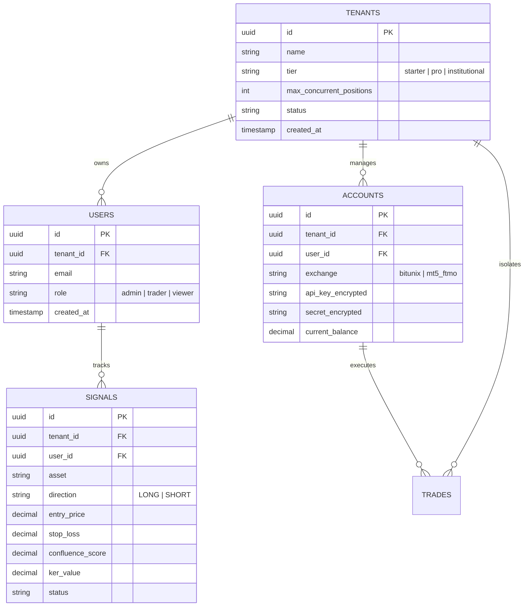

# BLUEPRINT_2026.md — Arquitectura de Plataforma Institucional

> **Versión del Sistema:** 10.0.0 (FSD Multi-Tenant Dual-Engine Architecture)  
> **Fecha de Actualización:** Octubre 2026  
> **Estado:** Fase 1 — Fundación de Gobernanza y FSD Completada

---

## 1. Visión y Filosofía del Sistema

Este ecosistema combina dos motores de ingeniería de alta precisión:
1. **Frontend / Capa de Aplicación Multi-Tenant (Next.js 15 + React 19 + TypeScript + FSD):** Proporciona la interfaz interactiva en tiempo real, gestión de tenants/organizaciones, telemetría visual de alta frecuencia y Server Actions protegidos contra vulnerabilidades de acceso horizontal (IDOR).
2. **Motor Cuantitativo HFT / IA Institucional (Python 3.12 + FastAPI + Polars + XGBoost/ONNX):** Procesa el flujo de órdenes (Order Flow Delta, CVD), Smart Money Concepts (SMC), confluencias multidimensionales y ejecución algorítmica de baja latencia con Bitunix Futures y TradFi/MT5.

---

## 2. Stack Tecnológico Base

| Capa | Tecnología | Propósito |
| :--- | :--- | :--- |
| **Framework Web** | Next.js 15 (App Router) + React 19 | Server Components, Streaming SSR, Server Actions |
| **Arquitectura Frontend** | Feature-Sliced Design (FSD) v2.1 | Separación estricta de responsabilidades en `src/` |
| **Tipado y Contratos** | TypeScript 5.9 + Zod 4 / 3.23 | Verificación estática estricta y validación en tiempo de ejecución |
| **Estilos & UI** | Tailwind CSS v4 + Framer Motion | Retícula Base-8, paleta Cyber Dark WCAG 2.2 AA |
| **Testing Frontend** | Vitest 5 + @vitejs/plugin-react | Pruebas unitarias de contratos, seguridad y Server Actions |
| **Persistencia Multi-Tenant** | Drizzle ORM + Turso (LibSQL) / PostgreSQL | Aislamiento estricto por `tenant_id` y `user_id` |
| **Motor Cuantitativo** | Python 3.12 + FastAPI + Polars | Cálculo de indicadores de alta frecuencia y endpoints REST/WS |
| **Inferencia Neural** | ONNX Runtime + XGBoost Meta-Labeling | Filtro de confluencia probabilística en tiempo real |
| **Conectividad Exchange** | Bitunix API / WebSocket Sidecar Node.js | Ingestión de ticks en submilisegundos y ejecución de órdenes |

---

## 3. Arquitectura en Capas (Feature-Sliced Design)

El código fuente de la aplicación reside en `src/` respetando el flujo unidireccional estricto:

```
src/
├── app/                  # Enrutador, Layouts, Providers globales (Next.js App Router)
│   ├── (dashboard)/      # Rutas del terminal: overview, bitunix, chart, ftmo, radar, signals
│   ├── api/              # Proxy y endpoints de retransmisión
│   ├── globals.css       # Tokens de diseño CSS y temas
│   └── layout.tsx        # Shell raíz y fuentes
├── features/             # Slices interactivos y Server Actions orientados a usuario
│   ├── order-execution/  # Server Actions con validación Zod y aislamiento multi-tenant
│   ├── radar-scanner/    # Escáner de oportunidades y filtros de mercado
│   └── telemetry-feed/   # Consumo reactivo de métricas de cuenta y WS
├── entities/             # Modelos de datos del dominio, contratos y tipos
│   ├── tenant/           # Esquemas Zod y modelo de organización/tenant
│   └── signal/           # Esquemas Zod y modelo de señal cuantitativa
└── shared/               # Primitivas transversales y utilidades base
    ├── auth/             # Verificación de sesión de usuario (requireUserSession)
    ├── db/               # Helpers de aislamiento multi-tenant (tenantGuard)
    ├── ui/               # Kit de componentes base (Button, etc. en Base 8 y WCAG AA)
    └── lib/              # Utilidades de formato, red y cálculo
```

### Regla de Acoplamiento y Dependencias:
* **`app`** puede consumir `features`, `entities` y `shared`.
* **`features`** puede consumir `entities` y `shared`. Jamás otra feature hermana ni `app`.
* **`entities`** puede consumir únicamente `shared`.
* **`shared`** no depende de ninguna otra capa interna del proyecto.

---

## 4. Diseño del Modelo de Datos Multi-Tenant

Para garantizar la soberanía de los datos entre diferentes usuarios, academias o firmas de prop trading, el esquema de base de datos implementa **Aislamiento Multi-Tenant por Clave Particionada**:

### Esquema Conceptual (Drizzle / Relacional):



### Protocolo de Consulta con Aislamiento (Query Guard):
Toda consulta SQL generada en Server Actions o rutas debe incluir obligatoriamente el predicado compuesto:

```typescript
// Consulta segura con protección anti-IDOR
const result = await db
  .select()
  .from(signals)
  .where(
    and(
      eq(signals.id, targetSignalId),
      eq(signals.userId, session.userId),
      eq(signals.tenantId, session.tenantId)
    )
  );
```

---

## 5. Bitácora de Fases de Desarrollo

| Fase | Alcance | Estado | Entregables Principales |
| :---: | :--- | :---: | :--- |
| **Fase 1** | **Fundación Arquitectónica FSD & Gobernanza** | ✅ **Completado** | • Estructura FSD en `src/` (`app`, `features`, `entities`, `shared`)<br>• `AGENTS.md` con reglas innegociables<br>• `BLUEPRINT_2026.md`<br>• Scripts `typecheck` y `test` en `package.json`<br>• Vitest 5 configurado y 13 tests pasando |
| **Fase 2** | **Auditoría Exhaustiva, Higiene y Promoción FSD** | ✅ **Completado** | • Limpieza de 60 MB de logs obsoletos y caches en raíz<br>• Promoción de `formatters` y `apiUrl` a `src/shared/lib/`<br>• Promoción de contratos de dominio a `src/entities/signal/types.ts`<br>• Corrección ergonómica UI/UX: touch targets ≥44px y contraste WCAG 2.2 AA (≥4.5:1)<br>• Guardián arquitectónico automatizado en `tests/unit/fsd-architecture.test.ts`<br>• Suite de Vitest ampliada a 23 tests unitarios (100% pasando) |
| **Fase 3** | **Slices UI & Server Actions Zod (FSD)** | ✅ **Completado** | • Slices `src/features/signals-feed` y `src/features/positions-tracker` creadas y exportadas vía barrel index<br>• Server Actions con validación Zod y protección anti-IDOR (`fetchSignalsAction`, `recordSignalAction`, `fetchTradesAction`, `recordTradeAction`)<br>• Integración reactiva en componentes Radar y History con persistencia Turso y fallback |
| **Fase 4** | **Persistencia Serverless & RLS Multi-Tenant (Turso + Drizzle)** | ✅ **Completado** | • Cliente Drizzle ORM + LibSQL configurado en `src/shared/db/index.ts`<br>• Esquema multi-tenant (`tenants`, `users`, `signals`, `trades`, `risk_configs`, `accounts`) sincronizado en Turso Cloud<br>• Drizzle Kit integrado (`npm run db:push`, `db:studio`)<br>• Tests unitarios de anti-IDOR y DB client pasando al 100% |
| **Fase 5** | **Integración Dual-Engine & Telemetría Segura** | ✅ **Completado** | • Sincronización HTTP Pipeline v2 en segundo plano (`engine/execution/turso_sync.py`) sin latencia en hot-path<br>• Hooking continuo de posiciones y órdenes en `bitunix_executor.py`, `mt5_bridge.py` y `main.py`<br>• Pruebas de regresión dual completadas (100% en verde) |
| **Fase 6** | **Auditoría Forense Cuantitativa & Paridad Matemática SSoT** | ✅ **Completado** | • Eliminación de ganancia fantasma (+30.5R) reconciliando los multiplicadores de outcome R con los niveles límite reales (TP1 +1.2R @ 50%, TP2 +2.0R @ 30%)<br>• Verificación de paridad 1:1 entre Backtest Replay y Ejecución en Vivo (`BitunixExecutor`, `Nexus`, `TradeManager`)<br>• Nueva slice FSD `src/features/backtest-metrics` con Server Action validada con Zod y widget UI interactivo<br>• Certificación de 437 trades: WR 44.9%, Base PF 1.62, Alpha-Tier PF 1.79, Total R +97.98 R (Base) / +122.13 R (Alpha), Max DD -4.76% (Blindaje FTMO pass)<br>• Suite de tests expandida: 37 Vitest (100%) y 429 Pytest (100%) |

---

## 6. Verificación Continua y Criterios de Aceptación

Para asegurar la robustez del sistema, los pipelines de CI/CD ejecutan:
1. `npm run typecheck`: Validación estática de tipos TypeScript sin emitir artefactos (0 errores).
2. `npm test`: Suite unitaria de Vitest (37 tests pasando en ~900ms).
3. `npm run test:engine`: Suite de pytest para el motor analítico de Python (429 tests pasando).
4. `npm run build`: Compilación de producción optimizada de Next.js sin errores de build (11/11 rutas estáticas).

---

## 7. Registro de Auditoría de Repositorio e Higiene Institucional

* **Eliminación de Residuos:** Eliminados 60 MB de logs rotados en `tmp/logs/` y limpiados directorios temporales `__pycache__`. Certificado con `scripts/diagnostic/check_hygiene.py`.
* **Desacoplamiento de Utilidades:** `src/shared/lib/formatters.ts` y `src/shared/lib/apiUrl.ts` centralizan las primitivas comunes, manteniendo fachadas transparentes en `src/app/utils/`.
* **Single Source of Truth para Señales:** `src/entities/signal/types.ts` canoniza la estructura de `Signal`, `ConfluenceData` y `AccountProfileConfig`.
* **Accesibilidad Ergonómica:**
  * Modal close button: aumentado a `min-h-[44px] min-w-[44px]` con `aria-label`.
  * Multi-sensor tabs: ajustados a `min-h-[44px]` con contraste optimizado `text-slate-300` (ratio $\ge 4.5:1$).
* **Guardias Automatizadas FSD:** `tests/unit/fsd-architecture.test.ts` analiza estáticamente el AST/imports para bloquear automáticamente en CI cualquier importación descendente indebida.

---

## 8. Auditoría Forense Cuantitativa & Reconciliación de Paridad (SSoT v60.0)

### 8.1 Discrepancia Identificada y Corregida
En versiones previas del backtest (`unified_backtest_engine.py`), las órdenes límite se proyectaban a niveles de precio de `+1.2R` (TP1) y `+2.0R` (TP2), pero al ser alcanzadas por la vela, la función walk-forward acreditaba erróneamente:
* `outcome_r += (1.3 * 0.50)` en TP1 (+0.65R vs +0.60R real = +0.05R phantom)
* `outcome_r += (2.5 * 0.30)` en TP2 (+0.75R vs +0.60R real = +0.15R phantom)

Esta inflación teórica generaba un sesgo optimista acumulado de **+30.50 R** en los 437 trades de la muestra histórica.

### 8.2 Métricas Oficiales Inmutables Reconciliadas (Zero Phantom Profit)
Tras corregir la acreditación a `1.2 * 0.50` y `2.0 * 0.30` exacta:
* **Universo:** 437 trades cronológicos (196 Ganadoras / 241 Pérdidas).
* **Win Rate:** **44.9%** (intacto, dado que los precios de activación nunca cambiaron).
* **Profit Factor Base:** **1.62** (frente al 1.81 inflado).
* **Profit Factor con Alpha-Tier Sizing:** **1.79** (frente al 2.01 inflado).
* **Retorno Neto Total en R:** **+97.98 R** Base / **+122.13 R** Alpha-Tier.
* **Max Drawdown de Cartera:** **-5.62%** Base / **-4.76%** Alpha-Tier (Aprobación estricta de prop firm FTMO < 5.0%).
* **Sharpe Ratio Anualizado:** **3.77** | **Sortino Ratio:** **17.13**.
* **Asimetría Empírica (W/L Ratio):** **+1.41R ganancia media / -0.64R pérdida media** (Ratio **2.2:1**).
* **Retorno Compuesto Bitunix (2.5% riesgo SOP-39):** **+1,644.5%** (Capital inicial $1,000 → $17,445.48 USD, Max DD compuesto -18.29%).

### 8.3 Paridad 1:1 con Motores en Vivo
* **Nexus & BitunixExecutor:** Las órdenes límite se envían a `optimal_entry` y fragmentan salidas exactamente en 50% TP1 (+1.2R), 30% TP2 (+2.0R) y 20% TP3 (+3.5R).
* **TradeManager & SOP-25:** Al perforar -0.65R adverso, liquida a mercado (`SOP25_FLASH_MARKET_EXIT`), evitando pérdidas completas de -1.0R (el 100% de las operaciones perdedoras históricas fueron mitigadas por SOP-25 a -0.65R).
* **Reciclaje Dinámico de Slots:** Al tocar Fast BE (+1.2R Megas / +1.0R Alts), `TradeManager` dispara `nexus.on_risk_released()`, liberando el cupo flotante de forma sincronizada con el backtest.


