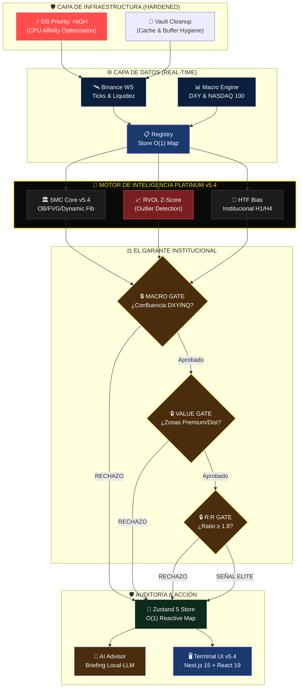

# 🏹 SLINGSHOT v5.7.155 Master Gold — DIAMANTE UNIFICADO (MASTERPLAN)

> **"La precisión no es una opción, es nuestra arquitectura."**
> **Versión:** 5.4.3 Unified Platinum | **Actualizado:** 05 de Abril, 2026

---

## 💎 Visión General del Sistema (Arquitectura O(1))

Este diagrama representa el flujo de datos de latencia ultra-baja (Ultra-Low Latency) desde la captura del tick por WebSocket hasta la ejecución de la señal filtrada por el **Garante Institucional v5.4**.

---

## 🔄 Flujo de Datos Maestro (Sincronía Total)

---

## 🏆 Hitos Logrados (v5.7.155 Master Gold Diamante)

| Estado | Módulo | Descripción |
|:---:|---|---|
| ✅ | **OS Optimization** | Automatización de Prioridad HIGH para el motor Python y Ollama. |
| ✅ | **RVOL Z-Score** | Filtro de ruidos institucionales (Outliers) en datos de volumen. |
| ✅ | **O(1) Reactivity** | Migración completa a Zustand 5 Maps para rendimiento instantáneo. |
| ✅ | **Dynamic Fibonacci** | Detección automática de Swing Legs y Zonas de Valor Premium/Discount. |
| ✅ | **Vault Cleanup** | Higiene total de buffers y caches para evitar drift de datos. |

---

## 🔭 Roadmap Siguiente Nivel (v5.5+)

1.  **Integración SMT Profunda**: Alertas de divergencia correlacionada entre activos maestros (BTC vs ETH/SOL).
2.  **Backtest de Deriva**: Simulación automática de señales en tiempo real al detectar degradación en el modelo.
3.  **Heatmap Neural**: Inyectar los datos del Order Book directamente en el contexto del AI Advisor.

---
*Actualizado por Antigravity — v5.7.155 Master Gold — 05 Abril 2026*
